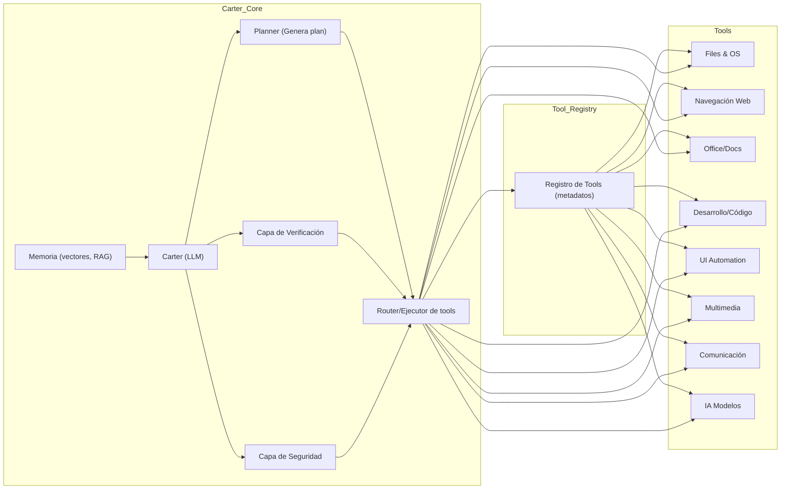

# 1. Resumen ejecutivo 

Carter debe convertirse en un *LLM con “manos”*, un asistente Windows capaz de interactuar con el sistema operativo, el navegador, aplicaciones, documentos y herramientas de desarrollo de manera autónoma. Para ello se requieren APIs nativas, bibliotecas robustas y un diseño arquitectónico claro. Entre los hallazgos principales destacan:

- **APIs nativas Windows:** Siempre que sea posible usar las interfaces oficiales (Win32, WinRT, PowerShell, WMI, UI Automation, etc.), ya que Microsoft las diseñó para lograr automatización robusta【2†L279-L287】. Por ejemplo, **Win32 API/pywin32** permite control de ventanas y procesos a bajo nivel, **PowerShell** ofrece cmdlets muy potentes para administración, **WMI/CIM** brinda información de hardware/sistema (aunque Win32_Product es lento【14†L79-L87】), y la automatización de UI oficial (UIA) es preferible a trucos visuales【2†L279-L287】. 
- **Bibliotecas de documentos:** Librerías Python consolidadas para Office como *python-docx*, *python-pptx* y *openpyxl* permiten crear/editar archivos Word, PPT y Excel【18†L11-L19】【20†L232-L240】. Para PDF se usan *PyPDF2*/*pypdf*, *pdfminer* o motores de conversión de OpenOffice/LibreOffice en modo headless【24†L428-L436】. 
- **Automatización web:** Herramientas como **Playwright** (soporta Chromium, Firefox, WebKit) y **Selenium** facilitan controlar navegadores para buscar, extraer datos, completar formularios, tomar capturas, etc. (Playwright por ejemplo permite `page.goto(url)` y `page.screenshot()` fácilmente【33†L100-L107】). Para scraping más simple, *requests+BeautifulSoup* o *newspaper3k* son útiles.
- **Automatización de escritorio/RPA:** Librerías como **pywinauto** (Python) ofrecen control GUI envíando clics/teclas a ventanas【29†L47-L50】. Herramientas RPA como **TagUI** (vía el paquete *RPA for Python*) integran automatización visual, OCR y control de mouse/teclado en una API sencilla【37†L94-L100】. También existen **AutoHotkey/AutoIt** (scripts de alto nivel) o frameworks comerciales (UiPath, Power Automate), aunque conviene priorizar opciones más abiertas y auditables.
- **Desarrollo y codificación:** Carter debe usar Git (CLI, libgit2) para control de versiones; usar servidores de lenguaje (LSP) integrados para entender proyectos de código（por ejemplo vía *python-lsp*, *typescript-lsp* etc.); y herramientas de entorno como terminal, *Docker/devcontainers*, compiladores y test runners (pytest, linters). La combinación de LLM con LSP es esencial: como señala Davide Consonni, *“un LSP conoce dónde se define un símbolo, su tipo y posibles errores de compilación”*, mientras el LLM aporta la intención【41†L72-L81】【41†L87-L93】. Así, Carter puede delegar pasos de codificación (quizás usando Codex o modelos locales) y luego usar LSP y pruebas automáticas para verificar y corregir.
- **Creación de contenido:** Para informes y presentaciones, usar plantillas de Office automatizadas (Word/PPT genéricas). Bibliotecas como *python-pptx* (PowerPoint) y *python-docx* facilitan generar artefactos pulidos. Para visuales, pueden integrarse *matplotlib*, *Plotly* o generadores de diagramas (Graphviz, Mermaid) para cuadros y cronogramas. Carter puede resumir textos y estructurar resultados para inserción directa en plantillas prediseñadas.
- **Multimedia:** Integrar *Pillow* u *OpenCV* para editar imágenes (cortar, redimensionar, anotar). Para audio, *pydub* o *FFmpeg* permiten manipulación, y motores TTS/STT: e.g. *pyttsx3* (usa voces SAPI offline)【43†L9-L11】, *Whisper* o *Vosk* para transcribir. Sin sobreingeniería, se prioriza OCR (Tesseract o MS OCR) y edición básica (FFmpeg para audio/vídeo).
- **Comunicaciones externas:** Usar **Microsoft Graph API** para correo/calendario/OneDrive/Teams【49†L45-L53】, APIs de Gmail/Google Calendar, Slack (Slack SDK en Python)【51†L49-L58】, Discord (discord.py)【53†L30-L37】, Notion API, Dropbox/Google Drive SDKs, etc. Estas permiten integrar Carter con sistemas de mensajería y almacenamiento en la nube. Hay que gestionar OAuth y permisos cuidadosamente.
- **Memoria y contexto:** Emplear RAG (retrieval-augmented generation) con bases de datos vectoriales locales (FAISS, Chroma, Milvus, Weaviate, SQLite+PGVector) y modelos de embeddings (OpenAI, local). LangChain/LlamaIndex ofrecen abstracciones para indexar y recuperar documentos relevantes. La memoria episódica y semántica mejora con logs de interacciones convertidos a vectores【55†L89-L97】. 
- **Orquestación de agentes:** Frameworks de cadenas de herramientas como LangChain (con modelo *Agent*) permiten encadenar herramientas complejas, planes multi-pasos y subagentes. Ejemplos como *Plan-and-Execute Agents* o BabyAGI ilustran cómo un **planificador** genera pasos y luego **ejecutores** invocan herramientas【58†L149-L158】. Esto permite flujos largos (“plan → ejecutar → verificar → corregir”) de forma estructurada.
- **Verificación y honestidad:** Implementar registros detallados (logging) y comprobaciones “post-condición”: tras cada acción, Carter debe verificar resultados (existencia de archivos, cambios de GUI, respuestas HTTP, errores devueltos) antes de declarar éxito. En el proyecto LIT.AI se enfatiza la necesidad de *“comprehensive logging for debugging and optimization”*【2†L263-L266】. Carter debe reportar fallas de forma transparente y, si hay duda, solicitar confirmación.
- **Seguridad y permisos:** Diseñar Carter con sandboxing y principio de mínimos privilegios. Por ejemplo, ejecutar operaciones peligrosas dentro de un **AppContainer** o cuenta de usuario restringida【61†L46-L54】. Cada herramienta debería tener scopes/allowlists: p. ej. bloquear comandos de red, acceso a sistema, etc., a menos que el usuario explícitamente permita. Se recomienda confirmación manual para acciones críticas (borrado masivo, instalación de software, etc.) y mantener auditoría de todo lo realizado.

En resumen, Carter debe apoyarse en APIs oficiales y bibliotecas maduras (caso de pywin32, OpenAI y bibliotecas Python) como capa principal, usar técnicas de automatización de UI sólo cuando no haya API, y mantener capas de fallback visual o RPA cuando sea necesario. La arquitectura interna integrará un registro de herramientas, un enrutador/planner que decide qué herramienta invocar, capas de memoria y verificación, y un estricto control de seguridad. Las decisiones clave, basadas en la investigación, son usar PowerShell/PyWin32 para la mayoría de tareas Windows, Playwright/Selenium para web, Python-docx/openpyxl para documentos, pywinauto/TagUI para UI, Git/LSP para código, y LangChain como marco de orquestación de alto nivel, siempre supervisado por componentes de verificación.

# 2. Mapa maestro de categorías de herramientas 

- **Windows OS (sistema operativo):** APIs y comandos para controlar aplicaciones, procesos, ventanas, dispositivo y estado del sistema (CPU, RAM, disco, red).  
- **Archivos y documentos:** Manejo de ficheros y formatos (lector/escritor de texto, Markdown, JSON, CSV, Word, Excel, PDF, imágenes). Bibliotecas ofimáticas.  
- **Navegador y web:** Herramientas de búsqueda y navegación web automatizada, scraping, llenado de formularios, interacción con contenido dinámico.  
- **Automatización de escritorio / visión:** Automatización gráfica cuando no hay API (OCR, reconocimiento de texto en pantalla, detección de botones/regiones, clics/teclado a bajo nivel, RPA).  
- **Herramientas de programación/desarrollo:** Terminal, control de versiones (Git), IDEs/LSP, entornos (Docker, virtualenv), compiladores, linters, prueba de software, integración de agentes de codificación (Codex/Copilot), loops de test/autocorrección.  
- **Creación de contenido / productividad:** Generación de informes, presentaciones, tablas, diagramas, correos, propuestas, cronogramas. Integración con plantillas de Office, generadores gráficos y técnicas de diseño automático.  
- **Multimedia:** Edición y generación (básica) de imágenes, audio y vídeo. OCR, TTS/STT, manipulación de medios con FFmpeg/OpenCV/Pillow.  
- **Comunicación y servicios externos:** APIs de correo/calendario/contactos (SMTP/IMAP, Graph, Gmail API), mensajería (Slack, Teams, Discord), almacenamiento (OneDrive, Drive, Dropbox), herramientas colaborativas (Notion, GitHub), bases de datos y webhooks.  
- **Memoria y conocimiento:** Almacenamiento de contexto y datos del usuario mediante bases de conocimiento locales (vector DBs, RAG), memorias a corto/largo plazo, embeddings de documentos y recuperación semántica (FAISS, Milvus, LangChain).  
- **Orquestación de agentes / flujos largos:** Frameworks para planificar y encadenar múltiples herramientas en tareas complejas, con subagentes y verificación (LangChain, AutoGPT, BabyAGI, agentes planificador-ejecutor).  
- **Verificación y honestidad:** Mecanismos para chequear que las acciones realmente ocurrieron (logs detallados, verificaciones post-acción, capturas de pantalla, checksums) y reportar errores de forma fiable.  
- **Seguridad y permisos:** Capas de seguridad per-tool (sandboxing de Windows, AppContainer, controles UAC), allowlists/deny-lists de funciones sensibles, auditoría, confirmaciones de usuario, rollback ante fallos y separación de privilegios (modo usuario vs administrador)【61†L46-L54】.  

Cada categoría agrupa diversas APIs y librerías específicas (ver catálogo siguiente) que habilitan esas capacidades.

# 3. Catálogo detallado por categoría 

A continuación se describen, por categoría, las principales herramientas/librerías disponibles, qué habilitan, su madurez y riesgos, y la recomendación de uso (principal, opcional o evitar). 

### **Windows OS / Sistema operativo**  
- **Win32 API (C/C++/Python):** API nativa de Windows para tareas de sistema (abrir/close ventanas, mover/resize, leer procesos, modificar registro, etc.). *Madurez:* muy alta; *Control:* directo; *Integración:* puede usarse vía *pywin32* (win32com/client, win32api) o *ctypes*. *Ventaja:* máxima flexibilidad y rendimiento. *Riesgo:* necesita cuidado con permisos y puede ser complejo. *Uso:* **principal** para funciones críticas de Windows.  
- **PowerShell:** Shell de scripting oficial (cmdlets para procesos, servicios, WMI, registro, red, etc.). *Madurez:* alta; *Integración:* llamar desde Python/subproceso, o usar módulos Python (p. ej. *pypsrp*). *Ventaja:* rico ecosistema de comandos y objetos. *Riesgo:* menos idempotente (scripts pueden dejar estado), potenciales riesgos al ejecutar scripts desconocidos. *Uso:* **imprescindible** para tareas administrativas (ver procesos, gestión servicios, PowerShell remoting) por facilidad de uso en Windows.  
- **WMI/CIM:** Clases WMI (Win32_*) para obtener información de hardware, procesos, servicios, impresoras, etc. p. ej. Win32_Process, Win32_ComputerSystem. *Madurez:* alta, pero *Win32_Product* es lento y provoca reinstalaciones automáticas【14†L79-L87】. *Integración:* vía módulo Python *wmi* o *pywin32*. *Riesgo:* consultas pesadas; se recomienda preferir *Get-CimInstance* de PowerShell para mejorar estabilidad. *Uso:* **principal** para inventarios/estadísticas, con precaución.  
- **psutil:** Biblioteca Python multiplataforma para procesos, CPU, RAM, discos, red. *Madurez:* alta y fácil de usar. *Limitaciones:* no maneja ventanas/UI; enfocado a métricas. *Uso:* **imprescindible** para monitorear estado (estadísticas CPU/RAM/procesos) de manera ágil desde Python.  
- **pywin32 / COM:** Extensiones Python para acceder a COM/ActiveX (p. ej. Office via `win32com.client`)【10†L25-L32】. *Uso:* indispensable para automatizar aplicaciones COM (Excel, Word, Outlook). *Riesgo:* requiere aplicaciones instaladas (Office) y Windows. *Se recomienda** para tareas de Office en ambiente Windows local.  
- **UI Automation (UIA):** API de accesibilidad de Windows para inspeccionar/controlar controles de GUI. *Madurez:* alta en Win10+, central para UIA de aplicaciones Win32/UWP【2†L279-L287】. *Integración:* bibliotecas Python como *pywinauto* (backend="uia"), *comtypes*, o .NET Automation wrappers. *Ventaja:* interactúa con elementos GUI de forma semántica. *Riesgo:* depende de que la app exponga bien la automatización; fallos en apps “no accesibles” (ej. algunas apps Win32 no estandarizadas) pueden requerir fallback visual. *Uso:* **principal** para control de GUI (clics, leer textos, menús) siempre que esté disponible.  
- **AutoHotkey/AutoIt:** Lenguajes de scripting libre para control de Windows (clics, teclado, macro). *Madurez:* veteranos; *Ventaja:* fácil para secuencias rápidas. *Riesgo:* poco estructurado, fragilidad con cambios de UI. *Uso:* **opcional / fallback** cuando no hay API; no como capa principal.  
- **Comandos del sistema (tasklist, taskkill, schtasks, sc, assoc, rundll32, etc.):** Útiles para acciones simples vía subprocess (listado/terminación de procesos, gestión de servicios, tareas programadas, asociaciones de archivos). *Uso:* **secundario** complementario o verificación.  
- **Variables de entorno / paths:** Python `os.environ`, librerías de entorno (winreg) permiten leer rutas del sistema, variables, registro. *Uso:* implícito en Python, asegurando no sobreescribir.  
- **Gestión de energía / usuario:** Comandos Windows (shutdown, lock, sleep) y APIs Win32 para suspender, bloquear o reiniciar, manejar batería. *Uso:* rara vez necesario, pero posible mediante `subprocess` o `pywin32`.  
- **Seguridad interna:** Windows AppContainer y contenedores (UWP) aíslan procesos【61†L46-L54】. Carter debería ejecutarse con **mínimos privilegios** y solicitar permiso administrador sólo para acciones críticas. Se implementarán listas blancas (ej. solo ciertas apps/API permitidas) y confirmaciones de usuario para acciones sensibles.  
- **Auditoría:** Registros de eventos de Windows para seguir actividades (p. ej. Windows Event Log). *Uso:* opcional, para logging adicional de acciones.

### **Archivos y documentos**  
- **Operaciones básicas (Python `os`/`pathlib`):** Leer/escribir archivos de texto/JSON/CSV, manejo de directorios. *Robustez:* alta; *Complejidad:* baja; *Uso:* **principal**.  
- **python-docx:** Permite crear/editar archivos Word (.docx) en Python【18†L11-L19】. *Madurez:* alta; puede abrir archivos existentes, insertar texto, tablas, estilos. *Limitaciones:* no maneja .doc (antiguos); funciones avanzadas (encabezados/pie de página, bibliografía) limitadas. *Uso:* **imprescindible** para informes Word automatizados.  
- **python-pptx:** Similar a docx, para crear/editar presentaciones PowerPoint (.pptx). *Madurez:* activa; puede manipular diapositivas, añadir textos, imágenes, gráficos. *Limitaciones:* control de diseño complejo puede requerir plantillas previas. *Uso:* **imprescindible** para generador de presentaciones (ej. “hazme un PPT”).  
- **openpyxl / XlsxWriter:** Para hojas Excel (.xlsx). openpyxl (madura) permite leer/escribir celdas, fórmulas y estilos; XlsxWriter (escritura de .xlsx con funcionalidad de gráficos avanzada). *Uso:* **imprescindible** para tablas y análisis de datos en Excel. Por ejemplo, con openpyxl se pueden crear celdas así: `sheet["A1"]="hola", sheet.save("file.xlsx")`【20†L232-L240】.  
- **CSV/JSON/YAML:** Python ofrece módulos nativos (`csv`, `json`, `pyyaml`) para estos formatos. *Uso:* **imprescindible** en tareas ligeras (logs, config, datos).  
- **PDF:** Librerías como *PyPDF2* (o *pypdf*) permiten combinar, dividir y extraer texto de PDFs. *pdfminer/pdfplumber* ofrecen extracción de texto más potente. *Conversión a PDF:* uso de LibreOffice headless (`soffice --headless --convert-to pdf`) puede convertir DOCX/XLSX/PPTX a PDF【24†L428-L436】. *Uso:* **principal** para manipulación simple de PDFs (ej. extraer texto, unir documentos).  
- **ImageMagick / Pillow / OpenCV:** Para imágenes en general: convertir formatos (JPEG/PNG), redimensionar, anotar. *ImageMagick* via línea de comando es muy robusto para conversión masiva; *Pillow* en Python permite edición básica; *OpenCV* es poderosa para procesamiento imagen. *Uso:* **secundario**, típicamente Pillow para recorte/resize, OpenCV para análisis (detección de texto/regiones).  
- **Conversión de formatos complejos:** Bibliotecas comerciales como *Aspose* ofrecen conversión Excel→PDF/Word→HTML, pero añaden costo. *Office COM Interop:* vía pywin32 se puede abrir Office real y guardar en otro formato (e.g. `excel.Workbooks.Open(...); excel.Application.ExportAsFixedFormat()`). *Uso:* **opcional** cuando se necesita fidelidad completa.  
- **Plantillas y generación de reportes:** Frameworks de *jinja2*, *Mako* para templating de documentos (por ejemplo usar HTML/Markdown como base). *Uso:* como capa adicional para dar formato antes de pasar a docx/PDF.  
- **Comparación/versionado:** Herramientas como *difflib*, *git diff* (externo) permiten comparar archivos. *LibreOffice* tiene comparación interna, pero se puede sustituir con diff de texto para código. *Uso:* **secundario** para validaciones (ej. verificar cambios).  
- **Permisos de archivos:** Módulos de sistema o *pywin32* (SetACL, Ctypes) para cambiar atributos. *Uso:* limitado (evitar borrar archivos sensibles sin confirmación).  
- **Comprimir/descomprimir:** *zipfile*, *tarfile* en Python para comprimir; *7zip* o *tar* externo como fallback si se necesitan otros formatos. *Uso:* común en archivado de artefactos.  
- **Metadatos:** *os.stat* o librerías específicas (PyExifTool) para obtener metadatos de archivos e imágenes. *Uso:* ocasional (p. ej. timestamp).  

### **Navegador y web**  
- **Playwright (Python):** Framework de Microsoft para automatización de navegadores headless (Chromium, Firefox, WebKit)【33†L100-L107】. Permite abrir páginas, ejecutar JavaScript, tomar capturas, completar formularios. *Robustez:* muy alta; gestiona automáticamente esperas y múltiples pestañas. *Integración:* requiere instalar los binarios de navegador. *Uso:* **imprescindible** para tareas de web crawling/automatización. Ejemplo: 
  ```python
  from playwright.sync_api import sync_playwright
  with sync_playwright() as p:
      browser = p.chromium.launch()
      page = browser.new_page()
      page.goto("https://example.com")
      print(page.title())
      browser.close()
  ```【33†L100-L107】.  
- **Selenium:** Alternativa madura, compatibilidad con más navegadores y versiones antiguas. *Uso:* **secundario**, por su ecosistema, aunque en muchos casos Playwright es más moderno y rápido.  
- **Puppeteer:** Similar a Playwright pero en Node.js; se puede usar desde Python (pyppeteer) si ya hay experiencia en JS. *Uso:* opcional/híbrido.  
- **Líneas de comandos / APIs:** *curl*, *requests* para llamadas HTTP simples a APIs o páginas estáticas. *requests* combinado con *BeautifulSoup* permite parsear HTML de forma sencilla (búsquedas de texto, extracción de tablas). *Uso:* **principal** para scraping ligero (JSON, HTML estático).  
- **Search APIs:** Dado que Bing Search API fue discontinuado en 2025, se recomiendan alternativas como **Google Custom Search API**, **SerpAPI** u otras (Brave, DuckDuckGo APIs). Permiten búsquedas web programáticas. *Uso:* **importante** para obtener información actualizada de Internet.  
- **Headless browsers:** Para páginas muy dinámicas (SPAs, React), usar el modo headless de Playwright/Selenium es esencial. *Uso:* ya contemplado con Playwright.  
- **Scraping especializado:** *newspaper3k* para artículos de noticias; *Selenium* o Playwright con visión (como soporte) para completar login/2FA si se necesita (con cuidado en credenciales). *Uso:* apuntar a tareas específicas de extracción.  
- **Captura de pantalla / PDF web:** Playwright permite hacer screenshots o imprimir en PDF de páginas completas. *Uso:* para generar evidencias visuales o documentos finales.  
- **Forms / autenticación:** Completar formularios con Playwright/Selenium (usando credenciales seguras, idealmente gestionadas fuera del LLM). *Uso:* encajaría en tareas de llenado de reportes online o login en APIs web.  
- **Interacción con contenido en la nube:** Para Google Docs/Sheets, usar Google Drive/Docs API en lugar de simular navegador; para Office365, usar Graph API. *Uso:* recomendado sobre automatización visual.  

### **Automatización de escritorio y visión**  
- **pywinauto:** Biblioteca Python para automatizar GUIs de Windows【29†L47-L50】. Permite enviar clics, escribir teclado y buscar controles por texto o índice. Ejemplo: `Application(backend="uia").start("notepad.exe")` lanza Notepad y luego `app.UntitledNotepad.menu_select("File->Save")`【29†L47-L50】. *Robustez:* alta en apps estándar; maneja esperas implícitas. *Uso:* **principal** cuando se requiere interacción visual con aplicaciones (menús, diálogos).  
- **RPA frameworks (TagUI/RPA for Python):** **TagUI** (vía paquete `tagui` o `rpa`) integra OCR, visión por computador y automatización web/escritorio en una API sencilla【37†L94-L100】. Soporta comandos de alto nivel (saltar a un elemento visual, etc.). *Robustez:* razonable para prototipos; *Ventaja:* unifica web+desktop+OCR. *Riesgo:* menús y textos pueden cambiar, depende de posición/imagen. *Uso:* **secundario** como fallback visual cuando APIs/UIA fallan.  
- **OCR:** *Tesseract* (open source) para reconocimiento de texto en imágenes/screenshots. *Microsoft OCR* vía Azure también disponible (requiere conexión). *Uso:* **secundario** (texto preferible en texto directo). Para validar contenido gráfico se puede pasar captura a OCR.  
- **Visión por computador:** *OpenCV* para detección de regiones y patrones (búsqueda de botones por forma/imagen). Puede combinarse con OCR para entender la pantalla. *Uso:* **opcionales** cuando ni UIA ni HTML ofrecen la información. Es costoso y frágil al diseño de interfaz.  
- **Sikuli:** Herramienta de automatización basada en imágenes. Permite “buscar imagen y clic”. *Riesgo:* altamente frágil ante cambios de UI. *Uso:* **evitar** en flujos críticos (mejor usar UIA o pywinauto).  
- **PyAutoGUI:** Cross-platform para controlar mouse/teclado por coordenadas. *Riesgo:* muy frágil (depende de resoluciones y posición). *Uso:* **solo fallback** si no hay mejor opción nativa.  
- **AutoHotkey/AutoIt:** Igual que en OS, pueden servir para enviar teclas o menús especiales. *Uso:* *opcional*, similar a pywin32 + SendKeys.  

En general, **preferir APIs oficiales** (UIA, COM) sobre “visión” para robustez【2†L279-L287】. La visión se reserva para casos donde no hay otra forma (ej. controles custom sin automatización). Siempre diseñar el sistema con capas: primero API, luego UIA, luego visión.

### **Herramientas de programación y desarrollo**  
- **Terminal/CLI:** Capacidades de ejecutar comandos del sistema (`subprocess` en Python). Se usará para Git, npm, pip, compilar código, ejecutar scripts o binarios. *Madurez:* inherente a Python. *Uso:* fundamental para orquestar herramientas de desarrollo.  
- **Git CLI / libgit2:** Para control de versiones. Git CLI es esencial (inicializar repos, commits, branches, diffs). *libgit2/pygit2* permite manipular repos desde código. *Uso:* **principal** (Git es núcleo en casi todo proyecto de software).  
- **Servicios de repositorio (GitHub/GitLab APIs):** Usar APIs REST o herramientas como `gh` CLI para operaciones remotas (issues, PRs, comentarios). *Uso:* **secundario** al principio, pero útil para integración continua.  
- **VS Code / LSP / Editor APIs:** Idealmente Carter podría utilizar un LSP (Language Server Protocol) para obtener información del proyecto: estructura, referencias, errores de compilación, autocompletado. Como sugiere Consonni, combinar LLM con LSP mejora la precisión【41†L72-L81】【41†L87-L93】. *Uso:* **imprescindible** en flujo de codificación (p.ej. preguntar al servidor “¿dónde se define esta función?”). VSCode Remote o extensión no son necesarios si Carter opera vía archivos, pero exponer un LSP (pyright, clangd, etc.) como herramienta es muy útil.  
- **Entornos y dependencias:** Poder crear entornos virtuales (conda/venv, Docker) y usar gestores de paquetes (pip, pipenv, poetry, npm). *Uso:* **principal** para mantener proyectos reproducibles. Carter debe poder ejecutar `pip install -r requirements.txt` o `npm install`.  
- **Compiladores / runtimes:** Herramientas nativas (gcc, javac, dotnet build, etc.) o interpretadores (node, python). Carter debe invocar el compilador o intérprete adecuado y luego lanzar el programa. *Uso:* **imprescindible** para probar código generado.  
- **Linters/test runners:** Integrar herramientas de calidad (pytest, unittest, ESLint, flake8). Permite validar automáticamente código nuevo. *Uso:* **importante** para loops “generar → probar → corregir”.  
- **Herramientas de depuración:** Leer logs de compilación/ejecución (captura de stdout/stderr); usar depuradores puede ser complicado, pero Carter puede leer archivos de log o usar APIs (p.ej. Python `pdb`). *Uso:* secundario, mayormente logs.  
- **Docker/DevContainers:** Para aislar entornos, ejecutar aplicaciones complejas (p.ej. base de datos). Permitir a Carter iniciar contenedores (`docker run`) y limpiarlos. *Uso:* **secundario** (es poderoso pero implica overhead), útil en fases avanzadas cuando se crean microservicios.  
- **Codex / Modelos de código:** Integración con un servicio de generación de código (OpenAI Codex / ChatGPT Code, o modelo local como CodeLLM) como una herramienta. Puede usarse para solicitar funciones específicas. Debe combinarse con verificación (p.ej. ejecutar tests). *Uso:* **importante** para tareas de programación asistida (ej. “escribe esta función”) pero **siempre validando el output** con compilación/test.  
- **APIs de servicios de desarrollo:** Herramientas como GitHub Copilot CLI, ChatGPT plugins, o GitHub/GitLab integraciones (CI/CD) son **opcionales**. Podrían usar `gh api` o `glab`. *Uso:* en fases avanzadas para mayor automatización.  

### **Creación de contenido y productividad**  
- **Office & plantillas:** Carter puede usar plantillas predefinidas de Word/PPT/Excel como base (por ejemplo, un estilo corporativo) y luego rellenarlas vía python-docx/pptx/openpyxl. *Uso:* **principal** para documentos formales.  
- **Procesamiento de texto:** Resumir textos largos mediante el LLM mismo o usar herramientas como *GPT-4oT* (no disponible localmente) integradas con las APIs internas. *Uso:* **importante** (el LLM es la mejor herramienta para sintetizar contenido).  
- **Gráficos/visualizaciones:** *Matplotlib*, *Seaborn*, *Plotly* en Python para crear gráficos/infografías numéricas. *Uso:* secundario, útil para informes de datos. También generar CSV/Excel con datos y dejarlos listos para que el usuario genere gráficos.  
- **Diagramas y cronogramas:** Herramientas como **GraphViz** (línea de comandos) o **Mermaid** (texto a SVG) para diagramas UML/flows. *Uso:* interesante para “crear diagramas”, pero puede ser complejo. Carter podría generar código Mermaid y convertirlo con algún renderer.  
- **Emails/correos:** Usar smtplib u **Outlook COM** o **Graph** para redactar y enviar correos. Carter puede armar el cuerpo con HTML/Markdown y luego enviarlo. *Uso:* importante para productividad (responder mensajes, redactar correos formales).  
- **Forms y encuestas:** Podría interactuar con APIs de Google Forms o Microsoft Forms, pero esto es menos común. *Uso:* no prioritario a menos que se requiera.  
- **Asistentes de estudio:** Generar flashcards, resúmenes de lecturas, cuestionarios. Esto recae más en capacidades del LLM (no requiere “tool” específica, salvo quizás una base de datos local de knowledge). *Uso:* como funcionalidad del diálogo.  
- **Dashboards simples:** Podría generar spreadsheets con datos y gráficos (Excel/Sheets) que el usuario abre. *Uso:* secundario (ya contemplado con openpyxl/matplotlib).  

### **Herramientas de multimedia**  
- **Imágenes:** *Pillow* para recorte, redimensionar, anotaciones básicas. *OpenCV* para procesamiento más avanzado (filtros). *Uso:* básico (p. ej. recortar un screenshot).  
- **Edición de imágenes automatizada:** *ImageMagick* en CLI para conversiones masivas (PNG↔JPEG, PDF a imágenes). *Uso:* secundario, útil para conversión.  
- **Generación de imágenes:** Modelos de IA locales (Stable Diffusion) o APIs (DALL·E) podrían integrarse *opcionalmente* para crear assets. *Riesgo:* muy pesado y no esencial; puede habilitar ideas creativas pero no obligatorio. *Uso:* opcional en fases avanzadas si hay GPU disponible.  
- **OCR (de nuevo):** *Tesseract* para imágenes/PDF que contienen texto. *Uso:* ya citado en visión.  
- **Audio:** *pydub* para cortar/unir MP3/WAV. *Uso:* editar grabaciones cortas.  
- **Conversión de formato:** *FFmpeg* (línea de comandos) es imprescindible para audio/vídeo (extraer audio, recortar vídeo, unir clips, añadir subtítulos). *Uso:* **principal** para tareas de medios. Ejemplo: `ffmpeg -i entrada.mp4 -vn -acodec libmp3lame salida.mp3`.  
- **Transcripción (STT):** *Whisper* (OpenAI) o *Vosk* (offline) para audio a texto. *Uso:* valioso para escuchar audios/podcasts y generar texto. *Riesgo:* modelos pesados.  
- **Sintetización (TTS):** *pyttsx3* (offline)【43†L9-L11】 o Microsoft Speech API. Permite a Carter “leer” textos en voz alta. *Uso:* **secundario**; importante en entornos de accesibilidad o para verificar salidas habladas.  
- **Vídeo:** Cortar/pegar con FFmpeg. *Uso:* bajo, solo si el usuario necesita ejemplo de montaje.  
- **Subtítulos:** Herramientas como *autosub* (basado en ffmpeg+Whisper) para generar subtítulos. *Uso:* no prioritario.  

### **Comunicación y servicios externos**  
- **Correo/Calendario:** **Microsoft Graph API** para Outlook (mails, calendarios, contactos, OneDrive)【49†L45-L53】. Por ejemplo, listar emails con Graph o enviar un correo. *Uso:* **principal** para integrarse con Office 365. Para Gmail, usar Gmail API (requiere OAuth de Google).  
- **Mensajería instantánea:** **Slack SDK (Python)** permite enviar mensajes, leer canales, etc.【51†L49-L58】. Carter podría informar resultados o leer mensajes. *discord.py* permite similar con Discord【53†L30-L37】. *Microsoft Teams:* mediante Graph (chat API). *Uso:* **secundario** – útil en entornos corporativos colaborativos.  
- **Almacenamiento en la nube:** API de **OneDrive/SharePoint** (via Graph), **Google Drive API**, **Dropbox API**. Carter puede guardar/leer archivos desde la nube. *Uso:* opcional, amplía opciones de trabajo remoto.  
- **Bases de datos y REST:** Carter puede conectarse a bases de datos locales (SQLite, PostgreSQL) o remotas (MySQL, Mongo) usando conectores Python. También puede consumir APIs REST de cualquier servicio (ej. weather, noticias). *Uso:* accesible pero requiere credenciales.  
- **Zapier/IFTTT/Webhooks:** Podrían integrarse para disparar flujos externos. *Uso:* posiblemente en fases avanzadas, no crítico.  
- **Notion, Trello, etc.:** APIs públicas permiten leer y escribir en esas plataformas. *Uso:* baja, como extras para usuarios que ya usan esas herramientas.  

**Observaciones:** Las integraciones locales (COM, Win32) son más robustas y funcionan sin conexión. Las integraciones cloud (Graph, Google, Slack) implican gestión de credenciales OAuth y posibles dependencias de red. En cada caso, Carter debe manejar tokens de acceso de forma segura, solicitando autorización explícita. Se recomienda un sistema de plugins: por defecto incluir Graph (ya que es Microsoft nativo), dejar Slack/Discord/Trello como opcionales descargables.  

### **Memoria, conocimiento y contexto**  
- **Bases vectoriales:** Librerías como **FAISS**, **Chroma**, **Weaviate** o **Milvus** para indexar embeddings de textos/documentos y consultar similitudes【55†L89-L97】. Esto permite responder preguntas recordando documentos del usuario. *Madurez:* FAISS es muy estable y offline; Weaviate/Milvus ofrecen más features en la nube. *Uso:* **principal** para implementar RAG local.  
- **Embeddings:** Modelos de embedding de texto (OpenAI, Cohere, modelos Hugging Face) para convertir documentos/preguntas en vectores. *Uso:* necesario junto con el vector DB.  
- **LlamaIndex / LangChain RetrievalQA:** Abstracciones que conectan archivos locales (PDFs, TXT) y facilitan las búsquedas RAG. *Uso:* **útil** capa de software; ayuda a diseñar funciones de búsqueda semántica y acceso a contexto histórico.  
- **Memoria semántica vs episódica:** Carter debe decidir qué guardar (p. ej. datos de usuario relevantes, configuraciones) y cómo priorizar lo reciente. Se recomienda cortar “recuerdos” largos y almacenar resúmenes interactivos.  
- **Privacidad/seguridad:** Los datos de memoria deben cifrarse localmente. Carter debe explicar por qué recordará algo y permitir borrado manual. Los sistemas RAG siempre deben buscar evidencias en documentos reales, evitando invenciones.  

### **Orquestación de agentes y flujos largos**  
- **LangChain (Python):** Framework para construir agentes que encadenan herramientas. Permite definir *Chains* secuenciales y *Agents* que deciden qué herramienta llamar (con memory, parser de JSON, etc.). *Uso:* central para implementar flujos complejos.  
- **Pattern Plan-Act (ReAct):** Patrón básico donde el LLM en cada paso decide una acción (p.ej. llamar a Search o Python). Útil para tareas cortas. *Uso:* de base, pero ineficiente para flujos largos.  
- **Plan-and-Execute Agents:** Arquitectura donde primero el LLM (“planner”) genera un plan de pasos a alto nivel y luego “ejecutores” realizan cada paso【58†L149-L158】. Esto reduce llamadas LLM y mejora la coherencia global. *Uso:* **importante** para flujos extendidos (“hazme este informe y luego preséntamelo”), ya que suele aumentar la tasa de éxito【58†L163-L165】.  
- **Herramientas multi-agente:** Frameworks estilo AutoGPT/BabyAGI brindan planificación automática con memoria y metaordenes, descomponiendo tareas en subtareas autoasignadas. Útiles en etapas avanzadas (p. ej. “automáticamente desarrollar un servicio web completo”). *Uso:* experimental, para fases 4-5.  
- **Tool registry & router:** Se diseñará un registro interno (base de datos/JSON) con metadatos de cada herramienta (capacidad, riesgos, reuso). Un componente “router” (como LangChain *AgentExecutor*) decide qué herramienta invocar ante cada request o plan. *Uso:* primordial en la arquitectura interna.  

### **Verificación y honestidad**  
- **Action logging:** Registrar cada llamada a herramienta con parámetros y resultados (logs en archivo o base de datos). Esto provee trazabilidad y auditoría. *Uso:* obligatorio por seguridad y debug.  
- **Post-condición checks:** Después de una acción, Carter debe validar (existencia de archivo creado, código de salida 0, texto de ventana, etc.). Ejemplo: si lanzó Notepad y dio un nombre de archivo, debe chequear que el archivo existe antes de decir “listo”. *Uso:* crítico para confiabilidad.  
- **Screenshots / evidencia:** Para cambios de GUI o datos sensibles, capturar pantallas de evidencia. *Uso:* opcional, pero útil para debugging visual.  
- **Chequeo de integridad:** Si Carter descarga o genera un artefacto importante, calcular checksum (MD5/SHA) o leer propiedades para confirmar consistencia. *Uso:* secundario.  
- **Verificación cruzada:** Cuando sea posible, usar diferentes herramientas para confirmar un dato. Ej. obtener el título de una ventana vía Win32 y comparar con UIA. *Uso:* como fallback antipoda a errores de una sola API.  
- **Errores significativos:** Entregar al usuario mensajes claros (ej. “Error: no se encontró la ruta” en lugar de stacktrace). *Uso:* debe implementarse en la capa de controlador de Carter.  

### **Seguridad, permisos y control**  
- **Principio de mínimo privilegio:** Ejecutar Carter con un token de AppContainer o usuario restringido【61†L46-L54】. Se conceden permisos específicos solo a las herramientas necesarias (p. ej. lectura de red deshabilitada a menos que se requiera).  
- **Allow-lists/deny-lists:** Definir listas blancas para aplicaciones que puede abrir Carter y comandos permitidos. Forzar confirmaciones para comandos peligrosos (borrar discos, modificar registro crítico, cambiar firewall). *Uso:* diseño de políticas internas.  
- **Sandboxing:** Además de AppContainer, se pueden usar técnicas de aislamiento de proceso (p. ej. contenedores Linux/Windows, VMs en Azure). *Uso:* opcional para tareas muy arriesgadas.  
- **Auditoría/Logging:** Guardar logs detallados (quién, cuándo, qué se pidió) para revisar acciones del LLM. *Uso:* obligatorio.  
- **Rollback:** Si Carter realiza cambios críticos fallidos (p.ej. falla al modificar config importante), intentar revertir (tal vez usando copias de seguridad automáticas o System Restore). *Uso:* a diseñar en fases avanzadas.  
- **Confirmaciones:** Para operaciones irreversibles (apagar, formatear, desinstalar), solicitar confirmación explícita adicional. *Uso:* requerido para seguridad.  
- **Limitación de entropía LLM:** En prompts, usar “dry-run” (p. ej. `--whatif` en PowerShell) como opción cuando sea viable, para predecir acciones sin ejecutarlas. *Uso:* mecanismo propuesto (dry-run/dependencias).  

En síntesis, la capa de seguridad exige aislamiento de procesos, privilegios mínimos y *whitelisting* de capacidades, complementado con registros, auditoría y rechazo de acciones no autorizadas.  

# 4. Tabla comparativa de herramientas 

| Categoría              | Herramienta/Biblioteca             | ¿Qué habilita?                                            | Local / Nube | Robustez      | Complejidad  | Riesgo                   | Prioridad    | Recomendación                             |
|------------------------|------------------------------------|-----------------------------------------------------------|--------------|---------------|--------------|--------------------------|--------------|-------------------------------------------|
| **Windows OS**         | Win32 API / pywin32               | Control de ventanas, procesos, registro, UI, etc.        | Local        | Muy alta      | Alta         | Manejo manual, errores  | Imprescindible| Capa base para casi todo en Windows       |
|                        | PowerShell                        | Cmdlets de sistema (servicios, WMI, red, disco, etc.)     | Local        | Alta          | Media        | Scripts maliciosos     | Imprescindible| Primer recurso para admin tasks           |
|                        | WMI (Win32_*)                     | Info HW/Procesos/Servicios/Impresoras                   | Local        | Alta (limit.) | Media        | Win32_Product lento【14†L79-L87】| Secundario  | Solo si PowerShell no basta              |
|                        | psutil                            | Estadísticas CPU/RAM/Procesos cross-OS                   | Local        | Alta          | Baja         | Pocos                    | Imprescindible| Fácil consulta de uso recursos           |
|                        | UI Automation (UIA)              | Automatización GUI semántica de controles Windows       | Local        | Alta          | Media        | Depende de accesibilidad | Principal    | Usar siempre que sea posible【2†L279-L287】 |
|                        | AutoHotkey/AutoIt                | Macro de teclado/ratón, atajos rápidos                  | Local        | Media         | Baja/Media   | Frágil GUI changes       | Opcional     | Solo fallback si no hay API nativa      |
| **Archivos/Docs**      | python-docx                      | Leer/crear/editar Word (.docx)【18†L11-L19】            | Local        | Alta          | Media        | Depende de formato DOCX  | Imprescindible| Base para informes formales             |
|                        | python-pptx                      | Crear/editar PowerPoint (.pptx)                         | Local        | Alta          | Media        | Limitado a PPTX          | Imprescindible| Automatizar presentaciones              |
|                        | openpyxl                         | Leer/crear/editar Excel (.xlsx)【20†L232-L240】         | Local        | Alta          | Media        | No legacy XLS soporte    | Imprescindible| Hojas de cálculo avanzadas              |
|                        | PyPDF2 (pypdf)                   | Unir/dividir/extraer texto PDF                          | Local        | Media-Alta    | Baja         | Texto complejo se pierde | Principal    | PDF básicos; conversión con LibreOffice |
|                        | pdfminer/pdfplumber              | Extraer texto e imágenes de PDF                         | Local        | Alta          | Media        | Puede fallar en PDF complejos| Secundario | Extracción precisa de texto            |
|                        | LibreOffice CLI (soffice)        | Conversión documentos (DOCX→PDF, etc.)【24†L428-L436】  | Local        | Alta          | Baja         | Resultados a veces malos | Secundario  | Conversión en batch (versatil)         |
|                        | ImageMagick / Pillow / OpenCV    | Manipulación de imágenes (convertir, resize, OCR)       | Local        | Alta          | Baja/Media   | Dependencia externa      | Secundario  | Edición básica de imágenes             |
| **Navegador/Web**      | Playwright (Python)             | Automatización de navegadores (Chromium/Firefox/WebKit)【33†L100-L107】| Local        | Muy alta      | Media        | Instala navegadores      | Imprescindible| Navegación avanzada y scraping         |
|                        | Selenium                        | Similar a Playwright (amplio soporte navegadores)        | Local        | Alta          | Media        | API más antigua          | Secundario  | En caso de compatibilidad específica   |
|                        | Requests + BeautifulSoup        | Llamadas HTTP estáticas, parsing HTML                   | Local        | Alta          | Baja         | Captcha/JS no soportado  | Imprescindible| Scraping simple y llamadas API         |
|                        | SerpAPI / Google Search API     | Búsqueda en web vía API (Google, Bing no oficial)       | Nube         | Alta          | Baja/Media   | Costo/API keys           | Importante  | Para búsqueda web (evita scraping ilegal) |
|                        | Headless Browser (Playwright)   | Páginas complejas con JS (SPAs)                         | Local        | Alta          | Media        | Voluminoso               | Principal   | Modo headless para todo JS-heavy       |
| **UI Automation / RPA**| pywinauto (Python UIA)          | Envío de clic/teclas a GUIs Windows【29†L47-L50】        | Local        | Alta          | Baja         | Requiere objeto GUI      | Principal    | Automatizar aplicaciones de escritorio |
|                        | RPA (TagUI/RPA-Python)          | Automatización web+desktop + OCR integrado【37†L94-L100】| Local        | Media-Alta    | Media        | Basado en imagen         | Secundario  | Útil para acciones mixtas (web+desktop)|
|                        | Tesseract OCR / MS OCR          | Reconocer texto en imágenes/screenshots                 | Local (o nube)| Alta (varía) | Baja         | Sensible a calidad imagen| Secundario  | Fallback cuando no hay texto directo   |
|                        | OpenCV (visión por computador)  | Detección de patrones/regiones en pantalla             | Local        | Alta          | Alta         | Muy dependiente de UI    | Opcional    | Solo si fallan APIs/UIA               |
|                        | PyAutoGUI                       | Clicks/teclas por coordenadas de pantalla              | Local        | Baja          | Baja         | Altamente frágil        | Evitar      | Recurso extremo; evitar si hay alternativa |
| **Desarrollo/Código**  | Git CLI / pygit2               | Control de versiones de código (commit, branch, diff)  | Local        | Muy alta      | Baja         | Uso indebido           | Imprescindible| Gestión de proyectos                  |
|                        | GitHub/GitLab API / CLI        | Issues/PRs/Repos remotos                                | Híbrido      | Alta          | Media        | OAuth tokens            | Secundario  | Integración DevOps                    |
|                        | LSP (pyls, clangd, etc.)       | Análisis de código en proyectos (símbolos, errores)   | Local        | Muy alta      | Media        | -                      | Imprescindible| Complemento del LLM para código【41†L72-L81】|
|                        | Docker / Devcontainers         | Ambientes aislados, contenedores de desarrollo        | Local/Híbrido| Alta          | Media        | Requiere Docker instalado | Opcional   | Para pruebas e integración continua   |
|                        | Linters/Test (pytest, ESLint)  | Verificar calidad y correctitud del código           | Local        | Alta          | Media        | -                      | Importante  | Validación automática de código       |
|                        | Compiladores (gcc, javac, etc.)| Compilar/ejecutar programas generados                  | Local        | Alta          | Alta         | Fallos de compilación  | Imprescindible| Para probar y validar código creado   |
|                        | Codex/ChatGPT (modelo de código)| Generación de código basado en intenciones del usuario| Nube/local   | Alta (dep)    | Alta         | Errores de sintaxis    | Importante  | Generación de esqueletos; siempre probar |
| **Contenido/Productividad** | Templates Office (Word/PPT) | Diseños predefinidos para informes y presentaciones    | Local        | Alta          | Baja         | -                      | Importante  | Mejora la apariencia de documentos     |
|                        | Matplotlib/Plotly              | Gráficos estadísticos y visuales para datos          | Local        | Alta          | Media        | -                      | Secundario  | Para informes con datos numéricos     |
|                        | Graphviz / Mermaid            | Diagramas de flujo/estructuras a partir de texto    | Local        | Alta          | Media        | Formato específico     | Opcional    | Crear diagramas automatizados         |
|                        | smtplib / Outlook COM         | Redacción y envío de correos (SMTP/Office)          | Local        | Alta          | Baja/Media   | Configuración SMTP     | Secundario  | Envío de resultados por email         |
|                        | Markdown / Jinja2 templating  | Formatos ligeros, documentos generados desde plantillas| Local        | Alta          | Media        | -                      | Secundario  | Base para generación de documentos    |
| **Multimedia**         | FFmpeg                         | Edición audio/vídeo (cortar, unir, convertir)        | Local        | Alta          | Media        | Complejidad CLI        | Importante  | Herramienta versátil de medios       |
|                        | Pillow / OpenCV                | Recorte/redimensionado/transformación de imágenes    | Local        | Alta          | Baja         | -                      | Secundario  | Edición básica de imágenes           |
|                        | Whisper / Vosk                 | Transcripción de audio a texto                       | Local        | Alta (dep)    | Media        | Recursos de CPU        | Secundario  | Procesar audios (multimodal)         |
|                        | pyttsx3 (SAPI) / Azure TTS    | Texto a voz                                           | Local (o nube) | Alta         | Baja         | Calidad variable       | Secundario  | Lectura de textos por Carter【43†L9-L11】  |
|                        | Stable Diffusion / DALL·E     | Generar imágenes con IA (opcional)                   | Local/Prem   | Alta (dep)    | Muy alta     | Recursos GPU, prompt   | Opcional    | Para creatividad avanzada (fotos, gráficos) |
| **Comunicación / Servicios** | Microsoft Graph API (Office365) | Correo, calendario, OneDrive, Teams【49†L45-L53】   | Nube         | Muy alta      | Media        | OAuth, permisos      | Imprescindible| Integración MS 365 centralizada    |
|                        | Gmail/Google API              | Correo, Drive, Calendar de Google                    | Nube         | Alta          | Media        | OAuth Google         | Secundario  | Alternativa para cuentas Google      |
|                        | Slack Python SDK              | Bots y mensajería Slack【51†L49-L58】              | Nube         | Alta          | Baja/Media   | Tokens Slack        | Secundario  | Notificaciones o lectura Slack     |
|                        | discord.py                    | Bot para Discord (envío/recibo de mensajes)【53†L30-L37】| Nube       | Alta          | Baja         | Tokens Discord      | Opcional    | Integración Discord (grupos)       |
|                        | Dropbox/Drive APIs            | Almacenamiento en nube (subir/descargar)            | Nube         | Alta          | Media        | OAuth                | Secundario  | Compartir archivos usuario         |
|                        | REST APIs genéricas           | Consumir cualquier servicio web (HTTP/JSON)         | Nube/Local   | Depende       | Media        | CORS, auth           | Secundario  | Extiende funcionalidades           |
| **Memoria / Contexto**  | FAISS / Chroma / Milvus      | Indexar vectores de texto, búsqueda semántica【55†L89-L97】| Local       | Alta          | Media        | -                    | Imprescindible| RAG local (preguntas-documentos)   |
|                        | SQLite + pgvector             | Mini vector DB local usando SQLite o Postgres        | Local        | Media         | Baja         | Escalabilidad menor  | Opcional    | Para proyectos pequeños            |
|                        | LlamaIndex / LangChain        | Frameworks RAG / agentes con recuperación automática  | Local/Cloud  | Alta          | Media        | Aprendizaje curva    | Importante  | Abstracción de memoria de Carter  |
|                        | Embeddings (OpenAI/HuggingFace) | Modelos de embeddings para vectorizar textos       | Nube/Local   | Alta          | Media        | Costos o recursos   | Imprescindible| Base de búsqueda semántica        |
| **Orquestación / Agentes** | LangChain (Agents & Chains)  | Encadenar herramientas, planificar multi-pasos      | Local/Nube   | Alta          | Media        | Curva de aprendizaje | Imprescindible| Core para manejar múltiples tools |
|                        | AutoGPT / BabyAGI patterns    | Agentes autónomos que manejan listas de tareas       | Local/Nube   | Experimental  | Alta         | Comportamiento errático | Secundario | Prototipos de workflows largos   |
|                        | Plan-and-Execute (LangChain)  | Arquitectura separa planner y ejecutor (más eficiente)【58†L149-L158】| Local/Nube| Alta         | Alta         | LLM calls intensivos  | Importante  | Planificación explícita de tareas|
|                        | Catálogo de herramientas (registry) | Base de metadatos de cada tool (capacidades, permisos) | Local       | Alta          | Media        | -                    | Imprescindible| Facilita enrutamiento y seguridad |

**Notas de la tabla:** *Robustez* indica estabilidad/maduración del enfoque; *Complejidad* refiere a la integración/programación requerida; *Riesgo* aborda fragilidad o potenciales fallos; *Prioridad* sugiere el orden de integración (desde imprescindible hasta evitar). Las recomendaciones indican si usar como **capa principal** (*principal*), de soporte (*secundario*), o sólo si es estrictamente necesario (*opcional*), incluso si conviene *evitar* en lo posible.

# 5. Stack ideal recomendado para Carter

La elección del stack de Carter estará dominada por **Python** en Windows, con un modelo LLM central (local o API). Proponemos:

- **Capa base (sistema):** Windows 10/11 x64. Python 3.10+ instalado. Acceso a Win32 API mediante `pywin32` o `ctypes`. Powershell Core disponible.  
- **Stack de herramientas principal:** 
  - *Scripting y OS:* Python con `os`, `subprocess`, `pywin32`, `psutil`.
  - *UI Automation:* `pywinauto` (UIA backend) para GUI; `winshell`/`pywin32` para shell; `ctypes` cuando se requiera Win32 puro.
  - *Documentos:* `python-docx`, `python-pptx`, `openpyxl` como capa principal; *LibreOffice CLI* de respaldo para conversiones masivas. 
  - *Web:* `playwright` (con navegadores instalados) como capa principal; `requests`+`BeautifulSoup` para datos sin JS; `selenium` o `pyppeteer` como alternativas. 
  - *RPA/Visión:* `RPA for Python (TagUI)` para tareas mixtas; `pyautogui` sólo como último recurso. `tesseract` para OCR. 
  - *Desarrollo:* Git CLI + *libgit2* para VCS; `pytest`/`flake8` para validación; `pyright`/`pyls`/`clangd` LSP servers para análisis de código; *docker* (opcional) para contenedores. 
  - *Comms:* `msal`/`requests` para Graph API (correo/OneDrive); Slack SDK (`slack_sdk`) y `discord.py` para chat; `google-api-python-client` para Google. 
  - *Memoria:* `faiss` (instancia local), junto con modelo de embedding (`openai-embedding` o Hugging Face local) integrado vía LangChain.  
  - *Orquestación:* `langchain` (AgentExecutor, Tools registry). `RAG` con `langchain.chains.RetrievalQA`.  
  - *Verificación:* sistema propio de logging (append-only). LLM con instrucción clara para “esperar confirmación”. Posibles *dry-run* flags de PowerShell.  
  - *Seguridad:* Las herramientas deben ejecutarse en un entorno con AppContainer / usuario sin privilegios; permisos explícitos para cada tool. Carter pedirá siempre confirmación para acciones irreversibles. 

- **Capas secundarias / fallback:** 
  - `Sikuli` o macros AHK para UIs muy obstinadas. 
  - `Aspose` o *Office COM* si los libs Python no logran cierta conversión. 
  - `Stable Diffusion` local para generación de imágenes avanzadas (si hay GPU).
  - `Milvus` o `Weaviate` si se necesita un vector DB escalable (p.ej. en producción).
  - Otros chatbots o APIs AI (Codex API, CoPilot CLI) como “herramientas externas” para casos de uso muy específicos.
  
- **Qué evitar:** 
  - Evitar soluciones cerradas o propensas a cambio como algunos RPA comerciales (UiPath) sin supervisión. 
  - No usar automatización basada sólo en coordenadas (ej. PyAutoGUI) salvo emergencia【2†L279-L287】. 
  - No confiar en scraping ilegal de motores (usar APIs oficiales). 
  - No delegar lógicas críticas exclusivamente al LLM sin validación. 
  - No excesiva mezcla de lenguajes/sistemas (p.ej. Java para web, .NET sin necesidad). 

En resumen, el **stack base** se construye sobre Python+Win32/PowerShell y herramientas oficiales; la capa **principal** son las bibliotecas Python maduras (pywin32, docx/pptx, playwright, pywinauto, git, LangChain, etc.); y se definen **fallbacks** para cubrir huecos (OCR, AHK, Selenium, etc.). Carter debe orquestar cuidadosamente estas capas para mantener control y fiabilidad.

# 6. Arquitectura técnica de tools para Carter 

La arquitectura propuesta integra componentes clave: un **registro de herramientas** (base de metadatos), un **planner (planificador)**, un **router/ejecutor** de herramientas, y capas transversales de memoria, seguridad, verificación y artefactos. A continuación se muestra un diagrama de alto nivel (Mermaid):



**Descripción de la arquitectura:**

- **LLM (Carter):** Núcleo de razonamiento que entiende instrucciones del usuario y coordina. Genera planes de alto nivel y llama al *router* para ejecutar tareas específicas.  
- **Planner:** Módulo (basado en LLM) que recibe la petición inicial y produce un plan de pasos con herramientas encadenadas.  
- **Registry/ToolsDB:** Catálogo donde se registran todas las herramientas disponibles (ej. “FileSys: pywin32”, “Web: Playwright”, etc.), con sus propiedades, permisos y límites.  
- **Router/Ejecutor:** Interpreta el plan paso a paso e invoca la herramienta adecuada (por ejemplo, llamar al módulo de automatización de archivos para “abrir documento”). Se asegura de que las entradas/salidas se formateen correctamente y maneja errores intermedios.  
- **Herramientas (Tools):** Sub-bloques que representan grupos de capacidades (manipulación de archivos, web, Office, código, UI, multimedia, comunicación, modelos AI externos). Cada grupo contiene APIs específicas detalladas en el catálogo.  
- **Memoria:** Base de conocimiento persistente (vector DB + RAG). El LLM consulta aquí para recuperar contexto relevante del usuario o documentos previos.  
- **Verificación:** Después de cada acción del *router*, este módulo comprueba el resultado (archivo creado, ventana abierta, respuesta API válida) antes de continuar o reportar error.  
- **Seguridad:** Filtro que restringe el uso de herramientas según políticas (p. ej. bloquea comandos peligrosos, necesita confirmación). Registra permisos y controla entornos aislados (AppContainer).

Esta arquitectura modular permite añadir nuevas herramientas sin reconfigurar todo el sistema: basta con registrar la herramienta en el `ToolsDB` con su interfaz (sincrónica o asíncrona) y el *router* puede enrutarlas. La interacción de Carter sigue un flujo general: **pedir** → **planificar** → **ejecutar una herramienta** → **verificar resultado** → repetir o finalizar. 

# 7. Herramientas imprescindibles desde ya

Las herramientas prioritarias que Carter debe integrar cuanto antes son: 

- **Para Windows OS:**  
  - *PyWin32 / ctypes / PowerShell*: acceso al núcleo de Windows (gestión de ventanas, procesos, registro, servicios).  
  - *psutil*: monitoreo de CPU/RAM/procesos.  

- **Para archivos/documentos:**  
  - *python-docx*, *python-pptx*, *openpyxl*: creación/edición de Word, PPTX y Excel.  
  - *PyPDF2/pypdf*: manipular PDFs.  
  - *LibreOffice headless*: convertir formatos (DOCX/PPTX→PDF, etc.)【24†L428-L436】.  

- **Para web/navegación:**  
  - *Playwright (Python)*: automatización de navegador completo【33†L100-L107】.  
  - *requests + BeautifulSoup*: scraping básico.  
  - *SerpAPI (o Google Custom Search)*: búsqueda web programática.  

- **Para UI/automatización escritorio:**  
  - *pywinauto*: automatización GUI nativa【29†L47-L50】.  
  - *TagUI (RPA-Python)*: tareas mixtas Web+Desktop y OCR【37†L94-L100】.  

- **Para desarrollo:**  
  - *Git CLI* y *libgit2*: control de versiones.  
  - *LSP servers* (p. ej. pyright, clangd): introspección de código, completado y errores【41†L72-L81】.  
  - *pytest/linters*: validar el código generado.  

- **Para creación de contenido:**  
  - Bibliotecas gráficas básicas (*matplotlib*) y *python-pptx* para reportes visuales.  
  - *SMTP / Outlook COM*: enviar correos y conectar con calendarios/Contactos (via Graph API).  
  - *Plantillas de Office*: documentos maestros (no es librería, pero configurar plantillas es clave).  

- **Para multimedia:**  
  - *FFmpeg*: manipulación de audio/vídeo (muy versátil).  
  - *Whisper o Vosk*: transcripción de audio.  
  - *pyttsx3*: síntesis de texto a voz (SAPI)【43†L9-L11】.  

- **Para comunicación/externos:**  
  - *Microsoft Graph API* (Python SDK o requests)【49†L45-L53】: Outlook, OneDrive, Teams.  
  - *Slack SDK (slack_sdk)*: enviar/leer mensajes Slack【51†L49-L58】.  
  - *discord.py*: cliente Discord【53†L30-L37】.  
  - *Google APIs*: Drive, Gmail, etc. según necesidad.  

- **Para memoria/contexto:**  
  - *FAISS* (o similar) + modelo de embeddings (OpenAI o local).  
  - *LangChain RetrievalQA*: integrar búsqueda semántica.  

- **Para orquestación:**  
  - *LangChain Agents*: facilita tool-calling y plan-egress.  

- **Seguridad/verificación:**  
  - Implementar logging exhaustivo (propio, no es “tool” externo, pero crítico).  
  - Herramientas Windows de auditoría si se desea (Event Log).  
  - Mecanismos de “dry-run” (p.ej. PowerShell `-WhatIf`) como práctica.  

Estas son **prioridad alta**. Con ellas Carter cubrirá la mayoría de casos de uso “operador de PC”: abrir/editar archivos, controlar aplicaciones, navegar, generar informes, programar, etc., con verificación integrada. 

# 8. Herramientas potentes pero secundarias

Una vez cubiertos los básicos, se pueden agregar: 

- **Selenium WebDriver:** Si bien Playwright cubre la mayoría, Selenium sigue siendo útil en entornos muy tradicionales.  
- **Puppeteer (Node.js):** Para desarrollos JS donde Python no es necesario.  
- **AutoHotkey scripts:** Para automatizaciones muy específicas de Windows (macros de teclado), aunque *pywinauto* ya puede emular muchos atajos.  
- **PyAutoGUI:** Útil solo en emergencias (coordenadas fijas).  
- **WMI PowerShell/CIM (Get-CimInstance):** Variante a WMI vía PowerShell para mejor fiabilidad.  
- **Node.js / Deno:** Si se necesitan herramientas JS nativas (por ejemplo npm scripts, Vue/React CLI).  
- **Ffmpeg wrappers (moviepy):** Simplificación de FFmpeg en Python.  
- **Pandas / python-pandas:** Para análisis de datos y generar CSV/Excel.  
- **DeckTape:** Herramienta CLI para convertir presentaciones HTML a PDF (por ejemplo, PPT exportado via Web). *Uso:* muy específico, complemento opcional.  
- **Stable Diffusion / DALL·E (local):** Para generación de imágenes creativas en segundos. **Muy interesante**, pero requiere hardware y no esencial para MVP; puede implementarse en una fase avanzada con su propia cola de tareas.  
- **Task Scheduler (schtasks):** Permite programar tareas, útil para automatizaciones recurrentes.  
- **Robot Framework:** Plataforma de testing genérica (incluye Selenium). Podría usarse para diseñar flujos de pruebas. *Uso:* especializado (no es primera capa, pero serviría para validaciones automáticas).  

Estas herramientas añaden potencia en nichos (más compatibilidad, facilidad, o capacidades especiales), pero no son estrictamente necesarias en la base. Se integrarán tras validar la arquitectura con las imprescindibles.

# 9. Herramientas interesantes pero no prioritarias

Estas son útiles pero no críticas en las etapas iniciales: 

- **Notion API, Trello API:** Para proyectos personales/productividad, no prioritarios frente a APIs de correo y Drive.  
- **Weaviate/Milvus (vector DB en la nube):** Más robustos a gran escala que FAISS, pero requieren infraestructura extra. **Interesante** en proyectos grandes de RAG, pero FAISS es suficiente localmente.  
- **Power Automate Desktop:** Herramienta Windows RPA con GUI propia. Podría servir para flows difíciles, pero es compleja de integrar desde Carter.  
- **UiPath Community:** RPA empresarial, útil pero demanda licencias y ecosistema.  
- **Azure/AWS ML Services:** Para TTS/STT o traducción sin desplegar localmente. Convenientes, pero implican costo y latencia de red. Puede considerarse en fases finales para mejorar calidad (p.ej. Azure Speech para mejor TTS).  
- **Jupyter/Pandas:** Ideales para prototipos de datos, pero Carter raramente usará Notebook como tal. Sin embargo, Pandas puede ayudar con data frames. *Uso:* añadido si se necesita manipulación avanzada de datos en Excel/CSV.  
- **API de calendario/contactos de Google:** Con Graph se cubre la mayoría de escenarios corporativos, Google sólo si el usuario lo pide.  
- **Chatbot plug-ins (browser)**: e.g. herramienta de navegación de ChatGPT. Útil pero dependiente de servicios externos. Carter usa su propio navegador headless, así que no prioritario.  

Estas integraciones se añadirán después de consolidar lo esencial, aportando valor en contextos específicos (empresas que usan Slack/Trello, grandes volúmenes RAG, flujos bilingües, etc.) pero sin bloquear el proyecto inicial.

# 10. Herramientas a evitar

Debemos evitar soluciones poco confiables o excesivamente complejas:

- **Automatización basada sólo en coordenadas:** Herramientas como PyAutoGUI o Sikuli (sin usar OCR) son *muy frágiles* (resolución de pantalla, ventanas en posiciones inesperadas). Se desaconseja su uso salvo en emergencias【2†L279-L287】.  
- **Scraping web ilegal/no-oficial:** Evitar “scraping” de motores de búsqueda o sitios con políticas anti-scraping. Siempre usar APIs oficiales cuando existan.  
- **Herramientas desactualizadas o bloqueadas:** Por ejemplo, UIAutomationServer COM clásico (obsoleto), o librerías WinAPI no mantenidas.  
- **Uso indiscriminado de Administrador:** No usar privilegios elevados por defecto; evita modificaciones críticas de sistema sin consentimiento (ej. deshabilitar UAC).  
- **Integraciones completamente en la nube para funciones locales:** (p.ej. chatbots de terceros para GUI), ya que Carter es local.  
- **RPA comerciales sin necesidad:** UiPath, BluePrism, etc., excepto como referencia; son pesados de integrar y dan poca flexibilidad comparado con PyWin/PyAuto.  
- **Múltiples LLM simultáneos sin coordinación:** No es lo mismo ser “un LLM” con muchos procesos. Mejores estructuras son los agentes centralizados.  
- **Generación de código sin validación:** El LLM debe probar su código. Evitar que Carter “confíe” ciegamente en una respuesta de código. (Implementar loop de test/corrección [41†L72-L81]).  

En resumen, **evitar soluciones riesgosas, propietarias o demasiado generales** si existen alternativas nativas claras en Windows. La estabilidad y seguridad importan más que implementar la “última moda” sin respaldo.

# 11. Roadmap por fases 

Se propone un plan incremental en 5 fases, de funcionalidades básicas hacia el asistente total. Cada fase incluye entregables técnicos claros y criterios de éxito:

```mermaid
gantt
    title Roadmap Carter (fases y entregables)
    dateFormat  YYYY-MM-DD
    section Fase 1: Base funcional
    "Integrar APIs básicas (FS, procesos, terminal)"          :a1, 2026-01-01, 2m
    "PyWin32 + Powershell + psutil + docx/pptx + openpyxl"    :a2, after a1, 3m
    "First verification layer (checks post-action)"          :a3, after a2, 1m
    section Fase 2: Operador Windows avanzado
    "Automatizar GUI: pywinauto + RPA(TagUI) + OCR básico"   :b1, 2026-06-01, 2m
    "Integrar navegador: Playwright + búsqueda web"         :b2, after b1, 2m
    "Monitoreo de sistema (CPU/GPU/RAM) con wmi/psutil"      :b3, after b2, 1m
    section Fase 3: Creación de artefactos y documentos
    "Generación de informes (Word/PDF) y gráficas Excel"    :c1, 2026-10-01, 2m
    "Presentaciones PowerPoint automatizadas"               :c2, after c1, 2m
    "Conexión a servicios cloud (Graph API correo/OneDrive)" :c3, after c2, 1m
    section Fase 4: Asistente de programación operativo
    "Integrar entorno Git y LSP (pyls, pyright)"            :d1, 2027-02-01, 2m
    "Loop: generar código, test automatizados, corregir"    :d2, after d1, 2m
    "Docker/Contenedores y CI básico"                       :d3, after d2, 2m
    section Fase 5: Asistente total multimodal
    "Memoria RAG completa (FAISS / Vector DB)"              :e1, 2027-06-01, 2m
    "Orquestador agente (LangChain completo)"               :e2, after e1, 2m
    "Integración multitool avanzada (flujos largos)"        :e3, after e2, 2m
    "Seguridad & validación robusta final"                 :e4, after e3, 1m
```

- **Fase 1 (Trimestre 1, 2026):** **Base funcional.** Integrar las APIs principales de Windows (abrir/cerrar archivos y procesos, gestionar carpetas) y generación básica de documentos (Word, Excel). Implementar sistema de logging y verificación de acciones sencillas. *Criterio de éxito:* Carter puede abrir el bloc de notas, escribir y guardar un archivo; generar un Excel con datos; reportar errores de forma clara.  
- **Fase 2 (T2 2026):** **Operador de Windows serio.** Añadir automatización de GUI (pywinauto/TagUI) y navegador (Playwright). Ampliar monitoreo del sistema (GPU, disco). *Éxito:* Carter puede cerrar aplicaciones, mover ventanas, realizar búsquedas web y extraer resultados; también reporta uso de recursos (por ejemplo, “CPU al 30%”).  
- **Fase 3 (T4 2026):** **Creación de artefactos.** Enfocada en documentos y contenido: Carter debe generar informes Word complejos, gráficos en Excel y presentaciones PPTX “hermosas” según datos. También integrar correo y OneDrive vía Graph. *Éxito:* Puede pedir “haz un PPT sobre X con diapositivas y gráficos” y obtener un PPTX listo; enviar por email un resumen generado.  
- **Fase 4 (T1 2027):** **Assistant de desarrollo.** Carter opera proyectos de software: clonarlos (Git), ejecutar compilaciones/tests, depurar errores. Integra LSP para entender el código base, genera parches si es posible. *Éxito:* Carter recibe “crea un pequeño proyecto en Python/Node, pruébalo y soluciona errores”. Debe poder instalar dependencias, ejecutar tests y mostrar logs.  
- **Fase 5 (T2 2027):** **Asistente total multimodal.** Añade memoria persistente (RAG con FAISS, indexación de documentos del usuario), orquestación de multi-agente (LangChain avanzado) y toda la capa de seguridad final. *Éxito:* Carter maneja flujos largos autónomos (“investiga X en web, prepara presentación y publícala”), recordando contexto previo, y no realiza acciones restringidas sin confirmación.  

Cada fase se planificará con iteraciones ágiles, priorizando validar los resultados ante el usuario o en pruebas automatizadas. Los criterios de éxito incluyen ejecución fiable de comandos, generación correcta de artefactos y flujo de comunicación transparente (logs, mensajes claros).

# 12. Conclusión 

Carter alcanzará el estatus de **asistente universal de Windows** proporcionando al LLM un conjunto completo de “manos” tecnológicas: APIs nativas de sistema, bibliotecas ofimáticas, automatización web y de escritorio, herramientas de desarrollo, memoria de largo plazo y un orquestador de agentes inteligente. La investigación muestra que el **diseño importa tanto como la cantidad de herramientas**. Es esencial construir sobre fundamentos sólidos: usar las APIs oficiales (Win32/PowerShell/UIA) para todo lo posible【2†L279-L287】, emplear librerías maduras de Python para Office y web, y verificar cada acción. 

La arquitectura propuesta (planner + router + capa de seguridad/verificación) garantiza que Carter maneje operaciones complejas de forma controlada. Las recomendaciones clave son: otorgar *mínimos privilegios* (sandboxing con AppContainer【61†L46-L54】), implementar logs exhaustivos para cada comando y usar técnicas de RAG para mantener la coherencia de la memoria. En pocas palabras, Carter no debe ser solo “otro chatbot”, sino un sistema integrado y seguro con una **interfaz de herramientas bien definida**.

**Pasos inmediatos:** integrar primero el soporte para acciones básicas de Windows (abrir/leer/editar archivos, procesos, ventanas) y Office (Word/Excel), junto con un sistema de logs/verificación. Luego ampliar a web y GUI. Finalmente, construir la capa de orquestación (LangChain) y memoria. 

En definitiva, la plataforma Carter debe equipar al LLM con una **cinturón de herramientas estructurado** (documentado en el registro de herramientas) y un flujo de trabajo que garantice que cada “tool call” es seguro y verificado. De esta manera, avanzaremos hacia el asistente de Windows confiable y poderoso que se vislumbra: un verdadero “operador del computador” guiado por inteligencia artificial. 

