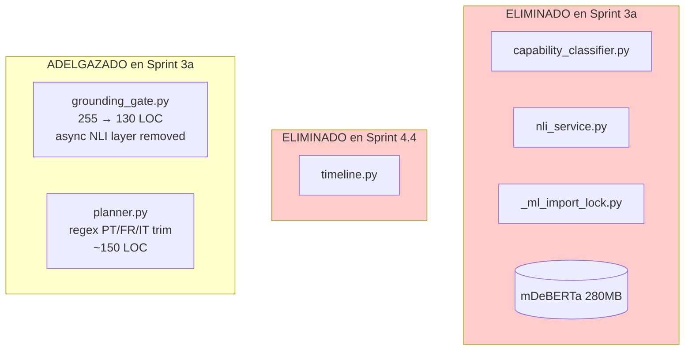

# 01 — Delta System (containers post-plan)

> **Comparación:** baseline (15 containers) vs HEAD (containers
> actualizados con módulos extraídos y stack NLI eliminado).
> **Para el diagrama original ver:** [`_baseline_audit/01_system.md`](../_historico/baseline_audit/01_system.md).

## 1. Qué cambió a nivel de container

### 1.1 Container eliminado: "NLI stack"

El container que en el baseline contenía `capability_classifier.py` +
`nli_service.py` + `_ml_import_lock.py` (~600 LOC + 280 MB mDeBERTa
en RAM) **ya no existe**. Sprint 3a lo eliminó tras medir cache hit
rate de 3.2 % (umbral de keep/kill = 20 %).

Lo que sobrevivió y por qué:
- **`grounding_gate.py`** (~130 LOC, era 255): conservó solo la capa
  inline (`detect_action_claim_without_evidence`) que es heurística
  morfológica sin NLI. La capa async fue eliminada.
- **`intent_validator.py`** (141 LOC): nunca dependió de NLI — es
  regex + lookup de `CROSS_REJECT_PAIRS`. Se queda intacto.

### 1.2 Container "Agent Core" descompuesto en 4 submódulos

El "Agent Core" container del baseline (1 módulo `agent.py` 2 968 LOC,
god class `Gemma4Agent` 1 852 LOC con 21 métodos) ahora consiste en
**5 archivos cohesivos**:

```
Agent Core (container)
├── agent.py                      (1 930 LOC)  — orquestador delgado
├── agent_prompt.py               (560 LOC)    — CORE_PROMPT + TOOL_RULES + builders
├── agent_guards.py               (371 LOC)    — 6 post-reply guards + fallback builder
├── agent_compaction.py           (223 LOC)    — history compaction + facts/summary LLM calls
└── agent_dispatch.py             (207 LOC)    — execute_calls sequential/parallel
```

`Gemma4Agent` sigue siendo la clase pública. Los nuevos módulos son
funciones puras que reciben state explícito (no `self`). Los métodos
del agent ahora son wrappers de 3-5 líneas.

### 1.3 Container "Tools / Knowledge" parcialmente descompuesto

El "Tools" container del baseline (`tools.py` 4 825 LOC, `ToolRegistry`
god class con 142 métodos) ahora consiste en:

```
Tools (container)
├── tools.py                      (4 282 LOC)  — ToolRegistry sigue siendo el dispatcher
├── tool_schemas.py               (79 LOC)     — literal COMPOUND_TOOL_SCHEMAS (65 entries)
├── app_resolver.py               (418 LOC)    — AppResolver + AppCandidate
├── ssrf_guard.py                 (64 LOC)     — _SSRFGuardRedirectHandler + _is_private_host
├── _shared.py                    (153 LOC)    — redact_sensitive + hard_gate (compartidos con domain_tools)
├── domain_tools.py               (10 489 LOC) — sin cambios estructurales
└── ops_tools.py                  (1 657 LOC)  — sin cambios
```

`ToolRegistry` sigue siendo god class (3 015 LOC restantes en `tools.py`
después de los splits, aproximadamente). Sprint 6.6 intentó extraer
el dispatch pipeline pero quedó SKIP por cycle complejo. La red de
tests está escrita por si alguien retoma.

### 1.4 Container "Sessions/Routines" simplificado

```
Sessions/Routines (container)
├── sessions.py                   (237 LOC, no cambió)
├── task_runner.py                (90 LOC)     — NUEVO, unifica routine + watcher
├── routine_runner.py             (~15 LOC)    — wrapper de task_runner --type routine
├── watcher_runner.py             (~15 LOC)    — wrapper de task_runner --type watcher
└── import_triggercmd.py          (131 LOC, no cambió)
```

### 1.5 Container "Observability" con 1 sink menos

```
Observability (container)
├── events_bus.py                 (99 LOC, central pub/sub)
├── log_recorder.py               (220 LOC, canónico — recibe todo el BUS)
├── tracing.py                    (67 LOC, sigue activo — 50+ callers en agent.py)
├── telemetry.py                  (443 LOC, opt-in default OFF)
└── timeline.py                   ────── ELIMINADO en Sprint 4.4 ──────
```

Sinks de "qué pasó en este turn":
- Baseline: **4 sinks redundantes** (TraceLogger + LogRecorder + Timeline + Telemetry).
- HEAD: **3 sinks** (TraceLogger + LogRecorder + Telemetry). Timeline eliminado.

> **Pendiente para futuro:** TraceLogger podría eliminarse migrando
> sus 50+ callers a `BUS.publish` (LogRecorder ya escucha el BUS).
> Sprint 4.4 lo evaluó como alto riesgo en observabilidad y diferió.

### 1.6 Container "Routing & Validation" reducido

Baseline: 6 piezas (planner + semantic_router + capability_classifier
+ nli_service + intent_validator + grounding_gate).

HEAD: **4 piezas** (planner + semantic_router + intent_validator +
grounding_gate-inline-only).

```
Routing & Validation (container)
├── planner.py                    (~750 LOC, regex ES+EN solo)
├── semantic_router.py            (279 LOC, no cambió)
├── grounding_gate.py             (~130 LOC, solo capa inline morfológica)
├── intent_validator.py           (141 LOC, regex CROSS_REJECT_PAIRS)
├── capability_classifier.py      ────── ELIMINADO en Sprint 3a ──────
├── nli_service.py                ────── ELIMINADO en Sprint 3a ──────
└── _ml_import_lock.py            ────── ELIMINADO en Sprint 3a ──────
```

Ganancias concretas:
- **280 MB RAM liberada** (mDeBERTa ya no se carga).
- **Worker thread NLI eliminado** (un menos del pool de threads del turn).
- **~600 LOC eliminadas** + las dependencias `transformers` que
  hubieran estado en `requirements.txt`.

## 2. Containers que NO cambiaron (conscientemente)

| Container | Razón |
|---|---|
| **Voice Loop** (`voice/`) | Frontera nítida ya en baseline. Diseño correcto. |
| **Mission/Verification** | Heredado de Carter, filosóficamente coherente. No tocado. |
| **LLM Lifecycle** | (`llama_server`, `llm_client`, `model_info`, `prewarm`, `multimodal`) — solo `model_info` pasó de `TypedDict` a `dataclass` (1.7) |
| **Memory & Knowledge** | (`memory`, `experience`, `knowledge`) — `experience` recibió campos de provenance del recovery. |
| **Skills + Microagents + Personas** | Conservados para Sprint 3b (medir uso real primero). |
| **UI Desktop (`ui/`)** | God classes intencionales del dominio (decisión 5b/6.7). |
| **UI Field (`server.py` + `ui_field/`)** | Estable. |
| **MCP Server** (`mcp_server.py`) | Sin cambios. |
| **Config + Profiles** | Sin cambios. |

## 3. Diagrama de containers actualizado (Fig 1.1 post-plan)

```mermaid
graph TB
    subgraph Usuario["Superficies de usuario"]
        CLI[Chat CLI<br/>chat.py]
        UIDesk[UI Desktop PyQt6<br/>ui/]
        UIField[UI Field React<br/>ui_field/ + server.py]
        Voice[Voice loop<br/>voice/ + voice_runner]
    end

    subgraph Orquestador["Orquestación del turno"]
        Agent[Agent Core 5 archivos<br/>agent.py + agent_prompt<br/>+ agent_guards + agent_compaction<br/>+ agent_dispatch]
        Runner[Agent Runner<br/>agent_runner.py]
        Sessions[Sessions/Routines<br/>sessions + task_runner]
    end

    subgraph LLM["Lifecycle del LLM"]
        LlamaSrv[Llama-server manager]
        LLMC[LLM client]
        Prewarm[boot_progress + prewarm + model_info + multimodal]
    end

    subgraph Routing["Routing & Validation 4 piezas"]
        Planner[Planner<br/>regex ES+EN]
        Router[Semantic Router<br/>MiniLM embeddings]
        Intent[Intent Validator<br/>regex CROSS_REJECT_PAIRS]
        Ground[Grounding Gate<br/>solo capa inline]
    end

    subgraph Tools["Tools / Knowledge"]
        Registry[Tool Registry<br/>tools.py 4282 LOC]
        Schemas[tool_schemas.py<br/>65 schemas]
        Apps[app_resolver.py]
        SSRF[ssrf_guard.py]
        Shared[_shared.py<br/>redact + hard_gate]
        Domain[domain_tools.py<br/>33 tools]
        Ops[ops_tools.py<br/>10 tools]
        Safety[safety.py]
        Verify[verifiers + verify_core]
        Mission[Mission Outcome<br/>mission_goal + mission_outcome]
    end

    subgraph Mem["Memory & Knowledge"]
        MemJ[Memory JSON]
        Exp[Experience SQLite+vec]
        Know[Knowledge FTS5+reranker]
        Skills[Skills + Microagents + Personas<br/>pendientes de Sprint 3b]
    end

    subgraph Infra["Infra transversal (3 sinks)"]
        BUS[(Event Bus)]
        Trace[Tracing<br/>50+ callers en agent.py]
        LogRec[Log Recorder<br/>BUS sync canonical]
        Telem[Telemetry<br/>opt-in default OFF]
        State[State<br/>resources + checkpoints]
        Config[Config + Profiles]
        MCP[MCP Server]
    end

    CLI --> Agent
    UIDesk --> Agent
    UIField --> Runner --> Agent
    Voice --> Runner

    Agent --> Planner
    Planner --> Router
    Agent --> Intent
    Agent -. async post-reply .-> Ground

    Agent --> Registry
    Registry --> Schemas
    Registry --> Apps
    Registry --> Ops
    Registry --> Safety
    Registry --> Verify
    Agent --> Mission
    Mission --> Verify
    Registry -. usa .-> Shared
    Domain -. usa .-> Shared
    Registry -. usa .-> SSRF

    Agent --> MemJ
    Agent --> Exp
    Agent --> Skills
    Registry -- "tool knowledge" --> Know

    Agent --> LLMC
    LLMC --> LlamaSrv
    Runner --> LlamaSrv

    Runner -- pub --> BUS
    Voice -- pub --> BUS
    Agent --> Trace
    Agent -- pub --> BUS
    BUS --> LogRec
    BUS --> Telem
    BUS --> UIDesk
    BUS --> UIField

    MCP --> Registry
    Config --> Agent
    Config --> Runner
    State --> Sessions
    Sessions --> Registry
```



## 4. Componentes que dejaron de existir (vs Fig 1.2 baseline)



## 5. Resumen del impacto a nivel de container

- **15 containers** del baseline → **14 containers** en HEAD
  (NLI stack disuelto).
- **Container "Agent Core" descompuesto** internamente en 5 archivos
  cohesivos (sin que la interfaz pública cambie).
- **Container "Tools" iniciado a descomponer** (3 extracciones,
  pendiente la 4ta — dispatch pipeline — con red de tests escrita).
- **1 container "Observability"** con 3 sinks (era 4).
- **1 container "Routing & Validation"** con 4 piezas (era 6).
- **Containers no tocados** (decisión consciente): Voice, Mission,
  UI Desktop, UI Field, MCP, Memory, Skills/Microagents/Personas
  (pendientes de Sprint 3b para medir uso real).

## 6. Crash recovery y resilience del subprocess llama-server

> Documentado tras la auditoría externa post-plan (Sprint 7.6), que
> detectó que estos componentes existen en el código pero no estaban
> descritos en este delta. No cambian con respecto al baseline; la
> auditoría externa los marcó "falta", el operador validó "existe pero
> sin doc", y este §6 cierra la brecha de documentación.

### 6.1 Detección de crash

[`gemma4_agent/infra/llama_server.py:LlamaServerManager.detect_crash_signature()`](../../gemma4_agent/infra/llama_server.py)
inspecciona el tail del `err.log` buscando patrones conocidos de
crash:

- CUDA illegal memory access
- Out of memory (GPU/CPU)
- Otros patrones documentados a partir de la línea 424.

Devuelve un dict con `summary` (str | None) que el caller (`launcher`,
`agent_runner._build_agent`) puede usar para decidir si vale la pena
reintentar o si el problema es estructural (e.g. modelo demasiado
grande para la VRAM disponible).

### 6.2 Vision relaunch (anti-leak conocido)

`LlamaServerManager.recycle_for_vision_leak()` reinicia el subprocess
cuando se detecta el leak progresivo del `mmproj` de Gemma 4
([ggml-org/llama.cpp#21690](https://github.com/ggml-org/llama.cpp/pull/21690)).

- **Trigger automático:** `multimodal._bump_image_counter()` se
  invoca en cada turn que incluyó una imagen. Cuando el counter
  cruza `IMAGE_RELAUNCH_THRESHOLD` (default 40 imágenes acumuladas),
  el callback registrado en `agent_runner._build_agent` (Sprint 4
  vision_relaunch wiring) llama a `recycle_for_vision_leak()`.
- **No-op para perfiles sin visión:** Standby / Light no cargan
  mmproj; el counter sube pero el callback es no-op.

### 6.3 Restart limpio en cambio de profile

`LlamaServerManager.restart(profile)` = `stop() + start(profile)`. Lo
usa `profile_watcher` cuando un cambio VRAM-aware del perfil
(Performance → Balanced → Light) requiere relanzar el server con
nuevos flags (`-c`, `--n-gpu-layers`, mmproj on/off).

### 6.4 Lo que NO existe (gaps conocidos)

- **Auto-restart mid-turn.** Si llama-server crashea durante un
  `client.chat()` en curso, el cliente HTTP recibe un error y el guard
  `_guard_unverified_final` debería catcharlo, pero **no hay re-spawn
  automático del subprocess**. El siguiente turn dispara
  `_autostart_llama_server` de nuevo (que detecta puerto libre y
  relanza), así que la sesión se recupera, pero el turn que crasheó
  queda perdido.
- **Health probe continuo.** Solo hay probe en el boot warmup
  (`_build_agent` → `client.health()` + 1-token chat). No hay
  probe periódico durante un turn largo que se sospecha colgado.

### 6.5 Gaps documentados para Sprint 8+

- Auto-restart mid-turn con re-try transparente del mismo turn.
- Health probe periódico durante turns que superan N segundos sin
  progress event.
- Métricas: contador de crashes detectados por sesión + tiempo
  promedio entre crash y respawn.
