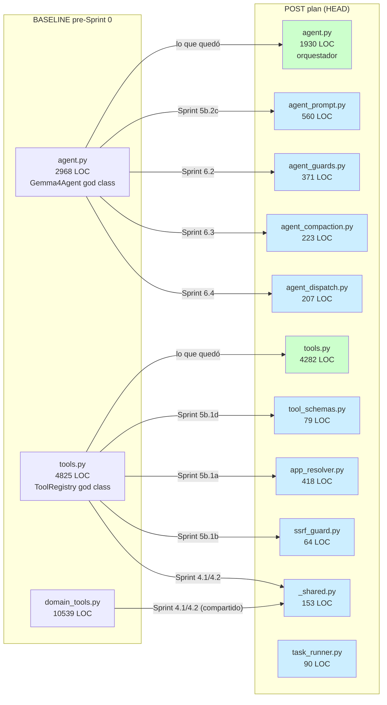

# 02 — Delta Components (módulos nuevos en detalle)

> Detalle técnico de los **9 módulos nuevos** creados durante el plan
> + cambios significativos en módulos existentes.
> **Para los componentes baseline ver:** [`_baseline_audit/02_components/`](../_historico/baseline_audit/02_components/).

## 1. Mapa de extracciones



## 2. Detalle de cada módulo nuevo

### 2.1 `agent_prompt.py` (560 LOC) — Sprint 5b.2c

**Extraído de:** `agent.py:41-590` (líneas viejas).

**Contenido:**
- `CORE_PROMPT` (string literal de 160 LOC — el system prompt base).
- `TOOL_RULES: dict[str, str]` — reglas de uso por tool (35 entries).
- `build_system_prompt(selected_tool_names)` — composer.
- `SYSTEM_PROMPT` — singleton eager.

**Por qué se extrajo:** son literales que cualquier dev necesita
inspeccionar/editar. Tenerlos en un archivo dedicado:
- Reduce `agent.py` en ~550 LOC.
- Permite recargar el prompt sin tocar el código del agente.
- Habilita futuro lazy-load desde `.md` files.

**Garantía de invariancia:** SHA256 de `SYSTEM_PROMPT` byte-idéntico
antes/después del split (verificado en commit `8fbf30e`).

**API pública:** `agent.py` hace `from .agent_prompt import CORE_PROMPT,
TOOL_RULES, build_system_prompt, SYSTEM_PROMPT` para preservar callers
externos (mcp_server, tests, etc).

### 2.2 `agent_guards.py` (371 LOC) — Sprint 6.2

**Extraído de:** `agent.py` (6 `_guard_*` methods + builder).

**Contenido:**

| Función | LOC aprox | Propósito |
|---|--:|---|
| `guard_unverified_final` | ~70 | Detecta replies que claim "hecho" sin tool_result verificado |
| `guard_phrase_confirm` | ~45 | Reemplaza false-confirmations |
| `build_user_facing_fallback` | ~55 | Composer del fallback honesto en idioma del usuario |
| `guard_promise_without_action` | ~95 | Detecta promesas vacías ("buscaré…", "te aviso") sin tool_events |
| `guard_grounded_action_claim` | ~80 | Verifica que claims de acción coincidan con tool_events |
| `guard_plan_status` | ~25 | Reporta status del plan al user si hay explicit_plan activo |

**Diseño:** funciones puras. Todas reciben state explícito (trace,
phrase_fires, current_user_text, last_router_subset, etc) en lugar de
acceder a `self`. Los métodos del agent ahora son wrappers de 3-5
líneas que pasan los atributos correctos.

**Tests asociados:** `test_promise_guard.py` (21/21 verde tras
Sprint 6.1), `test_phrase_trigger_guards.py`, parte de
`test_gemma4agent_contract.py`.

### 2.3 `agent_compaction.py` (223 LOC) — Sprint 6.3

**Extraído de:** `agent.py` (8 helpers top-level + 3 constantes).

**Contenido:**

| Símbolo | Propósito |
|---|---|
| `LIVE_TEXT_LIMIT`, `HISTORY_TEXT_LIMIT`, `TOOL_RESULT_LIMIT` | Constantes de budget |
| `compute_context_budget(context_size)` | Calcula límites dinámicos |
| `compact_live_content(content)` | Trunca contenido del turno actual |
| `compact_history_content(content)` | Trunca historial pasado |
| `compact_tool_result(name, args, result)` | Trunca resultados grandes de tools |
| `compact_json(value, max_items, max_string, depth)` | Recursive truncate de JSON |
| `message_text_estimate(message)` | Aproxima tokens para budget |

**Lo que NO se extrajo:** los métodos `_compact_completed_history`,
`_compact_active_history_for_retry`, `_extract_facts`,
`_summarize_history_block` siguen en `Gemma4Agent` porque manejan
state mutable (`self.history`, `self._summarize_last_run_turn`,
etc) y hacen LLM calls. Solo los helpers puros salieron.

### 2.4 `agent_dispatch.py` (207 LOC) — Sprint 6.4

**Extraído de:** `agent.py` (`_execute_calls_sequential` + `_execute_calls_parallel`).

**Contenido:** dos funciones puras (`execute_calls_sequential`,
`execute_calls_parallel`) que toman `tool_calls`, `tools_registry`,
`progress_cb`, `trace`, `turn_id` como parámetros y devuelven
`list[ToolEvent]`.

**Los métodos del agent** son ahora wrappers de 5 líneas.

### 2.5 `app_resolver.py` (418 LOC) — Sprint 5b.1a

**Extraído de:** `tools.py:642-1155` (`AppResolver` + `AppCandidate`).

**Contenido:**
- `@dataclass(frozen=True) AppCandidate` — resultado de búsqueda.
- `class AppResolver` con 16 métodos: 9 fuentes (`_from_path`,
  `_from_shortcuts`, `_from_start_apps`, `_from_uninstall_registry`,
  `_from_steam`, `_from_steam_appinfo_cache`, `_from_epic`,
  `_from_common_exe_roots`, `_launch_from_registry_item`) +
  `find()`, `open()`, `_rank()`.

**Por qué se extrajo:** es un sub-sistema con frontera nítida que
solo lo usa `ToolRegistry.apps` y la tool `app`. Cambios en
`AppResolver` no tocan el resto de `tools.py`.

**Sigue siendo god class** (16 métodos, 9 fuentes) pero ahora es
**god class aislada**. La auditoría baseline sugería reducirlo a 3-4
fuentes; eso es deuda futura.

### 2.6 `ssrf_guard.py` (64 LOC) — Sprint 5b.1b

**Extraído de:** `tools.py` (`_SSRFGuardRedirectHandler` + `_is_private_host`).

**Propósito:** prevenir SSRF (Server-Side Request Forgery) en las
tools `web_read` y `download_tool`. Bloquea redirects a IPs privadas.

**Por qué se extrajo:** la auditoría baseline lo marcó como
`[1-USER]` (usado en 1 lugar). Vive cerca de su único caller
ahora, no en medio de `tools.py`.

### 2.7 `tool_schemas.py` (79 LOC) — Sprint 5b.1d

**Extraído de:** `tools.py` (literal `COMPOUND_TOOL_SCHEMAS`).

**Contenido:** la lista entera de 65 dict schemas para el LLM.

**Por qué se extrajo:** es un literal enorme (~3 000 LOC pre-Sprint
pero con muchos schemas largos), separado de la lógica de dispatch.
Permite editar schemas sin abrir `tools.py`.

**Re-export en `tools.py`:** `from .tool_schemas import COMPOUND_TOOL_SCHEMAS`
para preservar callers existentes.

### 2.8 `_shared.py` (153 LOC) — Sprint 4.1 + 4.2

**Razón de existencia:** romper duplicación auto-confesada entre
`tools.py` y `domain_tools.py`.

**Antes del refactor:**
- `tools.py:_redact_sensitive` ≡ `domain_tools.py:_redact_credentials`
  (comentario "CC-105: paralelo a tools._redact_sensitive").
- `tools.py:_hard_gate` (método) ≡ `domain_tools.py:_hard_gate`
  (función top-level) — comentario "CC-101: gate duro replicable
  desde domain_tools".

**Después:**

```python
# _shared.py (sin dependencias del paquete — pure stdlib)
def redact_sensitive(value, depth=0): ...
def hard_gate(state, *, tool, action, args, reason, risk="high"): ...
```

**Patrón:** `_shared.py` NO importa de gemma4_agent. Otros archivos
del paquete sí pueden importar de `_shared.py`. Eso garantiza acíclico.

### 2.9 `task_runner.py` (90 LOC) — Sprint 1.8

**Unifica:** `routine_runner.py` + `watcher_runner.py` (eran 97 LOC
combinados de código idéntico estructuralmente).

**API:**
```bash
python -m gemma4_agent.infra.task_runner --type {routine,watcher} --id <id>
                                    [--label <label>]
```

**Compatibilidad:** los wrappers viejos siguen existiendo (~15 LOC
cada uno) — preprenden `--type routine|watcher` y delegan. Esto
preserva los Scheduled Tasks de Windows ya registrados que invocan
`python -m gemma4_agent.infra.routine_runner` etc.

## 3. Tabla resumen de impacto

| Módulo nuevo | LOC | Extraído de | Razón |
|---|--:|---|---|
| `agent_prompt.py` | 560 | agent.py | literales del prompt |
| `agent_guards.py` | 371 | agent.py | 6 post-reply guards |
| `agent_compaction.py` | 223 | agent.py | helpers de context budget |
| `agent_dispatch.py` | 207 | agent.py | sequential/parallel tool execution |
| `app_resolver.py` | 418 | tools.py | sub-sistema con frontera nítida |
| `ssrf_guard.py` | 64 | tools.py | 1-USER, vive cerca de sus callers |
| `tool_schemas.py` | 79 | tools.py | literal de 65 schemas |
| `_shared.py` | 153 | tools.py + domain_tools.py | romper duplicación CC-101/CC-105 |
| `task_runner.py` | 90 | unificación 2→1 | DRY de runners scheduled tasks |
| **Total módulos nuevos** | **2 165** | | |

## 4. Tabla resumen de eliminaciones

| Módulo eliminado | LOC | Sprint | Razón |
|---|--:|---|---|
| `capability_classifier.py` | 303 | 3a.1 | Cache hit 3.2 % < 20 % umbral |
| `nli_service.py` | 246 | 3a.1 | Dependencia de capability_classifier |
| `_ml_import_lock.py` | 49 | 3a.1 | Solo existía para serializar imports NLI |
| `timeline.py` | 137 | 4.4 | 4 sinks redundantes → 3 |
| `design_handoff_carter_field/` | varios | 1.1 | Carter handoff legacy |
| 23 wrappers fantasma de `_impls` | ~25 | 1.3 | Legacy tools no en COMPOUND_TOOL_SCHEMAS |
| Async layer de `grounding_gate.py` | ~125 | 3a.1 | Dependía de NLI |
| Regex PT/FR/IT en `planner.py` | ~150 | 3a.2 | System prompt es Spanish-only |
| Regex PT/FR/IT en `mission_goal._VERB_KIND_PATTERNS` | — | SKIP | en lista no-tocar |
| Fallbacks `it/pt/fr/de` en `grounding_gate._FALLBACKS_BY_LANG` | ~27 | 3a.2 | Idiomas no usados |
| **Total eliminado** | **~1 060** | | |

## 5. Módulos que se conservaron a propósito

Estos tienen tamaño grande pero **decisión consciente de no tocar**:

| Módulo | LOC | Razón |
|---|--:|---|
| `ui/main_window.py` | 1 430 | 55 métodos con 15+ state attrs compartidos = acoplamiento real del dominio |
| `ui/settings.py` | 1 148 | tabs comparten `self._gather()` — split no mecánico |
| `agent_runner.py` + `ui/agent_thread.py` | 552 + 220 | divergen genuinamente en threading model |
| `domain_tools.py` | 10 489 | top-level imports ya eran limpios (lazy), no urgente partirlo |
| `verifiers.py` | 690 | Side-effect decorators registrados al import (vital) |
| `mission_goal.py` + `mission_outcome.py` | 919 | Heredado de Carter v5, filosóficamente coherente |
| `voice/*` | 2 765 | Frontera nítida, diseño correcto |
| `tracing.py` | 67 | 50+ callers en agent.py, migración alto riesgo |
| `telemetry.py` | 443 | Opt-in default OFF, esperando uso real |

**Veredicto del plan:** **NO todo lo grande es deuda.** Los UI dialogs
son god classes intencionales del dominio. Los wrappers de workers
divergen por diseño. La auditoría baseline los marcó como "candidatos
a split" pero la ejecución reveló que el costo de splitear es mayor
que la ganancia.
