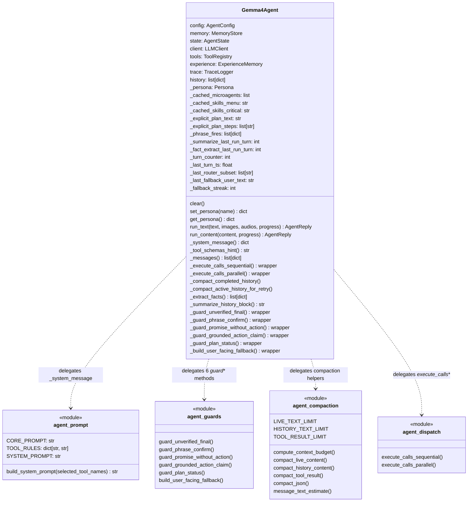
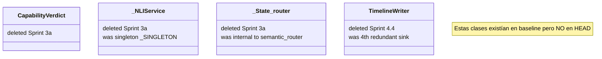
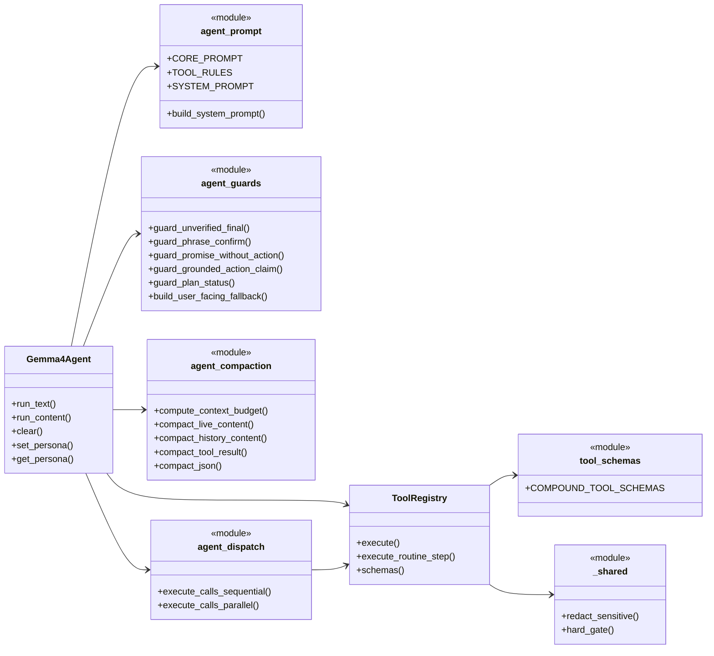

# 03 — Delta Classes (UML actualizado de god classes)

> Solo las clases que **cambiaron significativamente**. Para el UML
> baseline completo ver [`_baseline_audit/03_classes/`](../_historico/baseline_audit/03_classes/).

## 1. `Gemma4Agent` (agent.py) — descompuesto en 4 colaboradores

### Antes (baseline)
- LOC: 1 852.
- Métodos: 21.
- Atributos privados de state: 12.
- `run_content` solo: 892 LOC en un único método.

### Después (HEAD)
- LOC: ~1 200 dentro de `agent.py` (el archivo total son 1 930, hay
  helpers top-level).
- Métodos: 21 (igual número, pero los pesados son wrappers de 3-5 líneas).
- Atributos privados de state: 12 (sin cambios — la clase sigue
  manteniendo state).
- `run_content` solo: ~600 LOC (perdió la mayor parte de los
  `_compact_*`, `_extract_facts`, guards, dispatch).



> **Lo que NO cambió:** la **API pública** de `Gemma4Agent` (`run_text`,
> `run_content`, `clear`, `set_persona`, `get_persona`). Cualquier
> caller externo (CLI, UI Desktop, UI Field, MCP, runners) sigue
> funcionando idéntico.

## 2. `ToolRegistry` (tools.py) — 3 colaboradores extraídos

### Antes (baseline)
- LOC: 3 157 dentro de la clase + 4 825 del archivo total.
- Métodos: 142.
- Constructor instanciaba: `MemoryStore`, `AgentState`, `KnowledgeStore`,
  `AppResolver`, `_SSRFGuardRedirectHandler`.

### Después (HEAD)
- LOC: similares (la clase no se redujo internamente porque 5b.1c
  quedó SKIP), pero ahora **3 archivos auxiliares**:

```mermaid
classDiagram
    class ToolRegistry {
        memory: MemoryStore
        captures_dir: Path
        state: AgentState
        knowledge: KnowledgeStore
        safety_enabled: bool
        apps: AppResolver
        _impls: dict[str, ToolFn]
        parent_agent: Gemma4Agent
        execute(name, args) dict
        execute_routine_step(name, args, confirmed_at_create) dict
        schemas() list[dict]
        schema_names() list[str]
        schemas_for_names(names) list[dict]
        ~140 method handlers and helpers~
    }

    class tool_schemas {
        <<module>>
        COMPOUND_TOOL_SCHEMAS: list[dict]
        (65 schemas)
    }

    class app_resolver {
        <<module>>
        AppCandidate dataclass
        AppResolver class
    }

    class ssrf_guard {
        <<module>>
        _is_private_host() bool
        _SSRFGuardRedirectHandler class
    }

    class _shared {
        <<module>>
        redact_sensitive()
        hard_gate()
    }

    ToolRegistry ..> tool_schemas : reads COMPOUND_TOOL_SCHEMAS
    ToolRegistry ..> app_resolver : self.apps
    ToolRegistry ..> ssrf_guard : uses in web_read/download_tool
    ToolRegistry ..> _shared : redact_sensitive + hard_gate
```

> **Pending:** dispatch pipeline (`_normalize_tool_result`,
> `_coerce_and_validate_tool_args`, `_PRE_VALIDATORS`) NO se extrajo
> a `tool_dispatch.py` por cycle con 5 helpers privados. Sprint 6.5
> ya escribió la red de tests (`test_tool_pipeline_helpers.py`) para
> un futuro intento.

## 3. Clases ELIMINADAS



## 4. Clases ADELGAZADAS (no eliminadas)

### `grounding_gate.py`

| Componente | Antes | Después |
|---|---|---|
| `detect_action_claim_without_evidence` (inline) | ✓ | ✓ |
| `GroundingVerdict` dataclass | ✓ | ✓ |
| `_FALLBACKS_BY_LANG` 6 idiomas | ✓ | ✓ pero solo 2 (es+en) |
| `format_fallback` | ✓ | ✓ |
| `schedule_grounding_check` (async NLI) | ✓ | ❌ removido |
| `detect_reply_language` | ✓ | simplificado |
| `_LANG_HINTS` | 6 idiomas | 2 idiomas |

255 LOC baseline → ~130 LOC HEAD.

### `planner.py`

`_suggest_tools` regex multilingüe redujo ~150 LOC (PT/FR/IT trim).
La lógica de keyword matching sigue igual, solo idiomas removidos.

### `experience.py::ExperienceMemory`

Sin cambios funcionales en el plan, pero el recovery del stash trajo
**5 columnas nuevas** vía `ALTER TABLE`:
- `outcome_code`
- `failure_reason_code`
- `args_signature`
- `capability_label`
- `grounding_flagged`

Plus `flag_grounding_by_turn` que sprint 1.4 originalmente quería
colapsar con `flag_grounding` (skip — no existía en HEAD baseline).

## 5. UML actualizado del cluster "Agent Core" (Fig 3.1 post-plan)



## 6. Resumen del impacto en god classes

| Clase | Métricas baseline | Métricas HEAD | Veredicto |
|---|---|---|---|
| `Gemma4Agent` | 1 852 LOC / 21 métodos | ~1 200 LOC + 4 módulos delegados | ✅ descompuesto |
| `ToolRegistry` | 3 157 LOC / 142 métodos | similar internamente + 3 módulos extraídos | 🟡 parcial |
| `MainWindow` | 1 430 LOC / 53 métodos | 1 430 LOC / 53 métodos | ❌ conservado (acoplamiento real) |
| `SettingsDialog` | 1 148 LOC / 22 métodos | 1 148 LOC / 22 métodos | ❌ conservado (tabs comparten state) |

**Lo conservado** lo está **a propósito**, no por falta de
ambición. Los workers (`AgentWorker` / `AgentRunner`) tampoco se
colapsaron porque divergen genuinamente en threading model + output
channel + build sequence (Sprint 4 y Sprint 5b lo argumentaron, los
tests de paridad de Sprint 5a.3 confirman paridad de **API** pero no
de **flujo interno**).
