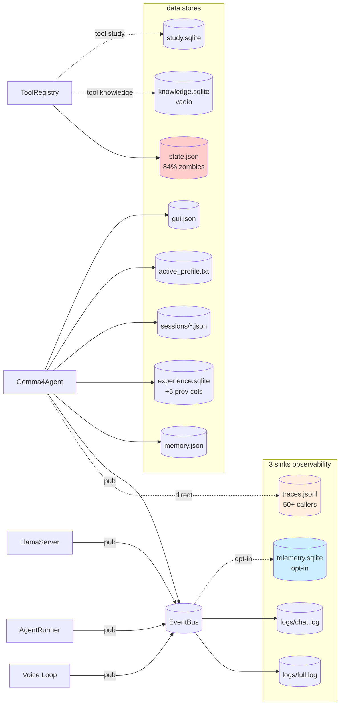

# 05 — Delta Data (persistencia + state.json + 4 sinks → 3)

> Cambios en superficies de persistencia post-plan. Para inventario
> baseline completo ver [`_baseline_audit/05_data.md`](../_historico/baseline_audit/05_data.md).

## 1. Eliminación de Timeline (4 sinks → 3)

### Baseline: 4 sinks redundantes

```
gemma4_agent/data/traces.jsonl                    ← TraceLogger (Agent escribe directo)
~/.gemma4/logs/<sid>/full.log                     ← LogRecorder (BUS sync listener)
~/.gemma4/logs/<sid>/chat.log                     ← LogRecorder (subset humano)
~/.gemma4/timeline/<sid>-turn<NNN>.jsonl          ← TimelineWriter (per-turn-per-session)
```

### HEAD: 3 sinks

```
gemma4_agent/data/traces.jsonl                    ← TraceLogger (sigue activo: 50+ callers)
~/.gemma4/logs/<sid>/full.log                     ← LogRecorder (canónico)
~/.gemma4/logs/<sid>/chat.log                     ← LogRecorder (subset humano)
[~/.gemma4/timeline/* ya no se escribe]           ← TimelineWriter ELIMINADO en Sprint 4.4
```

**Lo que NO se eliminó pero el plan lo planeaba:** TraceLogger (`tracing.py`).
Sprint 4.4 partial reveló que tiene **50+ call sites en `agent.py`** y
es el feeder de `scripts/analyze_traces.py` (que Sprint 2 construyó).
La migración a `BUS.publish` + LogRecorder es **alto riesgo en
observabilidad** por ganancia puramente estructural. Decisión: dejar
TraceLogger activo.

### Telemetry sigue opt-in default OFF

`telemetry.py` (443 LOC, `TelemetryStore`) no se tocó. Sigue
escribiendo a `<state_path.parent>/telemetry.sqlite` solo si
`GEMMA4_TELEMETRY=1`. La auditoría baseline lo marcó como candidato
a eliminar; sigue vivo por si Sprint 3b lo necesita para métricas
numéricas durante la ventana de medición.

## 2. state.json — situación post-plan

### Baseline (al momento de la auditoría)
- 538 KB, 468 resources de los cuales **392 (84 %) eran `closed`
  zombies** que nunca se borraban.
- 27 `pending_action` resources `open` (confirmations sin resolver).
- 360 routines persistidas (probablemente bloat de dev/test).
- 3 checkpoints, 1 note, 231 confirmations.

### HEAD (estado actual)

**El plan NO atacó este findings.** La acción "cambiar `mark_cleaned`
para que borre" estaba en Sprint 1 (audit §2.3 HIGH) pero el agente
no la ejecutó — no estaba en el prompt operativo de Sprint 1 + 2 +
3a + 4 + 5 + 6. Quedó como **deuda explícita en
[08_findings_post_plan.md](08_findings_post_plan.md)**.

**Recomendación práctica:** lo podés ejecutar a mano en cualquier
momento con:

```python
import json
from pathlib import Path
p = Path("gemma4_agent/data/state.json")
data = json.loads(p.read_text(encoding="utf-8"))
before = len(data["resources"])
data["resources"] = {
    k: v for k, v in data["resources"].items()
    if v.get("status") != "closed"
}
after = len(data["resources"])
p.write_text(json.dumps(data, indent=2, ensure_ascii=False), encoding="utf-8")
print(f"Purged {before - after} closed resources. {after} remain.")
```

O en código de producción: modificar
`state.AgentState.mark_cleaned()` para que haga `del data["resources"][rid]`
en lugar de cambiar `status="closed"`. Cambio de 5 líneas, pero
**rompe** cualquier consumer que asume que las closed siguen en disco
(buscar callers en `state.py` y `tools.py`).

## 3. Schemas SQLite — schema drift en experience.sqlite

Sprint 1 + recovery del stash trajeron 5 columnas nuevas a
`experiences` vía `ALTER TABLE` envueltas en try/except:

```sql
ALTER TABLE experiences ADD COLUMN outcome_code TEXT;
ALTER TABLE experiences ADD COLUMN failure_reason_code TEXT;
ALTER TABLE experiences ADD COLUMN args_signature TEXT;      -- JSON dict
ALTER TABLE experiences ADD COLUMN capability_label TEXT;
ALTER TABLE experiences ADD COLUMN grounding_flagged INTEGER DEFAULT 0;
```

Patrón `try/except sqlite3.OperationalError: pass` → idempotente
pero **traga errores genuinos** (disk full, etc).

**Sin migration framework** (alembic o similar). La auditoría baseline
lo marcó HIGH (§2.16). El plan no actuó — sigue como deuda.

**Consecuencia práctica:** cualquier `experience.sqlite` viejo se
auto-migra al levantar el agente. Nuevos schemas requieren agregar
más `ALTER TABLE` al mismo bloque.

## 4. Inventario completo de persistencia (post-plan)

Total de superficies: **25** (era 26 — eliminamos `timeline/`).

### 4.1 SQLite (sin cambios estructurales)

| Store | Path | Owner | Notas |
|---|---|---|---|
| `experience.sqlite` | `data/experience.sqlite` | `ExperienceMemory` | +5 cols nuevas |
| `knowledge.sqlite` | `data/knowledge.sqlite` | `KnowledgeStore` | Vacío en disco (feature dormido) |
| `study.sqlite` | `data/study.sqlite` | `domain_tools.study_tool` | SM-2 flashcards |
| `telemetry.sqlite` | `<state_path>/telemetry.sqlite` | `TelemetryStore` | Opt-in default OFF |

### 4.2 JSON (sin cambios estructurales)

| Store | Path | Owner | Notas |
|---|---|---|---|
| `memory.json` | `data/memory.json` | `MemoryStore` | 3 items en muestra |
| `state.json` | `data/state.json` | `AgentState` | 84 % zombies pendientes de purge |
| `sessions/<id>.json` | `~/.gemma4/sessions/*` | `SessionStore` | Sesiones de chat |
| `active_profile.txt` | `~/.gemma4/` | `profiles.py` | Profile activo |
| `profiles.json` | `~/.gemma4/` | `profiles.py` | Overrides (vacío en mi muestra) |
| `gui.json` | `~/.gemma4/` | `server.py` `PUT /settings` | UI prefs |
| `cache/app_inventory.json` | `~/.gemma4/cache/` | `AppResolver` | Cache de apps escaneadas |

### 4.3 Logs y trazas (3 sinks ahora)

| Sink | Path | Owner |
|---|---|---|
| `tracing.TraceLogger` | `data/traces.jsonl` | `Gemma4Agent` directo |
| `log_recorder.RECORDER` full | `~/.gemma4/logs/<sid>/full.log` | BUS sync listener |
| `log_recorder.RECORDER` chat | `~/.gemma4/logs/<sid>/chat.log` | mismo |
| ~~`timeline.TimelineWriter`~~ | ~~`~/.gemma4/timeline/`~~ | ELIMINADO Sprint 4.4 |

### 4.4 Outputs de tools (sin cambios)

- `data/backups/*.zip` — `backup_sync_tool`
- `data/generated/*.pptx,.xlsx,.png` — `office_tool`
- `data/data_analysis/*.png` — `data_analysis_tool`
- `data/jobs/*.log` — `job_manager_tool`
- `captures/` — multimodal (imágenes adjuntas por user)

### 4.5 Binarios externos (sin cambios)

- `~/.gemma4/tools/SoundVolumeView.exe` — `audio_device_tool`
- `~/.gemma4/models/vosk-model-small-es-0.42/` — wake
- `~/.gemma4/models/piper/*.onnx` — TTS
- `~/.gemma4/models/whisper/` — STT
- ~~`~/.gemma4/models/...nli...`~~ — NO existe, mDeBERTa ya no se descarga (NLI matado)

## 5. Diagrama del flujo de persistencia (post-plan)



## 6. Resumen

| Aspecto | Baseline | HEAD |
|---|---|---|
| Sinks observability | 4 (TraceLogger + LogRecorder/full + LogRecorder/chat + Timeline) | 3 (eliminamos Timeline) |
| Telemetry status | opt-in OFF | igual |
| TraceLogger status | activo, 50+ callers | igual (no migrado) |
| `state.json` purge | no | **NO** (pendiente, manual recommended) |
| `experience.sqlite` cols | 7 originales | 7 + 5 provenance |
| Stores SQLite totales | 4 (incluye telemetry conditional) | 4 |
| Stores JSON totales | 7 | 7 |
| Binarios externos | NLI mDeBERTa 280 MB + voice models | **solo voice models** (NLI eliminado) |
| Superficies totales | 26 | **25** |
