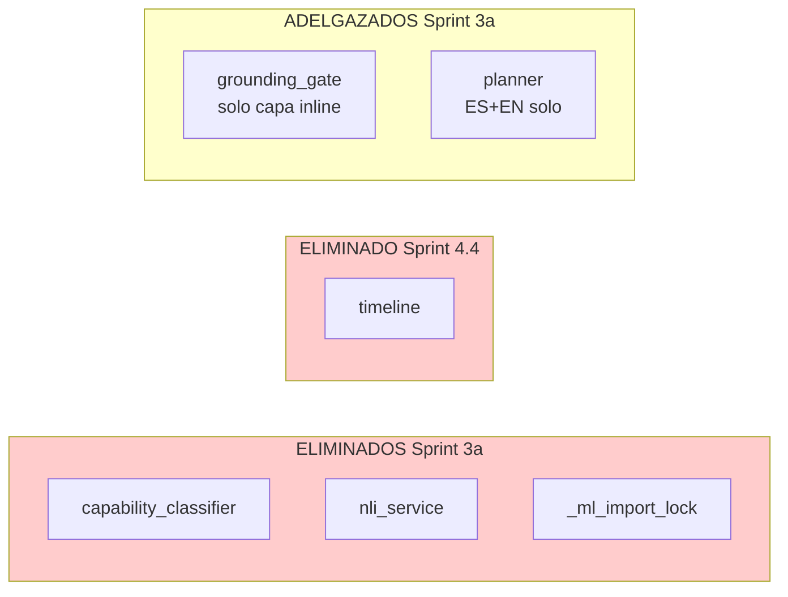

# 06 — Delta Dependencies (grafo post-plan)

> Cambios en el grafo de imports interno + dependencias externas
> (`requirements.txt` que ahora **sí existe**).
> Para grafo baseline ver [`_baseline_audit/06_dependencies.md`](../_historico/baseline_audit/06_dependencies.md).

## 1. requirements.txt — la diferencia más grande

**Baseline:** **NO existía.** Reproducir el proyecto era imposible
sin reverse-engineering de imports.

**HEAD:** existe en raíz del repo (Sprint 0.1 commit `123d2c2`):
40+ paquetes externos agrupados por tema (voice / LLM / UI desktop /
UI field / data / docs / DB / IoT / win32). Pinned a versiones del
venv activo donde había, `>=` para opcionales no instalados.

**Cambios específicos post-plan en requirements (Sprint 3a):**
- Eliminamos `transformers` (era para `nli_service`). **No agregamos
  nada nuevo.**

## 2. pyproject.toml — entry points

**Baseline:** NO existía.

**HEAD:** existe (Sprint 0.2 commit `d914beb`):

```toml
[project.scripts]
gemma4-chat = "gemma4_agent.chat:main"
gemma4-ui = "gemma4_agent.ui.app:main"
gemma4-server = "gemma4_agent.server:main"
gemma4-launcher = "gemma4_agent.launcher:main"
```

## 3. Grafo interno — nodos eliminados



## 4. Grafo interno — nodos nuevos

Sprint 5b + Sprint 6 + Sprint 4 + Sprint 1 agregaron **9 módulos
nuevos** al paquete:

| Módulo nuevo | Quién lo importa |
|---|---|
| `agent_prompt` | `agent` (re-export) + tests + `mcp_server` |
| `agent_guards` | `agent` (delegate desde 6 wrappers) |
| `agent_compaction` | `agent` (delegate desde compaction methods) |
| `agent_dispatch` | `agent` (delegate desde execute_calls_*) |
| `app_resolver` | `tools` (self.apps) |
| `ssrf_guard` | `tools` (web_read, download_tool) |
| `tool_schemas` | `tools` (re-export COMPOUND_TOOL_SCHEMAS) |
| `_shared` | `tools` + `domain_tools` |
| `task_runner` | `routine_runner` + `watcher_runner` (wrappers) |

**Garantía de acíclico:** `_shared.py` no importa de ningún módulo
del paquete (solo stdlib). Eso fue diseño deliberado de Sprint 4.1
para romper el cycle que motivó `_redact_*` y `_hard_gate`
duplicados.

## 5. Verificación de ciclos

Baseline: **0 ciclos** detectados (uso liberal de lazy imports).
HEAD: **0 ciclos** (mismo principio + módulos nuevos son hojas).

Confirmar manualmente con (no incluyo scanner aquí porque agregar
otro scratch y borrarlo es ruido):

```bash
python -c "
import importlib, sys
mods = [
    'gemma4_agent.agent_prompt',
    'gemma4_agent.agent_guards',
    'gemma4_agent.agent_compaction',
    'gemma4_agent.agent_dispatch',
    'gemma4_agent.app_resolver',
    'gemma4_agent.ssrf_guard',
    'gemma4_agent.tool_schemas',
    'gemma4_agent._shared',
    'gemma4_agent.task_runner',
]
for m in mods:
    importlib.import_module(m)
    print('OK', m)
"
```

Si todos imprimen `OK`, no hay cycle issues con los nuevos módulos.

## 6. Tabla comparativa de god modules

| Módulo | In-degree baseline | In-degree HEAD aprox |
|---|--:|--:|
| `agent` | 21 importadores | similar (clase pública sigue) |
| `config` | 21 | 21 |
| `domain_tools` | 20 | 20 |
| `state` | 20 | 20 |
| `tools` | 13 | 13 + 9 que también importan los nuevos sub-módulos |
| `ui.theme` | 12 (todos eager) | 12 |
| `events_bus` | 11 | 11 |
| `profiles` | 11 | 11 |
| **NUEVO: `agent_prompt`** | — | 4 (agent re-export + mcp + 2 tests) |
| **NUEVO: `agent_guards`** | — | 1 (agent) |
| **NUEVO: `agent_compaction`** | — | 1 (agent) |
| **NUEVO: `agent_dispatch`** | — | 1 (agent) |
| **NUEVO: `tool_schemas`** | — | 3 (tools + agent + tests) |
| **NUEVO: `_shared`** | — | 2 (tools + domain_tools) |
| **NUEVO: `app_resolver`** | — | 1 (tools) |
| **NUEVO: `ssrf_guard`** | — | 1 (tools) |
| **NUEVO: `task_runner`** | — | 2 (routine_runner + watcher_runner) |

**Observación:** los módulos nuevos tienen in-degree bajo (1-4). Eso
es **sano** — son sub-componentes de un container, no god modules
nuevos.

## 7. Resumen del impacto en deps

| Aspecto | Baseline | HEAD |
|---|---|---|
| `requirements.txt` | NO existe | **40+ paquetes pinneados** |
| `pyproject.toml` | NO existe | **PEP 621 + 4 entry points** |
| Deps eliminadas | — | `transformers` (Sprint 3a) |
| Deps agregadas | — | ninguna |
| Ciclos de import | 0 | **0** (preservado) |
| Total módulos internos | 135 | **140** (135 originales - 4 eliminados + 9 nuevos) |
| In-degree top god module | `agent` 21 | `agent` 21 (igual) |
| LOC top god module | `agent.py` 2 968 | `agent.py` **1 930** (−35 %) |

**Conclusión:** el grafo es **más rico estructuralmente** (más
nodos, más cohesión por archivo) sin perder la propiedad acíclica.
Cada módulo nuevo es **hoja del grafo** (depende de stdlib + 1-2
componentes internos), lo cual es exactamente lo que querés.
