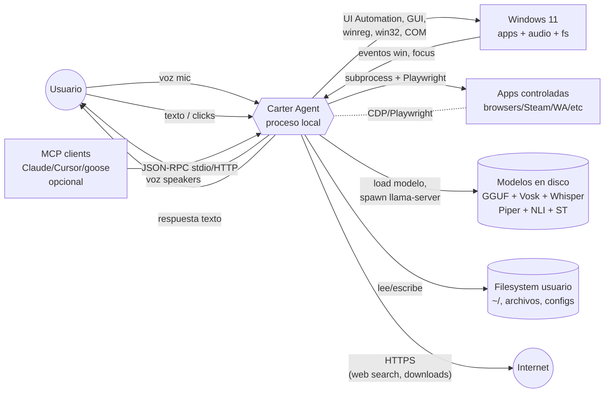
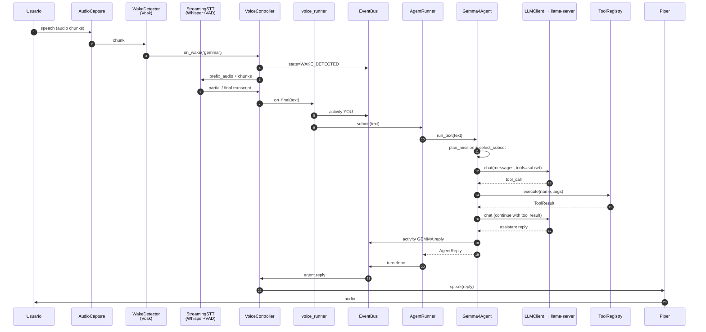
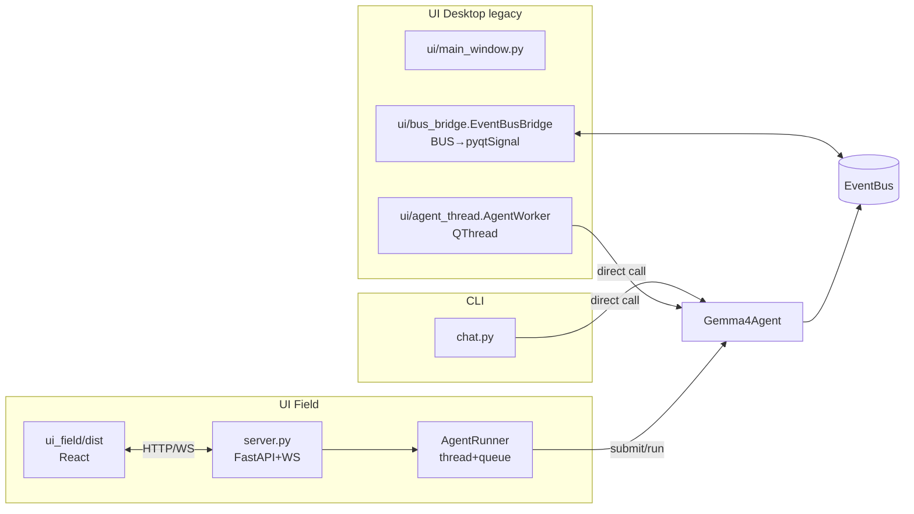
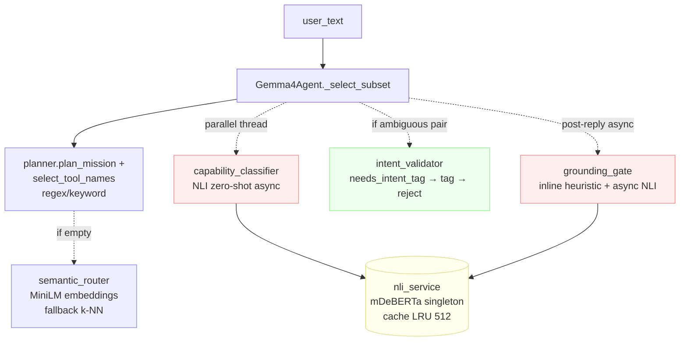
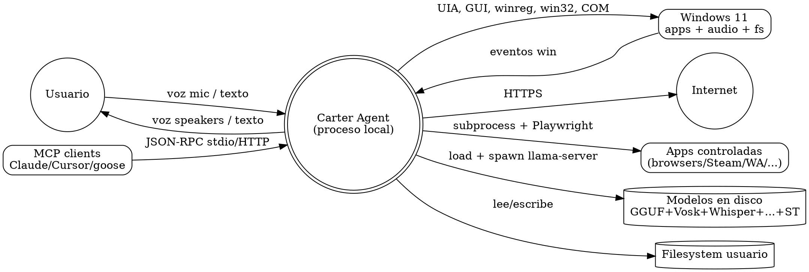

# Fase 1 — Diagrama de sistema (C4 niveles 1 y 2)

> **Corrección a Fase 0**: cuatro módulos que el scanner AST estático marcó
> como huérfanos (`verifiers.py`, `telemetry.py`, `ui/panels.py`, `ui/metrics.py`)
> en realidad **se cargan dinámicamente** (`from . import verifiers as _v  # F401`
> que dispara registro vía decoradores; `from . import metrics as metrics_mod`
> con alias). Ninguno es código muerto. Lo aclaro acá y lo dejo confirmado para
> Fase 6 (grafo de dependencias).
>
> **Convenciones**:
> - Diagramas en Mermaid como formato primario (renderizables en GitHub, VS Code, Obsidian).
> - Cada figura se reexporta en DOT al final del documento como backup.
> - Toda flecha está etiquetada con el tipo de interacción (`HTTP`, `WS`, `IPC`, `call`, `pub/sub`, `IO`, `subproc`).

---

## 1. C4 Nivel 1 — System Context

El agente Gemma4 corre 100 % local en una máquina Windows 11. Los "actores externos" son:

- **Usuario** que interactúa por voz (mic + speakers) o por texto (CLI/UI).
- **Sistema operativo Windows 11** (apps, ventanas, audio, registro, filesystem, browser nativo).
- **Apps controladas** (Steam, navegadores, WhatsApp, players, etc.) — fuera del proceso pero adentro del SO.
- **Modelos de IA en disco** (gemma-4 GGUF + mmproj, Vosk, Whisper, Piper, mDeBERTa NLI, MiniLM embeddings, MS-MARCO cross-encoder).
- **Filesystem del usuario** (carpetas, archivos personales, configs).
- **MCP clients externos opcionales** (Claude Desktop, Cursor, goose) que se conectan al `mcp_server.py` para reutilizar las tools.
- **Web pública** (lo único "remoto"): browsers Playwright, búsquedas web, descargas, Microsoft Graph.

**Lo único de la pintura anterior que NO existe:** no hay servicio cloud propio de Gemma4 (no telemetría externa, no LLM remoto). Todo el círculo `Gemma ↔ Models` es proceso local + GPU local.

---

## 2. C4 Nivel 2 — Containers (vista de alto nivel)

La pregunta clave es: ¿qué procesos / subsistemas con identidad propia hay dentro de "Carter Agent"? Después de leer el código real, identifico **15 containers** agrupados en 6 zonas:

```mermaid
%% Fig 1.2 — Containers (C4 N2) — vista de alto nivel
graph TB
    subgraph Usuario["Superficies de usuario"]
        CLI[Chat CLI<br/>chat.py]
        UIDesk[UI Desktop PyQt6<br/>ui/]
        UIField[UI Field React<br/>ui_field/ + server.py]
        Voice[Voice loop<br/>voice/ + voice_runner]
    end

    subgraph Orquestador["Orquestación del turno"]
        Agent[Agent Core<br/>agent.py · Gemma4Agent]
        Runner[Agent Runner<br/>agent_runner.py · thread + queue]
        Sessions[Sessions/Routines<br/>sessions.py · routine_runner · watcher_runner]
    end

    subgraph LLM["Lifecycle del LLM"]
        LlamaSrv[Llama-server manager<br/>llama_server.py · subprocess]
        LLMC[LLM client<br/>llm_client.py · HTTP]
        Prewarm[Boot/prewarm<br/>boot_progress · prewarm]
        Multimodal[Multimodal<br/>multimodal.py · image_part]
    end

    subgraph Routing["Routing & Validation"]
        Planner[Planner<br/>planner.py · MissionPlan]
        Router[Semantic Router<br/>semantic_router · MiniLM]
        Caps[Capability Classifier<br/>capability_classifier · NLI]
        NLI[NLI service<br/>nli_service.py · mDeBERTa]
        Intent[Intent Validator<br/>intent_validator.py]
        Ground[Grounding Gate<br/>grounding_gate.py]
    end

    subgraph Tools["Tools / Knowledge"]
        Registry[Tool Registry<br/>tools.py · ToolRegistry]
        Domain[Domain tools<br/>domain_tools.py · 33 tools]
        Ops[Ops tools<br/>ops_tools.py · Playwright/HTTP]
        SafetyMod[Safety<br/>safety.py · classify_tool_call]
        Verify[Verification<br/>verifiers.py + verify_core.py]
        Mission[Mission Outcome<br/>mission_goal + mission_outcome]
    end

    subgraph Mem["Memory & Knowledge"]
        MemJ[Memory explícita<br/>memory.py · JSON]
        Exp[Experience replay<br/>experience.py · SQLite+vec]
        Know[Knowledge base<br/>knowledge.py · FTS5+rerank]
        Skills[Skills + Microagents<br/>skills_registry + microagents]
        Personas[Personas<br/>personas.py]
    end

    subgraph Infra["Infra transversal"]
        BUS[(Event Bus<br/>events_bus.BUS)]
        Trace[Tracing<br/>tracing.py · JSONL]
        LogRec[Log Recorder<br/>log_recorder.py · per-session]
        Telem[Telemetry<br/>telemetry.py · SQLite]
        State[State<br/>state.py · resources]
        Config[Config + Profiles<br/>config.py + profiles.py + profile_watcher.py]
        MCP[MCP Server<br/>mcp_server.py]
    end

    %% superficies → orquestador
    CLI -- call --> Agent
    UIDesk -- "Qt signals" --> Agent
    UIField -- "HTTP/WS" --> Runner
    Voice -- "final text" --> Runner
    Runner -- "submit text" --> Agent

    %% orquestador → routing
    Agent -- "plan_mission" --> Planner
    Agent -- "select_tool_names" --> Planner
    Planner -- "fallback k-NN" --> Router
    Agent -. "parallel NLI" .-> Caps
    Caps --> NLI
    Agent -. "if ambiguous pair" .-> Intent
    Agent -. "async post-reply" .-> Ground
    Ground --> NLI

    %% orquestador → tools
    Agent -- "execute(name, args)" --> Registry
    Registry --> Domain
    Registry --> Ops
    Registry --> SafetyMod
    Registry -- "post-tool" --> Verify
    Agent -- "from_user_text" --> Mission
    Mission --> Verify

    %% orquestador → memorias
    Agent --> MemJ
    Agent --> Exp
    Agent --> Skills
    Agent --> Personas
    Registry -- "tool=knowledge" --> Know

    %% orquestador → LLM
    Agent -- "chat()" --> LLMC
    LLMC -- "HTTP :8080" --> LlamaSrv
    LlamaSrv -. spawn .-> LlamaProc[(llama-server.exe<br/>subprocess)]
    Runner -- "autostart" --> LlamaSrv
    Prewarm --> LLMC
    Agent --> Multimodal

    %% infra: BUS recibe de TODOS
    Runner -- "pub" --> BUS
    Voice -- "pub" --> BUS
    LlamaSrv -- "pub stage" --> BUS
    Telem -- "sub" --> BUS
    LogRec -- "sub (sync)" --> BUS
    UIDesk -- "sub via bus_bridge" --> BUS
    UIField -- "sub via WS" --> BUS

    %% trace y state: directo al disco
    Agent -- "event(turn_id,kind)" --> Trace
    Agent -- "state.update" --> State
    Sessions --> State
    Registry --> State

    %% config
    Config -- "from_env" --> Agent
    Config -- "from_env" --> Runner
    Config -- "from_env" --> Voice
    Config -- "from_env" --> Registry

    %% MCP expone Registry
    MCP -- "execute(name,args)" --> Registry
```

**Notas de lectura del diagrama:**

- Línea sólida = llamada directa síncrona en el código.
- Línea punteada = activación condicional / asíncrona (parallel thread, post-reply, opt-in).
- El **BUS** es el switchboard central. Cualquier actor que necesite saber "qué está pasando" se suscribe a él; cualquier productor publica en él. Esto desacopla totalmente Voice/Runner/LlamaServer (productores) de UI/LogRecorder/Telemetry (consumidores).
- El **`llama-server.exe`** está representado como un nodo aparte porque es un proceso hijo (no es código del paquete).

---

## 3. Inventario de containers, uno por uno

Para cada container: stack interno, responsabilidad (1 línea), archivos que lo implementan, qué consume, qué expone.

### 3.1 Superficies de usuario

#### Container `CLI Chat`
- **Responsabilidad:** REPL interactivo en terminal, con paleta ANSI y spinner.
- **Stack:** stdlib (argparse, threading, sys), nada externo.
- **Archivos:** `chat.py` (489 LOC, 1 clase `ProgressDisplay`, 6 funciones).
- **Consume:** `Gemma4Agent`, `AgentConfig`, `SessionStore`, `TimelineWriter`, `personas`, `profiles`, `llama_server` (autostart opcional).
- **Expone:** `python -m gemma4_agent.chat`.

#### Container `UI Desktop` (PyQt6)
- **Responsabilidad:** GUI legacy "MARK I JARVIS-style": splash + main window con HUD, panels, sessions, settings, triggers, memory viewer, tool explorer.
- **Stack:** PyQt6 (17 archivos del paquete `ui/`).
- **Archivos:** `ui/__main__.py`, `ui/app.py`, `ui/main_window.py` (1 616 LOC), `ui/settings.py` (1 247 LOC), `ui/hud.py`, `ui/panels.py`, `ui/triggers.py`, `ui/memory_viewer.py`, `ui/agent_thread.py`, `ui/bus_bridge.py`, `ui/sessions_panel.py`, `ui/tool_explorer.py`, `ui/theme.py`, `ui/log_widget.py`, `ui/metrics.py`, `ui/metric_bar.py`, `ui/async_tool.py`.
- **Consume:** `Gemma4Agent` (directo, vía `AgentWorker` en `QThread`), `EventBus` (vía `EventBusBridge` que traduce a `pyqtSignal`), `profiles`, `state`, `voice.audio_io` (Settings dialog elige device).
- **Expone:** `python -m gemma4_agent.ui`.

#### Container `UI Field` (React + Vite + FastAPI)
- **Responsabilidad:** UI moderna servida por FastAPI; rendereable en pywebview (ventana nativa), browser default o headless.
- **Stack:**
  - Frontend: React 19, TypeScript 6, Vite 8, pnpm.
  - Backend Python: FastAPI, uvicorn, pydantic, psutil, pynvml.
  - Bridges: `EventBus` → WebSocket; `AgentRunner` (single worker thread, queue serial).
- **Archivos:** `server.py` (1 519 LOC), `agent_runner.py` (552 LOC), `ui_field/src/` (TS/TSX), `ui_field/dist/` (bundle).
- **Endpoints:** `GET /` (static), `GET /model`, `GET /metrics`, `GET/PUT /settings`, `POST /turn`, `POST /activity`, `POST /agent/restart`, `GET /agent/status`, `GET /hardware`, `WS /events`.
- **Consume:** `Gemma4Agent` (vía `AgentRunner.submit`), `AgentConfig`, `EventBus`, `LlamaServerManager`, `ModelInfo`.
- **Expone:** `uvicorn gemma4_agent.server:app` o `python -m gemma4_agent.launcher ui [--browser|--no-window|--legacy-ui]`.

> **Decisión sobre las dos UIs:** las dos están vivas y cumplen funciones distintas (`ui/` es el legacy desktop, `ui_field/` es el sucesor pero está a medio terminar). Ambas son containers de pleno derecho. Cuál sobrevive a la limpieza la decide el dueño humano; este documento solo las describe.

#### Container `Voice Loop`
- **Responsabilidad:** captura mic → wake-word → STT streaming → publica final text al BUS / Runner; recibe texto del LLM → TTS → speakers.
- **Stack:** sounddevice (PortAudio), Vosk (wake), faster-whisper + silero-vad + scipy (STT), Piper (TTS), numpy. Win32 audio policy (pycaw + comtypes + pythoncom) para ducking.
- **Archivos:** `voice/audio_io.py` (AudioCapture), `voice/wake.py` (WakeDetector), `voice/stt.py` (StreamingSTT), `voice/tts.py` (StreamingTTS), `voice/controller.py` (VoiceController state machine, 9 estados), `voice_runner.py` (entry point + bridge a BUS/Runner).
- **Consume:** modelos de disco (Vosk, Whisper, Piper, Silero-VAD).
- **Expone:** `python -m gemma4_agent.voice_runner` (modo standalone) o integrado a UI Field vía BUS.

### 3.2 Orquestación del turno

#### Container `Agent Core`
- **Responsabilidad:** loop "decide → tool → feed back" del agente; armado del system prompt; gestión de history; integración de persona/microagents/skills/recall.
- **Stack:** solo Python; el modelo lo invoca vía `LLMClient`.
- **Archivos:** `agent.py` (2 968 LOC; `Gemma4Agent` 1 852 LOC / 21 métodos).
- **Consume:** prácticamente todos los containers (LLM, Router, Tools, Memory, Mission, Verification, BUS, Trace, State, etc.). Ver Fase 6 para grafo.
- **Expone:** `Gemma4Agent.run_text(...)`, `.run_voice_turn(...)`, `.clear()`, `.set_persona(...)`.

#### Container `Agent Runner`
- **Responsabilidad:** wrapping threading del `Gemma4Agent` sincrónico para servirlo a productores asincrónicos (FastAPI). Una sola cola, un worker — garantiza que no haya dos turns peleando por el slot único del llama-server.
- **Archivos:** `agent_runner.py` (552 LOC; `AgentRunner` 476 LOC, singleton `RUNNER`).
- **Consume:** `Gemma4Agent`, `LlamaServerManager`, `BUS` (para publicar progreso de boot/turn).
- **Expone:** `RUNNER.submit(text)`, `.start()`, `.stop()`, `.restart()`, `.is_warmed_up()`.

#### Container `Sessions/Routines`
- **Responsabilidad:** sesiones de chat (id, label, title autocompletado); routines y watchers como recursos persistidos en `state.json`; entry-points invocables por Windows Scheduled Tasks.
- **Archivos:** `sessions.py` (237 LOC, 3 clases), `routine_runner.py` (54 LOC), `watcher_runner.py` (43 LOC), `import_triggercmd.py` (131 LOC, importa TriggerCMD `commands.json` como `on_phrase` routines).
- **Consume:** `AgentState`, `ToolRegistry` (los runners ejecutan tools sin LLM), `MemoryStore`.
- **Expone:** `python -m gemma4_agent.{routine_runner,watcher_runner,import_triggercmd}` + APIs in-process.

### 3.3 Lifecycle del LLM

#### Container `Llama-server Manager`
- **Responsabilidad:** spawnear, monitorear y reciclar el subprocess `llama-server.exe` según el perfil activo. Idempotente; respeta servers externos en :8080.
- **Stack:** subprocess + socket + urllib (health-poll). Tail de logs en background.
- **Archivos:** `llama_server.py` (726 LOC; `LlamaServerManager` 327 LOC / 12 métodos), `boot_progress.py` (`LlamaLogTail`, etapas STAGE_SPAWN/STAGE_HEALTH/STAGE_LISTENING).
- **Consume:** `AgentConfig` (paths), `Profile` (flags), `BUS` (publica stages).
- **Expone:** `LlamaServerManager.start(profile, ...)`, `.stop()`, `.restart()`, `.get_pid()`.

#### Container `LLM Client`
- **Responsabilidad:** cliente HTTP OpenAI-compatible al llama-server; retry-on-recoverable, streaming SSE, parse tool_calls.
- **Archivos:** `llm_client.py` (490 LOC; `LLMClient` 289 LOC / 8 métodos).
- **Consume:** `AgentConfig` (server_url + parámetros sampling).
- **Expone:** `LLMClient.chat(messages, tools=...)`, `.health(...)`.

#### Container `Multimodal + Prewarm`
- **Responsabilidad:** ayudantes pequeños para acompañar al LLM: `multimodal.image_part` adapta imágenes al payload OpenAI; `prewarm` corre un turn de warmup de 1 token al boot para tener KV cache caliente.
- **Archivos:** `multimodal.py` (134 LOC, 0 clases), `prewarm.py` (140 LOC, 0 clases), `model_info.py` (153 LOC, lee metadata GGUF para /model en server).
- **Consume:** `LLMClient`, `AgentConfig`, GGUF en disco.

### 3.4 Routing & Validation

#### Container `Planner + Routing`
- **Responsabilidad:** decidir qué subset de tools va al system_prompt + qué pasos hay en la misión. Cascada de mecanismos para no depender de uno solo:
  1. `planner.plan_mission()` — extrae steps por regex multilingüe (ES/EN/PT/FR/IT) sobre verbos ("luego/despues/entonces").
  2. `planner.select_tool_names()` — keyword matching primario sobre cada step.
  3. Si keyword no encuentra nada → `semantic_router.fallback()` (embedding sentence-transformers/paraphrase-multilingual-MiniLM-L12-v2, top-k).
  4. En paralelo background → `capability_classifier` consulta `nli_service` (mDeBERTa zero-shot, 10 capability labels); resultado merge si llega a tiempo, cachea para el próximo turn similar si no.
- **Archivos:** `planner.py` (892 LOC, 2 clases), `semantic_router.py` (279 LOC), `capability_classifier.py` (303 LOC), `nli_service.py` (246 LOC, singleton), `_ml_import_lock.py` (49 LOC, serializa imports ML para evitar race huggingface_hub).
- **Modelos en disco:** MiniLM (~120 MB), mDeBERTa-xnli (~280 MB).
- **Consume:** `Agent Core` (le pasa el `user_text`).
- **Expone:** `MissionPlan`, `subset: list[str]`, `capability_telemetry: dict`.

#### Container `Validation Gates`
- **Responsabilidad:** dos gates ortogonales que protegen al user de respuestas incorrectas:
  - **Pre-tool:** `intent_validator.needs_intent_tag()` — cuando el subset contiene pares ambiguos (audio vs window/browser/app/media), inyecta una instrucción "emit `<intent>` tag", parsea la tag y rechaza la tool_call si el par (intent, tool, action) está en la blacklist `CROSS_REJECT_PAIRS`.
  - **Post-reply:** `grounding_gate.detect_action_claim_without_evidence()` (heurística sintáctica inline, sin LLM) y `schedule_grounding_check()` (async NLI sobre `nli_service` que escribe a lesson_store).
- **Archivos:** `intent_validator.py` (141 LOC, 2 clases, 5 funciones), `grounding_gate.py` (255 LOC).
- **Consume:** `nli_service` (compartido con `capability_classifier`).

### 3.5 Tools / Knowledge

#### Container `Tool Registry`
- **Responsabilidad:** dispatcher central de todas las tools del agente. Mantiene catálogo (`COMPOUND_TOOL_SCHEMAS`), aplica safety pre-call, ejecuta la handler, invoca verifiers post-call, normaliza el `ToolResult`, propaga eventos al BUS, gestiona resources en `state.json`.
- **Archivos:** `tools.py` (4 825 LOC; `ToolRegistry` 3 157 LOC / **142 métodos**; `AppResolver` 364 LOC; otras 2 clases).
- **Consume:** `domain_tools` (33 handlers compuestos), `ops_tools` (11 handlers: browser_real, download, email, env, input, ocr_*, registry, reminder, state), `safety.classify_tool_call`, `verify_core.verify`, `verifiers.*` (cargado por side-effect de import), `MemoryStore`, `KnowledgeStore`, `AgentState`.
- **Expone:** `ToolRegistry.execute(name, args) → dict`, `ToolRegistry.tools_for(...)`, atributos para subagent (`parent_agent`).

#### Container `Domain Tools`
- **Responsabilidad:** "tools compuestas" — funciones que el LLM invoca con `(action, ...)`. 33 tools, todas en un solo archivo.
- **Archivos:** `domain_tools.py` (10 539 LOC, **314 funciones top-level**, 1 clase). Dependencias externas: PIL, bs4, docx, fitz, matplotlib, mysql, openpyxl, paho, pandas, pdf2image, pdfplumber, pptx, psycopg, psycopg2, pymysql, pypdf.
- **Tools** (de los imports de `tools.py`): `audio_device`, `backup_sync`, `contacts`, `dependency`, `desktop_layout`, `habit_tracker`, `local_calendar`, `local_search`, `media`, `accessibility`, `container`, `creative_local`, `data_analysis`, `database`, `developer`, `device_settings`, `document`, `fact_check`, `form_filler`, `game_launcher`, `job_manager`, `maintenance`, `media_edit`, `network`, `notes_tasks`, `notification`, `office`, `peripheral`, `photo_library`, `printer_scanner`, `routine`, `smart_home`, `source_manager`, `study`, `watcher`, `whatsapp`.
- **Consume:** `AgentState`, `_ps` (helpers PowerShell-safe), las deps externas listadas.

#### Container `Ops Tools`
- **Responsabilidad:** tools que tocan navegador / OS / red / dispositivos vía Playwright o subprocess + protocolos crudos.
- **Archivos:** `ops_tools.py` (1 657 LOC, 1 clase, 43 funciones).
- **Tools (importadas por `tools.py`):** `browser_real` (Playwright sobre CDP), `download`, `email`, `env`, `input`, `ocr_find_text`, `ocr_image`, `registry`, `reminder`, `state`.

#### Container `Safety`
- **Responsabilidad:** clasificar cada tool_call como `safe / risky / dangerous` y aplicar gates duros (e.g. `whatsapp_send`, `file_delete`, `system_shutdown` requieren confirmación explícita o `routine_context`).
- **Archivos:** `safety.py` (67 LOC, 1 clase, 2 funciones), más `_hard_gate` en `domain_tools.py`.
- **Hallazgo de Fase 0/1:** lo llamé "safety" porque así se llama el archivo, pero NO es un sandbox de ejecución; son chequeos pre-call y prompts de confirmación. El agente sigue ejecutando código arbitrario del LLM en el mismo proceso.

#### Container `Verification` (per-tool)
- **Responsabilidad:** por cada tool ejecutada, opcionalmente medir efecto real (post-set verify para audio, post-write verify para filesystem, etc.). Cada verifier está registrado por nombre en `VERIFIER_REGISTRY` vía decorador.
- **Archivos:** `verify_core.py` (191 LOC, registry + summarizer), `verifiers.py` (690 LOC, 19 verifiers concretos).
- **Consume:** `tools` (re-lee state via tools), `comtypes`/`pycaw`/`win32gui` para los verifiers de audio/window.
- **Expone:** `VerifierOutcome` (`tool`, `confirmed: bool|None`, `evidence`), `summarize_verifiers(outcomes) → str` (footer).

#### Container `Mission Outcome` (per-mission)
- **Responsabilidad:** verificar si el OBJETIVO del usuario quedó cumplido, no solo si las tools ejecutaron OK. Patrón "Voyager 2023" (NeurIPS). Heredado de Carter v5.
- **Pipeline:**
  1. `MissionGoal.from_user_text(prompt)` extrae `ExpectedOutcome[]` por verb pattern (multilingüe).
  2. `goal.update_with_tool(name, args, ok)` por cada tool call.
  3. `compute_mission_outcome(goal, tool_records, reply)` clasifica en uno de 9 estados (COMPLETED, PARTIAL, FAILED, UNVERIFIED, NEEDS_USER, NEEDS_PERMISSION, BLOCKED_BY_POLICY, TOOL_OK_VERIFIER_INCONCLUSIVE, INTENT_NOT_FULFILLED).
- **Archivos:** `mission_goal.py` (659 LOC, 4 clases), `mission_outcome.py` (260 LOC).
- **Consume:** `verify_core.VerifierOutcome`.
- **Expone:** `MissionOutcome` (status + summary + counters) → footer del reply + trace event.
- **Opt-out:** `GEMMA4_MISSION_OFF=1`.

### 3.6 Memory & Knowledge

#### Container `Explicit Memory`
- **Responsabilidad:** facts persistentes user-facing ("user name = emma", "platform = disney"). Key/value JSON.
- **Archivos:** `memory.py` (187 LOC, `MemoryStore`), storage `data/memory.json`.
- **Consume:** `AgentState`.
- **Tool asociada:** `memory` (action="save"/"recall"/"list"/"delete").

#### Container `Experience Memory`
- **Responsabilidad:** "experience replay" Voyager-style. Cada turn completado se embeddea (MiniLM 384d) y se guarda en SQLite-vec. En la próxima request, top-K turns similares se inyectan al system_prompt como hint.
- **Archivos:** `experience.py` (489 LOC, `ExperienceMemory`), storage `data/experience.sqlite`.
- **Dep externa:** `sqlite_vec`.
- **Opt-out:** `GEMMA4_EXPERIENCE_MEMORY=false`.

#### Container `Knowledge Base`
- **Responsabilidad:** ingestar documentos del usuario (PDF/DOCX/etc) y servir RAG con FTS5 + opcional cross-encoder reranker (ms-marco-MiniLM-L-6-v2, ~80 MB).
- **Archivos:** `knowledge.py` (253 LOC, `KnowledgeStore`), storage `data/knowledge.sqlite`.
- **Tool asociada:** `knowledge` (action="ingest"/"search").
- **Opt-out reranker:** `GEMMA4_KNOWLEDGE_RERANK=false`.

#### Container `Skills + Microagents + Personas`
- **Responsabilidad:** capas declarativas (markdown + frontmatter) que enriquecen el system_prompt:
  - **Skills** (`skills/<name>/SKILL.md`): "recetas" lazy-on-demand. El LLM ve un MENU (name + description) y carga el body completo invocando `skill_load`.
  - **Microagents** (`microagents/*.md`): eager por trigger. Cuando una palabra del trigger matchea `user_text`, el body se appendea al system_prompt. Pattern OpenHands.
  - **Personas** (`personas.py`): set de "nudges" (tono, preferred_tools) seleccionables por env var o `set_persona()`.
- **Archivos:** `skills_registry.py` (456 LOC), `microagents.py` (351 LOC), `personas.py` (126 LOC).
- **Dato de diseño:** skills y microagents son ORTOGONALES (lazy vs eager, decisión LLM vs keyword match) según su propio docstring. La duplicación es a propósito, no accidente. Hay que evaluar si vale la pena mantener los dos.

### 3.7 Infra transversal

#### Container `Event Bus`
- **Responsabilidad:** pub/sub in-process. Singleton módulo (`BUS`). Dos canales:
  - **Listeners síncronos** (`add_listener(fn)`): invocados inline en cada publish, antes del fan-out. Usado por `log_recorder` (debe persistir antes de WS).
  - **Subscribers async** (`subscribe() -> Queue`): cola bounded por subscriber, drop-oldest en overflow. Usado por WS handlers y `bus_bridge` Qt.
- **Archivos:** `events_bus.py` (99 LOC, `EventBus` + `BUS` singleton).
- **Lo bueno:** API mínima y honesta; tradeoffs explícitos en docstring.

#### Container `Tracing`
- **Responsabilidad:** log estructurado por-turn a `data/traces.jsonl`. Usado por `Gemma4Agent` directamente (no pasa por BUS).
- **Archivos:** `tracing.py` (67 LOC, `TraceLogger` + `summarize_content`).
- **Hallazgo:** se solapa parcialmente con `LogRecorder` (que sí escucha al BUS). Dos sistemas para grabar "lo que pasó en este turn". Ver `_findings_seed.md`.

#### Container `Log Recorder`
- **Responsabilidad:** escucha BUS de forma SÍNCRONA y escribe dos archivos por sesión en `~/.gemma4/logs/<sid>/`: `full.log` (JSON line por evento) y `chat.log` (transcript humano).
- **Archivos:** `log_recorder.py` (220 LOC, `LogRecorder` + `RECORDER` singleton).

#### Container `Telemetry`
- **Responsabilidad:** SQLite local-only para métricas agregadas. Tabla `telemetry_turn`, `telemetry_session`, `telemetry_voice`, `telemetry_incident`. Suscribe al BUS para record automáticamente.
- **Archivos:** `telemetry.py` (443 LOC, `TelemetryStore` 340 LOC / 15 métodos).
- **Opt-in:** env var `GEMMA4_TELEMETRY=1` (off por default).

#### Container `State`
- **Responsabilidad:** "resources" persistidos en `data/state.json`: routines, watchers, sessions, browser sessions, jobs. Cleanup lifecycle.
- **Archivos:** `state.py` (261 LOC, `AgentState` 227 LOC / 17 métodos).

#### Container `Config + Profiles`
- **Responsabilidad:** lectura de env vars (`GEMMA4_*`) y profiles (`Standby / Light / Balanced / Balanced 8GB / Performance`) persistidos en `~/.gemma4/active_profile.txt`. Profiles definidos en código (no YAML).
- **Archivos:** `config.py` (141 LOC, `AgentConfig`), `profiles.py` (532 LOC, 12 funciones), `profile_watcher.py` (398 LOC, observa `~/.gemma4/` para hot-reload).

#### Container `MCP Server`
- **Responsabilidad:** exponer `ToolRegistry` por JSON-RPC (stdio o HTTP) para que clientes MCP (Claude Desktop, Cursor, goose) usen las tools del agente como backend, **sin** correr el LLM Gemma local.
- **Archivos:** `mcp_server.py` (332 LOC, 0 clases, 9 funciones).
- **Expone:** `python -m gemma4_agent.mcp_server [--port N]`.
- **Honestidad explícita** (del docstring): no corre el agent loop completo, solo el dispatcher. No tiene router, microagents, skills, mission. Es una superficie distinta del agente.

---

## 4. Vistas focalizadas (sub-diagramas)

Los containers son 15 y los flujos son muchos. Tres sub-vistas que ayudan a ver el problema:

### 4.1 Vista: flujo "voz → respuesta hablada"

### 4.2 Vista: las 3 superficies de usuario

> **Observación crítica para Fase 8:** las superficies tienen patrones de wiring distintos:
> - CLI: llama `Agent` directo.
> - UI Desktop: `AgentWorker` (QThread) llama `Agent` directo + lee BUS vía bridge a signals.
> - UI Field: pasa por `AgentRunner` (thread + queue + singleton); BUS sale por WS.
>
> Hay duplicación: `agent_thread.AgentWorker` y `agent_runner.AgentRunner` cumplen roles equivalentes (single-thread worker para un agente sync) pero con APIs distintas. Candidato a colapsar.

### 4.3 Vista: el subsistema de routing/validation

> 6 piezas tocando `user_text` antes del LLM y el reply. NLI es singleton compartido (bien). Capability + Grounding usan NLI async; Intent es síncrono pero solo si el subset cruza un par ambiguo. Semantic router solo dispara si el keyword no devuelve nada. La complejidad está justificada pero la mantenibilidad es delicada: cualquier cambio en una de las 6 puede romper de forma sutil. Fase 4 (sequence) va a poner esto en detalle.

---

## 5. Decisiones tomadas y hallazgos que cambian Fase 2+

### 5.1 Confirmaciones a la hipótesis original

| Hipótesis Fase 0 | Status | Detalle |
|---|---|---|
| Voice input pipeline | ✅ confirmado | container `Voice Loop`, archivos `voice/*` + `voice_runner.py` |
| Wake-word/VAD | ✅ confirmado | Vosk en `voice/wake.py`, Silero-VAD en `voice/stt.py` |
| Intent router | ✅ confirmado y MÁS GRANDE | 6 piezas: planner+semantic_router+capability_classifier+nli_service+intent_validator+grounding_gate |
| Tool dispatcher | ✅ confirmado | `tools.ToolRegistry` 142 métodos |
| Tool registry | ✅ confirmado y SOLAPADO | `tools.py` + `domain_tools.py` + `ops_tools.py` son 3 archivos donde "Registry" es solo el primero |
| Memory/RAG | ✅ confirmado y TRIPLE | `MemoryStore` JSON + `ExperienceMemory` SQLite-vec + `KnowledgeStore` FTS5+reranker, propósitos distintos |
| TTS output | ✅ confirmado | `voice/tts.py` Piper |
| Sandbox de ejecución | ❌ NO existe | `safety.py` son 67 LOC de chequeos pre-call, no aísla nada |
| Session manager | ✅ confirmado | `sessions.py` + `state.py` para resources |
| Telemetría local | ⚠️ existe pero opt-in y solapada | `telemetry.py` (opt-in) + `tracing.py` directo + `log_recorder.py` vía BUS = 3 sinks |

### 5.2 Nuevos containers descubiertos (no estaban en tu hipótesis)

- **Mission Outcome** (`mission_goal` + `mission_outcome`): 919 LOC para verificar OBJETIVO (no acción) post-turn. Heredado de Carter v5.
- **Validation Gates** (`intent_validator` + `grounding_gate`): 396 LOC, dos gates ortogonales (pre-tool + post-reply).
- **LLM Lifecycle** (`llama_server` + `llm_client` + `model_info` + `prewarm` + `multimodal`): 1 643 LOC dedicados puramente a manejar el llama-server.exe como subprocess hijo.
- **Skills/Microagents/Personas**: 933 LOC de capas declarativas que enriquecen el system_prompt — 3 mecanismos distintos.
- **MCP Server**: superficie aparte para exponer tools a clientes MCP externos.
- **Config/Profiles**: container propio (profile_watcher hot-reload, profile-aware envvars).

### 5.3 Confirmaciones al `_findings_seed.md` (alimentación para Fase 8)

Anoto en `_findings_seed.md` y resumo acá:

**Sobre-ingeniería / wrappers candidatos:**
- `agent_thread.AgentWorker` (UI Desktop) vs `agent_runner.AgentRunner` (UI Field) — dos clases distintas para el mismo patrón "single-thread worker para Gemma4Agent". Distintos por superficie. Candidato a colapsar.
- 3 sinks de "lo que pasó en este turn": `tracing.TraceLogger` (directo a JSONL desde Agent), `log_recorder.RECORDER` (BUS → 2 archivos por sesión), `telemetry.TelemetryStore` (BUS → SQLite). Probable solapamiento de información.

**Abstracciones que parecen vivir solas:**
- `EventListener = Callable[[dict], None]` y `subscribe() → queue` son APIs distintas en el mismo BUS. Justificado por timing (sync inline vs async). Mantener.
- `_ml_import_lock.ml_imports()` — context manager que serializa imports ML pesados. Existe por un bug específico (race entre faster_whisper y nli_service cargando huggingface_hub). Un solo uso. OK.

**Flags de config a investigar (probablemente nunca se cambian):**
- `GEMMA4_DISABLE_TOOL_SCHEMAS_HINT` (legacy opt-out marcado como "backward compat" en agent.py:792).
- `GEMMA4_SKILLS_OFF`, `GEMMA4_MICROAGENTS_OFF`, `GEMMA4_MISSION_OFF`, `GEMMA4_EXPERIENCE_MEMORY`, `GEMMA4_KNOWLEDGE_RERANK`, `GEMMA4_SEMANTIC_FALLBACK`, `GEMMA4_TELEMETRY` — todos los grandes subsistemas tienen opt-out individual. Vale verificar cuáles tienen valor distinto del default en producción.

**Comentarios olvidados:**
- `agent.py:1262` `# noqa: F401  registra via decorators` — perfectamente válido, pero los huérfanos de mi scanner vinieron precisamente de no considerar este patrón. Para Fase 6 voy a parsear estas marcas con `# noqa: F401`.

---

## 6. Anexo — Diagramas en Graphviz DOT (backup)

> Mismas Fig 1.1 y Fig 1.2 en DOT, por si algún viewer renderiza mejor que Mermaid.

```dot
// Fig 1.2 — Containers
digraph Containers {
    rankdir=TB;
    compound=true;
    node [shape=box, style=rounded];

    subgraph cluster_user { label="Superficies de usuario"; color="#888";
        CLI; UIDesk [label="UI Desktop PyQt6"]; UIField [label="UI Field React+FastAPI"]; Voice [label="Voice loop"];
    }
    subgraph cluster_orq { label="Orquestación"; color="#666";
        Agent [label="Agent Core (agent.py)"];
        Runner [label="Agent Runner"];
        Sessions [label="Sessions/Routines"];
    }
    subgraph cluster_llm { label="LLM Lifecycle"; color="#866";
        LlamaSrv [label="Llama-server Manager"];
        LLMC [label="LLM Client"];
        Prewarm [label="boot_progress + prewarm + multimodal + model_info"];
    }
    subgraph cluster_routing { label="Routing & Validation"; color="#688";
        Planner; Router [label="Semantic Router"]; Caps [label="Capability Classifier"];
        NLI [label="NLI Service"]; Intent [label="Intent Validator"]; Ground [label="Grounding Gate"];
    }
    subgraph cluster_tools { label="Tools / Knowledge"; color="#888";
        Registry [label="Tool Registry"];
        Domain [label="Domain Tools"];
        Ops [label="Ops Tools"];
        SafetyMod [label="Safety"];
        Verify [label="Verification"];
        Mission [label="Mission Outcome"];
    }
    subgraph cluster_mem { label="Memory & Knowledge"; color="#688";
        MemJ [label="Memory JSON"];
        Exp [label="Experience SQLite+vec"];
        Know [label="Knowledge FTS5+reranker"];
        Skills [label="Skills + Microagents"];
        Personas;
    }
    subgraph cluster_infra { label="Infra transversal"; color="#86a";
        BUS [shape=circle, label="EventBus"];
        Trace [label="Tracing"];
        LogRec [label="Log Recorder"];
        Telem [label="Telemetry"];
        State; Config; MCP [label="MCP Server"];
    }

    LlamaProc [shape=cylinder, label="llama-server.exe\nsubprocess"];

    CLI -> Agent; UIDesk -> Agent; UIField -> Runner; Voice -> Runner;
    Runner -> Agent;
    Agent -> Planner; Planner -> Router; Agent -> Caps; Caps -> NLI;
    Agent -> Intent; Agent -> Ground; Ground -> NLI;
    Agent -> Registry; Registry -> Domain; Registry -> Ops; Registry -> SafetyMod;
    Registry -> Verify; Agent -> Mission; Mission -> Verify;
    Agent -> MemJ; Agent -> Exp; Agent -> Skills; Agent -> Personas;
    Registry -> Know;
    Agent -> LLMC; LLMC -> LlamaSrv; LlamaSrv -> LlamaProc;
    Runner -> LlamaSrv;
    Runner -> BUS; Voice -> BUS; LlamaSrv -> BUS; Agent -> BUS;
    BUS -> Telem; BUS -> LogRec; BUS -> UIDesk; BUS -> UIField;
    Agent -> Trace; Agent -> State; Sessions -> State; Registry -> State;
    Config -> Agent; Config -> Runner; Config -> Voice; Config -> Registry;
    MCP -> Registry;
}
```

---

## 7. Lo que viene en Fase 2

Para cada uno de los 15 containers de §3, un diagrama de componentes (C4 N3) mostrando:
- Componentes internos (archivos / clases concretas).
- Qué consume cada uno.
- Qué expone (API pública).
- Tipo de interacción en cada flecha.

Orden propuesto, de menos a más sucio (para entrenar el ojo):
1. `Event Bus`
2. `Voice Loop`
3. `LLM Lifecycle` (3 archivos pequeños + el manager)
4. `Mission Outcome`
5. `Routing & Validation`
6. `Memory & Knowledge`
7. `Tools / Knowledge` (acá entra el ToolRegistry de 3 157 LOC — va a ser el más feo)
8. `Agent Core` (al final, porque depende de todos)
9. Superficies (`CLI`, `UI Desktop`, `UI Field`, `MCP Server`)
10. `Sessions/Routines`, `State`, `Config/Profiles`
11. `Tracing`, `Log Recorder`, `Telemetry` (los 3 sinks, juntos para que la duplicación se vea)
