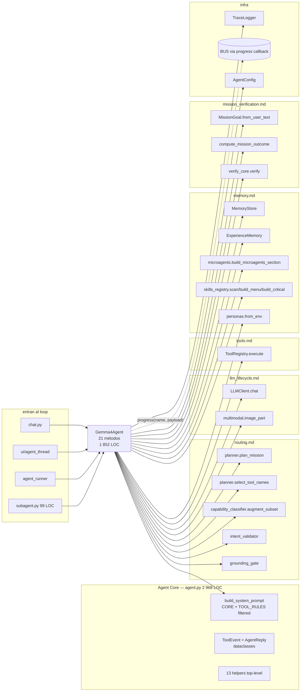
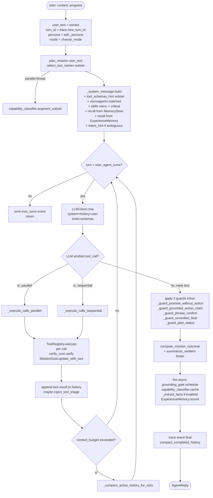
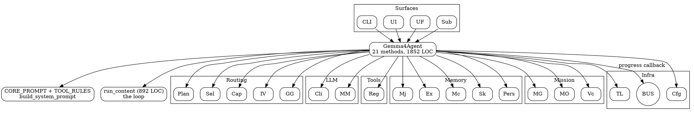

# 02.08 — Agent Core

> **Container:** Agent Core.
> **Archivos:** `agent.py` (único), más subagent.py (99 LOC, delegación).
> **Total LOC:** 3 067 (~5.5 % del paquete, pero el archivo es el segundo más
> grande del repo después de `domain_tools.py`).
> **Responsabilidad:** loop del agente. Decide → tool → tool result → repeat
> → reply. Arma el system_prompt. Compacta history. Aplica guards. Coordina
> a TODOS los containers anteriores.

## Componentes

| # | Símbolo | LOC | Responsabilidad |
|--:|---|--:|---|
| 1 | `Gemma4Agent.__init__` | 50 | Build de: MemoryStore + AgentState + LLMClient + ToolRegistry + ExperienceMemory + TraceLogger + persona + microagent cache + skills cache |
| 2 | `Gemma4Agent.clear` | 14 | Reset history + caches |
| 3 | `Gemma4Agent.set_persona` / `get_persona` | 25 | Switch persona en runtime |
| 4 | `Gemma4Agent._system_message` | 75 | Arma el system_prompt: CORE + tool_schemas_hint (filtrado por subset) + mode_hint + plan_hint + persona + project_context + recall + explicit_plan + phrase + microagents + skills (critical + menu) + intent_hint + memory.prompt_summary |
| 5 | `Gemma4Agent._tool_schemas_hint` | 92 | Genera el bloque "Tool Schemas EXACT" en modo full / compact / off según context_size |
| 6 | `Gemma4Agent._messages` | 16 | Concatena system + history + user message |
| 7 | `Gemma4Agent.run_text` | 10 | Public API delegate a run_content |
| 8 | `Gemma4Agent.run_content` | **892** | EL LOOP. main turn-by-turn loop con retry, parallel/sequential tool calls, mission tracking, compaction triggers, guards application, experience recording |
| 9 | `Gemma4Agent._execute_calls_sequential` / `_execute_calls_parallel` | 86 + 97 = 183 | Dos modos de ejecutar el batch de tool calls del LLM |
| 10 | `Gemma4Agent._inject_tool_image` | 13 | Helper: añade imagen al next user message |
| 11 | `Gemma4Agent._compact_completed_history` / `_compact_active_history_for_retry` | 59 + 32 = 91 | Compacta turns viejos cuando se acerca el context budget |
| 12 | `Gemma4Agent._extract_facts` | 72 | LLM call paralela para extraer facts → `MemoryStore.save` |
| 13 | `Gemma4Agent._summarize_history_block` | 48 | LLM call para summarizar bloques de history compactados |
| 14 | **6 × `Gemma4Agent._guard_*`** | 337 (5x) | Post-reply guards inline (cheap): `_guard_unverified_final`, `_guard_phrase_confirm`, `_build_user_facing_fallback`, `_guard_promise_without_action`, `_guard_grounded_action_claim`, `_guard_plan_status` |

**Datos top-level del módulo (fuera de la clase):**

| Símbolo | LOC | Qué |
|---|--:|---|
| `INHERIT_TTL_SEC = 300` + `DANGEROUS_TOOLS_NEVER_INHERIT` frozenset | ~12 | Knobs F-005 inherit-tools safety |
| `CORE_PROMPT` (multi-line raw string) | ~160 | El system prompt base universal |
| `TOOL_RULES: dict[str, str]` | ~330 | Reglas extra de uso por tool ("X tool: when to use it, common pitfalls") |
| `build_system_prompt(selected_tool_names=None)` | 48 | CORE + TOOL_RULES[name] for name in subset |
| `SYSTEM_PROMPT = build_system_prompt()` | 1 | Versión "full" cacheada al import |
| `ToolEvent` + `AgentReply` dataclasses | ~13 | Outputs |
| 13 helpers top-level (`_extract_user_text`, `_derive_outcome_code`, `_compact_*`, `_run_with_timeout`, `_format_phrase_fires`, `_compute_context_budget`, etc) | ~410 | Utilities para `run_content` |

## Diagrama: lo que toca el Agent Core

## El `run_content` loop (892 LOC, el método más grande del repo)

> **Caveat:** este flowchart simplifica enormemente. El método real tiene
> manejo de retry on `_compact_active_history_for_retry`, parallel/sequential
> branching, inherit-tools TTL gate, intent_validator post-call rejection,
> subagent delegation, image counters, fallbacks de varias capas. **Para
> Fase 4 (sequence diagrams) voy a hacer 1 diagrama por flujo crítico.**

## `subagent.py` (99 LOC, único colaborador directo)

`Gemma4Agent.tools.parent_agent = self` se setea en `__init__` para que la
tool `subagent` pueda invocar un sub-Gemma4Agent fresco. `subagent.py` define
`run_subagent(parent, prompt, ...)` que crea un `Gemma4Agent` con history
limpia, comparte la misma `ToolRegistry`, ejecuta el prompt y devuelve el
resultado. Es **el único patrón de recursión del agente sobre sí mismo**.

## Hallazgos

| Sev | Hallazgo | Ubicación |
|---|---|---|
| **CRITICAL** | **`Gemma4Agent.run_content` es 892 LOC en un solo método.** Tiene 4-5 responsabilidades distintas (turn loop, retry, parallel/sequential dispatch, mission tracking, async post-processing, guards, compaction). **Imposible de testear como unidad; cualquier cambio es riesgoso.** Candidato 1 a split. | `agent.py:895-1786` |
| **CRITICAL** | **`Gemma4Agent` orquesta 21 dependencias** (ver Fig 2.19). El `__init__` instancia 6 stores/clients/loggers directos + import lazy de 5 más (`from .X import Y` dentro de métodos). **God class auto-confesada** — su tamaño (1 852 LOC, 21 métodos) excede el de cualquier UI dialog. | `agent.py:608+` |
| **HIGH** | **`TOOL_RULES` dict (~330 LOC)** define reglas de uso por tool en un solo dict gigante. Cualquier cambio en una tool requiere editar el dict. Acoplamiento implícito a la lista de COMPOUND_TOOL_SCHEMAS (debe haber 1 entrada por tool relevante). Misma divergencia potencial que `semantic_router.TOOL_DESCRIPTIONS`. | `agent.py:206+` |
| **HIGH** | **`CORE_PROMPT` es un string raw multi-línea de ~160 LOC en código Python.** Cada cambio del prompt requiere editar `agent.py` y rebuild. Mejor en un archivo `.md` cargado lazy (igual que skills/microagents). | `agent.py:45-205` |
| **HIGH** | **6 `_guard_*` methods** = 337 LOC de "post-reply heuristics" para fix-up del reply del LLM. Esto es síntoma fuerte de que el LLM emite cosas indeseadas (promesas vacías, claims sin evidencia, replicación de prompt, etc) y las parchamos sintácticamente. Cada guard es honesto pero suma deuda: cada cambio del prompt o del modelo puede invalidar uno. | `agent.py:2194-2552` |
| **HIGH** | **`_extract_facts` + `_summarize_history_block` hacen LLM calls EXTRA** dentro del turn loop (post-reply, opt-in por `_fact_extraction_enabled` / `_summarization_enabled`). Cada uno con cooldown propio. Cuesta 1 turn-worth de tokens + latencia. **Si estos están ON por default y el latency budget es 4-5s/turn (memoria del usuario), es un problema.** | `agent.py:2042-2161` |
| **MED** | `_execute_calls_sequential` y `_execute_calls_parallel` son 86 + 97 LOC con lógica similar (mismo per-call validation, mismo verify, mismo BUS publish, etc) pero diferentes en si esperan resultados serializados o no. Candidato a refactor: 1 método con flag `parallel: bool`. | `agent.py:1787+` |
| **MED** | `_compact_completed_history` y `_compact_active_history_for_retry` son **dos compactadores con triggers distintos**. El primero corre al final del turn cuando ya quedó "completed"; el segundo corre cuando un retry detecta budget exceeded. Lógica parecida; APIs distintas. | `agent.py:1983-2193` |
| **MED** | **13 helpers top-level fuera de la clase** (`_extract_user_text`, `_derive_outcome_code`, `_compute_context_budget`, etc) — ~410 LOC. Algunos se usan 1 sola vez en `run_content`. Otros (`_compact_*`) son usados por los métodos `_compact_*` de la clase, generando indirección. | `agent.py:2558-2926+` |
| **MED** | **`from .X import Y` dentro de métodos** se repite 6+ veces (`from .experience import ExperienceMemory`, `from .personas import from_env`, `from .microagents import build_microagents_section`, `from .skills_registry import scan_skills, build_menu, build_critical_block`, `from .intent_validator import INTENT_TAG_INSTRUCTION, needs_intent_tag`, etc). Lazy imports a propósito (evitan ciclos o carga eager). Pero **disfraza el grafo real de dependencias**: el AST estático no los ve. Si se quita un import por linter, breakage silencioso. | `agent.py:619, 636, 705-707, 743-755, 769` |
| **MED** | `_PARSING_EVENT_NAMES` = `("plan", "tool_subset", "tool_start", "tool_end", "image_injected", "final", "max_turns")` aparece en el `progress` callback. **No hay tipo explícito (TypedDict, Enum, Literal)** para los eventos que el agent emite. Cada consumer (UI, AgentRunner) tiene que conocer la lista de strings. | (a verificar exacto) |
| **LOW** | `INHERIT_TTL_SEC = 300` + `DANGEROUS_TOOLS_NEVER_INHERIT = frozenset({...})` — knobs de la feature "F-005 inherit-tools safety". Si se documenta tan exhaustivamente y tiene 2 constantes en módulo, es elegible para su propio módulo `inherit_tools.py`. | `agent.py:27-38` |
| **LOW** | `_recent_recalls`, `_phrase_fires`, `_cached_microagents`, `_cached_skills_menu`, `_cached_skills_critical`, `_explicit_plan_text`, `_explicit_plan_steps`, `_summarize_last_run_turn`, `_fact_extract_last_run_turn`, `_turn_counter`, `_explicit_plan_status`, `_last_turn_ts` — **12 atributos de instancia** además de los stores. State sprawl. | `agent.py:611-651` |
| **LOW** | `_persona` y `_cached_microagents` se persisten al `clear()` (reset). Pero `_cached_skills_menu` SÍ se resetea con un comentario "util si el dev agrega/modifica un SKILL.md durante desarrollo. En produccion el catalogo no cambia mid-session." → reset innecesario en prod. | `agent.py:666-670` |

## DOT backup

