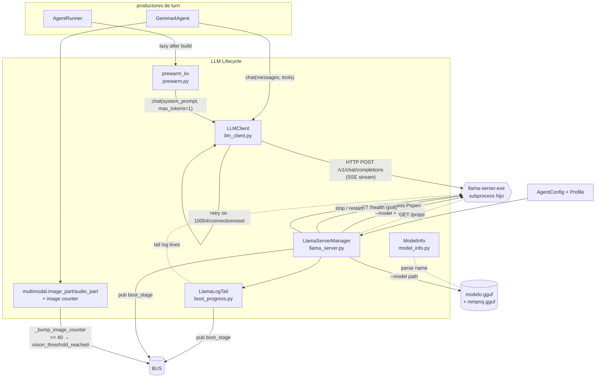
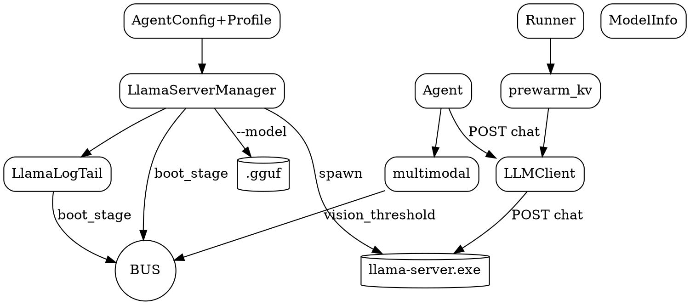

# 02.03 — LLM Lifecycle

> **Container:** LLM Lifecycle.
> **Archivos:** `llama_server.py`, `llm_client.py`, `model_info.py`, `prewarm.py`,
> `multimodal.py`, `boot_progress.py`.
> **Total LOC:** 1 803.
> **Responsabilidad:** gestionar el ciclo de vida de `llama-server.exe` (subprocess
> hijo), hablar HTTP con él, parsear su modelo cargado, calentar su KV cache,
> traducir su log de boot en eventos UI, y adaptar contenido multimodal al
> formato OpenAI-compatible.

## Componentes

| # | Archivo | Clase / fn principal | LOC | Responsabilidad |
|--:|---|---|--:|---|
| 1 | `llama_server.py` | `LlamaServerManager` (327 LOC, 12 métodos) + `port_in_use()` + `get_external_server_context()` | 726 | Spawn/stop/restart del subprocess; respeta servers externos en :8080; reciclado por `vision_relaunch` |
| 2 | `llm_client.py` | `LLMClient` (289 LOC, 8 métodos) | 490 | HTTP OpenAI-compat (`/v1/chat/completions`); retry-on-recoverable; SSE streaming; parse tool_calls |
| 3 | `model_info.py` | `parse_gguf_name`, `build_model_info`, `mock_model_info`, `is_experimental_quant` | 153 | Parser del nombre de archivo GGUF (Unsloth UD-, MoE A4B, MatFormer E4B) |
| 4 | `prewarm.py` | `prewarm_kv()` | 140 | POST sintético al server con system_prompt + max_tokens=1 para precargar KV cache |
| 5 | `multimodal.py` | `image_part`, `audio_part`, `user_content`, `_bump_image_counter` | 134 | Adaptación de imágenes/audio al payload OpenAI + contador de imágenes con threshold (issue ggml-org/llama.cpp#21690) |
| 6 | `boot_progress.py` | `LlamaLogTail` + `emit_stage()` + constantes `STAGE_*` | 145 | Tail del log de llama-server para traducir líneas en `boot_stage` events |

## Diagrama

## Tabla de envíos al BUS desde este container

| Evento publicado | Quién publica | Quién consume |
|---|---|---|
| `boot_stage` `STAGE_SPAWN/METADATA/LAYERS/OFFLOAD/LISTENING/HEALTH` | `LlamaLogTail` + `LlamaServerManager` | UI Field (WS), UI Desktop (bus_bridge → pyqtSignal), `telemetry` (subset) |
| `boot_stage` `prewarm_start` / `prewarm_done` | `prewarm.prewarm_kv` | mismo |
| `vision_threshold_reached` | `multimodal._bump_image_counter` (cuando llega a 40) | `agent_runner` registra callback explícito + `telemetry.record_incident` |

## Tabla del API público

| Símbolo | Quién lo llama |
|---|---|
| `LlamaServerManager.start(profile, ...)` | `launcher.py`, `agent_runner._autostart_llama_server`, `ui/main_window.ServerBootWorker` |
| `LlamaServerManager.stop()` / `.restart()` | mismos + `profile_watcher` cuando cambia el profile |
| `port_in_use()` | mismos (chequeo idempotente) |
| `get_external_server_context()` | `server.py:_current_model_info` |
| `LLMClient.chat(messages, tools=..., stream=...)` | `Gemma4Agent.run_text`, `prewarm_kv` |
| `LLMClient.health()` | `agent_runner._build_agent`, `agent_thread.AgentWorker`, `launcher.print_status` |
| `parse_gguf_name(p)` / `build_model_info(...)` | `server.py:_current_model_info` |
| `is_experimental_quant(p)` | (a verificar — buscar en Fase 6) |
| `image_part(p)` / `audio_part(p)` / `user_content(...)` | `Gemma4Agent` |
| `set_vision_relaunch_callback(cb)` | `agent_runner` al boot |
| `reset_image_counter()` | callback `cb` después de reciclar |
| `LlamaLogTail` | `agent_runner._autostart_llama_server` + `ui/main_window.ServerBootWorker` |

## Hallazgos

| Sev | Hallazgo | Ubicación |
|---|---|---|
| **HIGH** | `agent_runner._autostart_llama_server` y `ui/main_window.ServerBootWorker.run` hacen **la misma cosa** (chequear profile → port_in_use → apply_profile_to_env → LlamaServerManager + LlamaLogTail). 150+ LOC duplicadas con APIs distintas (BUS vs pyqtSignal). Mismo problema que `AgentRunner` vs `AgentWorker` pero en boot. | `agent_runner.py:155+` vs `ui/main_window.py:81-183` |
| **MED** | `model_info.is_experimental_quant` y la lista `EXPERIMENTAL_QUANT_PATTERNS` parecen alimentar un warning. Buscar quién la usa; si es 0 callers, es código muerto. | `model_info.py:107-135` |
| **MED** | `prewarm.py` (140 LOC, 1 función pública) tiene 30 LOC de docstring + import deferido + opt-out env + double-try fallback BUS. El "core" útil son ~25 LOC. Sospecho documentación-protección que ya no aplica si #21468 se resolvió aguas arriba. | `prewarm.py` |
| **MED** | `multimodal._bump_image_counter` emite **DOBLE notificación** (callback + bus) por diseño documentado. Hay dos consumidores (`agent_runner` callback que recicla server, y `telemetry` que lo registra). Justificado, pero hay que vigilar que no termine siendo 3 o 4 consumidores en el futuro. | `multimodal.py:62-98` |
| **MED** | `LlamaServerManager` 327 LOC, 12 métodos. Tiene a la vez: spawn, stop, restart, port-check, profile-aware envvar, model-not-found handling, vision relaunch, external server detection, GET /props. Mezcla concerns. Candidato a partir en `ServerManager` + `ServerProbe`. | `llama_server.py:399+` |
| **LOW** | `boot_progress.py` mezcla `LlamaLogTail` (clase, parser regex de log) con `emit_stage()` (helper de publish + constantes). Dos archivos. Aceptable, separación sirve si en algún momento el tail se reusa para otros procesos. | `boot_progress.py` |
| **LOW** | `_RECOVERABLE_CONN_ERRORS` en `llm_client.py:23` lista 7 substrings de errores con comentarios largos del porqué. Si nunca cambió en N meses, OK. Si crece, marcar para refactor a una closed table con tests. | `llm_client.py:23-31` |
| **LOW** | `ModelInfo` es un `TypedDict`, no `dataclass`. Inconsistente con `MissionOutcome`, `AgentReply`, etc. del resto del repo (que son dataclass frozen). | `model_info.py:21` |

## DOT backup

