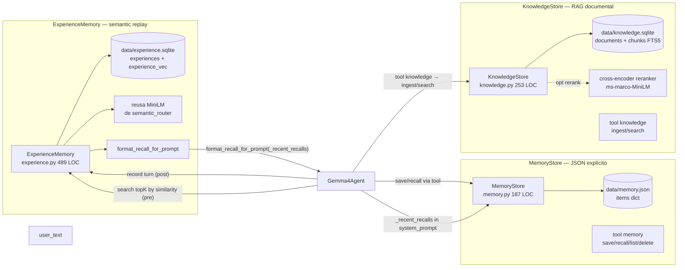
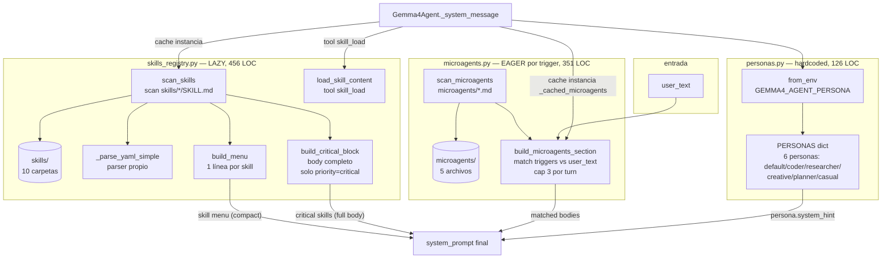
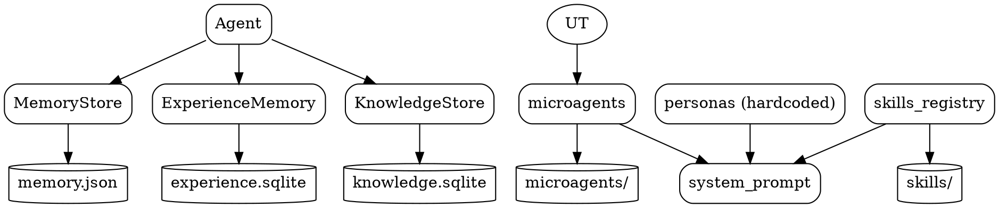

# 02.06 — Memory & Knowledge + Skills/Microagents/Personas

> **Containers:** Memory & Knowledge + Skills/Microagents/Personas.
> **Archivos:** `memory.py`, `experience.py`, `knowledge.py`,
> `skills_registry.py`, `microagents.py`, `personas.py`.
> **Total LOC:** 1 862.
> **Responsabilidad:** todo lo que enriquece el system prompt o sirve datos
> al agente sin ser una tool: memoria explícita, experience replay, RAG
> documental, skills declarativas, microagents-por-trigger, personas.

## Componentes

| # | Archivo | Símbolo principal | LOC | Storage | Modelo externo | Propósito |
|--:|---|---|--:|---|---|---|
| 1 | `memory.py` | `MemoryStore` (1 clase + 2 helpers sanitize) | 187 | `data/memory.json` | — | Facts user-facing: "user_name=emma", "platform=disney". Tool `memory` lo expone |
| 2 | `experience.py` | `ExperienceMemory` (5 funciones top-level + clase 371 LOC) | 489 | `data/experience.sqlite` con `experiences` + `experience_vec` virtual table | MiniLM 384d (reusa el del semantic_router) | Replay tipo Voyager: turn pasados embeddeados + buscables por similitud |
| 3 | `knowledge.py` | `KnowledgeStore` (1 clase) + `_rerank_rows()` + `_load_reranker()` | 253 | `data/knowledge.sqlite` con `documents` + `chunks` FTS5 virtual table | (opcional) cross-encoder ms-marco-MiniLM-L-6-v2 (~80 MB) | Ingesta de docs del usuario + RAG con BM25 + opcional rerank |
| 4 | `skills_registry.py` | `SkillMeta` + `scan_skills()` + `build_menu()` + `build_critical_block()` + `load_skill_content()` + parser YAML "simple" | 456 | filesystem `skills/<name>/SKILL.md` (10 carpetas) | — | Lazy "recetas" enchufables. Spec Anthropic Agent Skills + extensiones (priority, requires) |
| 5 | `microagents.py` | `Microagent` + `build_microagents_section()` + parser frontmatter | 351 | filesystem `microagents/*.md` (5 archivos) | — | Eager-por-trigger. Inyecta knowledge cuando el user_text matchea substrings |
| 6 | `personas.py` | `Persona` dataclass + `PERSONAS` dict (6 personas) | 126 | hardcoded en código | — | Tono + preferred_tools nudges. Seleccionable por env `GEMMA4_AGENT_PERSONA` o `/persona` CLI |

## Las 3 memorias en una sola foto

### Tabla comparativa

| | MemoryStore | ExperienceMemory | KnowledgeStore |
|---|---|---|---|
| **Qué guarda** | facts explícitos (key/value strings) | turns pasados con embedding | docs del usuario chunked |
| **Cómo se crea** | LLM llama tool `memory(action="save")` | escritura automática post-turn | LLM llama tool `knowledge(action="ingest")` |
| **Cómo se lee** | LLM llama tool `memory(action="recall")` o `prompt_summary()` directo en system_prompt | top-K búsqueda por similitud, inyectado en system_prompt | LLM llama tool `knowledge(action="search")` |
| **Storage** | 1 archivo JSON (~tiny) | 1 SQLite + virtual table sqlite-vec (crece) | 1 SQLite + FTS5 virtual table (crece) |
| **Modelo ML** | — | MiniLM (compartido con router) | (opcional) cross-encoder ms-marco |
| **Opt-out** | `GEMMA4_AGENT_MEMORY` (path override) | `GEMMA4_EXPERIENCE_MEMORY=false` | `GEMMA4_KNOWLEDGE_RERANK=false` (solo el reranker) |
| **Limpieza** | `MAX_TOTAL_ITEMS=500` cap; sin TTL | `prune()` por `_AUTO_PRUNE_EVERY=50` + `_DEFAULT_MAX_RECORDS=5000` + `_DEFAULT_MAX_AGE_DAYS=180` | manual via `delete(doc_id)` |

**No son redundantes.** Cada una tiene un propósito ortogonal:
- `MemoryStore` = "lo que el usuario dijo de sí mismo o quiere que recuerde".
- `ExperienceMemory` = "qué hizo el agente en turns parecidos antes".
- `KnowledgeStore` = "qué dicen los documentos del usuario".

Pero las **3 SQLite + 1 JSON + 1 archivo de profile + 1 archivo de gui.json = 6 stores** distribuidos en `data/` y `~/.gemma4/`. Para Fase 5 dejo el inventario completo.

## Skills + Microagents + Personas — 3 capas declarativas de system_prompt enrichment

### Tabla comparativa

| | Skills | Microagents | Personas |
|---|---|---|---|
| **Carga al system_prompt** | lazy (menu small + load explícito por tool) + critical eager | eager por trigger (substring match en user_text) | eager (1 por sesión) |
| **Selector** | LLM decide qué cargar | substring matching de keywords | env var o `/persona` CLI |
| **Storage** | `skills/<name>/SKILL.md` con frontmatter YAML | `microagents/*.md` con frontmatter YAML | dict hardcoded en `personas.py` |
| **Cantidad actual** | 10 skills | 5 microagents | 6 personas |
| **Opt-out** | `GEMMA4_SKILLS_OFF=1` | `GEMMA4_MICROAGENTS_OFF=1` | n/a (default persona = identity) |
| **Cap defensivo** | por profile (1/2/3/5) | `max_microagents=3` | no aplica |
| **Modifica preferred_tools del subset** | no | no | sí (`persona.preferred_tools` se mergea en planner) |

## Hallazgos

| Sev | Hallazgo | Ubicación |
|---|---|---|
| **HIGH** | **Skills + Microagents = dos sistemas declarativos paralelos para enriquecer el system_prompt** (807 LOC combinados). El docstring del propio `skills_registry.py:16-20` dice "Diferencia vs microagents". Esta auto-justificación es señal de que la separación es delicada. Si en producción un skill termina sirviendo lo que un microagent serviría, hay duplicación de propósito (no de código). | `skills_registry.py` + `microagents.py` |
| **HIGH** | `skills_registry._parse_yaml_simple` (74 LOC) es un **YAML parser artesanal** que cubre "scalars + inline lists + block sub-dict/sub-lists indentados con 2 espacios + booleans". Repo NO tiene `pyyaml` como dependencia. Pero el comentario del propio docstring dice "NO soporta block scalar `\|`, anchors, ni tipos complejos". Si los SKILL.md siempre son simples, esto está bien; si un autor escribe un `description:` multi-línea, parsea silenciosamente mal. Considerar `pyyaml` (1 dep, 0 LOC propias). | `skills_registry.py:107-180` |
| **HIGH** | `microagents.py` también parsea frontmatter YAML por su cuenta (otro parser distinto, `_FRONTMATTER_RE` regex). **Dos parsers caseros de YAML en el repo.** | `microagents.py:78` |
| **MED** | `personas.py` con 6 personas hardcoded. ¿Cuántas se usan en producción? Si el dueño usa solo `default` y `coder`, las otras 4 son código. | `personas.py:33-112` |
| **MED** | `personas.py:53` `preferred_tools=("developer", "filesystem", "terminal", "document", "fact_check", "knowledge")` — 6 tools "preferidas". El comentario dice que se mergean al planner subset. Verificar en `Gemma4Agent._select_subset` si la lista efectivamente entra antes del cap MAX_SELECTED_TOOLS=16 o si se descarta. | `personas.py` |
| **MED** | `experience.py:106-120` define **5 columnas ALTER TABLE wrapped en try/except** (provenance fields: `outcome_code`, `failure_reason_code`, `args_signature`, `capability_label`, `grounding_flagged`). Patrón de migración honesto pero `except sqlite3.OperationalError: pass` traga errores genuinos (disk full, etc). | `experience.py:110-120` |
| **MED** | `experience.flag_grounding` y `flag_grounding_by_turn` son **dos métodos casi idénticos** que difieren solo en si el lookup es por `id` o `turn_id`. Las dos hacen el mismo UPDATE. Colapsable a un solo método con un selector. | `experience.py:202-248` |
| **LOW** | `knowledge._chunk_text` con `max_chars=2200, overlap=250` hardcoded en kwargs default. No expuesto al usuario ni configurable por documento. | `knowledge.py:233` |
| **LOW** | `knowledge._fts_query` arma `"term1" OR "term2" OR ...` hasta `[:12]` términos. Si el query tiene 13+ palabras (raro pero posible), se silenciosamente truncado. | `knowledge.py:249-253` |
| **LOW** | `MemoryStore.MAX_TOTAL_ITEMS=500` cap pero no hay TTL ni LRU; el primero en llegar al cap bloquea writes. | `memory.py:18` |
| **NIL** | `state.atomic_write_json` reusado por `sessions.py` y `profiles.py`. Buena reutilización. | `state.py:19-30` |

## DOT backup

