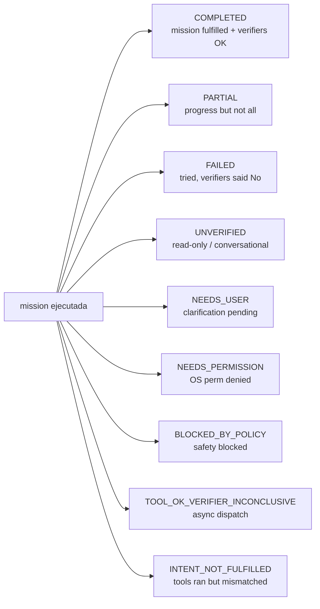
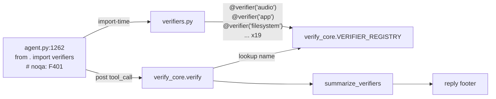
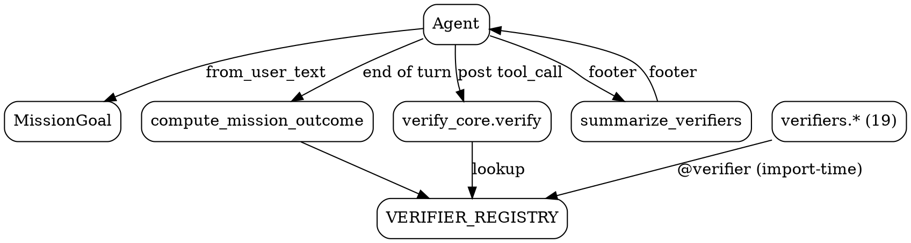

# 02.04 — Mission Outcome + Verification

> **Containers:** Mission Outcome + Verification (per-tool).
> **Archivos:** `mission_goal.py`, `mission_outcome.py`, `verify_core.py`, `verifiers.py`.
> **Total LOC:** 1 800.
> **Responsabilidad:** decidir si lo que el usuario PIDIÓ se cumplió, no solo
> si las tools devolvieron ok=True. Patrón "Voyager NeurIPS 2023" + herencia
> filosófica explícita de Carter v3/v4/v5 (honestidad por construcción).

## Componentes

| # | Archivo | Símbolo principal | LOC | Responsabilidad |
|--:|---|---|--:|---|
| 1 | `mission_goal.py` | `MissionGoal` (clase) + `ExpectedOutcome` + `OutcomeStatus` enum (9 estados) + `_VERB_KIND_PATTERNS` regex multilingüe | 659 | Extracción del objetivo del user_text: ¿qué `ExpectedOutcome.kind` (open/close/navigate/set_state/read_state/...) declaró el usuario? |
| 2 | `mission_outcome.py` | `compute_mission_outcome(goal, tool_records, reply)` + `_ToolCallRecord` + `_INCONCLUSIVE_BY_NATURE` set | 260 | Pipeline: combina `MissionGoal` + verifiers per-tool → produce `MissionOutcome` con 1 de 9 estados |
| 3 | `verify_core.py` | `VerifierOutcome` + `VERIFIER_REGISTRY` + `@verifier` decorator + `verify(name, args, result)` + `summarize_verifiers(outcomes)` | 191 | Registry global de verifiers per-tool y summarizer del footer |
| 4 | `verifiers.py` | 19 verifiers concretos (`audio`, `app`, `filesystem`, `clipboard`, etc.) registrados vía `@verifier` decorator | 690 | Implementaciones específicas: post-set audio check, file exists check, window exists check, etc. Para las 10 hottest tools. |

## Pipeline

```mermaid
%% Fig 2.07 — Mission + Verification pipeline
sequenceDiagram
    autonumber
    participant U as user_text
    participant AG as Gemma4Agent
    participant MG as MissionGoal.from_user_text
    participant TR as ToolRegistry
    participant VF as verifiers.&lt;tool&gt;
    participant VC as verify_core.verify
    participant MO as compute_mission_outcome
    participant Out as Reply footer

    U->>AG: "abre Steam y pone Hades"
    AG->>MG: from_user_text(text)
    MG-->>AG: MissionGoal(expected=[<br/>  ExpectedOutcome(kind=open_target,target=Steam),<br/>  ExpectedOutcome(kind=open_target,target=Hades)<br/>])
    loop por cada tool_call del LLM
      AG->>TR: execute(name, args)
      TR-->>AG: ToolResult(ok=True, evidence=...)
      AG->>VC: verify(name, args, result)
      VC->>VF: handler registrado (decorator)
      VF-->>VC: VerifierOutcome(confirmed=True/False/None)
      VC-->>AG: outcome
      AG->>MG: update_with_tool(name, args, ok)
    end
    AG->>MO: compute_mission_outcome(MissionGoal, tool_records, reply)
    MO-->>AG: MissionOutcome(status=COMPLETED|PARTIAL|FAILED|UNVERIFIED|...)
    AG->>Out: footer = summarize_verifiers(outcomes)
```

## Los 9 estados de `OutcomeStatus`



> **Honestidad por construcción**: la distinción `UNVERIFIED` vs
> `TOOL_OK_VERIFIER_INCONCLUSIVE` vs `INTENT_NOT_FULFILLED` está pensada para
> NO reportar "completado" cuando solo se disparó algo asíncrono o cuando lo
> ejecutado no fue lo pedido. Es la pieza filosóficamente más cargada del
> repo.

## Registro decorator-based de verifiers



**Por qué importa:** este es el patrón que hizo que mi scanner AST estático
marcara `verifiers.py` como huérfano (690 LOC sin importadores aparentes). El
import en `agent.py:1262` está deliberadamente marcado `# noqa: F401` porque
la única razón del import es disparar los 19 decoradores que pueblan el
registry. Si alguien borra el import "por linter", el footer se rompe en
silencio.

## Tabla de los 19 verifiers concretos (estimado)

> Hay 19 funciones top-level en `verifiers.py` según el AST scan, todas
> consumiendo `result` + `args` y retornando `VerifierOutcome`. Para Fase 3
> (UML), grep concreto a `@verifier(` que va a dar la lista exacta.

## Hallazgos

| Sev | Hallazgo | Ubicación |
|---|---|---|
| **MED** | **2 pipelines de verificación paralelos**: por-tool (`verify_core` + `verifiers`) y por-mission (`mission_goal` + `mission_outcome`). El segundo ENVUELVE al primero (lee `VerifierOutcome` per-tool). Justificado por nivel de granularidad, pero suma 1 800 LOC y 4 conceptos (`MissionGoal`, `ExpectedOutcome`, `VerifierOutcome`, `MissionOutcome`). | `mission_goal.py` + `mission_outcome.py` + `verify_core.py` + `verifiers.py` |
| **MED** | `MissionGoal._VERB_KIND_PATTERNS` es **multilingüe ES/EN/PT/FR/IT** por diseño. Si el repo dice "VOICE assistant Spanish by default" (system prompt de `agent.py:47`), portugués/francés/italiano probablemente nunca dispara. Cada pattern adicional aumenta riesgo de falso positivo en español. | `mission_goal.py:98+` |
| **LOW** | `OutcomeStatus` con 9 estados es un enum "complete" desde el día 1. Verificar si en producción la distribución real usa los 9 o solo 4-5. | `mission_goal.py:43-53` |
| **LOW** | `_INCONCLUSIVE_BY_NATURE = frozenset({"gui", "browser"})` con un comentario "web.open … sin embargo otras actions … lo manejamos en el caller". El frozenset documenta "tools cuyo verifier es null por naturaleza". 2 entradas. Frozenset overkill para 2 strings. Lista bastaría. | `mission_outcome.py:32-40` |
| **LOW** | `verify_core.py` con `VERIFIER_REGISTRY` global mutable y decorador `@verifier(name)` que muta el global en import time. Patrón estándar Python pero side-effect: si dos modulos importan `verifiers.py` con orden diferente y alguno define un verifier custom, el registry se corrompe en silencio. Anotar pero no es urgente. | `verify_core.py:63-100` |
| **NIL** | `summarize_verifiers([])` returns "" (mute cuando no hay info). Honesto. | `verify_core.py:138` |
| **MAYOR PROBLEMA** | Todo este subsistema (1 800 LOC) es **heredado de Carter v5**. Es funcional y honesto, pero el tamaño combinado del Mission/Verification es comparable a `voice/` entero. Vale preguntarse si el ROI sobrevive a su mantenimiento. | (todos los 4 archivos) |

## DOT backup


