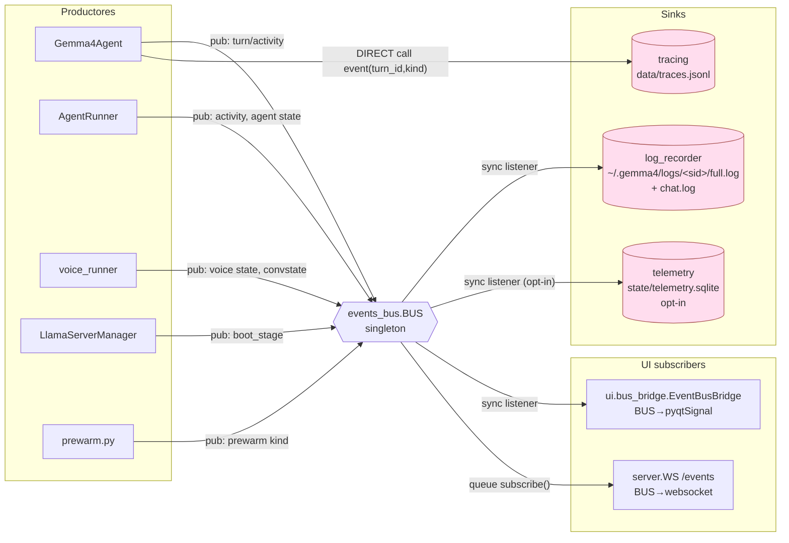
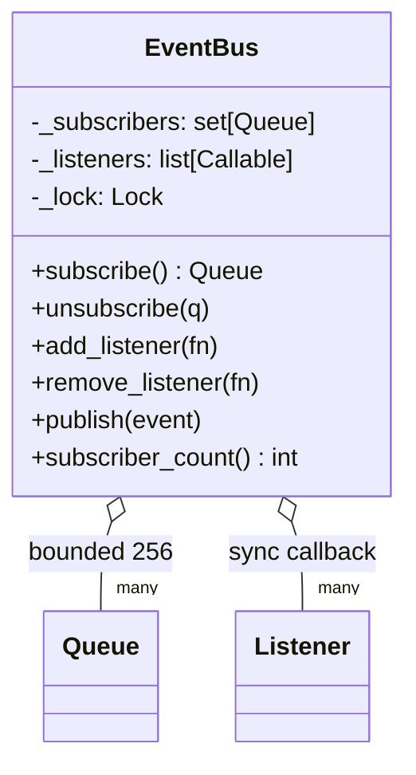
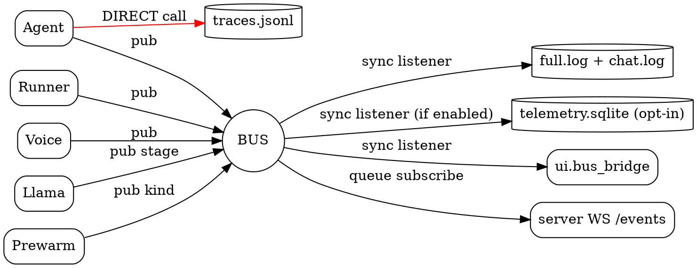

# 02.01 — Observability: Event Bus + 3 sinks

> **Containers cubiertos:** Event Bus, Tracing, Log Recorder, Telemetry.
> **Por qué juntos:** los tres sinks comparten el BUS como fuente y sirven
> superficies distintas, pero solapan información. Verlos juntos hace
> evidente la duplicación.

---

## Componentes

| # | Archivo | Clase / función | LOC | Responsabilidad |
|--:|---|---|--:|---|
| 1 | `events_bus.py` | `EventBus` + `BUS` singleton | 99 | Pub/sub in-process con dos canales (listeners sync + queues async) |
| 2 | `tracing.py` | `TraceLogger` + `summarize_content()` | 67 | JSONL por-turn a `data/traces.jsonl`, escrito DIRECTAMENTE por `Gemma4Agent` |
| 3 | `log_recorder.py` | `LogRecorder` + `RECORDER` singleton | 220 | Suscribe al BUS sync → escribe `~/.gemma4/logs/<sid>/full.log` + `chat.log` |
| 4 | `telemetry.py` | `TelemetryStore` + `TELEMETRY` singleton | 443 | Opt-in `GEMMA4_TELEMETRY=1`. Suscribe al BUS → SQLite con 4 tablas |
| 5 | `boot_progress.py` | `emit_stage()` + `LlamaLogTail` + constantes `STAGE_*` | 145 | Helper para publicar etapas de boot al BUS (utilities, no es sink) |

## Diagrama



---

## EventBus — el switchboard



**Diseño honesto y compacto.** Dos canales con tradeoffs explícitos en el
docstring:

- `add_listener(fn)` — sync, inline en el thread del publicador, en orden
  de registro, ANTES del fan-out a queues. Usado por sinks que deben
  persistir antes de que el evento llegue a la UI. **Constraint:** fn debe
  ser <1ms y exception-safe.
- `subscribe() → Queue` (bounded=256) — async, drop-oldest en overflow.
  Cada WS connection y la UI Qt usan este modo.

**API total:** 7 métodos. Sin features de más.

**Sobre-ingeniería detectada:** **ninguna** en `events_bus.py`. Es uno de
los archivos mejor escritos del repo. Lo marco para no tocar en Fase 8.

---

## Los 3 sinks

```mermaid
%% Fig 2.03 — Detalle de los 3 sinks
graph TB
    subgraph "tracing.py (67 LOC)"
        TL[TraceLogger<br/>dataclass + path + enabled]
        TLfn[event(turn_id, kind, **payload)<br/>summarize_content(content)]
    end

    subgraph "log_recorder.py (220 LOC)"
        LR[LogRecorder<br/>per-session]
        LRfn[install()<br/>_switch_to(session_id)<br/>_handle(event)]
        LR_full[(_full handle<br/>full.log JSONL)]
        LR_chat[(_chat handle<br/>chat.log human-readable)]
    end

    subgraph "telemetry.py (443 LOC, OPT-IN)"
        TS[TelemetryStore<br/>4 tablas SQLite]
        TS_sub[_on_bus_event<br/>filter: vision_threshold + boot_stage subset]
        TS_api[record_turn<br/>record_session<br/>record_voice<br/>record_incident]
        TS_q[summarize_last_24h<br/>export_json<br/>rotate(30d)]
    end

    AG[Gemma4Agent] -- "directo, no via BUS" --> TL
    TL --> TLfn
    TLfn -. write .-> Tj[(data/traces.jsonl)]

    BUS[(BUS)] -- "sync listener" --> LR
    LR --> LRfn
    LRfn --> LR_full
    LRfn --> LR_chat

    BUS -- "sync listener (si GEMMA4_TELEMETRY=1)" --> TS
    TS --> TS_sub
    TS_api -. INSERT .-> TSdb[(telemetry.sqlite)]

    AGdir[Agent puede llamar TS.record_turn directo] -. "explicit call" .-> TS_api
```

### Tabla comparativa de los 3 sinks

| Sink | Granularidad | Persistencia | Fuente | Cuándo se activa | Quién lo lee |
|---|---|---|---|---|---|
| **TraceLogger** (`data/traces.jsonl`) | por-turn-event | append JSONL | `Gemma4Agent` directo (no BUS) | siempre (env `GEMMA4_AGENT_TRACING=true`, default ON) | dev manual (grep) |
| **LogRecorder** (`~/.gemma4/logs/<sid>/full.log` + `chat.log`) | todo el BUS (full) + subset visible (chat) | append text + JSONL | sync listener del BUS | siempre que el server arranca | UI/dev reproduciendo bugs |
| **TelemetryStore** (`telemetry.sqlite`) | métricas (ttft, tokens, tps, vram, voice rtf) | INSERT SQLite | `_on_bus_event` filtra `vision_threshold_reached` + `boot_stage`; el resto llega por llamada explícita desde `Gemma4Agent.record_turn` | env `GEMMA4_TELEMETRY=1`, **default OFF** | `summarize_last_24h`, `export_json` |

### Solape concreto de información

Cualquier turn del agente queda registrado en **TRES lugares diferentes** con
formatos distintos:

| Información | TraceLogger | LogRecorder/full.log | LogRecorder/chat.log | Telemetry |
|---|:-:|:-:|:-:|:-:|
| user_text (input) | ✓ | ✓ | ✓ | – |
| tool calls (name+args) | ✓ | ✓ | ✓ (resumido) | – (solo count) |
| tool results | ✓ | ✓ | ✓ (resumido) | – |
| LLM reply | ✓ | ✓ | ✓ | – |
| TTFT / tokens / tps | – | parcial | – | ✓ |
| boot stages | – | ✓ | ✓ (BOOT) | ✓ (subset) |
| VRAM peak | – | – | – | ✓ |
| voice rtf / first_phoneme | – | – | – | ✓ |

**Veredicto:** TraceLogger y LogRecorder/full.log son cuasi-duplicados. La
única diferencia: TraceLogger lo escribe el Agent directo, LogRecorder lo
escribe el BUS sync. Mismo contenido, distinto buffer. Telemetry sí captura
algo único (métricas numéricas) pero usa SQLite con 4 tablas y 443 LOC para
guardar lo que en `traces.jsonl` ya están como campos del evento.

---

## Hallazgos (a `_findings_seed.md`)

| Severidad | Hallazgo | Ubicación |
|---|---|---|
| **HIGH** | TraceLogger y LogRecorder/full.log persisten cuasi-la-misma-información en cuasi-el-mismo-formato. Decisión: unificar o eliminar TraceLogger (que es el más simple y el único que el Agent llama directo). Ahorro: 67 LOC + un canal de IO menos. | `tracing.py` + `log_recorder.py` |
| **MED** | Telemetry tiene **4 tablas + 12 índices + WAL + housekeeping + export + summarize_24h** (443 LOC) para una feature opt-in que probablemente nadie usa. Si la única necesidad real es "ver TTFT/VRAM cuando algo va mal", una sola tabla flat (60 LOC) alcanza. | `telemetry.py` |
| **MED** | El singleton `TELEMETRY` se construye al **import** del módulo (`telemetry.py:443`), aunque el sistema esté en OFF. Llama a `_default_db_path()` que hace `AgentConfig.from_env()` (puede aplicar profile). Side-effects en import-time. | `telemetry.py:443` |
| **LOW** | `boot_progress.py` (145 LOC) podría ser 30 LOC: `STAGE_*` constantes + 1 helper `emit_stage`. Tiene `LlamaLogTail` adentro que mezcla concerns (log tailer ≠ helper de etapas). | `boot_progress.py` |
| **LOW** | `tracing.py:_json_safe` recurre todo el payload "por si acaso" no es serializable. Solo hace falta cuando se loggea content multimodal — el resto del payload viene de `Gemma4Agent` que ya controla los tipos. Optimizable. | `tracing.py:58-67` |

---

## DOT backup


