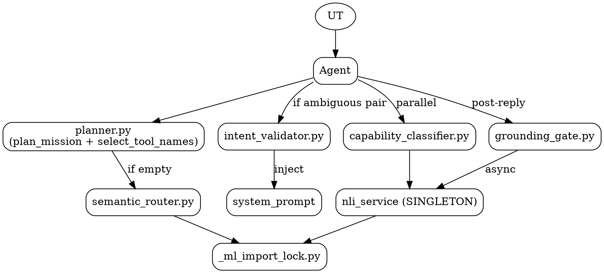

# 02.05 — Routing & Validation

> **Containers:** Planner + Routing, Validation Gates.
> **Archivos:** `planner.py`, `semantic_router.py`, `capability_classifier.py`,
> `nli_service.py`, `intent_validator.py`, `grounding_gate.py`,
> `_ml_import_lock.py`.
> **Total LOC:** 1 916.
> **Responsabilidad:** decidir qué subset de tools va al system prompt,
> validar que la tool elegida coincida con la intención, y verificar post-reply
> que el LLM no haya alucinado acciones.

## Componentes

| # | Archivo | Símbolo principal | LOC | Modelo externo | Cuándo se ejecuta |
|--:|---|---|--:|---|---|
| 1 | `planner.py` | `MissionPlan` + `MissionStep` + `plan_mission()` + `select_tool_names()` + `_suggest_tools()` (regex multilingüe ES/EN/PT/FR/IT) | 892 | — | hot path inline, primer paso |
| 2 | `semantic_router.py` | `suggest_tools_semantic()` + `embed()` + `_STATE` singleton + `TOOL_DESCRIPTIONS` (62 entradas) + LRU cache 256 | 279 | sentence-transformers MiniLM-L12-v2 (~120 MB) | fallback: solo si planner devuelve `[]` y user_text >3 palabras no-casual |
| 3 | `capability_classifier.py` | `CapabilityVerdict` + `augment_subset()` + `classify_capability_{sync,async,cached}` + `CAPABILITY_LABELS` (10) + `CAPABILITY_TO_TOOLS` map | 303 | (vía `nli_service`) | hot path con timeout 350ms, después fallback async para cachear |
| 4 | `nli_service.py` | `_NLIService` singleton + `classify_sync/async` + cache LRU 512 | 246 | mDeBERTa-v3-base-xnli (~280 MB) | lazy load primera invocación, ~1200ms por inference CPU |
| 5 | `_ml_import_lock.py` | `ml_imports()` context manager | 49 | — | serializa imports de transformers/huggingface_hub para evitar race con faster-whisper |
| 6 | `intent_validator.py` | `needs_intent_tag()` + `INTENT_TAG_INSTRUCTION` + `CROSS_REJECT_PAIRS` + `extract_intent_tag()` + `validate_call()` | 141 | — | pre-tool, solo si subset cruza par ambiguo |
| 7 | `grounding_gate.py` | `detect_action_claim_without_evidence()` + `schedule_grounding_check()` + multilingual `_FALLBACKS_BY_LANG` (6 idiomas) | 255 | (vía `nli_service` async) | post-reply, inline heurístico + async NLI a lesson_store |

## Diagrama: el pipeline completo

```mermaid
%% Fig 2.10 — Routing & Validation pipeline
graph TB
    UT[user_text]
    Agent[Gemma4Agent._select_subset]

    subgraph Planner["planner.py"]
        PM[plan_mission<br/>regex multilingüe]
        SST[_suggest_tools<br/>keyword groups ES/EN/PT/FR/IT]
        STN[select_tool_names<br/>aplica continuation hint +<br/>safety + cap MAX_SELECTED_TOOLS=16]
    end

    subgraph SR["semantic_router.py"]
        STSem[suggest_tools_semantic<br/>top-k cosine vs TOOL_DESCRIPTIONS]
        SRST[_STATE singleton<br/>model + tool_embeddings]
        EmbC[LRU cache 256<br/>embeds del input]
        ST[(MiniLM-L12-v2 ~120MB)]
    end

    subgraph CC["capability_classifier.py"]
        AS[augment_subset<br/>cache-then-sync 350ms<br/>then async warmup]
        Verd[CapabilityVerdict<br/>top1 + top2 + ambiguous]
        CMap[CAPABILITY_TO_TOOLS<br/>10 labels → buckets]
    end

    subgraph NLI["nli_service.py — SINGLETON"]
        NLIs[_NLIService<br/>zero-shot pipeline]
        NLIc[LRU cache 512<br/>sha256(text+labels)]
        Mod[(mDeBERTa-v3-base-xnli ~280MB)]
    end

    subgraph IV["intent_validator.py"]
        NIT[needs_intent_tag<br/>4 ambiguous pairs]
        ITI[INTENT_TAG_INSTRUCTION<br/>inject to system_prompt]
        VCx[validate_call<br/>vs CROSS_REJECT_PAIRS]
    end

    subgraph GG["grounding_gate.py"]
        DAC[detect_action_claim_without_evidence<br/>morfología 1p preterit + tool_events vacío]
        SGC[schedule_grounding_check<br/>async NLI → lesson_store]
        FB[format_fallback 6 idiomas]
    end

    UT --> Agent

    %% planner path
    Agent --> PM --> STN
    PM --> SST
    SST --> STN

    %% semantic fallback solo si planner vacío
    STN -. "if names == [] AND words>3 AND not casual" .-> STSem
    STSem --> SRST --> ST
    STSem --> EmbC

    %% capability classifier en PARALELO
    Agent -. "parallel thread" .-> AS
    AS --> Verd
    Verd --> CMap
    AS -. classify_sync .-> NLIs
    AS -. classify_async .-> NLIs
    NLIs --> NLIc
    NLIs --> Mod

    %% intent validator si subset ambiguo
    Agent -. "if needs_intent_tag(subset)" .-> NIT
    NIT --> ITI
    ITI -. "inject" .-> SysP[system_prompt]
    Agent -. "after tool_call" .-> VCx

    %% grounding gate post-reply
    Agent -. "after reply" .-> DAC
    DAC --> FB
    Agent -. "async fire-and-forget" .-> SGC
    SGC --> NLIs

    %% the 2 ML model loads share a lock
    SRST -. "ML import" .-> Lock[_ml_import_lock]
    NLIs -. "ML import" .-> Lock
```

## Tabla: 4 decisores trabajando sobre el mismo user_text

| Pieza | Cuándo dispara | Timeout | Si falla |
|---|---|---|---|
| `_suggest_tools` (regex keyword) | siempre, primero | sync inline | nada — devuelve `[]` |
| `semantic_router.suggest_tools_semantic` | solo si regex devolvió `[]` y user_text >3 palabras no-casual | ~50-150ms primera vez (después cache) | devuelve `[]` |
| `capability_classifier.augment_subset` | siempre, paralelo | 350ms sync, después async fire-and-forget | subset queda como estaba; cache se llena para next turn |
| `intent_validator.needs_intent_tag` | siempre, pero solo dispara `INTENT_TAG_INSTRUCTION` si subset contiene par ambiguo | sync inline | "n/a" path (no inyecta nada) |

## Tabla: 4 ambiguous pairs hardcoded

| Par (a, b) | Razón |
|---|---|
| (audio, window) | "cierra la música" → `audio.media_stop` vs `window.close` |
| (audio, browser_real) | "para de reproducir el video" → mismo dilema |
| (audio, app) | "cerra Spotify" → media_stop vs app.close |
| (audio, media) | overlap de actions: `audio.media_play_pause` ≈ `media.play` |

## Tabla: 6 entradas en CROSS_REJECT_PAIRS

| `(intent, tool, action)` rechazado | Razón |
|---|---|
| `(close, audio, media_stop)` | media_stop solo mutea, no cierra |
| `(close, audio, media_play_pause)` | toggle ≠ close |
| `(stop_media, window, close)` | close remueve el player entero, no para playback |
| `(stop_media, app, close)` | app.close mata el host app |
| `(set_volume, audio, media_stop)` | media_stop es media key global, no volumen |
| `(set_volume, audio, media_play_pause)` | mismo |

## Hallazgos

| Sev | Hallazgo | Ubicación |
|---|---|---|
| **HIGH** | `_suggest_tools` (planner.py:212+) tiene **regex multilingüe ES/EN/PT/FR/IT por keyword group** — repetidos en cada uno de los ~30 buckets. Para una "VOICE assistant Spanish by default" (system_prompt en `agent.py:47`), las variantes PT/FR/IT son código no ejercitado. Aumenta riesgo de falso positivo en ES y peso de mantenimiento. Cuantificar: cuántas LOC del archivo son texto regex multilingüe? Probablemente 250+ LOC. | `planner.py:212-630+` |
| **HIGH** | `capability_classifier` **carga un modelo de 280MB para clasificar entre 10 labels**. El planner regex ya cubre los casos principales; las **`_suggest_tools` regex tienen MÁS LOC de patterns que las 10 labels enteras** del classifier. Costo-beneficio: mDeBERTa cuesta 1.2s primera inference + 280MB memoria. ¿Vale para resolver el caso "Daredevil"? Verificar en producción cuántas veces `augment_subset` añade tools efectivamente. | `capability_classifier.py:48-78`, `nli_service.py:57` |
| **HIGH** | `grounding_gate._FALLBACKS_BY_LANG` define fallbacks en **6 idiomas (es/en/it/pt/fr/de)** con 4 templates cada uno (24 strings). El project default es ES + system prompt dice "Speak Spanish by default". Si el LLM realmente nunca contesta en alemán/italiano/portugués, esos 18 strings son código muerto idiomático. | `grounding_gate.py:145-200` |
| **MED** | `planner.select_tool_names._last_fallback_used` se setea como **atributo de la función** (`select_tool_names._last_fallback_used = False`). Es una variable global con disfraz de método. Si dos turns simultáneos llaman a esta función, hay race. | `planner.py:154, 181, 186` |
| **MED** | `semantic_router._EMBED_CACHE` + `_EMBED_CACHE_ORDER` reimplementa una LRU manualmente con `dict + list`. El stdlib tiene `functools.lru_cache` o `collections.OrderedDict.move_to_end`. Reinvento del wheel — 20 LOC para algo que vienen 1 import. | `semantic_router.py:229-267` |
| **MED** | Hay **DOS LRU caches** en este container (uno en `semantic_router._EMBED_CACHE`, otro en `nli_service._cache`, otro en `capability_classifier._cache`). Tres implementaciones manuales del mismo patrón. | `semantic_router.py:229`, `nli_service.py:70`, `capability_classifier.py:104` |
| **MED** | `_ml_import_lock` (49 LOC) existe para **un solo bug histórico** (faster-whisper race con huggingface_hub). Si el bug está arreglado upstream, es deuda. Si persiste, es defensa válida. | `_ml_import_lock.py` |
| **LOW** | `semantic_router.TOOL_DESCRIPTIONS` tiene 62 entradas hardcodeadas. Si se agrega una tool nueva sin tocar este dict, el semantic fallback no la encuentra. Acoplamiento implícito entre `tools.py` y `semantic_router.py`. | `semantic_router.py:28-91` |
| **LOW** | `intent_validator.CROSS_REJECT_PAIRS` solo tiene 6 entradas. La feature entera (141 LOC) protege 6 mis-pairings observados. Si el dataset crece o se vuelve obsoleto, vale ROI; si no, considerar quitar el sistema entero. | `intent_validator.py:22-35` |
| **LOW** | `grounding_gate.detect_reply_language` es un detector de idioma artesanal basado en 6 buckets de bigrams. Es para "elegir fallback en el idioma correcto" — pero si la decisión es "es por default", el detector apenas se usa. Removible si `_FALLBACKS_BY_LANG` se reduce a ES. | `grounding_gate.py:203-219` |
| **WTF** | `grounding_gate` define el fallback `_HONEST_FALLBACK = "No alcancé a completar la acción..."` (línea 140) Y ADEMÁS `_FALLBACKS_BY_LANG["es"]["generic"]` con el mismo texto. La constante se setea en module-level pero está sombreada por la tabla por-idioma. | `grounding_gate.py:140` vs `:147` |

## DOT backup


