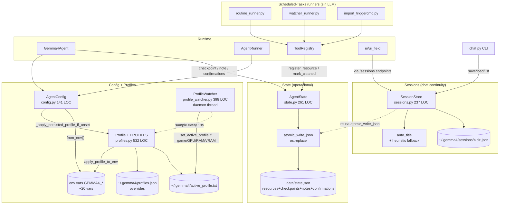
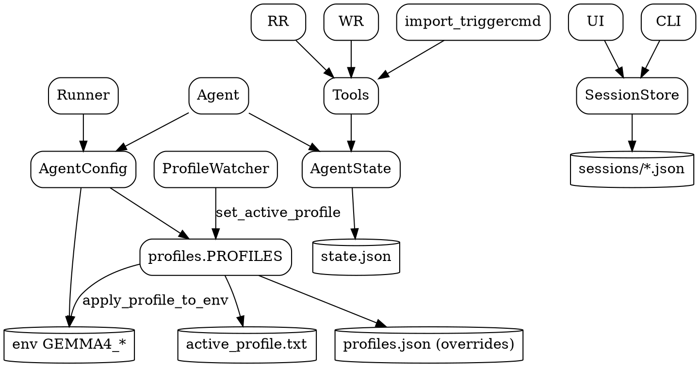

# 02.10 — State + Sessions/Routines + Config/Profiles

> **Containers:** Sessions/Routines + State + Config/Profiles.
> **Archivos:** `state.py`, `sessions.py`, `routine_runner.py`,
> `watcher_runner.py`, `import_triggercmd.py`, `config.py`, `profiles.py`,
> `profile_watcher.py`.
> **Total LOC:** 1 698.
> **Responsabilidad:** persistencia de estado/sesiones/recursos + configuración
> (env vars + perfiles) + hot-reload por watcher.

## Componentes

| # | Archivo | Símbolo principal | LOC | Storage | Responsabilidad |
|--:|---|---|--:|---|---|
| 1 | `state.py` | `AgentState` (227 LOC, 17 métodos) + `atomic_write_json()` | 261 | `data/state.json` | Resources, checkpoints, notes, confirmations. Atomic write con `os.replace`. |
| 2 | `sessions.py` | `Session` + `SessionTurn` + `SessionStore` + `auto_title()` | 237 | `~/.gemma4/sessions/<id>.json` | Sesiones de chat persistentes con título auto. |
| 3 | `routine_runner.py` | `main()` CLI | 54 | (lee/escribe `state.json` via tool) | Entry point para Windows Scheduled Tasks → ejecuta routine sin LLM |
| 4 | `watcher_runner.py` | `main()` CLI | 43 | (lee/escribe `state.json` via tool) | Entry point para Scheduled Tasks → evalúa watcher |
| 5 | `import_triggercmd.py` | `main()` CLI | 131 | (escribe routines via tool) | Importa `commands.json` de TriggerCMD como routines |
| 6 | `config.py` | `AgentConfig` (1 dataclass + `from_env()` + `_apply_persisted_profile_if_unset`) | 141 | env vars + lee `~/.gemma4/active_profile.txt` | Config inmutable del runtime |
| 7 | `profiles.py` | `Profile` dataclass + 5 `PROFILES` + `apply_profile_to_env()` + `set_active_profile()` + overrides | 532 | `~/.gemma4/active_profile.txt` + `~/.gemma4/profiles.json` (overrides) | Perfiles VRAM-aware (performance/balanced_8gb/balanced/light/standby) |
| 8 | `profile_watcher.py` | `ProfileWatcher` (daemon thread) + `WatcherConfig` + `_Sample` | 398 | (lee `~/.gemma4/active_profile.txt`) | Auto-downgrade al detectar juegos/GPU/RAM/VRAM heavy |

## Diagrama

## Tabla: tipos de "recursos" en `data/state.json`

`AgentState` modela 4 categorías:

| Categoría | Métodos | Para qué |
|---|---|---|
| `resources` | `register_resource`, `list_resources`, `update_resource`, `update_resource_metadata`, `mark_cleaned`, `cleanup_plan` | Cualquier cosa con lifecycle (routines, watchers, browser sessions, jobs, etc) |
| `checkpoints` | `checkpoint`, `list_checkpoints`, `rollback_plan` | Snapshots para rollback de acciones reversibles |
| `notes` | `note` | Notas libres del agente |
| `confirmations` | `create_confirmation`, `list_confirmations`, `get_confirmation`, `resolve_confirmation` | Confirmaciones pendientes (safety) — el LLM las crea, el user las aprueba/rechaza |

## Tabla: los 5 profiles VRAM-aware

| Profile | context_size | model | vision | rerank | parallel_tools | fact_extraction | server | voice | est VRAM |
|---|--:|---|:-:|:-:|:-:|:-:|:-:|:-:|--:|
| Performance | 32 768 | usuario default | ✓ | ✓ | ✓ | ✓ | ON | ON | (alta) |
| Balanced 8GB | (a verificar) | E4B UD-Q4_K_XL | ✓ | ✓ | ✓ | ? | ON | ON | ~7.5 GB |
| Balanced | (a verificar) | E4B Q4_K_M | ✓ | ✓ | ? | ? | ON | ON | ~6 GB |
| Light | (a verificar) | E2B Q5_K_M | ✗ | ✗ | ✗ | ✗ | ON | ON | ~4.7 GB |
| Standby | — | — | ✗ | ✗ | ✗ | ✗ | OFF | ✗ | 0 |

(Detalles exactos quedan para Fase 5; aquí solo el shape.)

## Tabla: ~20 env vars GEMMA4_*

Reconstruido leyendo `config.py:from_env` + grep `os.environ.get("GEMMA4_`:

| Env var | Por defecto | Tipo |
|---|---|---|
| `GEMMA4_AGENT_SERVER` | `http://127.0.0.1:8080` | str |
| `GEMMA4_AGENT_MODEL` | `gemma-4` | str |
| `GEMMA4_LLAMA_SERVER_EXE` | `C:/llamacpp-cuda/bin/llama-server.exe` | path |
| `GEMMA4_MODEL_PATH` | `<project>/models/E4B/gemma-4-E4B-it-Q4_K_M.gguf` | path |
| `GEMMA4_MMPROJ_PATH` | `<project>/models/E4B/mmproj-F16.gguf` | path |
| `GEMMA4_AGENT_{TEMPERATURE,TOP_P,TOP_K,MIN_P,REPEAT_PENALTY,SEED}` | sampling params | float/int |
| `GEMMA4_AGENT_{MAX_TOKENS,CONTEXT,TIMEOUT,MAX_TURNS}` | budgets | int/float |
| `GEMMA4_AGENT_{PARSE_TOOL_CALLS,PARALLEL_TOOL_CALLS,ENABLE_THINKING,TRACING,SAFETY}` | flags | bool |
| `GEMMA4_AGENT_REASONING_FORMAT`, `GEMMA4_AGENT_MODE` | | str |
| `GEMMA4_AGENT_{MEMORY,CAPTURES,TRACE_PATH,TRACE,STATE}` | paths | path |
| `GEMMA4_AGENT_PERSONA` | | str |
| `GEMMA4_AGENT_SESSIONS` (on/off), `GEMMA4_AGENT_SESSIONS_DIR` | | bool/path |
| `GEMMA4_AGENT_TIMELINE` (on/off) | | bool |
| `GEMMA4_AGENT_LOGS_DIR` | `~/.gemma4/logs` | path |
| `GEMMA4_LOG_LEVEL` | `INFO` | str |
| `GEMMA4_TELEMETRY` | OFF | bool |
| `GEMMA4_EXPERIENCE_MEMORY` (on/off), `GEMMA4_EXPERIENCE_MAX_RECORDS`, `GEMMA4_EXPERIENCE_MAX_AGE_DAYS` | | bool/int |
| `GEMMA4_KNOWLEDGE_RERANK`, `GEMMA4_RERANK_MODEL` | | bool/str |
| `GEMMA4_SEMANTIC_FALLBACK`, `GEMMA4_SEMANTIC_MODEL` | | bool/str |
| `GEMMA4_NLI_MODEL` | mDeBERTa default | str |
| `GEMMA4_SKILLS_OFF`, `GEMMA4_MICROAGENTS_OFF`, `GEMMA4_MISSION_OFF` | OFF (=enabled) | bool |
| `GEMMA4_DISABLE_PREWARM` | OFF (=enabled) | bool |
| `GEMMA4_DISABLE_TOOL_SCHEMAS_HINT`, `GEMMA4_TOOL_SCHEMAS_HINT_MODE` | | bool/str |
| `GEMMA4_ACTIVE_PROFILE` | (sino lee active_profile.txt) | str |
| `GEMMA4_KNOWLEDGE_RERANK`, `GEMMA4_AGENT_PARALLEL_TOOLS`, `GEMMA4_AGENT_FACT_EXTRACTION` (escritas por profile) | | bool |

Total: **~35 env vars**. Más que las "~20" que dije en Fase 1; ajustar en `01_system.md`.

## Hallazgos

| Sev | Hallazgo | Ubicación |
|---|---|---|
| **HIGH** | **`AgentState` 17 métodos + 4 conceptos** (resources/checkpoints/notes/confirmations). 4 sub-stores en un solo JSON. Métodos como `update_resource` y `update_resource_metadata` con APIs **casi idénticas** (uno hace patch genérico, el otro append-to-list especializado). Colapsable. | `state.py:100-170` |
| **HIGH** | `profiles.py` (532 LOC, 12 funciones) define 5 profiles + override system + writeback de env vars + helper para detectar server externo + helper para parar/arrancar. Mezcla "datos del perfil" con "ejecución del perfil". Candidato a split. | `profiles.py` |
| **HIGH** | **`config.AgentConfig.from_env` lee `~/.gemma4/active_profile.txt` y aplica env vars EN IMPORT TIME indirectamente** (al construir AgentConfig). Side-effect oculto. El comentario del propio archivo admite "lazy import para evitar ciclo". Acoplamiento de orden. | `config.py:125-141` |
| **MED** | `profile_watcher.py` (398 LOC) tiene 4 condiciones de trigger (game watchlist, GPU%, RAM%, VRAM%), histéresis configurable, y un daemon thread con `threading.Event.wait`. **Solo se activa si el user opt-in** explícitamente en Settings. Si nadie lo activa, es código que se carga pero no corre. | `profile_watcher.py` |
| **MED** | `sessions.auto_title` tiene fallback heurístico Y llamada al LLM. Si el usuario nunca activa el LLM-titling, los `_clean_title` + try/except + 3 ramas de fallback son código defensivo desperdiciado. | `sessions.py:189-237` |
| **MED** | `routine_runner.py` y `watcher_runner.py` son **idénticos estructuralmente** (40-50 LOC cada uno: argparse + ImportConfig + load resource + `registry.execute(...)` + print). Colapsable a un solo `python -m gemma4_agent.task_runner --type {routine,watcher} --id ...`. | `routine_runner.py` + `watcher_runner.py` |
| **MED** | `state.AgentState._load` y `_save` repiten `setdefault("resources", {})...` 4 veces (uno por cada sub-store). Si se agregara una 5ta categoría, hay 2 lugares para tocar. | `state.py:41-57` |
| **LOW** | `config._env_bool` acepta `{"1","true","yes","on","si"}`. La "si" (sin acento, español) es la única non-english. Sospechoso si se ejecuta CI sin testear. | `config.py:107-111` |
| **LOW** | `_PROFILE_OWNED_ENV` tuple en `config.py:117` lista las env vars "owned" por el perfil para detectar si están seteadas manualmente. Cualquier env var nueva del perfil hay que agregar también acá. Doble fuente de verdad. | `config.py:117-122` |
| **NIL** | `state.atomic_write_json` con `os.replace` es el patrón correcto. Bien. | `state.py:19-30` |

## DOT backup

