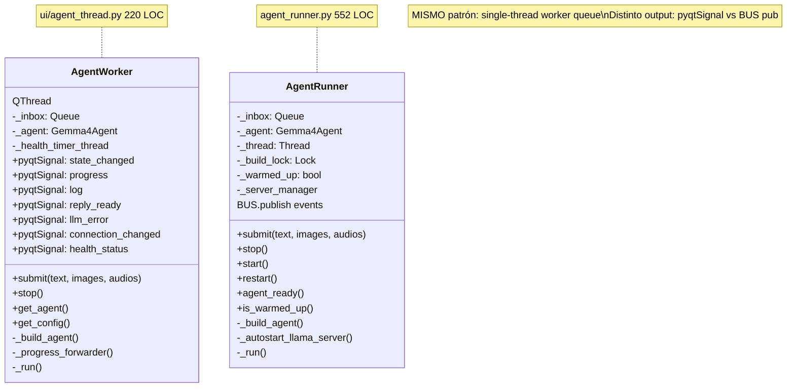
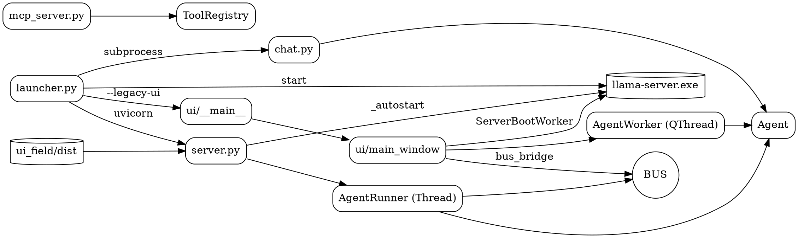

# 02.09 — Superficies: CLI + UI Desktop + UI Field + MCP Server

> **Containers:** Chat CLI + UI Desktop (PyQt6) + UI Field (React+FastAPI) + MCP Server.
> **Archivos:** `chat.py`, `ui/*`, `server.py`, `agent_runner.py`, `ui_field/`,
> `mcp_server.py`, `launcher.py`.
> **Total LOC:** ~8 750 (sin contar React/TS de `ui_field/src/`).
> **Responsabilidad:** las 4 maneras de entrar al agente. **Cada una tiene
> su propio wrapper de threading + boot + bus subscription**, con código
> duplicado entre superficies.

## Componentes

| # | Surface | Entry point | Archivos principales | LOC | Wrap del agente |
|--:|---|---|---|--:|---|
| 1 | CLI | `python -m gemma4_agent.chat` | `chat.py` | 489 | Llama `Gemma4Agent.run_text` directo, en main thread |
| 2 | UI Desktop (PyQt6) | `python -m gemma4_agent.ui` | `ui/__main__.py`, `ui/app.py`, `ui/main_window.py` + 15 widgets | 5 587 | `ui/agent_thread.AgentWorker` (QThread + queue) |
| 3 | UI Field (React + FastAPI) | `uvicorn gemma4_agent.server:app` o `launcher ui` | `server.py` + `agent_runner.py` + `ui_field/` | 2 071 Python + ts/tsx | `agent_runner.AgentRunner` (threading.Thread + queue + singleton RUNNER) |
| 4 | MCP Server | `python -m gemma4_agent.mcp_server [--port N]` | `mcp_server.py` | 332 | Llama `ToolRegistry.execute` directo, sin agent loop |
| — | Launcher orquestador | `python -m gemma4_agent.launcher {status,start,chat,ui,...}` | `launcher.py` | 485 | Spawnea subprocesses de las superficies (`subprocess.run`) |

## Diagrama

```mermaid
%% Fig 2.14 — Las 4 superficies, mismo Agent
graph LR
    subgraph s1["CLI"]
        CHAT[chat.py 489 LOC<br/>ProgressDisplay + REPL]
    end

    subgraph s2["UI Desktop PyQt6 — 5 587 LOC"]
        UIm[ui/__main__]
        UIa[ui/app.py<br/>splash + main()]
        UIw[ui/main_window<br/>1 616 LOC]
        AW[ui/agent_thread<br/>AgentWorker<br/>QThread + queue]
        BB[ui/bus_bridge<br/>BUS → pyqtSignal]
        SBW[ServerBootWorker<br/>en main_window<br/>QThread autostart llama]
    end

    subgraph s3["UI Field React + FastAPI — 2 071 LOC"]
        SR[server.py 1 519 LOC<br/>FastAPI: /model /metrics<br/>/settings /turn /events]
        AR[agent_runner.AgentRunner<br/>552 LOC<br/>threading.Thread + queue<br/>singleton RUNNER]
        ALL[agent_runner._autostart_llama_server<br/>spawn + LlamaLogTail]
        UF[ui_field/dist React 19]
    end

    subgraph s4["MCP Server"]
        MCP[mcp_server.py 332 LOC<br/>JSON-RPC stdio o HTTP<br/>NO corre LLM Gemma]
    end

    Agent[Gemma4Agent.run_text]
    Reg[ToolRegistry.execute]
    BUS[(BUS)]

    CHAT -- "direct call" --> Agent
    UIm --> UIa --> UIw --> AW
    AW -- "submit/run" --> Agent
    UIw --> BB
    BB <-- listener --> BUS
    UIw --> SBW
    SBW -- "spawn llama" --> Llama[llama-server.exe]

    UF -- "HTTP/WS" --> SR
    SR --> AR
    AR -- "submit/run" --> Agent
    SR --> ALL
    ALL -- "spawn llama" --> Llama
    AR <-- pub/sub --> BUS

    MCP -- "execute(name, args)" --> Reg
    Reg --> Agent
```

## La duplicación más fea del repo

### `AgentWorker` (UI Desktop) vs `AgentRunner` (UI Field)



**Mismos atributos:** `_inbox: Queue`, `_agent`, thread builder, health polling.
**Mismas operaciones:** `submit`, `stop`, `_build_agent`, `_run` loop.
**Misma responsabilidad:** serializar requests a `Gemma4Agent` (que es sync).
**Diferencia única:** dónde reportar progreso (pyqtSignal vs BUS).

### `ServerBootWorker` (UI Desktop) vs `AgentRunner._autostart_llama_server` (UI Field)

Mismo problema: ambos verifican profile → port → ENV → `LlamaServerManager.start` → `LlamaLogTail`. 100+ LOC duplicadas con APIs distintas.

## Tabla de los 11 entry points

> Repaso del inventario de Fase 0, ahora con responsabilidad.

| Entry point | Tipo | Responsabilidad |
|---|---|---|
| `python -m gemma4_agent.chat` | superficie | REPL CLI |
| `python -m gemma4_agent.ui` | superficie | GUI PyQt6 |
| `uvicorn gemma4_agent.server:app` | superficie | HTTP+WS backend de React |
| `python -m gemma4_agent.mcp_server [--port N]` | superficie | MCP server stdio/HTTP |
| `python -m gemma4_agent.launcher {status,start,chat,ui,smoke}` | orquestador | Multi-subcommand: chequea, arranca llama, spawnea las otras superficies |
| `python -m gemma4_agent.voice_runner` | runner | Voice loop standalone (modo CLI) |
| `python -m gemma4_agent.routine_runner --id X` | scheduled task | Ejecuta una routine sin LLM |
| `python -m gemma4_agent.watcher_runner --id X` | scheduled task | Evalúa un watcher sin LLM |
| `python -m gemma4_agent.import_triggercmd <commands.json>` | utility | Importa TriggerCMD |
| `python -m gemma4_agent.eval_smoke` | smoke | Smoke test |
| `python -m gemma4_agent.{microagents,skills_registry}` | utility | Doble rol (módulo + CLI) |

**11 entry points para un mismo paquete.** Hay tres grupos:
- **Superficies** (4): user-facing reales — CLI, PyQt, FastAPI, MCP.
- **Runners** (3): invocables por OS/scheduler (Voice, Routine, Watcher).
- **Utility** (4): orquestador + import + smoke + microagents/skills CLI.

## Hallazgos

| Sev | Hallazgo | Ubicación |
|---|---|---|
| **HIGH** | `AgentWorker` y `AgentRunner` son la misma cosa con APIs distintas. **Candidato 1 a unificar.** Posible diseño: una clase base `AgentSerialWorker` con `submit/_run/_build_agent`, y dos adaptadores delgados `QtAgentWorker(QThread)` y `BusAgentRunner(Thread)` que solo difieren en cómo reportan progreso. Ahorro estimado: ~400 LOC. | `ui/agent_thread.py` + `agent_runner.py` |
| **HIGH** | `ServerBootWorker.run` (en `ui/main_window.py:81-183`) y `AgentRunner._autostart_llama_server` (en `agent_runner.py:155-200+`) tienen **la misma lógica de boot**. Mismo problema que (1) en otra dimensión. | `ui/main_window.py:81+` vs `agent_runner.py:155+` |
| **HIGH** | `launcher.run_ui` (~100 LOC en `launcher.py:184-279+`) tiene 4 modos de "abrir UI Field": default pywebview / `--browser` / `--no-window` / `--legacy-ui`. **El último spawnea `python -m gemma4_agent.ui` como subprocess**, lo que carga DOS python procesos para mostrar la UI legacy. Aceptable como utility, pero costoso. | `launcher.py:184-310` |
| **HIGH** | `mcp_server.py` (332 LOC, 0 clases) implementa MCP JSON-RPC desde cero en stdio + HTTP. Hay un SDK oficial (`mcp` package Python). Si llega al repo, el archivo entero podría reducirse a 50-80 LOC. | `mcp_server.py` |
| **MED** | `ui/main_window.py` 1 616 LOC, `MainWindow` con 53 métodos. **Domina toda la UI Desktop.** Mezcla: layout + dialogs + voice bridge + server boot + signal wiring. Candidato a split en sub-widgets. | `ui/main_window.py:186+` |
| **MED** | `ui/settings.py` 1 247 LOC, `SettingsDialog` con 22 métodos. Dialog enorme. | `ui/settings.py:83+` |
| **MED** | `chat.py:14-24` tiene `if __package__ in {None, ""}:` con `sys.path.insert(0, ...)` para hacer el módulo invocable como script suelto. Compromiso comprensible para CLI standalone pero es magia de imports. | `chat.py:14-24` |
| **MED** | `server.py` 1 519 LOC tiene **TODO el backend FastAPI en un solo archivo**: endpoints, detection de hardware (NVML, wmic), métricas, model_info, settings IO, WS broadcast. Candidato a partir en `server/{app,metrics,settings,events}.py`. | `server.py` |
| **MED** | `launcher.print_status` lista hardcodeado todas las paths del config + COMPOUND_TOOL_SCHEMAS count. Tampoco hay test que verifique que cada path realmente existe en disco antes de mostrar OK. (En realidad sí lo hace con `file_line`, OK.) | `launcher.py:85-108` |
| **LOW** | `_WHISPER_HALLUCINATIONS` (set hardcoded) está duplicado en `ui/main_window.py:41-51` Y en `voice/stt.py:87-109` (`SPANISH_HALLUCINATION_PHRASES` tupla). Distintas listas, pero ambas para "frases que Whisper aluciona". | `ui/main_window.py:41` + `voice/stt.py:87` |
| **LOW** | `mcp_server.py:28` "Carter v5 mcp_server.py — reference implementation porteada aca" — documentado, ya en findings. | `mcp_server.py:28` |
| **NIL** | `ui/bus_bridge.py` (122 LOC) es honesto: BUS sync listener → pyqtSignal. Patrón mínimo correcto. | `ui/bus_bridge.py` |

## DOT backup


