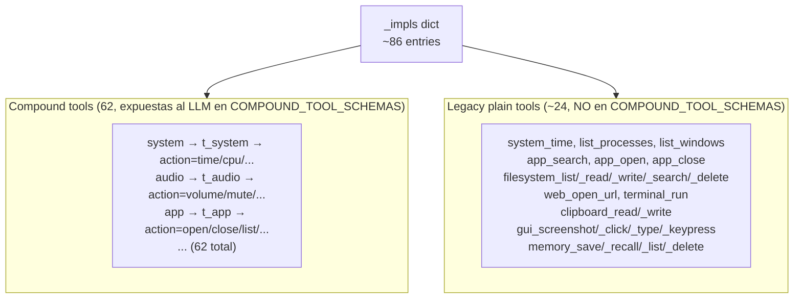
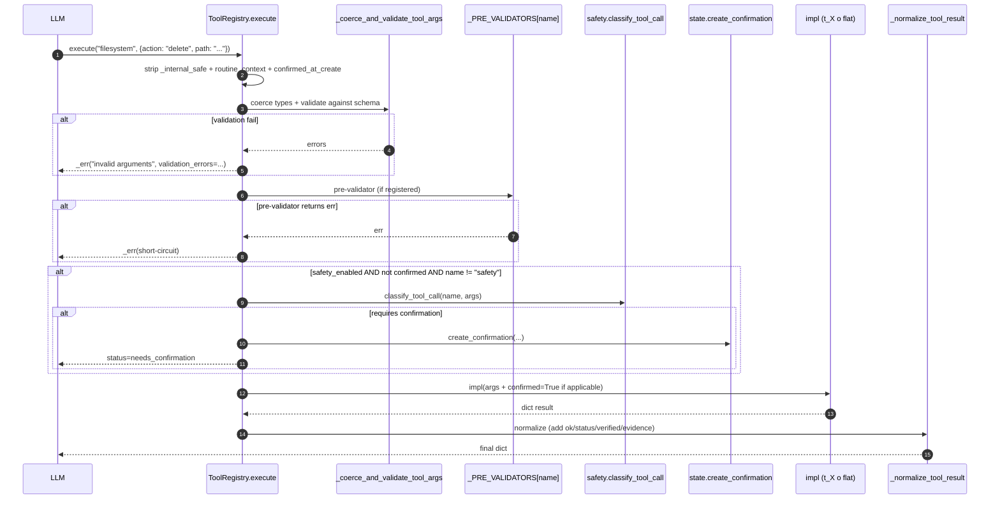
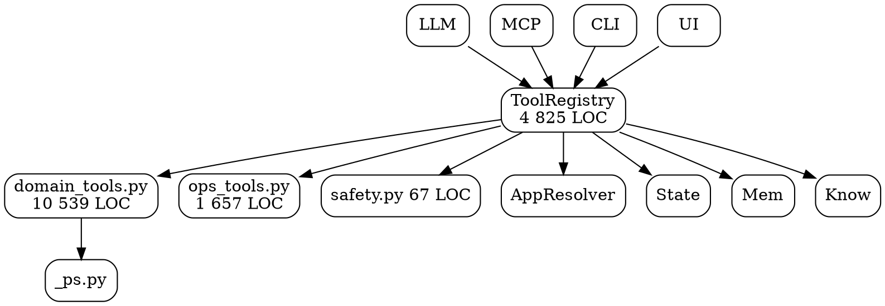

# 02.07 — Tools (Registry + Domain + Ops + Safety)

> **Containers:** Tool Registry + Domain Tools + Ops Tools + Safety.
> **Archivos:** `tools.py`, `domain_tools.py`, `ops_tools.py`, `safety.py`,
> `_ps.py`.
> **Total LOC:** 17 170 (31 % del paquete entero).
> **Responsabilidad:** todo lo que el LLM puede ejecutar para hablar con
> Windows. **El "monstruo" del repo.**

## Componentes

| # | Archivo | Símbolo / clase | LOC | Responsabilidad |
|--:|---|---|--:|---|
| 1 | `tools.py` | `ToolRegistry` (3 157 LOC) + `AppResolver` (364 LOC) + `_SSRFGuardRedirectHandler` (~30 LOC) + `_normalize_tool_result()` + `_coerce_and_validate_tool_args()` + `_PRE_VALIDATORS` + `_redact_sensitive()` + `COMPOUND_TOOL_SCHEMAS` (~62 tool schemas dict) | **4 825** | Dispatcher central. Hold de `_impls` dict (mapping de **~86 entries** entre tools compuestas y tools legacy planas). Pre-validación, safety classify, gates duros, normalize, side-effects de state. |
| 2 | `domain_tools.py` | 33 funciones top-level `<name>_tool(state, args)` + 281 helpers privados + `_hard_gate` + `_redact_credentials` (1 clase de ayuda) | **10 539** | Handlers de tools "compuestas" del LLM: 33 tools, cada una con varias `action="X"`. Importa PIL, bs4, fitz/pdfplumber/pdf2image/pypdf, matplotlib, pandas, openpyxl, paho-mqtt, mysql, psycopg, psycopg2, pymysql, python-docx, python-pptx. |
| 3 | `ops_tools.py` | `browser_real_tool` + `download_tool` + `email_tool` + `env_tool` + `input_tool` + `ocr_find_text` + `ocr_image` + `registry_tool` + `reminder_tool` + `state_tool` + helpers | **1 657** | Tools que tocan navegador (Playwright sobre CDP) / OS / red / dispositivos vía subprocess + protocolos crudos. |
| 4 | `safety.py` | `classify_tool_call(name, args)` + `_DANGEROUS_TOOLS` + tipo `ClassificationResult` | **67** | Mapping nombre → riesgo (low/med/high). No es sandbox. |
| 5 | `_ps.py` | `parse_ps_json()` + `PSValidationError` + regex `RX_*` (`RX_HHMM`, `RX_DAY_OF_WEEK`, `RX_ISO_DATETIME`, `RX_LOG_NAME`, `RX_SQL_IDENT`, `RX_TCP_STATE`, `is_ipv4`, `is_ipv6`, `ps_safe_literal`) | 82 | Helpers para tools que invocan PowerShell: parser de `PS-> ConvertTo-Json`, validators de literales seguros. |

## Diagrama: el dispatcher central

```mermaid
%% Fig 2.16 — Tool Registry + dependencies
graph TB
    LLM[LLM tool_call] --> Reg

    subgraph Reg["ToolRegistry — tools.py 3 157 LOC, ~86 entries en _impls"]
        Exec[execute name, args]
        ExecRout[execute_routine_step<br/>inyecta routine_context]

        subgraph Pipeline["pipeline de execute()"]
            Strip[strip _internal_safe + routine_context + confirmed_at_create]
            Validate[_coerce_and_validate_tool_args<br/>+ _PRE_VALIDATORS]
            Safety[if safety_enabled →<br/>classify_tool_call<br/>→ may create_confirmation]
            Call[impl args]
            Norm[_normalize_tool_result]
        end

        Impls[_impls dict<br/>~86 entries]
        Schemas[COMPOUND_TOOL_SCHEMAS<br/>~62 tools del LLM]
        Apps[AppResolver<br/>364 LOC]
        SSRF[_SSRFGuardRedirectHandler]
    end

    subgraph Domain["domain_tools.py 10 539 LOC, 314 funciones"]
        D1[33 *_tool functions]
        Dhg[_hard_gate]
        Drd[_redact_credentials]
    end

    subgraph Ops["ops_tools.py 1 657 LOC, 43 funciones"]
        O[10 main tools + helpers]
    end

    subgraph Sf["safety.py 67 LOC"]
        SafetyFn[classify_tool_call]
        Dang[_DANGEROUS_TOOLS]
    end

    subgraph PS["_ps.py 82 LOC"]
        PS[parse_ps_json + regex validators]
    end

    subgraph Ext["Stores externos"]
        Mem[(MemoryStore)]
        State[(AgentState)]
        Know[(KnowledgeStore)]
    end

    LLM --> Reg
    Exec --> Strip --> Validate --> Safety --> Call --> Norm
    Safety --> SafetyFn
    Call --> Impls
    Impls -- "calls into" --> Domain
    Impls -- "calls into" --> Ops
    Impls -- "calls into" --> Apps
    Impls -. "memory tools" .-> Mem
    Impls -. "state/routine/watcher" .-> State
    Impls -. "knowledge tool" .-> Know
    Domain --> PS
    Ops -. "playwright CDP" .-> CDP[browser CDP]
    ExecRout --> Pipeline
```

## Estructura interna: `ToolRegistry._impls` tiene DOS familias



> **Por qué importa:** las tools "compuestas" (`audio` con `action="set_volume"`) son las que el LLM ve. Las "legacy planas" (`audio_set_volume`) **no están en `COMPOUND_TOOL_SCHEMAS`**, pero están en `_impls`. Tres posibles motivos:
> 1. Legacy de antes de la compactación en compound tools.
> 2. Llamadas internas (e.g. `t_audio` llama a `audio_set_volume` para reusar lógica).
> 3. Disponibles a `MCP server` que tal vez expone el catalogo "ancho" en vez del "compound".
>
> Necesita verificarse en Fase 7 (inventario tools) — pero ya es una **señal de duplicación de superficie** que el LLM no usa.

## Pipeline interno de `execute(name, args)`



## La clase `AppResolver` (364 LOC adentro de `tools.py`)

| Método | Para qué |
|---|---|
| `find(query, limit, refresh, deep_fallback)` | Devuelve `AppCandidate[]` ordenados por relevancia |
| `find_steam_library(query, limit)` | Steam específico |
| `_from_path` | Apps en PATH ambiental |
| `_from_shortcuts` | `.lnk` del Start Menu |
| `_from_start_apps` | `shell:appsfolder` Windows UWP+desktop |
| `_from_uninstall_registry` | Registry `Uninstall` key |
| `_launch_from_registry_item(item)` | parseo del comando del registry |
| `_from_common_exe_roots(query, max_matches=80)` | scan de Program Files, %LOCALAPPDATA%, etc |
| `_from_steam` | Steam library scan |
| `_from_steam_appinfo_cache(query, max)` | parseo binario de Steam appinfo.vdf |
| `_steam_library_roots()` | `libraryfolders.vdf` |
| `_from_epic` | Epic Games launcher manifests |
| `open(candidate)` | Lanza el ejecutable resolveiendo path/args |

**Es un buscador de apps "todo en uno"** con 9 fuentes distintas. Compite directamente con UI Automation, `where.exe`, y `start menu search`. Mantenido como índice propio del agente para no depender de Win32 search performance.

## Hallazgos

| Sev | Hallazgo | Ubicación |
|---|---|---|
| **CRITICAL** | **`tools.py` 4 825 LOC, `ToolRegistry` 3 157 LOC / ~86 entries en `_impls`** + **`domain_tools.py` 10 539 LOC, 314 funciones top-level**. Es el 31 % del paquete. Re-leerlo entero es inviable; tocarlo es de alto riesgo. Tres god-modules concentran este monstruo. | `tools.py` + `domain_tools.py` + `ops_tools.py` |
| **CRITICAL** | **`domain_tools.py` cumple "kitchen sink": 16+ deps externas pesadas en un solo archivo.** Importar `domain_tools` carga 4 parsers PDF, 4 drivers SQL, matplotlib, pandas, openpyxl, paho-mqtt, etc. Cualquier proceso que importe el Registry (CLI, UI, server, mcp_server, runners) paga esto. **Latencia de boot brutal.** | `domain_tools.py` (cabecera de imports) |
| **HIGH** | **Dos familias en `_impls`** — compound + legacy plain. ~24 entries legacy que NO están en `COMPOUND_TOOL_SCHEMAS` → no las ve el LLM. Si nadie las usa, son ~1 500 LOC zombies. Fase 7 va a verificar. | `tools.py:1495-1584` |
| **HIGH** | **`AppResolver` 364 LOC con 9 fuentes de apps**: path + shortcuts + start_apps + uninstall registry + 2 modos de Steam + Epic + common_exe_roots + manual launch. ¿Cuántas devuelven resultados que las otras no? Reducible a 2-3 fuentes con tests de cobertura. | `tools.py:660-1155` |
| **HIGH** | **`_redact_credentials` (domain_tools.py) Y `_redact_sensitive` (tools.py) son la misma función con nombres distintos.** El comentario en `domain_tools.py:51` lo dice: `# CC-105: paralelo a tools._redact_sensitive`. Duplicación auto-confesada. | `domain_tools.py:50-65` + `tools.py:_redact_sensitive` |
| **HIGH** | **`_hard_gate` (domain_tools.py) Y `_hard_gate` (tools.py:3945+) son la misma función con la misma firma.** El comentario en `domain_tools.py:68` dice: `# CC-101: gate duro replicable desde domain_tools (sin ToolRegistry)`. Es decir, hay copia explícita "por arquitectura" para evitar import circular. Eso es síntoma de boundaries mal puestos. | `domain_tools.py:68-90` + `tools.py:3945+` |
| **MED** | `safety.py` 67 LOC define `classify_tool_call` pero la lógica de gates duros está REPETIDA en `domain_tools._hard_gate` y `tools._hard_gate`. **Tres lugares para "este tool es peligroso"**. | `safety.py` + 2x `_hard_gate` |
| **MED** | `COMPOUND_TOOL_SCHEMAS` empieza en línea 4 645 de `tools.py`. Lista enorme. Cada agregar/cambiar de tool requiere editar este god-list. | `tools.py:4645+` |
| **MED** | `_PRE_VALIDATORS` (mapping name → validator) es un mecanismo añadido al pipeline pero solo se documenta inline. No hay un registry decorator-based como el de verifiers. Inconsistencia con `verify_core.@verifier(name)`. | `tools.py:1643` |
| **MED** | `ToolRegistry` mete en su `__init__`: `MemoryStore`, `AgentState`, `KnowledgeStore`, `AppResolver`. **Constructor con efectos secundarios masivos** (crea SQLite, escanea apps, etc). Difícil de instanciar en tests sin mocks profundos. | `tools.py:1486-1495` |
| **LOW** | `_SSRFGuardRedirectHandler` (~30 LOC) es un single-use class dentro de `tools.py`. Encapsula bien la mitigación SSRF pero podría vivir en `ops_tools.py` (es para `web_read`/`download_tool`). | `tools.py:1365-1395` |
| **LOW** | `t_state`, `t_input`, `t_env`, `t_registry`, `t_download`, `t_email`, `t_reminder`, `t_browser_real` — todos son **1-line wrappers** que solo reenvían a la función real en `ops_tools.py`. ~16 LOC de stubs que no agregan lógica. | `tools.py:2336-2360` |
| **LOW** | `t_office`, `t_audio_device`, `t_notification`, `t_routine`, `t_media`, `t_source_manager`, `t_dependency`, `t_contacts`, `t_whatsapp`, `t_notes_tasks`, `t_local_calendar`, `t_habit_tracker`, `t_local_search`, `t_printer_scanner`, `t_desktop_layout`, `t_document`, `t_developer`, `t_device_settings`, `t_game_launcher`, `t_media_edit`, `t_maintenance`, `t_watcher`, `t_job_manager`, `t_network`, `t_data_analysis`, `t_fact_check`, `t_photo_library`, `t_container`, `t_database`, `t_creative_local`, `t_form_filler`, `t_peripheral`, `t_accessibility`, `t_study`, `t_smart_home` — **35 métodos más que también son wrappers a `domain_tools.<name>_tool(state, args)`**. ~70 LOC de stubs adicionales. | `tools.py:2426-2554` |
| **NIL (bueno)** | `execute()` tiene pipeline claro: strip → validate → pre-validator → safety → call → normalize. **Es la pieza del Registry que vale leer en detalle.** | `tools.py:1617-1673` |

## DOT backup


