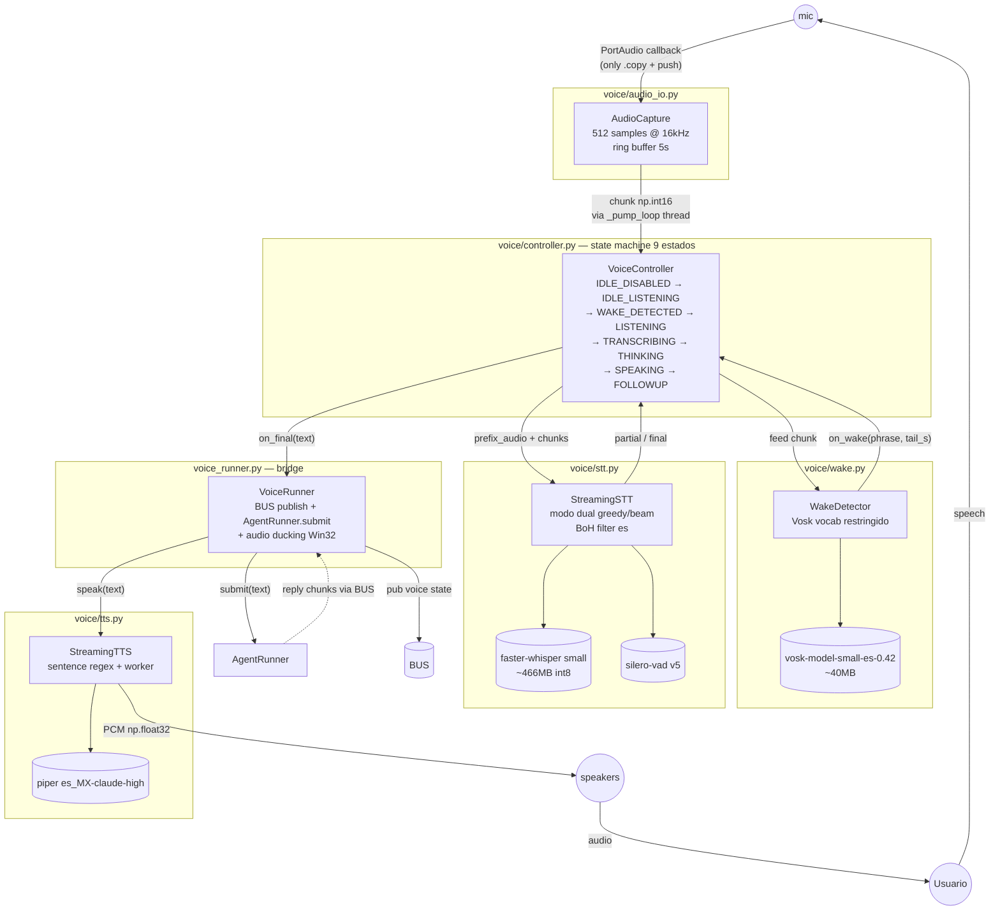
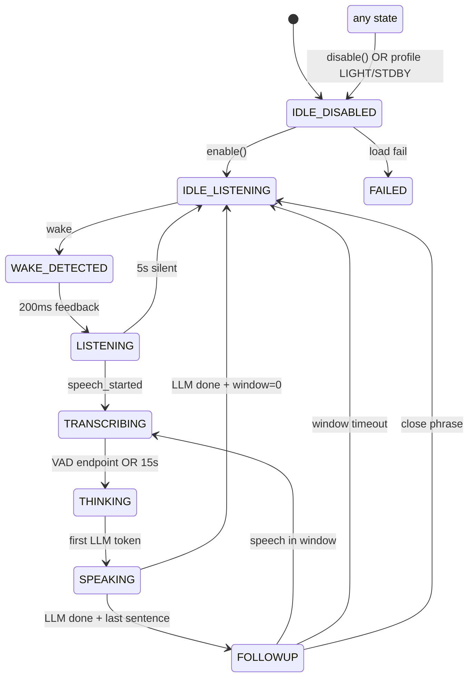
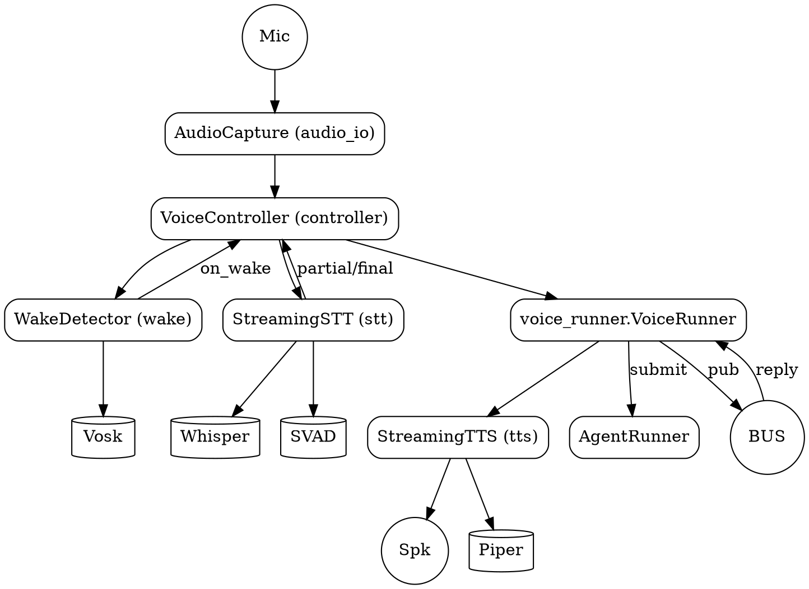

# 02.02 — Voice Loop

> **Container:** Voice Loop.
> **Archivos:** todo el paquete `voice/` (6 archivos) + `voice_runner.py` en raíz.
> **Total LOC:** 2 765.

## Componentes

| # | Archivo | Clase principal | LOC | Modelo externo | Responsabilidad |
|--:|---|---|--:|---|---|
| 1 | `voice/audio_io.py` | `AudioCapture` | 245 | PortAudio (sounddevice) | InputStream mic 16kHz mono int16, chunks de 512 samples (Silero v5 requirement) + ring buffer 5s |
| 2 | `voice/wake.py` | `WakeDetector` | 346 | Vosk `vosk-model-small-es-0.42` (~40 MB) | Wake-word "gemma"/"hey gemma" con vocab restringido, confidence ≥0.85, debounce 2s |
| 3 | `voice/stt.py` | `StreamingSTT` | 863 | faster-whisper `small` + Silero VAD v5 + scipy butter | STT modo dual (greedy ≤3s / beam=5 >3s), bag-of-hallucinations es, high-pass 80 Hz |
| 4 | `voice/tts.py` | `StreamingTTS` | 302 | Piper `es_MX-claude-high` | Sintaxis de oraciones por regex + worker thread + cola FIFO, descarga voz on-demand |
| 5 | `voice/controller.py` | `VoiceController` | 576 | — | State machine de 9 estados que orquesta los 4 anteriores |
| 6 | `voice_runner.py` | `VoiceRunner` (entry) | 425 | comtypes + pycaw (audio ducking Win32) | Bridge entre VoiceController y BUS / AgentRunner |
| 7 | `voice/__init__.py` | — | 8 | — | (vacío) |

## Diagrama

## State machine `VoiceController`

## Tabla de modelos en disco

| Modelo | Path típico | Tamaño aprox | Carga | Usado en |
|---|---|--:|---|---|
| Vosk small es-0.42 | `~/.gemma4/models/vosk-model-small-es-0.42/` | ~40 MB | eager en `WakeDetector.load()` | wake-word |
| faster-whisper small | `~/.gemma4/models/whisper/` | ~466 MB (int8) | eager en `StreamingSTT.load()` | STT |
| Silero VAD v5 | bundled con `silero_vad` pip | ~2 MB | eager con whisper | VAD endpoint |
| Piper voice (es_MX-claude-high) | `~/.gemma4/models/piper/*.onnx` + `.onnx.json` | ~60 MB | descargado on-demand | TTS |

## Hallazgos

| Sev | Hallazgo | Ubicación |
|---|---|---|
| **MED** | `voice/stt.py` 863 LOC con docstring monumental (35 líneas) explicando 9 cambios + referencias a issues. Es la única clase voice con más comentarios "por qué" que código. Honesto pero excesivo: gran parte podría ir a `docs/voice_stt_notes.md`. | `voice/stt.py:1-50` |
| **LOW** | URLs de modelos Piper hardcoded a un repo HF y voz default `es_MX-claude-high`. Si HF rebrandeo el repo o cae, se cae el bootstrap del TTS. Aceptable, pero anotar. | `voice/tts.py:33-48` |
| **LOW** | `voice/tts.py` tiene 3 voces en `PIPER_VOICE_URLS` pero solo 1 default. El selector no se cambia desde la UI (busqué `set_voice` y no aparece). Si nunca se cambia, las otras 2 son código muerto. | `voice/tts.py:35-48` |
| **LOW** | `voice_runner.py` 425 LOC con 1 sola función top-level y 2 clases. El bridge BUS↔Controller+ducking podría ser ~150 LOC. Sospecho features acumuladas. | `voice_runner.py` |
| **NIL** | `audio_io.py` es honesto y compacto. PortAudio callback solo `.copy() + push`, pump thread aparte. Buen patrón. | `voice/audio_io.py` |
| **NIL** | `wake.py` con vocabulario restringido + confidence floor + debounce: tres defensas explícitas contra FP. Bien documentado el porqué del 0.85 threshold. | `voice/wake.py` |

> **Observación general:** este es el subsistema con mejor diseño del paquete.
> Frontera clara, una responsabilidad por archivo, deps externos en un solo
> archivo (`stt.py`). La sobre-ingeniería es marginal.

## DOT backup

