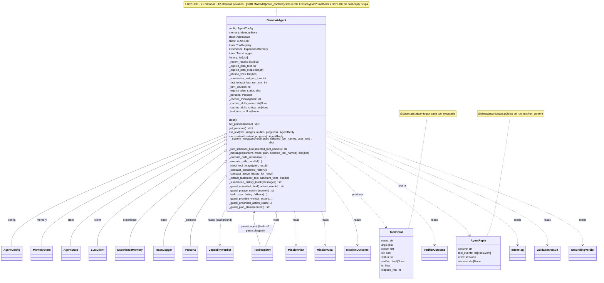

# 03.08 — Agent Core (clases UML)

> **Container:** Agent Core.
> **Archivos:** `agent.py`, `subagent.py`.

## Fig 3.08 — Agent Core classes

## Funciones top-level (en `agent.py` fuera de la clase)

| Función / Constante | LOC | Rol |
|---|--:|---|
| `INHERIT_TTL_SEC = 300`, `DANGEROUS_TOOLS_NEVER_INHERIT = frozenset({...})` | ~10 | F-005 knobs |
| `CORE_PROMPT` (string raw multi-línea) | ~160 | El system prompt base |
| `TOOL_RULES: dict[str, str]` | ~330 | Reglas por tool inyectadas según subset |
| `build_system_prompt(selected_tool_names=None)` | ~48 | CORE + TOOL_RULES filtrado |
| `SYSTEM_PROMPT = build_system_prompt()` | 1 | Build at import time (versión "full") |
| `_extract_user_text`, `_derive_outcome_code`, `_derive_args_signature`, `_fold_match`, `_is_unverified_result`, `_run_with_timeout`, `_format_phrase_fires`, `_summarization_enabled`, `_summarization_cooldown_turns`, `_fact_extraction_enabled`, `_fact_extraction_cooldown_turns`, `_compute_context_budget`, `_parallel_tools_enabled`, `_message_text_estimate`, `_compact_live_content`, `_compact_history_content`, `_compact_tool_result`, `_compact_json` | ~410 | Helpers para `run_content` |

## Veredictos

| Clase | LOC | Métodos | Marca | Veredicto |
|---|--:|--:|---|---|
| `ToolEvent` | <30 | dataclass | — | mantener. |
| `AgentReply` | <30 | dataclass | — | mantener. |
| `Gemma4Agent` | **1 852** | 21 | `[GOD MÁXIMO]` | **#2 candidato a split del repo.** Ejes posibles: (a) extraer `_system_message` + `_tool_schemas_hint` a `agent/prompt_builder.py`, (b) extraer `_execute_calls_*` a `agent/dispatcher.py`, (c) extraer 6 `_guard_*` a `agent/guards.py`, (d) extraer `_compact_*` + `_summarize_history_block` + `_extract_facts` a `agent/history_compaction.py`. **Pero hacerlo sin tests sólidos es muy arriesgado.** |

## Hallazgos a `_findings_seed.md`

- **`Gemma4Agent` 1 852 LOC, 21 métodos, 12 atributos privados** — ya en findings (CRITICAL).
- **`run_content` 892 LOC un solo método** — ya en findings (CRITICAL).
- **6 `_guard_*` = 337 LOC de post-reply fixups** — ya en findings (HIGH).
- **`CORE_PROMPT` 160 LOC raw multi-línea en `.py`** — ya en findings (HIGH).
- **`TOOL_RULES` 330 LOC dict** — ya en findings (HIGH).
- **18 helpers top-level fuera de la clase** — ya en findings (MED).
- **`from .X import Y` lazy 6+ veces dentro de métodos** — ya en findings (MED).
