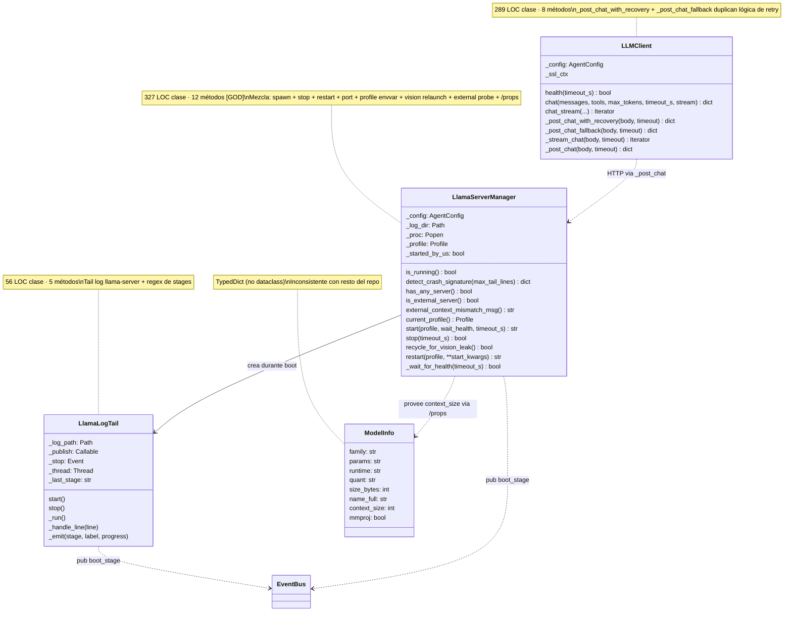

# 03.03 — LLM Lifecycle (clases UML)

> **Container:** LLM Lifecycle.
> **Archivos:** `llama_server.py`, `llm_client.py`, `model_info.py`,
> `boot_progress.py`, `prewarm.py`, `multimodal.py`.

## Fig 3.03 — LLM Lifecycle classes

## Funciones top-level relevantes (no son clases pero pertenecen al subsistema)

| Función | Archivo | LOC | Rol |
|---|---|--:|---|
| `port_in_use()` | `llama_server.py` | ~15 | Detección de server externo en :8080 |
| `get_external_server_context(host, port, timeout)` | `llama_server.py` | ~30 | GET /props → context_size |
| `parse_gguf_name(gguf_path) → dict` | `model_info.py` | ~30 | Regex parser (family, params, quant) |
| `build_model_info(...) → ModelInfo` | `model_info.py` | ~20 | Bundle |
| `mock_model_info() → ModelInfo` | `model_info.py` | ~15 | placeholder dry-run |
| `is_experimental_quant(gguf_path) → tuple[bool, str]` | `model_info.py` | ~10 | Detecta MXFP4 etc — verificar callers |
| `emit_stage(publish, stage, label, progress, error)` | `boot_progress.py` | ~10 | Helper para callers que no instancian LlamaLogTail |
| `prewarm_kv(client, system_prompt, tools, timeout, publish)` | `prewarm.py` | ~95 | POST sintético con max_tokens=1 |
| `prewarm_enabled() bool` | `prewarm.py` | ~5 | Lee `GEMMA4_DISABLE_PREWARM` |
| `image_part(path)`, `audio_part(path)`, `user_content(text, images, audios)` | `multimodal.py` | ~40 | Adapter OpenAI-compat |
| `_bump_image_counter()` + `set_vision_relaunch_callback(cb)` + `reset_image_counter()` + `get_image_counter()` | `multimodal.py` | ~80 | Counter module-level con doble notificación |

## Veredictos

| Clase | LOC | Métodos | Marca | Veredicto |
|---|--:|--:|---|---|
| `LlamaServerManager` | 327 | 12 | `[GOD]` | **split en 2:** `ServerProcess` (spawn/stop/restart/wait_health) + `ServerProbe` (`port_in_use`, `external_server_context`, `external_context_mismatch_msg`, `detect_crash_signature`). |
| `LLMClient` | 289 | 8 | — (límite) | revisar: `_post_chat_with_recovery` + `_post_chat_fallback` + `_post_chat` son 3 caminos a la misma POST. Posible colapso a 1 método con `recovery: bool`. |
| `LlamaLogTail` | 56 | 5 | — | mantener pero **mover de `boot_progress.py` a su propio archivo** o a `llama_server.py` (donde se usa). El módulo actual mezcla "helper de constantes/emit" con "clase de tail". |
| `ModelInfo` | TypedDict | — | — | **convertir a `@dataclass(frozen=True)`** para consistencia con `MissionOutcome`, `AgentReply`, `Profile`, `Persona`, etc. |

## Hallazgos a `_findings_seed.md`

- **`LlamaServerManager` split en `ServerProcess` + `ServerProbe`.** Severity MED.
- **`LLMClient._post_chat_with_recovery` + `_post_chat_fallback` + `_post_chat` = 3 caminos a 1 POST.** Severity MED. Colapsable.
- **`ModelInfo` TypedDict inconsistente con dataclasses del resto del repo.** Severity LOW.
- **`LlamaLogTail` dentro de `boot_progress.py` mezcla concerns.** Severity LOW. Mover.
- **`prewarm.py` 140 LOC para 95 LOC de core function + opt-out env + double-try BUS.** Ya en findings.
- **`is_experimental_quant` callers** — verificar Fase 6 si llamadores >0. Si 0, código muerto.
