# 03.06 — Memory & Knowledge (clases UML)

> **Container:** Memory & Knowledge + Skills/Microagents/Personas.
> **Archivos:** `memory.py`, `experience.py`, `knowledge.py`,
> `skills_registry.py`, `microagents.py`, `personas.py`.

## Fig 3.06 — Memory classes

```mermaid
classDiagram
    class MemoryStore {
        path: Path
        _lock: RLock
        _load() dict
        _save(data)
        save(key, value, source) dict
        recall(key, fuzzy, limit) list[dict]
        list_all() dict
        delete(key) dict
        prompt_summary() str
        cleanup(max_total) dict
    }
    note for MemoryStore "@dataclass · 187 LOC · 7 métodos públicos\nJSON store con sanitize de control chars\nMAX_TOTAL_ITEMS=500 (sin TTL/LRU)"

    class ExperienceMemory {
        path: Path
        _conn: Connection
        _disabled: bool
        record(turn_id, user_input, tools_used, outcome, mission_status, summary, embed_fn, outcome_code, failure_reason_code, args_signature, capability_label) dict
        flag_grounding(experience_id, reason) dict
        flag_grounding_by_turn(turn_id, reason) dict
        prune(max_records, max_age_days) dict
        recall(query, embed_fn, k, max_distance) list[dict]
        recent(limit) list[dict]
        stats() dict
        close()
        _open() Connection
    }
    note for ExperienceMemory "@dataclass · 371 LOC clase · 9 métodos\nSQLite + sqlite_vec virtual table\nEmbeddings 384d (MiniLM compartido)\nflag_grounding + flag_grounding_by_turn = DUP"

    class KnowledgeStore {
        path: Path
        _init()
        _connect() Connection
        ingest_text(text, source, title, metadata) dict
        ingest_file(path, title) dict
        search(query, limit, rerank) dict
        list_documents(limit) dict
        delete(doc_id) dict
        status() dict
    }
    note for KnowledgeStore "@dataclass · 253 LOC · 6 métodos\nSQLite FTS5 + opcional cross-encoder reranker"

    class SkillMeta {
        name: str
        description: str
        priority: Priority
        path: Path
        requires: dict
    }
    note for SkillMeta "@dataclass(frozen=True)\nMetadata · no incluye body (lazy)"

    class Microagent {
        name: str
        triggers: list[str]
        priority: str
        content: str
        source_path: Path
    }
    note for Microagent "@dataclass(frozen=True)\nIncluye body (eager-loaded para match)"

    class Persona {
        name: str
        description: str
        system_hint: str
        preferred_tools: tuple[str]
        tone: str
    }
    note for Persona "@dataclass(frozen=True)\n6 personas hardcoded en PERSONAS dict"

    Gemma4Agent o-- MemoryStore : self.memory
    Gemma4Agent o-- ExperienceMemory : self.experience
    ToolRegistry o-- KnowledgeStore : self.knowledge
    Gemma4Agent ..> SkillMeta : scan_skills() → list
    Gemma4Agent ..> Microagent : build_microagents_section
    Gemma4Agent o-- Persona : self._persona
```

## Funciones top-level

| Función | Archivo | Rol |
|---|---|---|
| `is_enabled()` | `experience.py` | `GEMMA4_EXPERIENCE_MEMORY` |
| `_vec_blob(vec)` | `experience.py` | Serializa embedding para sqlite-vec |
| `format_recall_for_prompt(recalls)` | `experience.py` | Renderiza recall para system_prompt |
| `_load_reranker()`, `_rerank_rows(query, rows, limit)` | `knowledge.py` | Cross-encoder lazy + rerank |
| `_chunk_text(text, max_chars, overlap)`, `_fts_query(query)` | `knowledge.py` | Helpers |
| `scan_skills() → list[SkillMeta]` | `skills_registry.py` | Scan + parse |
| `build_menu(skills) → str` | `skills_registry.py` | 1 línea por skill |
| `build_critical_block(skills) → str` | `skills_registry.py` | Bodies eager |
| `load_skill_content(name) → str` | `skills_registry.py` | Lazy load body |
| `_parse_yaml_simple(text) → dict`, `_parse_skill_md(path)`, `_is_valid_skill_name(name)` | `skills_registry.py` | Parser propio (74 LOC) |
| `scan_microagents() → list[Microagent]`, `build_microagents_section(user_text, cached) → tuple` | `microagents.py` | Scan + match + render |
| `_parse_frontmatter(text)`, `_normalize_text(text)`, `_match_triggers(...)` | `microagents.py` | Helpers |
| `get(name) → Persona`, `from_env() → Persona`, `list_names() → list[str]` | `personas.py` | API |

## Veredictos

| Clase | LOC | Métodos | Marca | Veredicto |
|---|--:|--:|---|---|
| `MemoryStore` | 187 | 7 | — | mantener. Cap MAX_TOTAL_ITEMS=500 sin TTL ya en findings. |
| `ExperienceMemory` | 371 | 9 | `[GOD]` (>300 LOC) | revisar split: storage (SQLite + sqlite_vec) + recall logic (embed_fn) + provenance bookkeeping + prune. **`flag_grounding` + `flag_grounding_by_turn` colapsables.** |
| `KnowledgeStore` | 253 | 6 | — | mantener. FTS5 + reranker es esfuerzo justificado. |
| `SkillMeta`, `Microagent`, `Persona` | <30 each | dataclass | — | mantener. |

## Hallazgos a `_findings_seed.md`

- **`ExperienceMemory` 371 LOC** — split o reducir provenance fields. Severity MED.
- **`flag_grounding` + `flag_grounding_by_turn` duplicación** — ya en findings.
- **`_parse_yaml_simple` parser propio (74 LOC)** — ya en findings (`pyyaml` es 1 dep).
- **`MemoryStore.MAX_TOTAL_ITEMS=500` sin TTL/LRU** — ya en findings.
- **6 Personas hardcoded** — verificar uso real en Fase 8.
