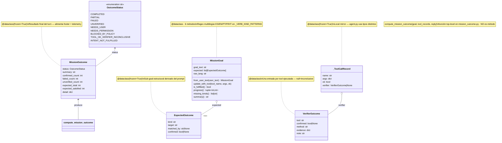

# 03.04 — Mission Outcome + Verification (clases UML)

> **Container:** Mission Outcome + Verification.
> **Archivos:** `mission_goal.py`, `mission_outcome.py`, `verify_core.py`, `verifiers.py`.

## Fig 3.04 — Mission/Verification classes

## Funciones top-level (no clases pero pertenecen al subsistema)

| Función | Archivo | Rol |
|---|---|---|
| `compute_mission_outcome(goal, tool_records, reply)` | `mission_outcome.py` | Pipeline: combina MissionGoal + verifiers per-tool → MissionOutcome |
| `_enabled()` | `mission_outcome.py` | `GEMMA4_MISSION_OFF` |
| `register_verifier(tool_name)` decorator | `verify_core.py` | Pueblo el `VERIFIER_REGISTRY` |
| `verify(tool_name, args, result) → VerifierOutcome` | `verify_core.py` | Dispatch al registry |
| `summarize_verifiers(outcomes) → str` | `verify_core.py` | Footer del reply |
| `collect_evidence_keys(outcomes) → list[str]` | `verify_core.py` | Para telemetry |
| `registered_tool_names() → list[str]` | `verify_core.py` | introspección |
| `_clear_registry_for_tests()` | `verify_core.py` | Test helper |
| 19 verifiers concretos `@register_verifier("X")` | `verifiers.py` | Implementaciones específicas |

## Veredictos

| Clase | LOC | Métodos | Marca | Veredicto |
|---|--:|--:|---|---|
| `OutcomeStatus` (enum) | ~10 | 9 valores | — | mantener. Si en producción solo se usan 4-5, considerar reducir (Fase 8). |
| `ExpectedOutcome` | <20 | dataclass | — | mantener. |
| `MissionOutcome` | <20 | dataclass | — | mantener. |
| `MissionGoal` | ~80 | 6 + cls | — | mantener. `_VERB_KIND_PATTERNS` multilingüe ya en findings. |
| `_ToolCallRecord` | <20 | dataclass | `[1-USER]` (solo `compute_mission_outcome`) | considerar inline. |
| `VerifierOutcome` | <20 | dataclass | — | mantener. |

## Hallazgos a `_findings_seed.md`

- **`OutcomeStatus` 9 valores** — Fase 8 verificar distribución real.
- **`_ToolCallRecord` 1-user** — inline en `compute_mission_outcome` posible.
- **2 funciones top-level (`compute_mission_outcome`, `verify`)** son las APIs públicas — buen patrón (no es indirección).
- **`VERIFIER_REGISTRY` global mutable poblado por decoradores** — ya en findings.
