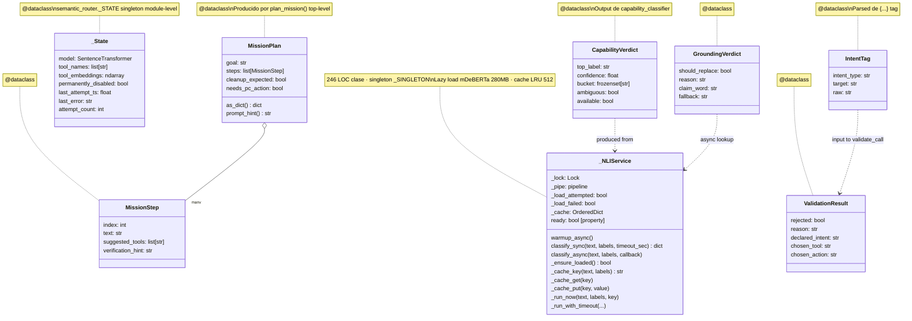

# 03.05 — Routing & Validation (clases UML)

> **Container:** Routing + Validation.
> **Archivos:** `planner.py`, `semantic_router.py`, `capability_classifier.py`,
> `nli_service.py`, `intent_validator.py`, `grounding_gate.py`.

## Fig 3.05 — Routing classes

## Funciones top-level (las APIs reales del subsistema)

| Función | Archivo | LOC | Rol |
|---|---|--:|---|
| `plan_mission(content) → MissionPlan` | `planner.py` | ~15 | Extrae steps por regex |
| `select_tool_names(content, plan, safety_enabled, last_assistant_text) → list[str]` | `planner.py` | ~100 | El SELECTOR principal con keyword + continuation + fallback |
| `_suggest_tools(step)` | `planner.py` | **400+** | Buckets regex multilingüe ES/EN/PT/FR/IT |
| `_related_tools(name, text)` | `planner.py` | ~50 | Expansión por co-ocurrencia |
| `suggest_tools_semantic(query, k, min_score) → list[str]` | `semantic_router.py` | ~30 | top-k cosine |
| `embed(text) → ndarray` | `semantic_router.py` | ~30 | Embed cacheado |
| `warm_up()` / `reset_cache()` / `status()` | `semantic_router.py` | ~15 | Utilities |
| `classify_capability_{cached,sync,async}` + `augment_subset(user_input, current_subset, timeout)` | `capability_classifier.py` | ~80 | API pública |
| `_build_verdict(scores)` / `_apply_verdict(subset, verdict, telemetry)` | `capability_classifier.py` | ~30 | Helpers |
| `get_nli_service() → _NLIService` | `nli_service.py` | 2 | Singleton accessor |
| `needs_intent_tag(selected_tool_names) → bool` | `intent_validator.py` | ~5 | Check pares ambiguos |
| `extract_intent_tag(content) → IntentTag|None` | `intent_validator.py` | ~15 | Parse |
| `validate_call(intent, tool, args) → ValidationResult` | `intent_validator.py` | ~20 | Reject vs CROSS_REJECT_PAIRS |
| `corrective_message(result) → str` | `intent_validator.py` | ~5 | Hint para retry |
| `detect_action_claim_without_evidence(reply, tool_events) → GroundingVerdict` | `grounding_gate.py` | ~50 | Inline (no NLI) check |
| `schedule_grounding_check(reply, tool_events, turn_id, ...)` | `grounding_gate.py` | ~50 | Async NLI → flag_grounding |
| `detect_reply_language(reply) → str` | `grounding_gate.py` | ~20 | Lang guess para fallback |
| `format_fallback(reason, lang, missing, hints) → str` | `grounding_gate.py` | ~20 | Template multilingüe |
| `ml_imports()` context manager | `_ml_import_lock.py` | ~30 | Serializa imports ML |

## Veredictos

| Clase | LOC | Marca | Veredicto |
|---|--:|---|---|
| `MissionStep`, `MissionPlan` | <80 combined | — | mantener. |
| `_State` | <30 | `[1-USER]` (singleton module-level) | considerar inline el dataclass como atributos del módulo. |
| `CapabilityVerdict` | <30 | — | mantener. |
| `_NLIService` | 246 | 11 métodos | mantener (singleton compartido). **Cache LRU manual = candidato a `functools.lru_cache`.** |
| `IntentTag`, `ValidationResult`, `GroundingVerdict` | <30 each | — | mantener. Estructuras de respuesta limpias. |

## Hallazgos a `_findings_seed.md`

- **`_suggest_tools` 400+ LOC de regex multilingüe** — ya en findings (HIGH).
- **`_State` (semantic_router) dataclass singleton 1-user** — el dataclass agrega indirección sobre lo que pueden ser variables módulo. LOW.
- **Cache LRU manual en `_NLIService`** — `functools.lru_cache`. LOW.
- **`grounding_gate.format_fallback` con 6 idiomas × 4 templates** — ya en findings (HIGH).
- **`_ml_import_lock` 49 LOC para un solo bug histórico** — Fase 8 verificar si bug está fixed upstream.
