# 03.10 — State + Config (clases UML)

> **Containers:** State + Sessions/Routines + Config/Profiles.
> **Archivos:** `state.py`, `sessions.py`, `config.py`, `profiles.py`, `profile_watcher.py`.

## Fig 3.10 — State + Sessions + Config + Profiles classes

```mermaid
classDiagram
    class AgentState {
        path: Path
        _lock: RLock
        register_resource(kind, label, cleanup_tool, cleanup_args, metadata) dict
        list_resources(include_closed) dict
        cleanup_plan(resource_id) dict
        update_resource(resource_id, metadata_patch, cleanup_args_patch, status, label) dict
        update_resource_metadata(resource_id, patch, append_lists, max_append) dict
        mark_cleaned(resource_id, result) dict
        checkpoint(label, rollback, metadata) dict
        list_checkpoints() dict
        rollback_plan(checkpoint_id) dict
        note(text, metadata) dict
        create_confirmation(tool, args, reason, risk) dict
        list_confirmations(include_resolved) dict
        get_confirmation(confirmation_id) dict
        resolve_confirmation(confirmation_id, status, result) dict
        _load() dict
        _save(data)
    }
    note for AgentState "@dataclass · 227 LOC · 17 métodos [GOD]\n4 sub-stores: resources / checkpoints / notes / confirmations\nupdate_resource + update_resource_metadata APIs casi idénticas"

    class SessionTurn {
        role: str
        content: str
        ts: str
        tool_count: int
    }
    note for SessionTurn "@dataclass"

    class Session {
        id: str
        created_at: str
        updated_at: str
        title: str
        turns: list[SessionTurn]
        new(title) Session [classmethod]
        to_dict() dict
        from_dict(data) Session [classmethod]
    }
    note for Session "@dataclass\nUna sesión persistente"

    class SessionStore {
        root: Path
        _lock: RLock
        _path(session_id) Path
        save(session) dict
        load(session_id) Session|None
        delete(session_id) dict
        list_sessions(limit) list[dict]
    }
    note for SessionStore "118 LOC clase · 5 métodos\nReusa state.atomic_write_json"

    class AgentConfig {
        server_url: str
        model: str
        llama_server_exe: Path
        model_path: Path
        mmproj_path: Path
        temperature: float
        top_p: float
        top_k: int
        min_p: float|None
        repeat_penalty: float
        seed: int
        max_tokens: int
        context_size: int
        request_timeout_s: float
        max_agent_turns: int
        parse_tool_calls: bool
        parallel_tool_calls: bool
        enable_thinking: bool
        reasoning_format: str
        agent_mode: str
        enable_tracing: bool
        enable_safety: bool
        memory_path: Path
        captures_dir: Path
        trace_path: Path
        state_path: Path
        chat_url: str [property]
        health_url: str [property]
        from_env() AgentConfig [classmethod]
    }
    note for AgentConfig "@dataclass(frozen=True) · 141 LOC archivo\n23 fields · cls.from_env() llama _apply_persisted_profile_if_unset()"

    class Profile {
        name: str
        display_name: str
        context_size: int
        model_path: str|None
        vision_enabled: bool
        rerank_enabled: bool
        parallel_tools: bool
        fact_extraction: bool
        server_running: bool
        voice_enabled: bool
        description: str
        est_vram_mb: int
    }
    note for Profile "@dataclass(frozen=True)\n12 fields · 5 instancias hardcoded en PROFILES"

    class WatcherConfig {
        enabled: bool
        downgrade_to: str
        restore_to: str
        game_watchlist: list[str]
        trigger_on_game: bool
        trigger_on_gpu: bool
        trigger_on_ram: bool
        trigger_on_vram: bool
    }
    note for WatcherConfig "@dataclass · config del watcher"

    class _Sample {
        has_game: bool
        gpu_pct: float|None
        ram_pct: float|None
        vram_pct: float|None
    }
    note for _Sample "@dataclass · sample por tick"

    class ProfileWatcher {
        _config: WatcherConfig
        _running: bool
        _thread: Thread
        _stop_event: Event
        _samples: deque
        _downgrade_since: float|None
        _upgrade_since: float|None
        _pre_downgrade_profile: str|None
        _pending_switch: tuple|None
        _switch_callback: Callable
        start()
        stop(timeout_s)
        is_running() bool
        apply_pending(force) bool
        _sample() _Sample
        _condition_active(sample) bool
        _condition_reason(sample) str
        _sustained(window_s, condition) bool
        _switch_to(name, reason)
        _tick()
        _queue_switch(name, reason)
        _run()
    }
    note for ProfileWatcher "260 LOC clase · 13 métodos\nDaemon thread con threading.Event.wait\nOpt-in (default OFF)"

    SessionStore o-- "many" Session : produces
    Session o-- "many" SessionTurn
    ProfileWatcher o-- WatcherConfig
    ProfileWatcher ..> _Sample : produces per tick
    ProfileWatcher ..> Profile : set_active_profile by name
    AgentConfig ..> Profile : _apply_persisted_profile_if_unset
```

## Veredictos

| Clase | LOC | Métodos | Marca | Veredicto |
|---|--:|--:|---|---|
| `AgentState` | 227 | 17 | `[GOD]` | **split por sub-store**: `ResourceStore` + `CheckpointStore` + `NotesStore` + `ConfirmationStore`. Y/o **colapsar `update_resource` + `update_resource_metadata`** (APIs casi idénticas). |
| `SessionTurn`, `Session` | <50 each | dataclass + 3 helpers | — | mantener. |
| `SessionStore` | 118 | 5 | — | mantener. |
| `AgentConfig` | <100 | dataclass + 2 properties + from_env | — (límite) | mantener. 23 fields es mucho pero corresponden a env vars reales. |
| `Profile` | <50 | dataclass | — | mantener. |
| `WatcherConfig`, `_Sample` | <30 each | dataclass | — | mantener. |
| `ProfileWatcher` | 260 | 13 | — (límite) | mantener pero **verificar uso real en Fase 8** (opt-in con default OFF). |

## Hallazgos a `_findings_seed.md`

- **`AgentState` 17 métodos + 4 sub-stores en una sola clase** — ya en findings (HIGH).
- **`update_resource` ≡ `update_resource_metadata` APIs casi idénticas** — ya en findings (MED).
- **`AgentConfig.from_env` side-effect oculto (`_apply_persisted_profile_if_unset` aplica env vars al construir)** — ya en findings (HIGH).
- **`ProfileWatcher` opt-in default OFF** — ya en findings (MED). Si nadie lo activa, 398 LOC dormidos.
- **`Profile` 12 fields, 5 instancias hardcoded** — ya documentado en `state_config.md` Fase 2.
