# 03.07 — Tools (clases UML)

> **Container:** Tools.
> **Archivos:** `tools.py`, `domain_tools.py` (0 clases), `ops_tools.py`
> (0 clases salvo CustomFormatter), `safety.py`, `_ps.py`.

## Fig 3.07 — Tools classes

```mermaid
classDiagram
    class AppCandidate {
        name: str
        display_name: str
        path: str
        kind: str
        score: float
        steam_appid: int|None
        as_dict() dict
    }
    note for AppCandidate "@dataclass(frozen=True)"

    class AppResolver {
        _sources: dict[str, list[AppCandidate]]
        _last_refresh: dict[str, float]
        find(query, limit, refresh, deep_fallback) list[AppCandidate]
        find_steam_library(query, limit) list[AppCandidate]
        open(candidate) dict
        _load_source(source_name, loader)
        _rank(query, candidates, limit) list[AppCandidate]
        _from_path() list[AppCandidate]
        _from_shortcuts() list[AppCandidate]
        _from_start_apps() list[AppCandidate]
        _from_uninstall_registry() list[AppCandidate]
        _launch_from_registry_item(item) str|None
        _from_common_exe_roots(query, max_matches) list[AppCandidate]
        _from_steam() list[AppCandidate]
        _from_steam_appinfo_cache(query, max_matches) list[AppCandidate]
        _steam_library_roots() list[Path]
        _from_epic() list[AppCandidate]
    }
    note for AppResolver "364 LOC · 16 métodos · [GOD]\n9 fuentes de apps (path/shortcuts/start_apps/uninstall_reg/common_exe/2xSteam/Epic)"

    class _SSRFGuardRedirectHandler {
        redirect_request(req, fp, code, msg, headers, newurl)
    }
    note for _SSRFGuardRedirectHandler "subclass urllib.HTTPRedirectHandler\nUsado por web_read/download para bloquear SSRF\n[1-USER] dentro de tools.py — vive lejos de su uso"

    class ToolRegistry {
        memory: MemoryStore
        captures_dir: Path
        state: AgentState
        knowledge: KnowledgeStore
        safety_enabled: bool
        apps: AppResolver
        _impls: dict[str, ToolFn]
        parent_agent: Gemma4Agent
        execute(name, args) dict
        execute_routine_step(name, args, confirmed_at_create) dict
        schemas() list[dict]
        schema_names() list[str]
        schemas_for_names(names) list[dict]
        t_system, t_audio, t_app, t_steam, t_window, t_gui, t_vision, t_browser, t_web, t_uia, t_filesystem, t_package, t_clipboard, t_terminal, t_memory, t_verify, t_skill_load, t_state, t_input, t_env, t_registry, t_download, t_email, t_reminder, t_browser_real, t_knowledge, t_office, t_audio_device, t_notification, t_routine, t_media, t_source_manager, t_dependency, t_contacts, t_whatsapp, t_notes_tasks, t_local_calendar, t_habit_tracker, t_local_search, t_printer_scanner, t_desktop_layout, t_backup_sync, t_document, t_developer, t_device_settings, t_game_launcher, t_media_edit, t_maintenance, t_watcher, t_job_manager, t_network, t_data_analysis, t_fact_check, t_photo_library, t_container, t_database, t_creative_local, t_form_filler, t_peripheral, t_accessibility, t_study, t_smart_home, t_subagent, t_safety, t_session [62 wrappers compound]
        system_time, list_processes, list_windows, app_search, app_open, app_close, filesystem_list, filesystem_read, filesystem_write, filesystem_search, filesystem_delete, filesystem_copy, filesystem_move, filesystem_rename, filesystem_mkdir, filesystem_diff, filesystem_archive, filesystem_unarchive, filesystem_open, web_open_url, web_search, web_read, web_research, terminal_run, clipboard_read, clipboard_write, gui_screenshot, gui_click, gui_multi_click, gui_scroll, gui_drag, gui_wait_for, gui_type, gui_keypress, uia_tree, uia_find, uia_click, uia_focus, uia_set_value, verify_app_opened, verify_file_exists, verify_window_exists, verify_clipboard_contains, memory_save, memory_recall, memory_list, memory_delete [legacy flat tools]
        system_cpu_ram_gpu, system_disk, system_battery, system_brightness_get, system_brightness_set, audio_get_volume, audio_set_volume, audio_mute, audio_devices, audio_set_default, audio_media_control, window_active, window_control, window_move_resize, browser_youtube_play, _youtube_play_target, steam_store_page [helpers internos]
        _prune_stale_browser_sessions()
        _audio_endpoint_volume()
        _backup_path_for(path)
        _checkpoint_existing_path(label, path)
        _match_query(query, target) bool
        _hard_gate(state, tool, action, args, reason, risk)
        _uia_run(args, action)
    }
    note for ToolRegistry "3157 LOC clase · ~140 métodos [GOD MÁXIMO]\n_impls dict 86 entries (62 compound + 24 legacy plain)"

    ToolRegistry o-- AppResolver : self.apps
    ToolRegistry o-- MemoryStore : self.memory
    ToolRegistry o-- KnowledgeStore : self.knowledge
    ToolRegistry o-- AgentState : self.state
    ToolRegistry ..> Gemma4Agent : self.parent_agent (back-ref for subagent)
    ToolRegistry ..> _SSRFGuardRedirectHandler : usado por web_read
    AppResolver o-- AppCandidate : produces
```

## Funciones top-level críticas (no clases pero importantes)

| Función | Archivo | Rol |
|---|---|---|
| `_normalize_tool_result(name, args, result)` | `tools.py` | Normaliza ok/status/verified/evidence |
| `_coerce_and_validate_tool_args(name, args)` | `tools.py` | Coerce types + validate vs schema |
| `_PRE_VALIDATORS: dict[str, Callable]` | `tools.py` | Pre-call validators (no decorator pattern) |
| `_redact_sensitive(args)` | `tools.py` | Mask secrets — **DUP de `domain_tools._redact_credentials`** |
| `_parameters_for_tool(name)` | `tools.py` | Lookup schema |
| `_hard_gate(state, tool, action, args, reason, risk)` | `tools.py` (Y `domain_tools.py`) | Gate duro pre-tool — **DUP confesada** |
| `COMPOUND_TOOL_SCHEMAS: list[dict]` (línea 4 645) | `tools.py` | Lista de ~62 schemas para el LLM |
| `classify_tool_call(name, args) → ClassificationResult` | `safety.py` | low/med/high + requires_confirmation |
| `parse_ps_json(text) → Any` | `_ps.py` | Parse PowerShell ConvertTo-Json |
| `ps_safe_literal(value) → str` | `_ps.py` | Escape para PowerShell strings |
| Regex validators (`RX_*`, `is_ipv4`, `is_ipv6`) | `_ps.py` | Input validators |
| 33 funciones `<name>_tool(state, args)` | `domain_tools.py` | Handlers compuestos |
| 10 funciones (`browser_real_tool`, `download_tool`, etc) | `ops_tools.py` | Handlers ops |
| 314 helpers privados | `domain_tools.py` | Implementaciones |

## Veredictos

| Clase | LOC | Métodos | Marca | Veredicto |
|---|--:|--:|---|---|
| `AppCandidate` | <30 | dataclass + 1 | — | mantener. |
| `AppResolver` | 364 | 16 | `[GOD]` (>15) | **split o reducir**: 9 sources con verdadero overlap. Probablemente 3-4 fuentes alcanzan. Cada `_from_X` es 20-80 LOC. |
| `_SSRFGuardRedirectHandler` | ~30 | 1 | `[1-USER]` | mover a `ops_tools.py` (donde se usa) o inline. |
| `ToolRegistry` | **3 157** | **~140** | `[GOD MÁXIMO]` | **el #1 candidato a split del repo.** Múltiples ejes: (a) extraer `_impls` registration a una clase aparte, (b) mover los 50 wrappers t_X a delegación auto-generada, (c) separar `execute` + `execute_routine_step` pipeline a su propia clase. **Pero hacerlo sin tests sólidos es muy arriesgado.** Recomendación: empezar por extraer los wrappers y borrar las legacy plain tools no usadas. |

## Hallazgos a `_findings_seed.md`

- **`ToolRegistry` 3 157 LOC, ~140 métodos** — el peor god-class. Ya en findings (CRITICAL).
- **`AppResolver` 16 métodos, 9 sources** — ya en findings (HIGH).
- **`_SSRFGuardRedirectHandler` 1-user en tools.py, debería estar en ops_tools.py** — LOW.
- **50+ wrappers `t_*` de 1 línea** — ya en findings (HIGH).
- **`_redact_sensitive` vs `_redact_credentials` DUP** — ya en findings (HIGH).
- **`_hard_gate` x2 DUP** — ya en findings (HIGH).
- **`_PRE_VALIDATORS` dict inconsistente con `@register_verifier` decorator** — ya en findings (MED).
