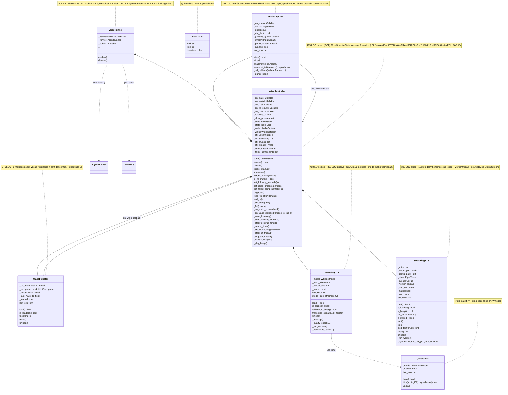

# 03.02 — Voice Loop (clases UML)

> **Container:** Voice Loop.
> **Archivos:** `voice/audio_io.py`, `voice/wake.py`, `voice/stt.py`,
> `voice/tts.py`, `voice/controller.py`, `voice_runner.py`.

## Fig 3.02 — Voice Loop classes

## Veredictos

| Clase | LOC | Métodos | Marca | Veredicto |
|---|--:|--:|---|---|
| `AudioCapture` | 245 | 6 | — | mantener. Patrón PortAudio + pump-thread correcto. |
| `WakeDetector` | 346 | 5 | — | mantener. Vocab restringido + confidence + debounce justifican el tamaño. |
| `_SileroVAD` | ~70 | 3 | `[1-USER]` (solo `StreamingSTT`) | considerar inline en `StreamingSTT` — solo se usa ahí. |
| `STTEvent` | <20 | dataclass | — | mantener. |
| `StreamingSTT` | 488 | 11 | `[GOD]` (>300 LOC) | revisar: el quality_check + bag-of-hallucinations + modo dual + warmup pueden ir a un módulo `voice/whisper_quality.py` aparte. |
| `StreamingTTS` | 302 | 12 | — (límite) | mantener pero verificar que las 3 voces hardcoded se usan (Fase 8). |
| `VoiceController` | 495 | 27 | `[GOD]` (>15 métodos) | **split candidato**: state-machine + callback dispatch + lifecycle (enable/disable/shutdown) + timer management (`_start_listening_timeout`, `_start_followup_timer`). Probablemente 2 clases: `VoiceStateMachine` + `VoiceController`. |
| `VoiceRunner` | 204 | ~7 | — | revisar: bridge de 425 LOC suena alto para "BUS + ducking". Verificar features. |

## Hallazgos a `_findings_seed.md`

- **`VoiceController` 27 métodos.** Severity MED. State-machine + timers + lifecycle + TTS bridge mezclados.
- **`_SileroVAD` 1-user.** Severity LOW. Inline en `StreamingSTT`.
- **`StreamingSTT` 488 LOC.** Severity LOW. Considerar split de `_quality_check` + bag-of-hallucinations a archivo aparte.
- **`StreamingTTS` 3 voces Piper hardcoded, 1 default** — verificar Fase 7 que las otras 2 se usan.
