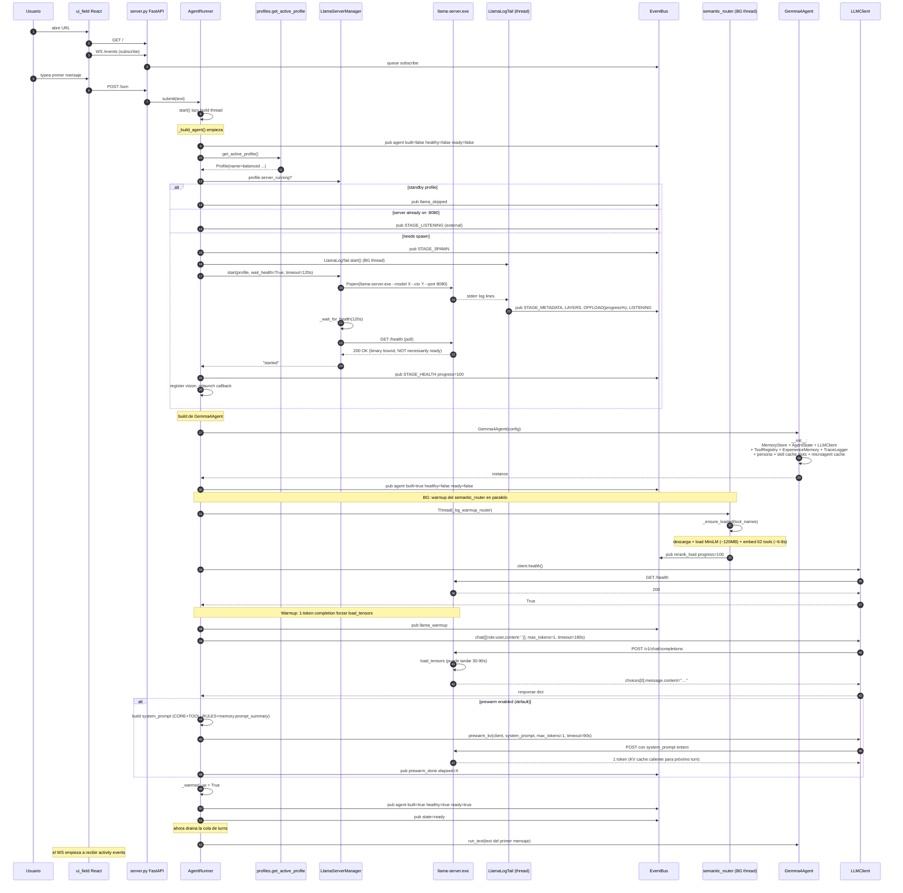

# 04.01 — Cold boot del agente

> Cuándo: primera invocación de `AgentRunner.submit()` (UI Field) o
> `python -m gemma4_agent.ui` (UI Desktop) o `python -m gemma4_agent.chat`.
> **Fuente:** `agent_runner.py:155-413` + `ui/main_window.py:81-183` + `chat.py`.
> Caso peor medido: 30-90 segundos (dominado por `load_tensors` del llama-server).

## Fig 4.01 — Boot completo (UI Field path)

## Lo que pasa en `ui/main_window.py` (versión PyQt) es MUY parecido

`ServerBootWorker.run` (`ui/main_window.py:81-183`) hace **la misma secuencia**
con `pyqtSignal` en lugar de BUS. Mismo orden, mismas etapas, distinto
reporter. Ya documentado como duplicación en surfaces.md.

## Lo que pasa en `chat.py` es MUCHO MÁS SIMPLE

- Si pasás `--start-server`, llama a `LlamaServerManager.start` directo (sin tail).
- Construye `Gemma4Agent(config)` síncrono.
- No hay warmup, no hay prewarm, no hay router pre-load. El primer turn pagará.
- Spinner ANSI corre en main thread.

## Hallazgos a `_findings_seed.md`

- **`_autostart_llama_server` (agent_runner) ≡ `ServerBootWorker.run` (PyQt)** — ya en findings.
- **`_build_agent` en `agent_runner.py` mete 7 fases serializadas + 1 paralela en un solo método de 150+ LOC** (HIGH). Posible refactor: extraer cada fase a un método dedicado para que sea testeable.
- **Warmup con `messages=[{role:user,content:'.'}]`** — el "." como input neutro funciona pero es frágil. Si Gemma cambia su interpretación de tokens cortos, se rompe silenciosamente. Considerar warmup explícito con sentinel.
- **Prewarm corre con `max_tokens=1` pero pasa el system_prompt entero** (~46 KB para 62 tools). Esto carga el KV cache pero el server tiene que parsear tools y schemas — eso ya estaba documentado, OK.
- **Si profile=standby**, el agente queda construido pero NO ready (`llama_skipped`). Las superficies tienen que entender ese estado intermedio. ¿Lo testea alguien? Verificar en Fase 7.
