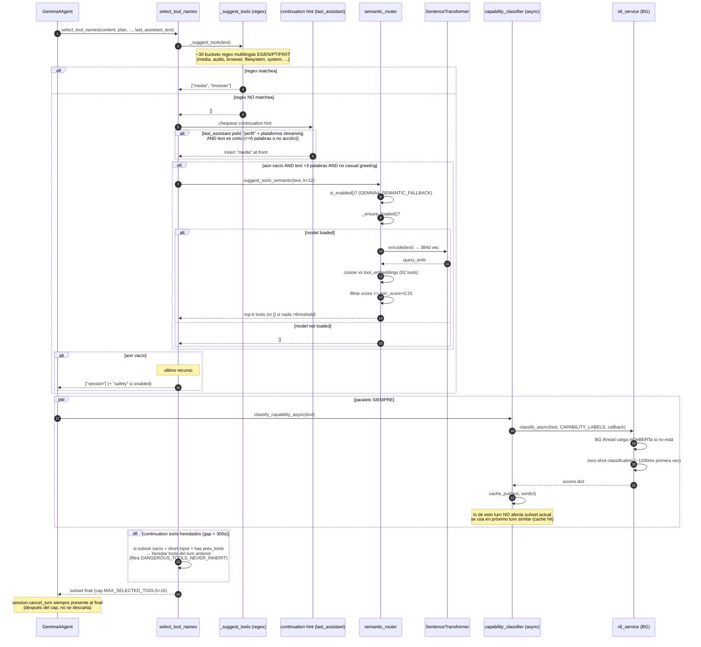

# 04.05 — Router fallback: regex no encuentra tool

> Cuándo: el usuario pide algo cuyo vocabulario no está en los buckets regex
> multilingües de `planner._suggest_tools`.
> **Fuente:** `planner.py:select_tool_names` + `semantic_router.suggest_tools_semantic` + `capability_classifier.augment_subset`.

## Cadena de fallbacks (4 niveles + último recurso)

## Negative anchor: drop "email" en caso ambiguo

`planner.py:160-163` tiene un caso especial: si el subset contiene `email` AND
el texto menciona "perfil/profile" pero NO menciona keywords de correo
(`mail|email|correo|courriel|posta|messaggio`), **se descarta email** porque
el semantic fallback a veces lo trae erróneamente por similitud léxica.

Es un parche reactivo a un bug observado.

## Hallazgos a `_findings_seed.md`

- **4 niveles de fallback + último recurso + paralelo NLI** = mucha lógica para una decisión que regresa "qué tools van al prompt".
- **`_suggest_tools` regex multilingüe ya marcada como HIGH** — esto reafirma. Las 30 buckets regex son la "primera línea". Si fallan, hay 3 capas más detrás que pagan latencia (especialmente NLI primera vez).
- **`semantic_router.min_score=0.25` hardcoded.** Si los embeddings cambian (modelo distinto, deps nuevas), el threshold puede ser óptimo o no.
- **`capability_classifier` lo único que hace en este turn es "cachear para el próximo"**. Para que aporte valor, el mismo input (o muy similar) tiene que repetirse. ¿Pasa eso seguido en producción? Verificar telemetry del cache hit rate (si Telemetry está activado).
- **Negative anchor "email + perfil sin mail keywords → drop email"** es un parche puntual. Si se acumulan más parches así, vale generalizar a un mecanismo de "anti-patterns" declarativo.
- **`MAX_SELECTED_TOOLS=16` cap + session siempre al final** — diseño defensivo OK.
