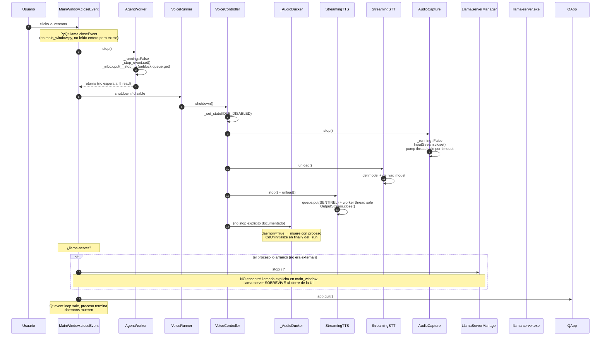

# 04.06 — Shutdown / cleanup

> Cuándo: usuario hace Ctrl+C (CLI), cierra la ventana (UI), o el proceso
> recibe SIGTERM.
> **Fuente:** dispersa — cada subsistema tiene su `stop()/uninstall()`.
> **TL;DR:** NO HAY ORQUESTADOR DE SHUTDOWN. Cada superficie lo hace
> diferente; el ProfileWatcher y los `_inbox` de los runners viven en daemon
> threads que mueren con el proceso (perdiendo work in flight).

## Fig 4.06 — Shutdown del UI Desktop (PyQt)



## Fig 4.07 — Shutdown del UI Field (FastAPI)

```mermaid
sequenceDiagram
    autonumber
    participant U as Usuario
    participant Uv as uvicorn server
    participant SR as server.py shutdown handler
    participant AR as AgentRunner
    participant LSM as LlamaServerManager
    participant LP as llama-server.exe
    participant LR as LogRecorder
    participant BUS as EventBus

    U->>Uv: Ctrl+C
    Uv->>SR: shutdown event (FastAPI lifespan)
    alt si hay shutdown handler
        SR->>AR: RUNNER.stop()
        AR->>AR: _running=False<br/>_stop_event.set()<br/>_inbox.put(_TurnRequest(text=__stop__))
        AR->>LSM: ? (no encontré stop explícito)
    else (default uvicorn)
        Note over Uv,SR: uvicorn corta el event loop;<br/>daemons mueren
    end

    Note over LR: LogRecorder NO se uninstall explícitamente<br/>su _close_handles corre solo si install/uninstall ciclo
    Note over BUS: BUS subscribers (WS) cuelgan en queue.get<br/>el server cierra el socket → connection closed
    Note over LP: llama-server.exe sobrevive si nadie llamó .stop()
```

## Fig 4.08 — Lo que SÍ hace cleanup correctamente

Procesos hijos con `atexit`/finally:

| Componente | Cleanup garantizado | Cómo |
|---|---|---|
| `_AudioDucker` worker | sí | finally en `_run` hace `pythoncom.CoUninitialize()` |
| `AudioCapture._sd_stream` | sí (si stop() se llama) | `InputStream.close()` en `stop()` |
| `LlamaServerManager.stop` | sí (si se invoca) | `Popen.terminate()` con timeout, después `kill()` |
| File handles `LogRecorder` | parcial | `_close_handles` en `_switch_to` y `uninstall`, **NO en exit** |
| SQLite connections (`ExperienceMemory`, `KnowledgeStore`, `TelemetryStore`) | parcial | `close()` existe pero **no se llama en shutdown** |
| ProfileWatcher daemon | no | daemon=True, **muere abrupto** sin flush |
| AgentRunner inbox | sentinel pero no drain | si hay turns en cola, **se pierden** |

## Lo que está BIEN en el código actual

- Todos los workers usan `threading.Event.wait` con timeout (no `time.sleep`), así pueden ser interrumpidos.
- `_inbox.put("__stop__")` como sentinel es patrón correcto para unblockear queue.get.
- `daemon=True` en TODOS los threads garantiza que el proceso pueda terminar (no quedan threads zombies).

## Lo que está MAL o FALTA

1. **No hay un `shutdown()` global** que recorra los singletons en orden (`RUNNER`, `RECORDER`, `TELEMETRY`, `BUS`, `VoiceRunner`, `LlamaServerManager`).
2. **`llama-server.exe` sobrevive al cierre del UI** si el usuario no lo paró explícitamente vía launcher (port queda ocupado, próximo arranque detecta "external server").
3. **`LogRecorder` no se uninstall en exit** → último flush del buffer no garantizado.
4. **SQLite connections nunca se cierran** en shutdown → en Linux/macOS WAL+shm files quedan; en Windows el handle del archivo queda en `data/`.
5. **AgentRunner `_inbox` puede tener turns pendientes** al sentinel, que se pierden.
6. **`ProfileWatcher` daemon thread se mata abrupto** si está activo (cualquier `set_active_profile` en flight queda a mitad).

## Hallazgos a `_findings_seed.md`

- **No hay shutdown coordinado.** Severity MED. Crear un `gemma4_agent/shutdown.py` con `shutdown_all(timeout=10s)` que recorra `RUNNER.stop()`, `VOICE.disable()`, `RECORDER.uninstall()`, `TELEMETRY.disable()`, `LlamaServerManager.stop()` y join threads no-daemon. Las superficies (CLI, UI Desktop, UI Field) deberían llamarlo desde sus exit hooks.
- **`llama-server.exe` sobrevive al cierre de UI**. Severity MED. El usuario probablemente lo nota cuando ve "external server detected" en el próximo boot.
- **SQLite no se cierra en shutdown**. Severity LOW. WAL puede dejar `*.sqlite-wal` y `*.sqlite-shm` en disco; al próximo open, SQLite los unifica automáticamente — no es bug fatal pero es chusma.
- **Daemon threads que mueren sin flush** (LogRecorder, ProfileWatcher) — LOW. Si la sesión es corta, no se nota; si es larga con muchos eventos, se pierden los últimos N.
