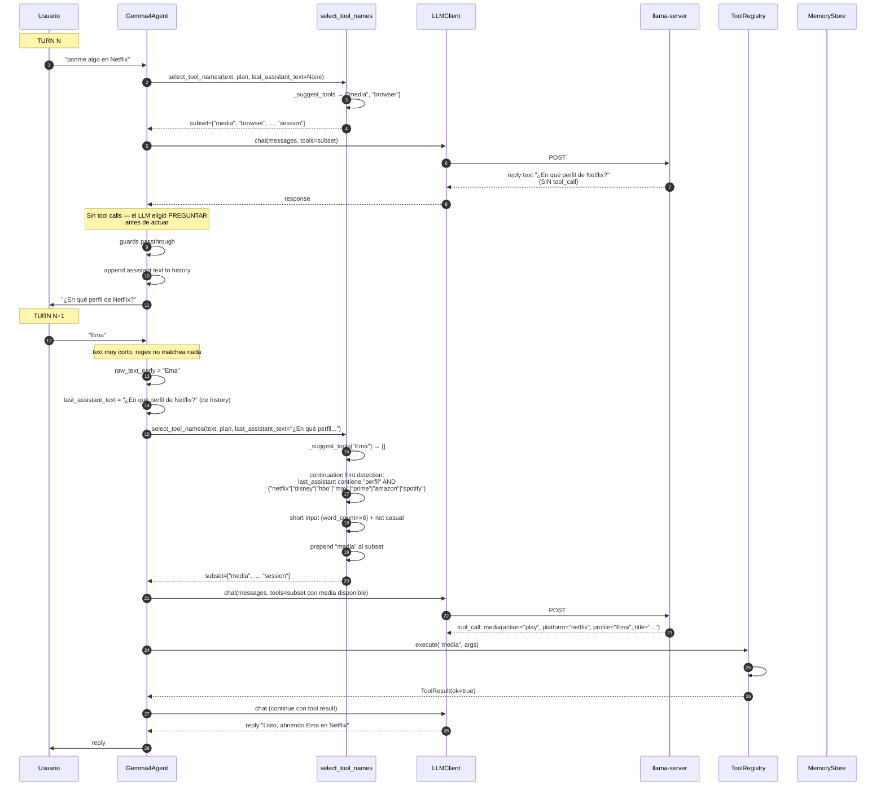
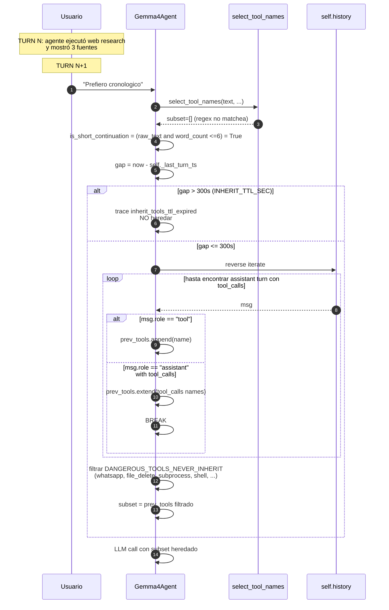

# 04.04 — Slot-filling cuando faltan parámetros

> Cuándo: el usuario pide algo que requiere un parámetro que NO está en el
> input, ej: "ponme algo en Netflix" (falta el perfil de Netflix).
> **Fuente:** `agent.py:1067-1086` (continuation hint en select_tool_names) +
> `planner.py:select_tool_names` + el LLM mismo (decide preguntar al user).

## Concepto clave

El proyecto **no implementa slot-filling explícito** (no hay máquina de
estados "missing slot → ask → fill"). El patrón real es:

1. El **LLM decide** preguntar al usuario cuando le falta info (vía CORE_PROMPT
   que le dice "ASK don't ASSUME").
2. El usuario responde con texto corto ("Ema", "el de Juan").
3. El **router detecta continuation** (`last_assistant_text` contiene "perfil"/
   "profile" + streaming brand) y **fuerza `media` en el subset** aunque el
   regex no matche por ser texto corto.
4. El **TTL `INHERIT_TTL_SEC=300s`** evita heredar tools peligrosos si el
   usuario volvió tras mucho tiempo.

## Fig 4.04 — Slot-filling con continuation hint

## Path alternativo: short continuation + INHERIT TOOLS

Cuando `select_tool_names` devuelve `[]` Y el input es ≤6 palabras y no es
saludo, el agente **hereda las tools del turn anterior** (`agent.py:1093-1186`):

## Hallazgos a `_findings_seed.md`

- **No hay slot-filling explícito** — todo se delega al LLM (que decide cuándo preguntar) + continuation hint (que mantiene la tool en subset). Funciona pero **es difícil de testear**: para cada caso "user pregunta X → agente pregunta Y → user responde Z" hay que reproducir el history completo.
- **Continuation hint con regex hardcoded para 7 plataformas de streaming**: `\b(netflix|disney|hbo|max|prime|amazon|spotify)\b` (`planner.py:114`). Cualquier plataforma nueva (Tidal, YouTube Music, Apple TV) no dispara el hint.
- **INHERIT_TTL_SEC y DANGEROUS_TOOLS_NEVER_INHERIT son knobs en `agent.py` top-level.** Ya en findings (LOW) — sugerencia: mover a `inherit_tools.py`.
- **Continuation hint heuristic "word_count <= 6"** es frágil. "Pongo Ema entonces" (3 palabras) cabe; "Quiero verlo con el perfil de Ema" (7) no. Tradeoff aceptable, pero anotar.
- **El `_phrase_fires` y `_recent_recalls` agregan complejidad ortogonal al slot-filling** — si una phrase-trigger routine matcheó, suprimimos `session` del subset; si experience.recall trajo un turn pasado relevante, lo inyectamos al system_prompt. Cada uno afecta lo que el LLM ve sin que sea "slot fill" estrictamente.
