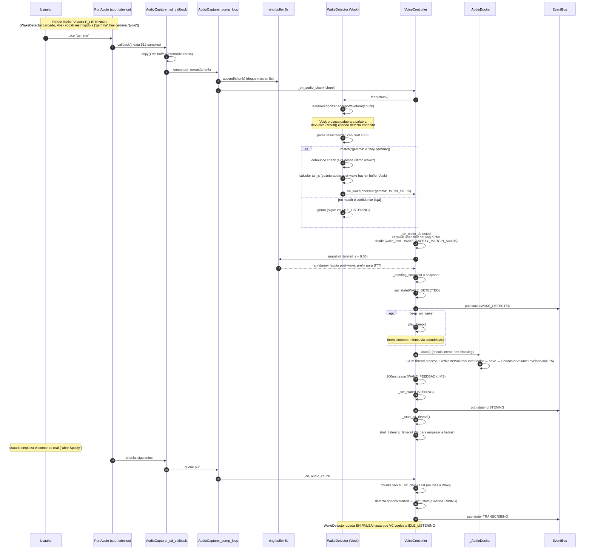

# 04.03 — Wake-word activation

> Cuándo: el usuario dice "gemma" o "hey gemma" estando en IDLE_LISTENING.
> **Fuente:** `voice/audio_io.py` + `voice/wake.py` + `voice/controller.py`.
> Latencia objetivo: < 300 ms desde "gemma" hasta beep + ducking + STT armado.

## Fig 4.03 — Wake activation

## Tuning crítico

| Parámetro | Default | Por qué |
|---|---|---|
| Vosk vocab restringido | `["gemma","hey gemma","[unk]"]` | acota falsos positivos (palabras foneticamente similares) |
| `WAKE_MIN_CONFIDENCE` | `0.85` | wakes reales >0.9, falsos positivos <0.7 |
| `WAKE_DEBOUNCE_S` | `2.0` | evita re-wake durante el comando |
| `WAKE_FEEDBACK_MS` | `200` | feedback visual antes de LISTENING |
| `WAKE_SAFETY_MARGIN_S` | `0.05` | Vosk tiene jitter ~50ms en word timestamps |
| `CHUNK_SAMPLES` | `512` (~32ms @ 16kHz) | EXACTO Silero VAD v5 requirement |
| `RING_BUFFER_SECONDS` | `5` | espacio para "rebobinar" pre-wake si fuera necesario |
| `LISTENING_TIMEOUT_S` | `5.0` | si no se empieza a hablar, vuelve a idle |

## Hallazgos a `_findings_seed.md`

- **Patrón "snapshot post-wake + prefix_audio al STT"** es la diferencia técnica clave que evita perder los primeros fonemas del comando ("abre" → "bre"). Bien implementado.
- **Ducking corre en COM thread separado para no glitchear el mic** — comentario del código lo justifica explícitamente. Diseño consciente.
- **Si el ring buffer se llena y nadie hace snapshot**, el deque drops oldest — el ring de 5s alcanza para wake + comando corto pero no para el caso "user habla largo antes de wake" (que no es el caso normal).
- **No hay test de "wake en idioma distinto del modelo"** — el modelo Vosk es `es-0.42`. Si el usuario dice "Gemma" con acento inglés (`/ˈdʒɛmə/`), Vosk ES puede no matchear. Verificar Fase 7.
