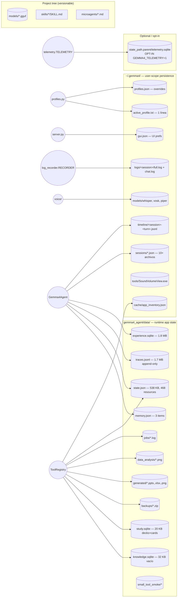
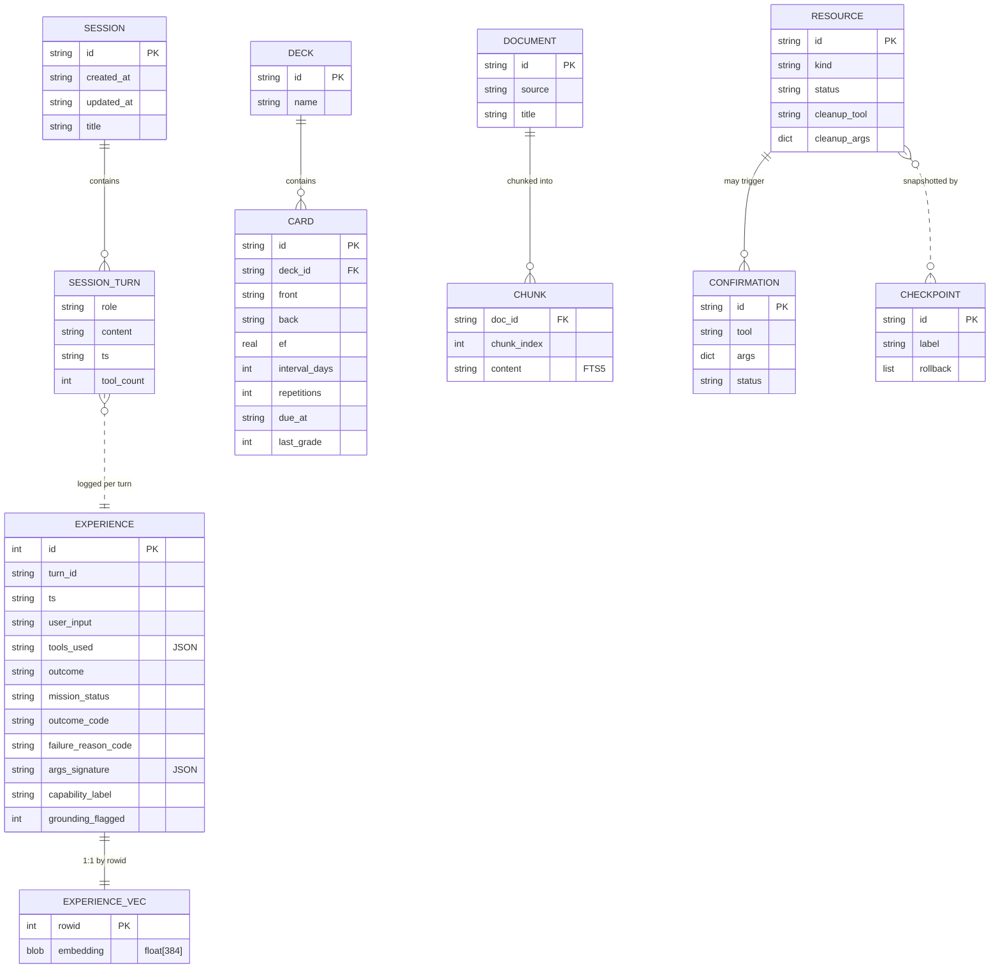

# Fase 5 — Diagrama de datos y estado

> Inventario de TODO lo que el agente persiste, dónde, en qué formato, con
> qué shape real. Verificado contra los archivos del usuario, no contra docs.

## 1. Mapa global



## 2. Inventario detallado

### 2.1 SQLite stores

| Store | Path | Tamaño actual | Backend | Tablas | Owner |
|---|---|--:|---|---|---|
| `experience.sqlite` | `data/experience.sqlite` | 1.8 MB | SQLite + `sqlite-vec` virtual | `experiences`, `experience_vec` (vec0 float[384]) | `experience.ExperienceMemory` |
| `knowledge.sqlite` | `data/knowledge.sqlite` | 32 KB (vacío) | SQLite + FTS5 virtual | `documents`, `chunks` (FTS5) | `knowledge.KnowledgeStore` |
| `study.sqlite` | `data/study.sqlite` | 20 KB | SQLite | `decks`, `cards` | `domain_tools.study_tool` (SM-2 spaced repetition) |
| `telemetry.sqlite` | `<state_path.parent>/telemetry.sqlite` | (no existe; OFF por default) | SQLite + WAL | `sessions`, `turns`, `voice`, `incidents` | `telemetry.TelemetryStore` |

#### Schemas reales (extraídos de las DBs):

**experiences** (`experience.sqlite`):
```sql
CREATE TABLE experiences (
    id INTEGER PRIMARY KEY AUTOINCREMENT,
    turn_id TEXT NOT NULL,
    ts TEXT NOT NULL,
    user_input TEXT NOT NULL,
    tools_used TEXT NOT NULL DEFAULT '[]',  -- JSON array
    outcome TEXT,
    mission_status TEXT,
    summary TEXT,
    -- columns añadidos por ALTER TABLE post-launch (provenance):
    outcome_code TEXT,
    failure_reason_code TEXT,
    args_signature TEXT,       -- JSON dict
    capability_label TEXT,
    grounding_flagged INTEGER DEFAULT 0
);
CREATE VIRTUAL TABLE experience_vec USING vec0(embedding float[384]);
```

**knowledge** (`knowledge.sqlite`):
```sql
CREATE TABLE documents (
    id TEXT PRIMARY KEY,         -- sha256(source+text)[:24]
    source TEXT NOT NULL,
    title TEXT,
    created_at TEXT NOT NULL,
    metadata TEXT DEFAULT '{}'   -- JSON
);
CREATE VIRTUAL TABLE chunks USING fts5(
    doc_id UNINDEXED,
    chunk_index UNINDEXED,
    source UNINDEXED,
    title UNINDEXED,
    content                     -- FTS5 indexed
);
```

**study** (`study.sqlite`):
```sql
CREATE TABLE decks (
    id TEXT PRIMARY KEY,
    name TEXT NOT NULL,
    created_at TEXT NOT NULL
);
CREATE TABLE cards (
    id TEXT PRIMARY KEY,
    deck_id TEXT NOT NULL,
    front TEXT NOT NULL,
    back TEXT NOT NULL,
    ef REAL NOT NULL DEFAULT 2.5,           -- SM-2 ease factor
    interval_days INTEGER NOT NULL DEFAULT 0,
    repetitions INTEGER NOT NULL DEFAULT 0,
    due_at TEXT NOT NULL,
    last_reviewed_at TEXT,
    last_grade INTEGER,
    created_at TEXT NOT NULL,
    FOREIGN KEY(deck_id) REFERENCES decks(id)
);
```

**telemetry** (`telemetry.sqlite`, NO existe en disco — opt-in):
- `sessions(id, ts, ts_ms, kind, profile, payload_json)`
- `turns(id, ts, ts_ms, ttft_ms, tokens_completion, tokens_prompt_total, tps, cache_n_reused, vram_peak_mb, tool_call_count, tool_call_errors, payload_json)`
- `voice(id, ts, ts_ms, kind, duration_ms, rtf, first_phoneme_ms, payload_json)`
- `incidents(id, ts, ts_ms, kind, severity, payload_json)`
- Índices por `ts_ms` en las 4 tablas. WAL+`synchronous=NORMAL`.

### 2.2 JSON stores

| Store | Path | Tamaño actual | Shape | Owner |
|---|---|--:|---|---|
| `memory.json` | `data/memory.json` | 439 B | `{"items": {key: {value, updated_at, source}}}` | `memory.MemoryStore` |
| `state.json` | `data/state.json` | **538 KB** | `{"resources": {...}, "checkpoints": {...}, "notes": [...], "confirmations": {...}}` | `state.AgentState` |
| `sessions/<id>.json` | `~/.gemma4/sessions/*.json` | 10+ files | `Session.to_dict()`: id, ts, title, turns[] | `sessions.SessionStore` |
| `active_profile.txt` | `~/.gemma4/active_profile.txt` | 11 B | 1 línea: `"performance"` | `profiles.set_active_profile` |
| `profiles.json` | `~/.gemma4/profiles.json` | 2 B (`{}`) | dict de overrides | `profiles.py` |
| `gui.json` | `~/.gemma4/gui.json` | 61 B | dict de UI prefs | `server.py PUT /settings` + `ui/app.py` |
| `cache/app_inventory.json` | `~/.gemma4/cache/` | (cached) | resultado de `AppResolver._from_*` | `AppResolver` (assumido) |

#### `state.json` real (datos del usuario actual)

Mi inspección de `data/state.json` actual:

```
{
  "resources": 468 entries,
  "checkpoints": 3,
  "notes": 1,
  "confirmations": 231
}

resource kinds breakdown:
  routine:               360   ← ¡360 routines!
  steam:                  36
  pending_action:         27
  browser_url:            14
  browser_real:            6
  app:                     6
  office_file:             3
  contact:                 2
  note:                    2
  task:                    2
  calendar_event:          2
  backup:                  2
  streaming_preference:    2
  source:                  1
  habit:                   1
  job:                     1
  watcher:                 1

status:
  closed: 392   ← se conserva en perpetuidad
  open:    76
```

### 2.3 Logs y trazas (append-only, no cap)

| Sink | Path | Tamaño actual | Formato | Lifecycle |
|---|---|--:|---|---|
| `tracing.TraceLogger` | `data/traces.jsonl` | **1.7 MB** | JSON-line por evento de turn | append-only, NUNCA rota |
| `log_recorder.RECORDER` (full) | `~/.gemma4/logs/<sid>/full.log` | per-session | JSON-line por evento del BUS | append-only, dir por sesión |
| `log_recorder.RECORDER` (chat) | `~/.gemma4/logs/<sid>/chat.log` | per-session | texto humano `[hh:mm:ss] SRC: msg` | append-only |
| `timeline.TimelineWriter` | `~/.gemma4/timeline/<sid>-turn<NNN>.jsonl` | per-turn | JSON-line (un archivo por turn) | append, **NO documentado en mi inventario inicial** |

#### Sample real de `traces.jsonl`:
```json
{"ts":"2026-05-12T03:35:54-0400","turn_id":"20260512_033554_1e248b89","kind":"request_start","mode":"fast_action","content":{"type":"text","chars":5,"preview":"holas"},"thinking":false,"parallel_tool_calls":false,"max_tokens":1280}
{"ts":"2026-05-12T03:35:56-0400","turn_id":"20260512_033554_1e248b89","kind":"llm_response","finish_reason":"stop","content_chars":34,"tool_call_count":0,"stripped_reasoning":false}
{"ts":"2026-05-12T03:35:56-0400","turn_id":"20260512_033554_1e248b89","kind":"final","content":"¡Hola! ¿En qué puedo ayudarte hoy?","tool_events":0}
```

### 2.4 Outputs del agente (no leídos por nadie del código)

| Sink | Path | Tamaño actual | Owner |
|---|---|--:|---|
| Backups ZIP | `data/backups/*.zip` | per-backup | `domain_tools.backup_sync_tool` |
| Documentos generados | `data/generated/*.pptx,.xlsx,.png` | per-output | `domain_tools.office_tool` |
| Plots data_analysis | `data/data_analysis/*.png` | per-output | `domain_tools.data_analysis_tool` |
| Job logs | `data/jobs/*.log` | per-job | `domain_tools.job_manager_tool` |
| Small tool smoke | `data/small_tool_smoke/*` | tiny | smoke testing |
| Capturas | `gemma4_agent/captures/` | per-capture | `multimodal.image_part` (cuando user adjunta imagen) |

### 2.5 Binarios externos descargados

| Binario | Path | Owner |
|---|---|---|
| `SoundVolumeView.exe` + `.chm` | `~/.gemma4/tools/` | `domain_tools.audio_device_tool` (descarga proactiva) |
| Vosk model | `~/.gemma4/models/vosk-model-small-es-0.42/` | `voice/wake.py` |
| Piper voices | `~/.gemma4/models/piper/*.onnx + .json` | `voice/tts.py` |
| Whisper model | `~/.gemma4/models/whisper/` | `voice/stt.py` |

## 3. Estado in-memory que se PIERDE al reiniciar

Todo lo que vive solo en memoria del proceso `python -m gemma4_agent.*`:

| Componente | Atributos in-memory perdidos | Costo de re-build |
|---|---|---|
| `Gemma4Agent` | `history`, `_recent_recalls`, `_phrase_fires`, `_cached_microagents`, `_cached_skills_menu`, `_cached_skills_critical`, `_explicit_plan_*`, `_turn_counter`, `_last_turn_ts`, `_persona` | history se pierde (caro: sin contexto conversacional); caches se reconstruyen lazy |
| `LLMClient` | KV cache del llama-server (vive en el subprocess, NO en cliente) | si server reinicia: 30-90s para load_tensors + KV |
| `semantic_router._STATE` | model + tool_embeddings (~120 MB) | 6-8s eager load |
| `nli_service._SINGLETON` | pipeline mDeBERTa (~280 MB) + cache LRU 512 | ~14s primera vez |
| `knowledge._RERANK_STATE` | CrossEncoder (~80 MB) | lazy |
| `experience` no in-memory (todo SQLite) | — | — |
| `capability_classifier._cache` | LRU 256 | reset, próximo turn rehidrata via NLI |
| `EventBus._subscribers`, `_listeners` | reset | nuevas conexiones se re-suscriben |
| `LlamaServerManager._proc` | subprocess handle (subprocess SOBREVIVE pero queda huérfano) | "external server detected" en próximo boot |
| `AudioCapture._ring`, `_pending_queue` | reset | irrelevante |
| `VoiceController._state` | reset a IDLE_DISABLED | OK |
| `state.AgentState` no in-memory (file-backed) | — | — |
| `MemoryStore` no in-memory (file-backed) | — | — |

## 4. ER diagram (informal)



## 5. Hallazgos críticos

| Sev | Hallazgo | Notas |
|---|---|---|
| **HIGH** | **`state.json` 538 KB con 468 resources** (392 `closed`). `state.AgentState.mark_cleaned` marca `status="closed"` pero **nunca borra**. Lecturas/escrituras releen y reserializan los 538 KB cada vez. Caro y crece monótonamente. | `state.py:_load`/`_save` reserializa entero. |
| **HIGH** | **`state.json` tiene 360 routines persistidas** — muy probable que muchas sean "test" / "duplicadas" / "viejas". Si el usuario realmente las usa, el menú de skills/routines va a ser ilegible. Si no, son zombis. Necesita una `routine prune` tool. | |
| **HIGH** | **`traces.jsonl` 1.7 MB sin rotación.** `TraceLogger` solo hace `append`; **no hay rotate ni cap**. Crece para siempre. Telemetry tiene `rotate(keep_days=30)` pero TraceLogger no. | `tracing.py` |
| **HIGH** | **`timeline/<session>-<turn>.jsonl`** es un cuarto sink que NO documenté en Fase 1/2 (no apareció en mi grep inicial). Per-turn-per-session, append-only, sin rotación. Suma a la duplicación de "tracks de qué pasó este turn" (ya había 3: trace+logs+telemetry). **Ahora son 4.** | `timeline.py:34` |
| **HIGH** | **`experience.sqlite` 1.8 MB ya con auto-prune (50 inserts) + max 5000 records + max 180 días.** Tiene housekeeping correcto. Pero las 5 columnas `ALTER TABLE` post-launch indican **schema drift** sin migration framework. | `experience.py:106-120` |
| **MED** | **`knowledge.sqlite` está vacío en disco.** El usuario actual no ha ingestado documentos. Verificar Fase 7 si `knowledge` se usa o es feature dormido. | |
| **MED** | **`pending_action` resources: 27 open.** Pueden ser confirmations pendientes que el user nunca aprobó/rechazó. Memory leak conceptual. | `state.json` |
| **MED** | **`gui.json` con shape arbitrario** (`{voiceClose, temperature}` actual). No hay schema, validation, ni versionado. Compatible con cualquier campo nuevo, pero si la UI cambia el contrato, el archivo viejo no se migra. | `server.py` PUT /settings |
| **MED** | **`profiles.json` (overrides)** es `{}` — nadie ha customizado profiles. Si el feature "user puede editar profiles via Settings" no se usa, las 200+ LOC de manejo de overrides son deuda. | `profiles.py` |
| **LOW** | **`~/.gemma4/cache/app_inventory.json`** indica que `AppResolver` cachea sus 9 fuentes a disco. Lo agrego al doc; en Fase 7 verifico TTL. | `AppResolver` |
| **LOW** | **`~/.gemma4/tools/SoundVolumeView.exe`** es un binario externo descargado proactivamente por el agente (con permiso del user vía `feedback_install_authorization`). Documentar. | `domain_tools.py:9858` |
| **LOW** | **`memory.json` con solo 3 items** — feature usada poco. Si el usuario nunca pide "guardame que mi nombre es Ema", MemoryStore es subutilizado vs ExperienceMemory. | |
| **LOW** | **`captures/` y `data/generated/` quedan en `gemma4_agent/` (dentro del package!)** — outputs en mismo dir que código. Si versionan el repo van a quedar en git status. Mover a `~/.gemma4/captures` y `~/.gemma4/generated`. | |
| **LOW** | **`backups/*.zip` sin cap ni TTL** — `backup_sync_tool` deja zips para siempre. | |
| **LOW** | **`jobs/*.log` sin cap ni TTL** — `job_manager_tool` deja logs para siempre. | |

## 6. Resumen de superficies de persistencia

- **6 SQLite stores potenciales** (experience, knowledge, study, telemetry, + sqlite-vec virtual + FTS5 virtual).
- **6 JSON stores** (memory, state, sessions/*, active_profile, profiles, gui).
- **4 sinks de logs/trazas** (traces.jsonl, full.log, chat.log, timeline/*-turn.jsonl) **— 4, no 3 como dije antes**.
- **5 dirs de outputs** (backups, generated, data_analysis, jobs, captures).
- **3 dirs de modelos ML** (vosk, whisper, piper).
- **1 dir de binarios externos** (~/.gemma4/tools).
- **1 dir de cache** (~/.gemma4/cache).

**Total: ~26 superficies de persistencia distintas.** Para auditar "qué dejó en disco el agente" hay que mirar en >10 carpetas.

## 7. Findings a `_findings_seed.md`

- **`state.json` no purga `closed` resources** (HIGH). 392/468 = 84 % son zombies.
- **`traces.jsonl` sin rotación** (HIGH). Telemetry sí, este no.
- **`timeline/` 4to sink** (HIGH). Es duplicación adicional sobre lo que ya hay (trace + log_recorder + telemetry).
- **Schema drift en experience.sqlite con `ALTER TABLE` ad-hoc** (HIGH). Sin migration framework.
- **27 `pending_action` zombi en state.json** (MED).
- **`gui.json` y `profiles.json` sin schema/version** (MED).
- **`captures/` y `data/generated/` adentro del package** (LOW). Mover a `~/.gemma4/`.
- **`backups`, `jobs` sin TTL** (LOW).
