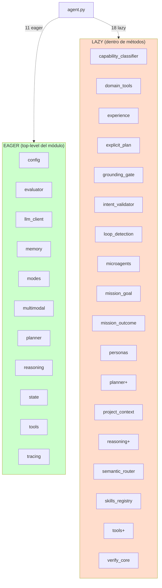

# Fase 6 — Grafo de dependencias internas

> Quién importa a quién dentro del paquete. **Genuino esta vez** — el scanner
> de Fase 0 perdía `from . import X` (sin sub-import) y `from gemma4_agent
> import X`; ahora ambos se capturan. Distingo **eager** (top-level del módulo,
> se ejecuta al import) vs **lazy** (dentro de función/método, se ejecuta
> on-demand).

## Métricas globales

| Métrica | Valor |
|---|--:|
| Nodes (módulos) | 135 |
| Edges totales | **327** (150 eager + 177 lazy) |
| Ratio lazy/eager | **1.18** — más imports lazy que eager |
| Ciclos de import | **0** |
| Módulos no importados por nadie | 8 (todos entry points conocidos) |

**Lectura honesta del ratio lazy:eager:** que el ratio sea ~1.2 es bandera
amarilla. Indica que el código defiere muchas dependencias a runtime para
evitar (a) ciclos, (b) carga eager pesada en boot, o (c) cuando el import
puede fallar (deps opcionales). Cada lazy hace el grafo estático mentiroso
y dificulta refactors automáticos.

## Top 15 god modules (más importados)

| In-degree | (e + l) | Módulo | Tipo |
|--:|---|---|---|
| 21 | (6e + 15l) | `agent` | god class core |
| 21 | (10e + 11l) | `config` | god module config |
| 20 | (10e + 10l) | `domain_tools` | god module tools (importado 9 menos veces lazy que `agent` pero similar magnitud) |
| 20 | (12e + 8l) | `state` | god module storage |
| 13 | (6e + 7l) | `tools` | god module tools |
| 12 | (11e + 1l) | `ui.theme` | god module UI (Color enum + helpers, casi todos eager) |
| 11 | (5e + 6l) | `events_bus` | bus pub/sub |
| 11 | (4e + 7l) | `profiles` | profiles |
| 9 | (4e + 5l) | `memory` | MemoryStore |
| 8 | (6e + 2l) | `planner` | router primario |
| 8 | (2e + 6l) | `llama_server` | LlamaServerManager |
| 7 | (3e + 4l) | `nli_service` | NLI singleton |
| 7 | (4e + 3l) | `ops_tools` | ops tools |
| 6 | (5e + 1l) | `verify_core` | verifier registry |
| 6 | (4e + 2l) | `reasoning` | sanitizers/heuristics |

**Observación:** los top 4 god modules (`agent`, `config`, `domain_tools`,
`state`) reciben **82 imports combinados** — son las dependencias estructurales
que todo el sistema toca. Tocar cualquiera de ellos requiere validar cascadas.

## Top 10 importers (módulos con más outgoing)

| Out-degree | (e + l) | Módulo | Comentario |
|--:|---|---|---|
| **43** | (0e + 43l) | `test_gx_features` | **el test gigante** (2 666 LOC) que importa todo el repo lazy desde funciones de test |
| **26** | (11e + 18l) | `agent` | confirmado como god orchestrator |
| **23** | (13e + 11l) | `ui.main_window` | confirmado como god UI |
| 16 | (4e + 13l) | `server` | FastAPI con 13 lazy imports — defensa de carga lenta |
| 9 | (7e + 2l) | `tools` | importa de `domain_tools`, `ops_tools`, etc |
| 9 | (2e + 7l) | `agent_runner` | bridge sync/async |
| 7 | (5e + 2l) | `launcher` | orquestador CLI |
| 7 | (7e + 0l) | `eval_smoke` | smoke test todos eager |
| 7 | (4e + 4l) | `chat` | REPL CLI |
| 6 | (1e + 5l) | `ui.settings` | settings dialog |

## Diagrama del grafo eager (sin lazy)

```mermaid
graph LR
    %% Top god modules
    config((config))
    state((state))
    agent((agent))
    tools((tools))
    domain_tools((domain_tools))
    events_bus((events_bus))
    memory((memory))
    profiles((profiles))
    llm_client((llm_client))

    %% Entry points
    chat[chat]
    launcher[launcher]
    server[server]
    agent_runner[agent_runner]
    mcp_server[mcp_server]
    voice_runner[voice_runner]

    %% Routing / mission
    planner((planner))
    semantic_router((semantic_router))
    capability_classifier((capability_classifier))
    nli_service((nli_service))
    intent_validator((intent_validator))
    grounding_gate((grounding_gate))
    mission_goal((mission_goal))
    mission_outcome((mission_outcome))
    verify_core((verify_core))

    %% Voice
    voice_controller((voice.controller))
    voice_stt((voice.stt))
    voice_tts((voice.tts))
    voice_wake((voice.wake))
    voice_audio_io((voice.audio_io))

    %% UI
    ui_main((ui.main_window))
    ui_settings((ui.settings))
    ui_theme((ui.theme))
    ui_app((ui.app))

    %% Edges principales (solo eager, top conexiones)
    chat --> agent
    chat --> config
    chat --> sessions((sessions))
    launcher --> config
    launcher --> llama_server((llama_server))
    launcher --> llm_client
    launcher --> profiles
    launcher --> tools
    server --> events_bus
    server --> llama_server
    server --> model_info((model_info))
    agent_runner --> events_bus
    agent_runner --> boot_progress((boot_progress))
    agent --> config
    agent --> llm_client
    agent --> memory
    agent --> modes((modes))
    agent --> multimodal((multimodal))
    agent --> planner
    agent --> reasoning((reasoning))
    agent --> state
    agent --> tools
    agent --> tracing((tracing))
    tools --> domain_tools
    tools --> ops_tools((ops_tools))
    tools --> knowledge((knowledge))
    tools --> memory
    tools --> safety((safety))
    tools --> state
    tools --> _ps((_ps))
    domain_tools --> _ps
    domain_tools --> state
    voice_controller --> voice_audio_io
    voice_controller --> voice_stt
    voice_controller --> voice_tts
    voice_controller --> voice_wake
    voice_runner --> agent_runner
    voice_runner --> events_bus
    voice_runner --> voice_controller
    planner --> semantic_router
    capability_classifier --> nli_service
    grounding_gate --> nli_service
    mission_outcome --> mission_goal
    mission_outcome --> verify_core
    ui_app --> ui_main
    ui_app --> ui_settings
    ui_app --> ui_theme
    ui_main --> ui_theme
    ui_settings --> ui_theme
    profile_watcher((profile_watcher)) --> profiles
    log_recorder((log_recorder)) --> events_bus
    llama_server --> llm_client
    llama_server --> model_info
    llama_server --> profiles
    llm_client --> config
    config --> profiles
    sessions --> state
```

Solo edges eager — lo que se ejecuta cuando importás `gemma4_agent.<X>`.

## Los 8 módulos huérfanos (entry points puros, esperable)

| Módulo | Por qué es huérfano | Veredicto |
|---|---|---|
| `__init__` | Solo exporta `__version__` | Esperable |
| `chat` | Entry point `python -m gemma4_agent.chat` | OK |
| `eval_smoke` | Smoke test | OK |
| `import_triggercmd` | CLI utility | OK |
| `launcher` | Entry point CLI principal | OK |
| `routine_runner` | Entry point Scheduled Tasks | OK |
| `watcher_runner` | Entry point Scheduled Tasks | OK |
| `ui.__main__` | Entry point `python -m gemma4_agent.ui` | OK |

**0 módulos de código muerto reales.** Los 4 falsos positivos de Fase 0 (`verifiers`, `telemetry`, `ui.panels`, `ui.metrics`) ya están confirmados como vivos en el nuevo scan:
- `verifiers` lo importan `agent.py` (lazy) + `test_verifiers.py` (eager).
- `telemetry` lo importa `test_gx_features.py` (lazy).
- `ui.panels` lo importan `ui.main_window` + `test_gx_features.py` (eager).
- `ui.metrics` (que apareció como `(2e+1l)` arriba) tiene 3 importers.

## Top lazy importers (sospechosos de "defensa de boot")

| #lazy | Módulo | Para qué |
|---:|---|---|
| 43 | `test_gx_features` | test gigante 2 666 LOC — lazy por scope de test, normal |
| 18 | `agent` | god orchestrator — lazy para evitar ciclos y boot caro |
| 13 | `server` | FastAPI — lazy para no cargar tool stack al servir static |
| 11 | `ui.main_window` | UI Qt — lazy para no acoplar Qt a stack del agente |
| 7 | `agent_runner` | bridge — lazy para no traer Gemma4Agent + ToolRegistry hasta primer turn |
| 5 | `ui.settings` | dialog — lazy para evitar acoplar dialog a agent stack |
| 4 | `mcp_server` | server alternativo — lazy para evitar carga eager |
| 4 | `watcher_runner` | scheduled task runner — lazy por mismo motivo |
| 4 | `routine_runner` | scheduled task runner — mismo |

Patrón claro: **los 4 entry points "minimal-import" (`mcp_server`,
`watcher_runner`, `routine_runner`, `import_triggercmd`)** difieren las
dependencias para no pagar el boot del ToolRegistry + domain_tools cuando
solo van a ejecutar una tool específica. Esto está documentado en sus
docstrings y es **buen diseño**.

Pero `agent.py` con **18 lazy imports dentro de métodos** es otro caso: ahí
la razón es evitar ciclos (e.g. `from .experience import ExperienceMemory`
dentro del `__init__`) o evitar carga pesada (e.g. `from .microagents import
build_microagents_section` dentro de `_system_message`). **Cada uno disfraza
el grafo real y crea breakage silencioso si alguien borra el import "no
usado".**

## Diagrama del subgrafo "qué importa Gemma4Agent" (eager + lazy)

> `planner+` / `reasoning+` / `tools+` indican que el mismo módulo se importa
> tanto eager (top-level del módulo) como lazy (re-importado dentro de algún
> método específico, e.g. en `_extract_facts`). Redundancia.

## Top 10 sub-conexiones eager más usadas (matriz parcial)

`importer → módulos importados (eager)`:

| Importer | Eager targets |
|---|---|
| `agent` (core) | config, evaluator, llm_client, memory, modes, multimodal, planner, reasoning, state, tools, tracing |
| `ui.main_window` | agent_thread, bus_bridge, hud, log_widget, memory_viewer, metrics, panels, sessions_panel, settings, theme, tool_explorer, triggers |
| `tools` | domain_tools, knowledge, memory, ops_tools, safety, state, _ps |
| `launcher` | config, llama_server, llm_client, profiles, tools |
| `eval_smoke` | config, memory, modes, planner, reasoning, state, knowledge |
| `chat` | agent, config, sessions, timeline |
| `voice.controller` | voice.audio_io, voice.stt, voice.tts, voice.wake |
| `server` | config, events_bus, model_info, ... |
| `voice_runner` | agent_runner, boot_progress, events_bus, voice.controller |
| `mission_outcome` | mission_goal, verify_core |

## Hallazgos a `_findings_seed.md`

### Sobre el grafo en sí
- **0 ciclos detectados** — el equipo logró que el grafo sea acíclico vía lazy imports. Buena propiedad estructural.
- **0 código muerto real** — los 8 "huérfanos" son entry-points conocidos. Los 4 falsos positivos de Fase 0 quedaron descartados (verifiers, telemetry, ui.panels, ui.metrics).
- **Ratio lazy:eager = 1.18** — alto. Indica grafo "defensivo" con muchas deferencias. Trade-off: evita ciclos y boot pesado, pero dificulta análisis estático y refactor automático.

### God modules confirmados
- **`agent`, `config`, `domain_tools`, `state`** = 82 importers combinados. Tocar cualquiera requiere validar todas las cascadas.
- **`ui.theme` 11 importers eager** — `Color` enum + helpers usado por toda la UI. OK.
- **`events_bus` 11 importers** — switchboard central. OK.

### Sospechas confirmadas
- **`agent.py` con `planner`, `reasoning`, `tools` importados EAGER al top-level Y LAZY adentro de métodos** = re-import redundante. Severity LOW pero anota.
- **18 lazy imports en `agent.py`** — confirmado. Cada uno es 1 punto de breakage silencioso.
- **`test_gx_features.py` importa 43 módulos lazy** — el test mas grande del repo (2 666 LOC) prácticamente importa todo el paquete. Si se mantiene como uno solo, refactor masivo. Si se divide, cada test trae solo lo que necesita.

### No-hallazgo (positivo)
- **Cero ciclos** = mucho mejor que muchos proyectos comparables.
- **Cero módulos zombies confirmados** vía grafo estático mejorado.

## Artefactos generados (borrar al cerrar Fase 6)

- `gemma4_agent/_depgraph_scan.py` — scanner AST
- `gemma4_agent/_depgraph.json` — JSON crudo (1 151 líneas)
- `gemma4_agent/_depgraph.err` — errores
- `gemma4_agent/_depgraph_report.py` — agregados
