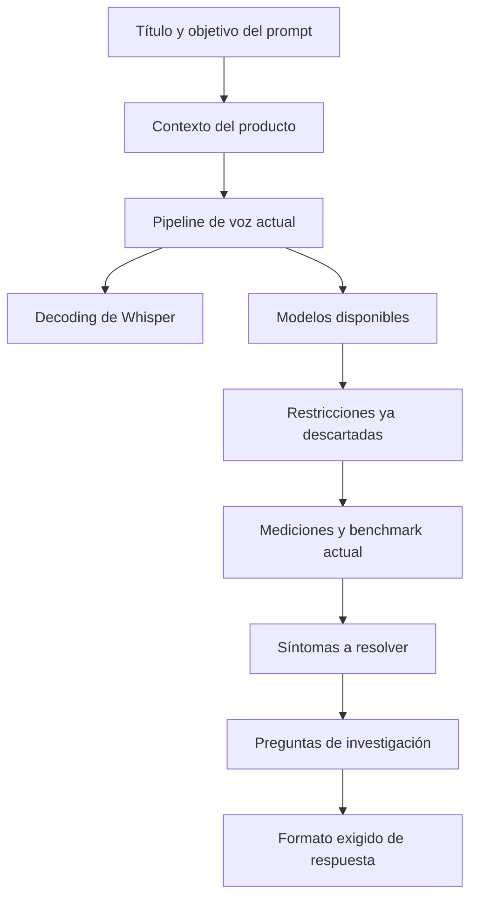

# Análisis del MD sobre precisión local de STT

## Resumen ejecutivo

Sí fue posible leer y analizar el archivo Markdown enviado. El documento no es una especificación de producto final ni un memo técnico convencional; es, más bien, un **brief de investigación muy bien armado** para pedirle a otro modelo una revisión profunda de un sistema ASR local basado en Whisper-small en CPU, con foco en español, *code-switching* y latencia de asistente de voz. Su mayor fortaleza es que define con claridad las restricciones no negociables, describe el pipeline con bastante precisión, aporta una línea base medida y formula preguntas de investigación concretas y accionables. fileciteturn0file1L1-L6 fileciteturn0file1L10-L27 fileciteturn0file1L29-L78 fileciteturn0file1L88-L117

Lo más débil del texto no es el contenido técnico, sino la **auditabilidad y la priorización**. El MD menciona papers, repos y discusiones, pero no incluye enlaces desarrollados ni criterios de descarte suficientemente duros para licencias, latencia p95, uso de CPU, memoria y riesgo de degradar la generalidad multiusuario. Además, el set de evaluación bien alineado aún es pequeño, lo que limita el peso de varias conclusiones empíricas. fileciteturn0file1L107-L117 fileciteturn0file1L130-L187

Mi conclusión es que el MD ya está **por encima del promedio** como prompt de investigación, pero todavía puede mejorar mucho si se convierte de “lista amplia de preguntas” a “lista priorizada de decisiones y experimentos”. Las mejoras de más ROI son: exigir una tabla de decisión con filtros de licencia y CPU, pedir métricas de entidad/intención además de WER, agregar URLs/versiones exactas, y separar recomendaciones viables hoy de ideas de investigación futura. La validación externa también respalda varios supuestos clave del documento: Whisper usa ventanas deslizantes de 30 segundos; el `prompt` sirve más para estilo/ortografía que para seguir instrucciones, y Whisper no maneja bien el *code-switching* monolíticamente si depende de detección automática de idioma. citeturn14view1turn14view0turn15search0turn15search3

## Accesibilidad y estructura del archivo

El archivo está accesible y tiene una estructura ordenada: abre con un objetivo-meta para usarlo como prompt de investigación, luego pasa a contexto del producto, pipeline actual, restricciones descartadas, mediciones existentes, síntomas observados, preguntas de investigación y formato esperado de respuesta. También incluye un bloque de diagrama/pipeline, un bloque de código Python y una tabla comparativa de experimentos ya corridos. fileciteturn0file1L1-L6 fileciteturn0file1L29-L74 fileciteturn0file1L99-L105

Un detalle importante: el MD **sí cita fuentes**, pero lo hace como referencias textuales breves —por ejemplo, `arxiv 2502.11572`, `arxiv 2505.12969` y `openai/whisper #2009`— en vez de usar enlaces Markdown o URLs completas. Eso no invalida el documento, pero sí vuelve más difícil auditar rápidamente la evidencia y aumenta la probabilidad de que otro modelo responda con fuentes secundarias o mal interpretadas. fileciteturn0file1L107-L114

Como mapa visual, la lógica del documento se puede resumir así:



En términos de calidad editorial, la estructura es buena porque sigue una secuencia lógica: primero limita el espacio de soluciones, después entrega evidencia observada y al final formula la agenda de investigación. Eso suele producir respuestas mucho mejores que un pedido abierto o ambiguo. fileciteturn0file1L10-L27 fileciteturn0file1L88-L117 fileciteturn0file1L130-L187

## Qué dice el documento y qué deja abierto

El mensaje central del MD es claro: el problema no es “mejorar ASR en abstracto”, sino **mejorar un asistente local en Windows, sin nube, gratis, multiusuario y con fuerte mezcla español-inglés**, donde el STT corre únicamente en CPU y además debe respetar una latencia propia de una interfaz tipo Alexa. Esa combinación de restricciones es la clave de todo el documento. fileciteturn0file1L10-L27

El pipeline actual también está bien delimitado: micrófono a 16 kHz mono, buffer circular, Silero VAD, wake word “hey gemma”, máquina de estados, filtro anti-silencio/anti-alucinación, `faster-whisper` con `small` en CPU int8 y un post-corrector por inventario con RapidFuzz. Esa especificidad es valiosa porque evita recomendaciones genéricas y permite que la investigación se centre en cuellos de botella reales. fileciteturn0file1L29-L78

Lo que el documento ya deja razonablemente establecido es esto: la línea base actual usa `beam_size=1`, `temperature=0.0`, `condition_on_previous_text=False`, y ciertas variantes más “sofisticadas” —como `beam_size=5`, *temperature fallback* o un `initial_prompt` más cargado— no mejoraron y en algunos casos empeoraron WER y latencia. También queda explicitado que el mayor dolor práctico está en nombres propios en inglés, clips cortos con eco/ruido y verbos mal oídos que alteran la intención. fileciteturn0file1L56-L74 fileciteturn0file1L97-L117 fileciteturn0file1L119-L128

Lo que sigue abierto es amplio, pero puede resumirse en cuatro frentes:  
- **inferencia y sesgo contextual** sin cambiar de modelo;  
- **preprocesamiento** compatible con CPU;  
- **modelos alternativos** realmente usables en ese presupuesto;  
- **evaluación y fine-tuning barato** si lo anterior no alcanza. fileciteturn0file1L130-L178

Mi lectura crítica es que el documento plantea bien las preguntas, pero todavía no fuerza suficientemente el formato de la decisión final. Hoy pide “investigación”; lo que más le convendría pedir es “veredicto operativo”, con descarte automático de opciones que rompan licencia, CPU, memoria o latencia. fileciteturn0file1L180-L187

## Análisis crítico por secciones

**Apertura y propósito.**  
La apertura deja clarísimo que el archivo es un prompt para pegar en otro sistema y que la respuesta debe distinguir entre lo verificado y lo especulativo. Esa instrucción es excelente, porque en ASR práctico hay mucho folklore. El pequeño problema es que la apertura no obliga al modelo a responder con enlaces primarios exactos, versiones o fecha de benchmark. Yo añadiría esa exigencia desde la primera línea. fileciteturn0file1L1-L6

**Contexto del producto.**  
Esta sección es de las mejores del MD. Las restricciones son concretas: todo local, todo gratis, multiusuario, *code-switching*, CPU, latencia acotada. La parte que falta es una definición explícita de “licencia aceptable”. Por ejemplo, algunas alternativas modernas pueden ser gratuitas pero no aptas para uso comercial irrestricto. Moonshine, por ejemplo, publica el código bajo MIT, pero sus modelos en otros idiomas están bajo una licencia comunitaria no comercial; SeamlessM4T se publica bajo licencia de investigación. Si el producto aspira a distribución amplia, ambas condiciones deberían disparar un descarte por defecto. fileciteturn0file1L15-L27 citeturn17view0turn8view7

**Pipeline y configuración de decoding.**  
La configuración técnica es coherente y, a nivel sintáctico y semántico, está bien planteada. `faster-whisper` reconoce parámetros como `prefix`, `hotwords`, `suppress_tokens`, `word_timestamps`, `patience`, `length_penalty` y `repetition_penalty`; además, la documentación del propio proyecto indica que `hotwords` no tiene efecto si `prefix` está definido. También confirma que `word_timestamps` usa atención cruzada con *dynamic time warping*. Esto significa que la sección de preguntas técnicas está bien orientada y no está consultando parámetros imaginarios. fileciteturn0file1L54-L74 citeturn11view1turn11view0turn10view0turn10view2turn10view4

Aun así, hay tres mejoras editoriales obvias. La primera: registrar versión exacta de `faster-whisper`, CTranslate2, ONNX Runtime y modelo convertido. La segunda: medir el `initial_prompt` en **tokens reales**, no en caracteres aproximados, porque Whisper considera solo los últimos 224 tokens. La tercera: agregar latencia p50/p95/p99 y no solo promedio, porque en UX de voz importa mucho la cola de latencia. OpenAI además aclara que el `prompt` en Whisper es útil sobre todo para continuidad de estilo y ortografía, y que no sigue instrucciones como GPT; por eso conviene tratar cualquier “prompt engineering” prolongado como algo de riesgo alto y beneficio incierto. citeturn14view0turn14view1turn8view0

**Restricciones descartadas y mediciones existentes.**  
Muy buena decisión haber documentado lo que ya se probó y salió mal. Esa sección ahorra tiempo y previene recomendaciones repetidas. También es técnicamente sensata porque las comparaciones de implementación en Whisper deben hacerse con configuraciones equivalentes, especialmente el mismo `beam size`, algo que el README de `faster-whisper` remarca explícitamente. Lo que falta aquí es un marco de significancia mínima: con un subconjunto alineado chico, conviene reportar intervalos, dispersión por comando y métricas por tipo de error, no solo un WER agregado. fileciteturn0file1L88-L117 citeturn8view0

**Síntomas concretos.**  
Esta parte está especialmente bien porque traduce fallas ASR a impacto de producto: entidades en inglés, ruido/eco y verbos de intención. En otras palabras, no mide “texto bonito”, sino “si el asistente hizo bien la tarea”. Mi recomendación aquí es convertir esos síntomas en una taxonomía fija de evaluación: entidad, verbo, idioma, ruido, eco, alucinación, wake contamination y OOV. Eso hará que cualquier investigación posterior sea comparable entre iteraciones. fileciteturn0file1L119-L128

**Preguntas de investigación y formato esperado.**  
La cobertura temática es amplia y sólida, pero también un poco ambiciosa para una sola respuesta. Son 12 preguntas distribuidas en seis áreas, más una exigencia de ROI. Mi sugerencia es dividirlas en dos capas: una capa “runtime viable ahora” y otra capa “R&D/futuro”. Si no haces esa separación, el modelo que responda tenderá a mezclar cambios simples de inferencia con ideas más profundas de adaptación o entrenamiento y la respuesta se volverá menos operativa. fileciteturn0file1L130-L187

## Validación técnica de alto nivel

A nivel técnico, el MD parte de varios supuestos bien fundados. Whisper, según su README oficial, procesa audio con una ventana deslizante de 30 segundos; además, OpenAI explica que el `prompt` es para continuidad y estilo, no para obedecer instrucciones como un LLM generalista, y limita su efecto a 224 tokens. Eso respalda la intuición del documento de que el `initial_prompt` puede ayudar un poco con nombres propios, pero también degradar palabras comunes o provocar efectos secundarios si se “sobrecarga”. citeturn14view1turn14view0turn8view2

También es consistente la decisión de fijar el idioma matriz en español. Whisper no fue diseñado para manejar bien *code-switching* monolítico; en discusiones de la comunidad y mantenedores se remarca que asume audio monolingüe por segmento o clip, y que los casos mixtos son poco fiables si se dejan a detección automática. En ese sentido, el documento acierta al tratar el Spanglish como un problema de sesgo contextual y post-corrección, no como algo que la autodetección vaya a resolver gratis. fileciteturn0file1L113-L114 citeturn15search0turn15search1turn15search3

La parte de VAD también es razonable. Silero VAD documenta soporte a 8 kHz y 16 kHz y destaca ejecución muy rápida en CPU; además, en v5/v6 existen restricciones de ventana fija a 256/512 muestras según la frecuencia. Por eso, el pipeline descrito con 16 kHz y bloques de 512 muestras es técnicamente plausible y compatible con una app local en tiempo real. fileciteturn0file1L31-L45 citeturn8view1turn0search6

Sobre modelos alternativos, el documento acierta al abrir el abanico, pero conviene depurarlo más. **Distil-Whisper** es atractivo por velocidad y tamaño, pero la línea oficial actual es solo para reconocimiento en inglés, lo que lo vuelve mala apuesta para español/Spanglish. **Vosk** sí encaja mejor con la restricción de offline + streaming + vocabulario configurable y modelos relativamente pequeños. **SpeechBrain wav2vec2 español** tiene una WER reportada en Common Voice, pero es monolingüe y no está orientado a *code-switching*. **Parakeet v3** es multilingüe y tiene licencia permisiva CC BY 4.0, pero NVIDIA lo presenta como modelo optimizado para sistemas GPU-acelerados; por peso, ecosistema y ejemplos, no parece un candidato natural para laptop CPU compartiendo recursos con un LLM local. **SeamlessM4T** añade ASR y cobertura multilingüe, pero su licencia de investigación lo deja fuera de muchas implementaciones productivas. **Moonshine** es probablemente el candidato alternativo más interesante en latencia para voz en vivo, pero sus modelos no ingleses están bajo licencia comunitaria no comercial, así que no debería entrar como “apto por defecto” si el uso final pudiera ser comercial. citeturn18view1turn18view4turn18view5turn18view6turn19view0turn19view4turn8view6turn8view7turn17view0turn17view1turn17view3

En cuanto a *fine-tuning* barato, el documento no está mal encaminado: hoy sí existe una ruta PEFT/LoRA dentro del ecosistema de Hugging Face para ASR y específicamente para Whisper. Lo que aún no fija el MD —y debería fijar— es el umbral que justificaría pasar de optimizaciones de inferencia a entrenamiento. Si no se define ese umbral, cualquier respuesta podría “escaparse” hacia fine-tuning demasiado pronto. citeturn22view0turn22view1turn22view2

Finalmente, el MD hace bien en sospechar de la generación sintética por TTS como bala de plata. La literatura muestra que los datos sintéticos pueden ayudar mucho cuando se introducen con diversidad y mezcla con datos reales, pero también que el puro TTS puede introducir brecha de distribución, estilos poco realistas y caídas apreciables en ASR si se usa sin cuidado. En otras palabras: es viable como apoyo, no como sustituto ingenuo del dato real. citeturn23view0turn23view1turn23view2

## Acciones sugeridas, ediciones y textos reutilizables

La mejora más valiosa no es “agregar más preguntas”, sino **cerrar el espacio de respuesta**. Yo haría cinco cambios concretos al MD.

Primero, agregaría un bloque de **criterios de aceptación obligatorios**. Hoy la latencia ideal está clara, pero faltan filtros explícitos de licencia, memoria, p95, uso de CPU y degradación de generalidad. Segundo, separaría “opciones aptas para producción hoy” de “opciones interesantes pero de investigación”. Tercero, obligaría a citar URLs primarias exactas en cada recomendación. Cuarto, pediría métricas por entidad e intención además de WER. Quinto, exigiría una recomendación top-5 con orden de ejecución y condición de descarte. Esos cambios harían que el modelo que responda entregue una salida más ejecutable y menos enciclopédica. fileciteturn0file1L180-L187 citeturn14view0turn17view0turn8view7turn18view4

Una edición útil para insertar directamente en el MD sería esta:

```md
### Criterios de aceptación obligatorios

- Descarta automáticamente cualquier opción con licencia research-only, no comercial, API paga o dependencia cloud.
- No recomiendes modelos que, en CPU de laptop 4–8 cores, no puedan aspirar razonablemente a p95 < 700 ms para clips de ~2 s.
- Reporta siempre: WER, entity recall, intent accuracy, p50/p95 de latencia, RAM pico y carga estimada de CPU.
- Separa en dos listas:
  1. Viable hoy en producción
  2. Interesante para I+D, pero no apto hoy
- Incluye enlaces primarios exactos a papers, model cards, repos y documentación oficial.
```

Si quieres reutilizar el MD para pedírselo a otro modelo, este texto adicional mejoraría mucho la respuesta:

```text
Antes de responder, aplica estos filtros duros: licencia apta para uso de producto, ejecución local sin nube, CPU-only realista en laptop 4–8 cores y latencia compatible con voz en tiempo real. Si una alternativa falla cualquiera de esos filtros, márcala como DESCARTADA y explica por qué.
```

Y si quieres pedir una respuesta más operativa y menos dispersa, este segundo fragmento ayuda bastante:

```text
Quiero que tu respuesta empiece con un ranking Top 7 de experimentos por ROI. Para cada experimento, dime exactamente qué cambiar, qué métrica espero mover, cuánto riesgo introduce, qué costo computacional agrega y en qué condición lo descartaría.
```

Por último, si el objetivo es refinar el documento antes de usarlo como prompt de investigación, yo también añadiría una nota breve sobre reproducibilidad:

```text
Supón que necesitaré replicar cualquier benchmark. Por eso, para cada recomendación indica versión del modelo, versión de librería, hardware usado en el benchmark y si el resultado proviene de paper, documentación oficial, model card o issue/discusión.
```

## Matriz de prioridad y esfuerzo

La siguiente tabla estima el esfuerzo para **mejorar el MD como documento de trabajo**, no para implementar todos los cambios del sistema ASR. Se basa en las secciones visibles del archivo y en los vacíos detectados durante la revisión. fileciteturn0file1L10-L187

| Section | Purpose | Priority | Estimated Effort (hours) | Suggested Action |
|---|---|---:|---:|---|
| Contexto del producto | Fijar restricciones no negociables | High | 0.5 | Agregar filtro explícito de licencias aceptables y criterio de memoria/CPU |
| Pipeline de voz actual | Describir arquitectura existente | High | 1.5 | Añadir versiones exactas, commits, CPU objetivo y métricas p50/p95 |
| Config de decoding | Precisar parámetros de Whisper | High | 2.0 | Añadir conteo real de tokens del `initial_prompt` y plan A/B para `hotwords`, `prefix` y `suppress_tokens` |
| Restricciones descartadas | Evitar repetir pruebas de bajo ROI | Med | 0.5 | Convertir descartes en reglas: qué ya no volver a probar y bajo qué excepción |
| Lo que ya se midió | Dar línea base y evidencia previa | High | 3.0 | Expandir set alineado, agregar métricas por entidad/intención y dispersión estadística |
| Síntomas concretos | Traducir fallas técnicas a impacto de producto | High | 2.0 | Crear taxonomía fija de errores: entidad, verbo, ruido, eco, alucinación, OOV |
| Preguntas para la investigación | Guiar la respuesta del modelo investigador | High | 4.0 | Reordenar por ROI y dividir entre “viable hoy” vs “I+D/futuro” |
| Formato de respuesta deseado | Forzar una salida útil y comparable | High | 1.0 | Exigir tablas obligatorias con licencia, CPU, RAM, latencia y veredicto final |

La prioridad más alta está en tres puntos: **criterios de descarte**, **reproducibilidad** y **métricas de negocio**. Si esos tres elementos quedan bien definidos, el MD pasará de ser un excelente pedido de investigación a una herramienta de decisión mucho más confiable. fileciteturn0file1L180-L187 citeturn14view0turn11view0turn17view0turn18view4