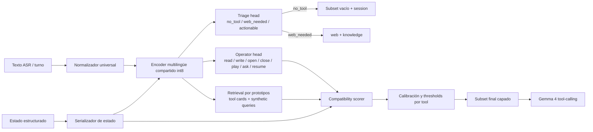
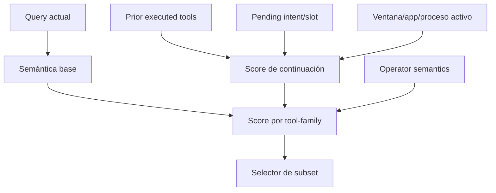

# Router unificado y selectivo para Carter Agent

**Executive summary.** Tras revisar el repositorio adjunto, mi recomendación es **no** consolidar el sistema alrededor de `router_v2` ni mantener `planner.py` como cascada autoritativa. La mejor arquitectura unificada, bajo tus restricciones, es un **router semántico selectivo con un solo encoder multilingüe compartido, una cabeza explícita de abstención/triage calibrada, una cabeza de “operator semantics” para read-vs-write, y una recuperación por prototipos de tools fusionada con estado de sesión**. En corto: primero decide **si corresponde ofrecer tools**; después decide **cuáles**. Esa separación ataca el fallo que el propio repo ya evidencia: el problema dominante no es “encontrar semánticamente algún tool”, sino **sobre-ofrecer tools cuando debería abstenerse**. La literatura reciente sobre tool retrieval también va en esa dirección: los recuperadores genéricos rinden peor de lo esperado en tool retrieval, la expansión sintética tipo Tool2Vec/Re-Invoke ayuda mucho, y reducir el conjunto de tools visibles mejora la selección downstream del LLM. citeturn13view2turn13view4turn13view0turn12view3

## A. DIAGNOSIS

Mi inspección del ZIP muestra cuatro piezas de routing coexistiendo: `planner.py` como ruta autoritativa; `semantic_router.py` con top-k denso; `intent_router.py` con centroides semánticos; y `router_v2.py` con e5-small ONNX + BM25 + RRF, hoy desactivado. También veo un corpus curado de **1,733** queries, un split estable dev/holdout, **65** tools compuestas en `tool_schemas.py`, y una lógica de continuidad repartida entre router y agente. En `planner.py`, la deuda técnica es visible: hay una gran cantidad de chequeos `re.search`, expansiones manuales de abreviaturas y múltiples “rescues” estructurales, lo que ayuda a recall puntual pero vuelve frágil la universalidad multilingüe sin keywords.

El patrón de error central es el esperado para voz local: queries **muy cortas, ruidosas, elípticas y multilingües**. En tool retrieval, eso pega especialmente fuerte. ToolRet construyó un benchmark de **7.6k tareas** y **43k tools**, y mostró que modelos fuertes en IR convencional siguen rindiendo mal en recuperación de tools; además, esa baja calidad de recuperación degrada el pass rate downstream del LLM. En paralelo, RAG-MCP mostró que pasar demasiadas tools al modelo **reduce la calidad de selección** y que recuperar solo las relevantes puede más que triplicar la accuracy frente a un baseline sin retrieval. citeturn13view2turn13view3turn13view4turn13view5

En el repo, eso se manifiesta de forma muy concreta: la parte más débil del baseline reportado no es el recall bruto de tools, sino la **abstención no-tool**. Esa debilidad es coherente con un router semántico de top-k que siempre “encuentra algo” por cercanía vectorial, aunque la intención real sea smalltalk, self-reference, directiva conversacional o una pregunta que el LLM puede contestar sin tools. La literatura de *selective classification* encaja exactamente con este problema: no basta rankear; hay que tener una **regla explícita de rechazo** con riesgo controlado y calibración de confianza. La calibración por *temperature scaling* sigue siendo una base práctica y robusta, y la clasificación selectiva formaliza el intercambio entre cobertura y riesgo. citeturn13view13turn13view14

También hay un segundo problema, más sutil: el router actual intenta resolver demasiadas cosas a la vez en el mismo plano semántico. “Qué notas tengo” y “anota esto” deberían compartir tool-family pero diferir en **operator semantics**; “está instalado Discord” e “instala Discord” comparten entidad, pero difieren en **lectura vs escritura**; “ciérralo” no es un problema de parsing del turno actual, sino de **estado**. Re-Invoke es útil aquí como intuición: offline conviene expandir herramientas con queries sintéticas y, online, extraer el/los intentos subyacentes de la query, en lugar de confiar en una sola similitud query→descripción. citeturn12view3

A nivel de encoder, el repo ya da una pista importante: `paraphrase-multilingual-MiniLM-L12-v2` es un embedding multilingüe de **384 dimensiones**, útil para clustering y búsqueda semántica, y la documentación de Sentence Transformers lo sitúa dentro de la familia multilingüe de **50+ idiomas**. `multilingual-e5-small` también es atractivo: la familia Multilingual E5 ofrece tamaños *small/base/large* y fue entrenada con **1 billón de pares multilingües**. Pero en este repo, usar e5 como centro del runtime ya mostró señales de desalineación para el gating fino de intención. Mi conclusión no es “E5 es malo”, sino “**un retriever bueno no reemplaza un abstention head calibrado**”. citeturn11view1turn1search5turn13view8turn13view9

Finalmente, la restricción de latencia es real. Alexa considera degradación de servicio cuando el **P90** llega a **5 segundos**, y el ecosistema espera timeout cerca de **8 segundos** en interfaces típicas; si a eso le sumas que tu brief fija un presupuesto total de turno de **4–5 s**, el router debe vivir cómodamente en **decenas de milisegundos**, no cientos. ONNX Runtime soporta cuantización a 8 bits para CPU, y Sentence Transformers recomienda ONNX/OpenVINO como backends de aceleración; OpenVINO puede ser especialmente útil en hardware Intel, mientras que ONNX Runtime da mejor neutralidad de plataforma. citeturn11view16turn11view17turn11view3turn11view4

## B. RECOMMENDED ARCHITECTURE

Recomiendo **una arquitectura única de una sola pasada**: **encoder multilingüe pequeño compartido + triage selectivo calibrado + cabeza de operator semantics + recuperación por prototipos de tool + fusión estructurada de estado**. Gana por una razón por encima de todas: **separa explícitamente “¿debo ofrecer tools?” de “¿qué tools debo ofrecer?”**, que es justo la separación que falta hoy y el origen del mal no-tool en el baseline. Así corriges el fallo dominante sin volver a keywords ni pagar el costo de un reranker pesado en CPU. La parte de recuperación se apoya en expansión sintética tipo Tool2Vec/Re-Invoke; la parte de rechazo se apoya en calibración y selective classification; y todo ocurre con un solo embedding pass por turno. citeturn13view0turn12view3turn13view13turn13view14





La API que propongo es simple y medible:

```python
class RouterState(TypedDict):
    prior_tools: list[str]
    pending_tool: str | None
    pending_slot: str | None
    active_window: str | None
    open_apps: list[str]
    last_tool_result_type: str | None

class RouteResult(TypedDict):
    subset: list[str]
    triage: Literal["no_tool", "web_needed", "actionable"]
    scores: dict[str, float]
    operator_scores: dict[str, float]
    used_state: bool
    latency_ms: float

def route(query: str, state: RouterState, mode: Literal["isolated", "production"]) -> RouteResult
```

La clave es que **`mode="isolated"` y `mode="production"` comparten exactamente el mismo router**; solo cambia si se serializa o no el estado. Eso preserva la honestidad del número duro de recall puro y, al mismo tiempo, permite que producción explote contexto real sin esconder debilidad de base.

## C. TRADE-OFF TABLE

La comparación importante no es “qué paper suena mejor”, sino qué opción encaja con **tu repo, tus fallos reales y tu presupuesto de CPU**. El propio repositorio ya demostró que un híbrido BM25+RRF sin una capa fuerte de abstención puede empeorar resultados en queries breves de voz. La literatura, por otro lado, apoya tres ideas que sí conviene rescatar: **synthetic query expansion**, **tool prototypes**, y **subsets pequeños**. citeturn13view0turn12view3turn13view4turn12view4

| Arquitectura | Robustez multilingüe | Latencia CPU | Offline/local fit | No-tool / abstención | Read-vs-write | Riesgo de implementación | Veredicto |
|---|---:|---:|---:|---:|---:|---:|---|
| **Recomendada: encoder compartido + triage calibrado + operator head + prototipos + estado** | Alta | Alta | Alta | **Muy alta** | **Muy alta** | Media | **Elegir** |
| v1 actual: regex + semantic union + intent centroid | Media | Alta | Alta | Baja-media | Media | Baja | Mantener solo como transición |
| v2 actual: e5 + BM25 + RRF + fallback | Media | Media-alta | Alta | Baja-media | Baja | Media | No revivir como ruta principal |
| Cross-encoder/reranker pesado o MLC grande en runtime | Alta | Baja | Baja-media | Alta | Alta | Alta | Solo teacher offline |

Sobre modelos concretos, mi matriz es esta:

| Modelo | Papel sugerido | Multilingüe | Tamaño / capacidad | Recomendación |
|---|---|---|---|---|
| **MiniLM multilingüe pequeño distilado a tu dominio** | **Encoder runtime** | Sí | 384-d; params exactos **no especificados** en la model card revisada | **Sí** |
| `intfloat/multilingual-e5-small` | Baseline alterno / teacher candidato | Sí | 12 capas, 384-d; la familia ofrece small/base/large | Solo como baseline o teacher |
| **EmbeddingGemma** | Candidato v2 si luego quieres reemplazar encoder | Sí | **300M** parámetros, 100+ idiomas | Interesante, pero no para primera migración |
| **BGE-M3** | Teacher offline / minería de hard negatives | Sí | Soporta dense+sparse+multi-vector, >100 idiomas | No en hot path CPU |
| `jina-embeddings-v3` | Teacher offline opcional | Sí | **570M** parámetros | No en hot path CPU |

Las características multilingües y tamaños de `multilingual-e5-small`, `EmbeddingGemma`, `BGE-M3` y `jina-embeddings-v3` vienen de sus papers/model cards. `EmbeddingGemma` es especialmente atractivo por foco on-device, pero a **300M** parámetros sigue siendo un salto de riesgo innecesario para esta primera consolidación; `BGE-M3` y `jina-embeddings-v3` son mejores candidatos para enseñanza offline que para routing caliente en CPU. citeturn13view8turn13view9turn11view12turn12view6turn11view13turn11view14

Mis objetivos de rendimiento propuestos, asumiendo laptop CPU local y el brief de 4–5 s por turno, son estos: **router warm p50 10–15 ms, p95 30–45 ms, cap duro 50 ms**; memoria residente **<250 MB**; subset máximo **6** tools de dominio + `session` y `safety`; y score dual en evaluación: **recall aislado** y **recall con estado**. Para “tier-Alexa”, tomaría como guardarraíles externos un **P90 <5 s** de experiencia global y evitar cualquier diseño que acerque el router al orden de cientos de milisegundos. citeturn11view16turn11view17turn11view3turn11view4

## D. MIGRATION PLAN

**Paso uno: congelar medición y ampliar el harness, sin tocar todavía la decisión.**  
Cambio: extender `router_eval.py` para reportar, por split y por slice, `tool_recall`, `precision@subset`, `F1`, `no_tool_keep`, `false_invoke_rate`, `latency p50/p95`, `RSS`, `isolated_recall`, `production_recall`, `code_switch`, `ASR_noise`, `read/write minimal pairs` y `continuations`.  
Movimiento esperado: **0** en métricas; solo mejor observabilidad.  
Validación: mantener el holdout hash actual intacto y crear slices anotados adicionales, nunca mezclados en training.

**Paso dos: mover continuidad y pending intent dentro del router, pero como estado estructurado, no como heurística textual.**  
Cambio: crear `RouterState` y pasar al router el tool ejecutado previo, `pending_tool`, `pending_slot`, ventana activa y tipo del último resultado; retirar gradualmente la “herencia” desde `agent.py` y `planner.py`.  
Movimiento esperado: en **producción**, **+2 a +5 puntos** de recall; en modo aislado, **0**.  
Validación: comparar `isolated` vs `production` y exigir que la mejora ocurra solo en los slices de continuidad.

**Paso tres: insertar primero la cabeza de triage selectivo delante del router actual.**  
Cambio: una clasificación calibrada `no_tool / web_needed / actionable` con thresholds aprendidos en dev.  
Movimiento esperado: **+0.08 a +0.18** en `no_tool_keep`, con recall estable o caída máxima de **0.01** si la calibración está bien hecha.  
Validación: holdout blind; además, análisis por slice en self-reference, smalltalk, static knowledge, current-facts y directives. La calibración se hace con *temperature scaling* y el reject option con objetivo explícito de riesgo. citeturn13view13turn13view14

**Paso cuatro: reemplazar el union de keywords + semantic fallback por retrieval por prototipos + operator head, en shadow mode.**  
Cambio: indexar por tool múltiples prototipos semánticos construidos desde schema breve, descripción de routing y queries sintéticas multilingües; el operator head restringe qué tools tienen compatibilidad semántica con la acción detectada.  
Movimiento esperado: **+0.02 a +0.05** en recall aislado y **+0.02 a +0.06** en `no_tool_keep`, sobre todo en read-vs-write y queries cortas.  
Validación: shadow sobre todo el corpus dev; despliegue real solo si gana por slice y no solo en promedio. Tool2Vec y Re-Invoke son la base más sólida para esta fase. citeturn13view0turn12view3

**Paso cinco: separar routing de entity resolution.**  
Cambio: el router elige familias (`app`, `window`, `steam`, `browser_real`, `media`); después entra un resolvedor especializado de entidad para nombres de app, juego, canción o ventana.  
Movimiento esperado: recall similar o **+0.01 a +0.03**, pero caída clara de errores de near-anagram y PWA misresolution.  
Validación: slice específico con `Teams/Steam`, `Chrome/PWA`, títulos de juegos, y ventanas multi-tab.

**Paso seis: compactar schemas para Gemma y meter métricas downstream de tool-calling dentro del scoreboard del router.**  
Cambio: para runtime, cada tool expone una “call card” corta para el LLM y conserva su schema completa para ejecución; el selector optimiza no solo recall de routing sino `downstream_call_rate` y `leak_rate`.  
Movimiento esperado: el recall del router puede no moverse mucho, pero el pass rate end-to-end sí debería subir.  
Validación: benchmark end-to-end con Gemma 4 local y el parser de rescate activo, midiendo “tool offered + tool actually called + correct call shape”.

## E. WHAT TO DELETE

Eliminaría **`core/router_v2.py` como ruta de producción**. No vale la pena intentar “arreglarlo” como base autoritativa porque su diseño parte del supuesto equivocado para este repo: que mejorar retrieval híbrido basta para mejorar routing. Tus datos y los probes del propio proyecto ya muestran que no basta.

También eliminaría **`semantic_router.py` e `intent_router.py` como módulos públicos separados** una vez exista el nuevo router. Sus ideas sobreviven, pero embebidas dentro de una sola pieza: el encoder compartido, la cabeza de triage y la recuperación por prototipos.

Después eliminaría **la mayor parte de `_suggest_tools()` en `planner.py`**. No toda la normalización debe desaparecer: dejaría normalización Unicode, números, extensiones de archivo, URLs, y quizá uno o dos detectores puramente estructurales de seguridad o sesión. Pero quitaría la lógica donde la decisión primaria depende de listados crecientes de surface forms. El router debe decidir por significado; los detectores estructurales deben actuar como **constraints** o **post-filters**, no como motor.

No borraría `app_resolver.py`; lo **reubicaría**. Hoy participa indirectamente en compensar fallos de routing. En el diseño nuevo debe vivir **después** del routing, como resolvedor de entidad para las pocas familias que realmente lo necesitan.

Por último, borraría la **fragmentación** entre `planner.py` y `agent.py` para continuations e inherit-tools. Esa lógica debe salir de ahí y quedar centralizada en `route(query, state, mode)`.

## F. STRUCTURAL FIXES for the recurring patterns

**Read-vs-write.**  
La corrección estructural no es más regex sobre verbos. Es una **cabeza de operator semantics** entrenada para un vocabulario pequeño pero general: `read`, `write`, `open`, `close`, `play`, `pause`, `search`, `ask`, `resume`, `confirm`, `cancel`. Cada tool-family declara qué operadores admite y con qué peso. Así, “qué notas tengo” y “anota esto” quedan naturalmente cerca de `notes_tasks`, pero con operadores distintos; “está instalado Discord” e “instala Discord” quedan cerca de `package` con diferente `read/write`; y weather/release-dates caen en `web_needed` por triage, no por una lista de frases. Eso es semántico, multilingüe y mucho más estable que añadir buckets de palabras.

**App-name resolution.**  
La robustez aquí viene de **hacer family-first, entity-second**. Primero decides si el turno es `app`, `window`, `steam`, `game_launcher`, `browser_real` o `media`. Solo entonces activas un resolvedor de entidad con señales especializadas: nombre visible, proceso, shortcut, foreground app, reciente, score de char-ngrams, penalización de near-anagrams y prior de fuente. Así desaparece el antipatrón de intentar resolver `Teams` vs `Steam` al mismo tiempo que decides toda la tool family.

**Continuations y contexto.**  
Tu propio repo ya sugiere la verdad importante: el estado útil no es el `prev_user_text`, sino el **tool efectivamente ejecutado**, el slot pendiente y el tipo de resultado previo. En el router nuevo, eso entra como features estructurales, no como “hint” separado. “ciérralo” no tiene por qué ser difícil si el router ve `prior_tools=["browser_real"]`, `active_window="Netflix - Chrome"` y `last_tool_result_type="opened_media"`. A la vez, el harness debe seguir reportando el número honesto en aislamiento.

**Acoplamiento router ↔ Gemma 4 tool-calling.**  
Aquí propongo cuatro defensas. Primera: subsets más chicos, porque RAG-MCP muestra que el exceso de tools degrada selección downstream. Segunda: **call cards** cortas, porque tus schemas actuales son verbosas y algunas muy largas, lo que aumenta el costo cognitivo del LLM. Tercera: incorporar al scorer una señal de **callability prior** aprendida desde logs, para no empujar al top tools que Gemma suele “ver” pero no llamar correctamente. Cuarta: mantener el parser de rescate de tool leaks, pero medirlo como deuda, no como solución. citeturn13view4

Mi política no-tool sería así: si `triage=no_tool`, el subset de dominio queda vacío y solo sobreviven `session` y, si corresponde, `safety`. Si `triage=web_needed`, el subset queda reducido a `web` y, si quieres conservar compatibilidad, `knowledge`. Si `triage=actionable`, entra retrieval + scorer + calibración, con cap pequeño. Esa política sustituye de raíz el comportamiento actual de “siempre ofrezco algo semánticamente parecido”.

## G. OFFLINE TRAINING RECIPE

La receta offline debe ser **reproducible, versionada y compatible con tus constraints**. Mi propuesta es esta.

Primero, construye un dataset de entrenamiento con cuatro niveles de etiqueta por fila: `triage_label`, `tool_set`, `operator_set`, y `state_dependency`. El corpus curado actual es la base; pero el holdout actual debe quedar **intocable**. En dev puedes añadir logs nuevos, siempre con corte temporal posterior y nunca mezclando ejemplos del holdout existente.

Segundo, expande cada tool-family con **queries sintéticas multilingües** al estilo Tool2Vec/Re-Invoke. Para cada tool, genera ejemplos en **es-419/es**, **en**, **pt**, **fr**, **it** y **de**, con variantes de voz natural, elipsis, cortes, errores ASR y code-switch. Re-Invoke es especialmente útil como guía porque formaliza dos pasos offline/online muy alineados contigo: generar queries sintéticas por tool en indexación y extraer intents subyacentes de la query del usuario en inferencia. Tool2Vec, por su lado, muestra mejoras fuertes cuando la representación de la tool se apoya en usage queries y no solo en la descripción. citeturn12view3turn13view0

Tercero, usa un **teacher offline** más pesado para fabricar mejores etiquetas suaves, no para servir en runtime. Mi stack preferido sería: `BGE-M3` o un embedder similar para mining de hard negatives y cobertura híbrida; un reranker multilingüe como `jina-reranker-v2-base-multilingual` para score query-tool; y, si quieres, un LLM local en GPU para generar contrastive hard negatives y juzgar `no_tool` vs `web_needed` vs `actionable`. `BGE-M3` está pensado precisamente para dense+sparse/hybrid retrieval y soporta más de 100 idiomas; el reranker de Jina es un cross-encoder multilingüe útil como teacher, no como motor de producción en CPU. citeturn11view13turn11view15

Cuarto, entrena un **student único** con multitarea. Inicialízalo desde un encoder pequeño multilingüe; mi opción conservadora es partir desde la familia MiniLM multilingüe que ya encaja con tu stack actual. Las pérdidas deberían combinar: distillation loss sobre scores tool-query del teacher; cross-entropy para `triage_label`; BCE para `operator_set`; y una pérdida de ranking/listwise sobre los prototipos por tool. Si quieres evitar sobreajuste a Spanish-only, fuerza batches balanceados por idioma y por slice semántico.

Quinto, exporta el runtime artifact a **ONNX int8** y benchmarkéalo en CPU con dos backends: ONNX Runtime por defecto y OpenVINO como variante para Intel. ONNX Runtime documenta cuantización a 8 bits y Sentence Transformers soporta explícitamente ONNX/OpenVINO para acelerar embeddings. citeturn11view3turn11view4

Sexto, en datos públicos, priorizaría lo siguiente: **MASSIVE** para intentos de asistente virtual en 51 idiomas y 60 intents; **MTOP** para task-oriented parsing multilingüe; **MultiATIS++** como refuerzo de NLU cross-lingual; y, para robustez a voz/ASR, **FLEURS** y **Common Voice**. Para tu caso real, eso debe ir acompañado por un generador propio de perturbaciones ASR aprendidas de tus trazas: el dato público sirve para ampliar cobertura lingüística; la resiliencia real a Whisper o al ASR que uses sale de tus errores reales. citeturn11view5turn13view10turn11view7turn13view11turn13view12

## H. ANTI-OVERFIT NOTE

No creo realista prometer “~100%” bajo estas restricciones. Incluso con un router mejor, seguirán existiendo tres residuos duros: **deixis intrínsecamente ambigua en aislamiento**, **filosofía de etiqueta discutible en parte del no-tool**, y **fallos downstream de Gemma al no llamar una tool ofrecida**. Mi techo realista sería este: **recall aislado 0.88–0.92**, **no-tool keep aislado 0.75–0.85**, y **recall de producción con estado 0.93–0.96**. Más allá de eso, probablemente estarías optimizando contra ambigüedad inevitable o contra el tool-calling del LLM, no contra el router.

Para no memorizar el corpus, impondría estas reglas duras. El holdout actual por hash estable se congela y no se toca. Ningún prompt sintético puede ver queries de holdout literalmente. Todo tuning de thresholds, ablations y selección de arquitectura ocurre en dev. Además, crearía un segundo set “future blind” con logs posteriores en el tiempo, y un tercer set “adversarial” construido solo con perturbaciones sistemáticas: ASR noise, code-switch, ellipsis y entity confusions.

Los entregables que esperaría de esta migración son concretos: `router/encoder.py`, `router/policy.py`, `router/index.py`, `router/state.py`; `scripts/build_router_dataset.py`; `scripts/generate_router_synthetic.py`; `scripts/train_router.py`; `scripts/export_onnx_int8.py`; `scripts/bench_router_cpu.py`; `scripts/eval_router_slices.py`; tests unitarios y tests de regresión por slice; manifiestos de datos; y un `rollout_checklist.md`.

El checklist de rollout debería ser muy corto y muy estricto.  
**Uno:** shadow mode al 100% de tráfico local, sin impacto en usuario.  
**Dos:** canary 5% con rollback instantáneo si cae recall de producción o sube false-invoke rate.  
**Tres:** pasar a 25% solo si mejora al baseline por slice crítico: no-tool, continuations, read/write, app names.  
**Cuatro:** 100% solo cuando el score end-to-end con Gemma mejore, no solo el router offline.  
**Cinco:** conservar un kill switch para volver temporalmente a v1 durante dos ciclos de release.

Mi conclusión final es simple: **quédate con la intuición buena de v1 —abstención, continuidad y pragmatismo—, pero reimplántala en una arquitectura semántica única y calibrada; no con más regex, y tampoco con un BM25+RRF puro**. El mejor router para este Carter Agent no es “más retrieval”, sino **retrieval subordinado a una decisión selectiva de abstención y a una semántica explícita de operador y estado**.