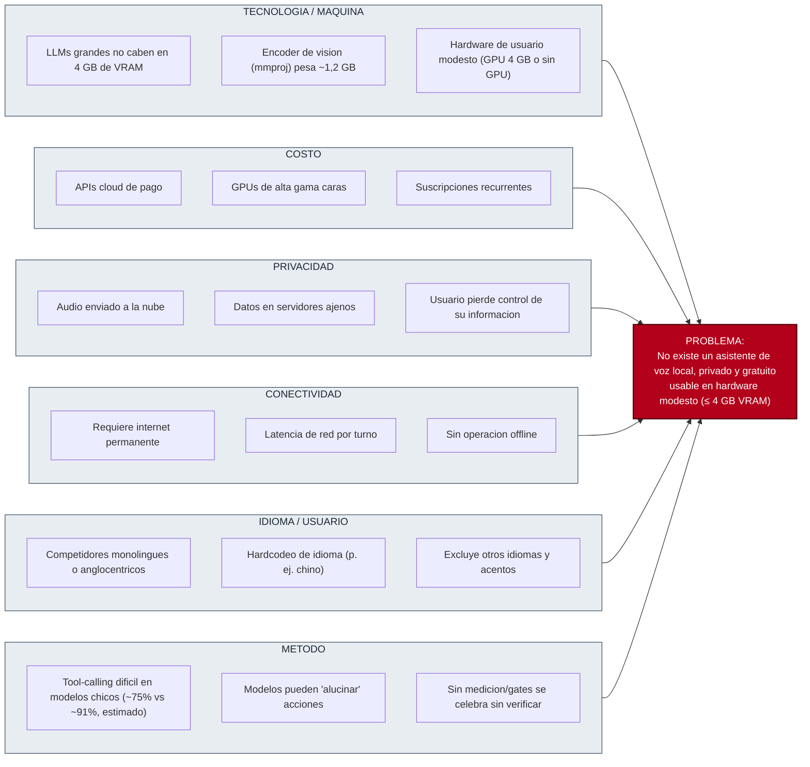
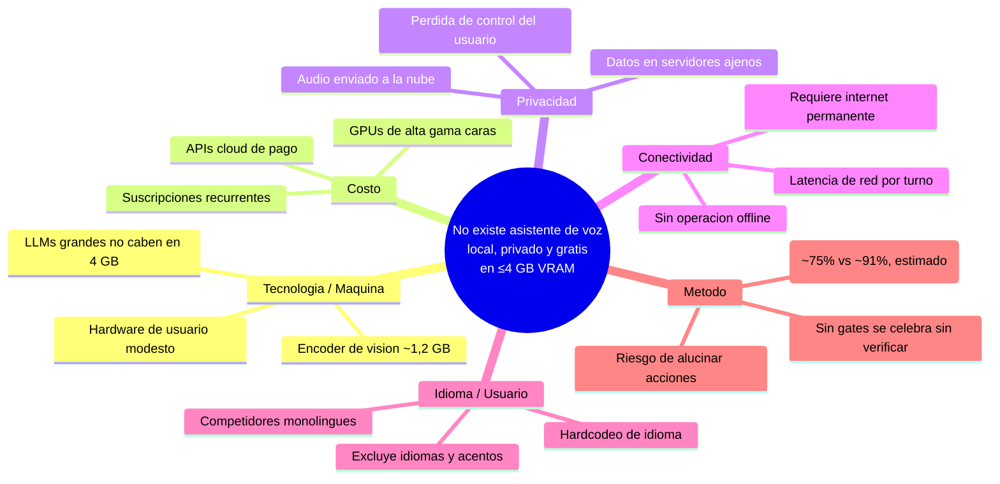
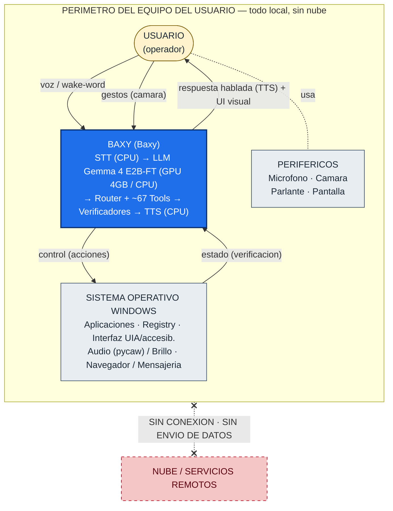
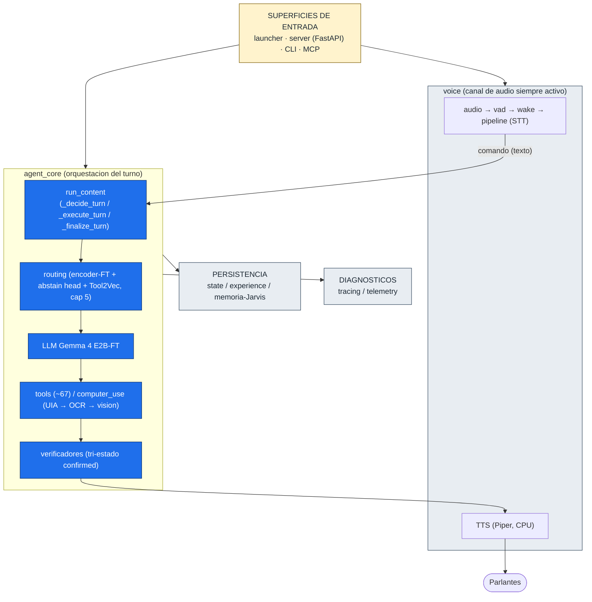
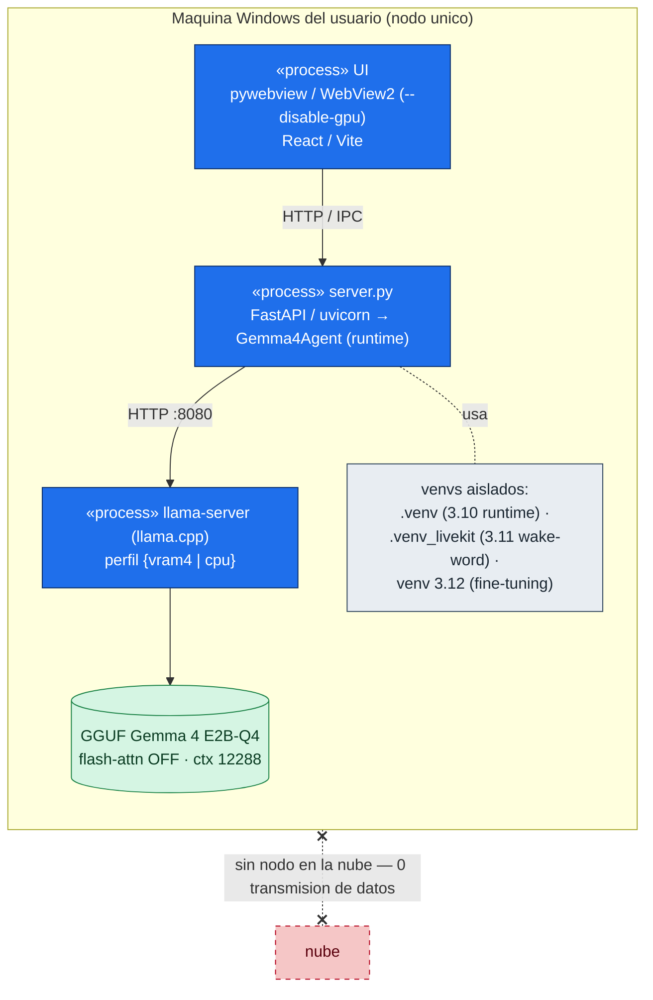
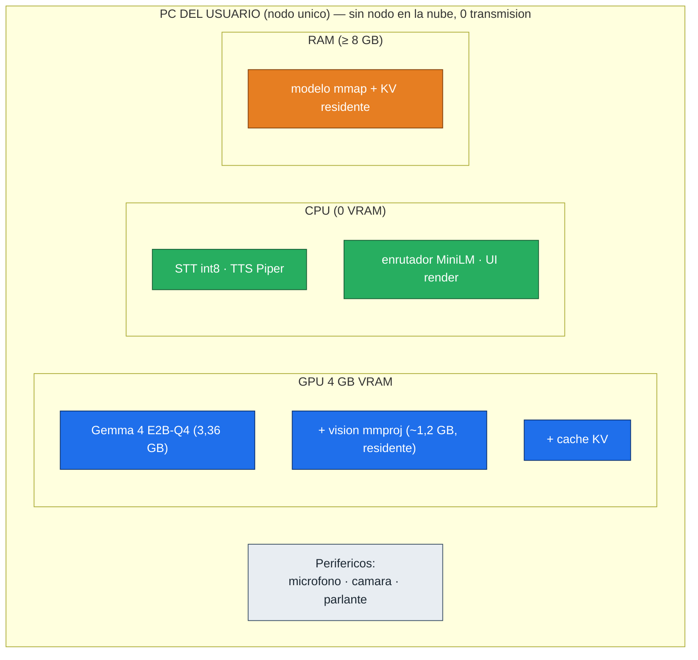
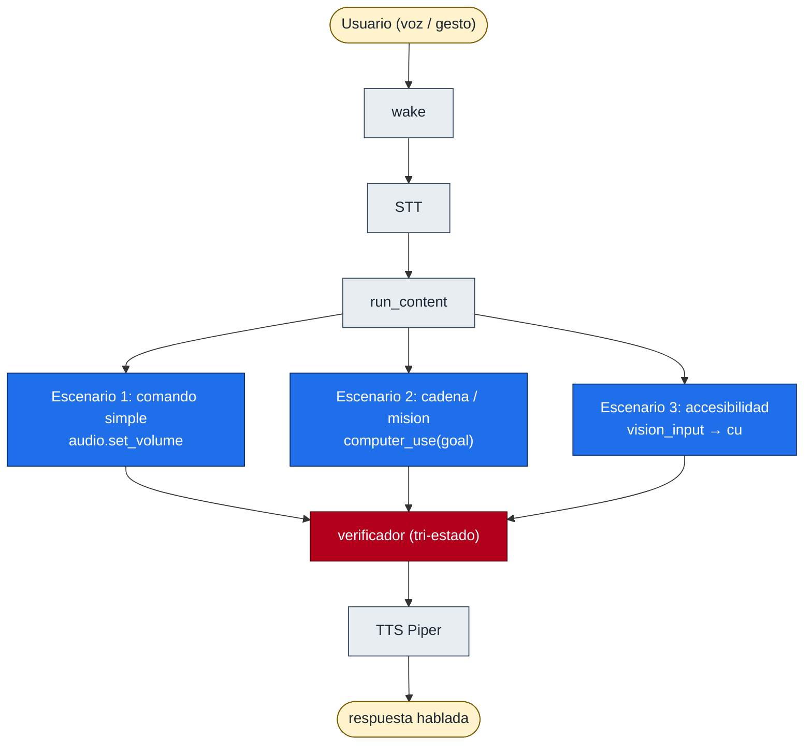
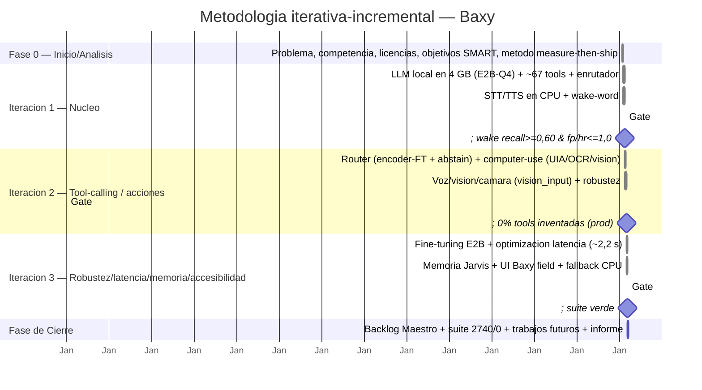

# Diagramas en Mermaid — Tesis Baxy

> Versión en **Mermaid** de los diagramas que en `INFORME_FINAL_COMPLETO.md` aparecen
> como arte ASCII. Mermaid se renderiza nativamente en GitHub, GitLab, VS Code
> (extensión Markdown Preview Mermaid), Obsidian, Typora y muchos editores Markdown.
> Para incrustarlos en el `.docx`: renderizar en <https://mermaid.live>, exportar a
> PNG/SVG y pegar en el lugar de cada figura.
>
> Fuente de cada diagrama: `_tesis_curso/entregables/INFORME_FINAL_COMPLETO.md`
> (bloques 01 introducción/fundamentación, 03 propuesta/plan, 04 diseño/ejecución).
> Elaboración propia (2026).

---

## Figura 1. Diagrama de Ishikawa (causa-efecto) de la problemática

Mermaid no posee un tipo *fishbone* nativo, por lo que el diagrama de Ishikawa se
representa con un **grafo de causas → problema** que conserva la estructura de espina
de pescado: el problema central (la "cabeza del pescado") a la derecha y las seis
categorías de causas (adaptación de las "6M") confluyendo hacia él. Se incluye además
una **versión en `mindmap`** equivalente para editores que prefieran ese formato.

### 1a. Versión grafo causa → efecto (recomendada)



### 1b. Versión `mindmap` equivalente



*Figura 1. Diagrama de Ishikawa: seis categorías de causas (6M) que originan la
problemática central. Fuente: Elaboración propia (2026), a partir de
`ANALISIS_COMPETENCIA.md`, `Gemma4_estado_y_limites_2026_05_29.md` y
`vram_real_medida.csv`.*

---

## Figura 2. Diagrama de Contexto (DFD nivel 0 / C4 nivel 1)

Sitúa al sistema **Baxy** en el centro y representa sus interacciones con los
actores y entidades externas. La característica determinante es la **ausencia total
de la nube**: ningún flujo cruza el perímetro del equipo del usuario hacia servicios
remotos.



*Figura 2. Diagrama de Contexto: el Usuario interactúa con Baxy por voz/gestos y
recibe TTS + UI; Baxy actúa sobre el SO Windows y lee su estado para verificar. El
perímetro del equipo no es atravesado por ningún flujo hacia la nube. Fuente:
Elaboración propia (2026).*

---

## Figura 3. Vista Lógica (paquetes del agente y hot-path del turno)

Descomposición funcional del sistema en paquetes y el flujo del *hot-path* (camino de
ejecución de un comando del usuario), según el modelo de vistas "4+1" de
Kruchten (1995).



*Figura 3. Vista Lógica: paquetes del agente y flujo del hot-path. Fuente:
Elaboración propia (2026), a partir de `ARCHITECTURE.md`.*

---

## Figura 4. Vista de Despliegue (procesos y entornos en la máquina del usuario)

Cómo se instala y arranca el sistema como un conjunto de **procesos locales
coordinados**, sin servicios remotos. Tres procesos (UI, server, llama-server) y tres
*venvs* aislados por incompatibilidad de dependencias.



*Figura 4. Vista de Despliegue: procesos y entornos. Fuente: Elaboración propia
(2026).*

---

## Figura 5. Vista Física (mapeo a recursos de hardware del nodo único)

Asignación de los componentes lógicos a los recursos de hardware de **un único nodo:
el computador del usuario**. Datos de VRAM medidos en `vram_real_medida.csv`.



*Figura 5. Vista Física: reparto de recursos en el nodo único. E2B-Q4 (3 371 MiB)
entra en 4 GB; E4B-Q4 (5 087 MiB) NO entra. Fuente: Elaboración propia (2026), datos
de `vram_real_medida.csv`.*

---

## Figura 6. Vista de Escenarios (los tres casos de uso clave)

Concreta las vistas anteriores mediante casos de uso reales, **validados en vivo**
contra el agente y el LLM.



*Figura 6. Vista de Escenarios: los tres casos de uso clave. Fuente: Elaboración
propia (2026), casos validados en `MEMORY.md`.*

---

## Figura 7. Metodología — fases y tres iteraciones (cronograma Gantt)

La planificación se organizó en un horizonte de tres meses: una **fase de
inicio/análisis**, **tres iteraciones de desarrollo incremental** y una **fase de
cierre**, en coherencia con la metodología iterativa-incremental (Scrum + Kanban).
Cada iteración cierra contra *gates* medidos.



*Figura 7. Cronograma de las fases y tres iteraciones del desarrollo, con los gates
medidos al cierre de cada iteración. Las duraciones son ilustrativas del horizonte de
tres meses; las iteraciones agrupan los sprints reales del historial del repositorio.
Fuente: Elaboración propia (2026).*

---

## Figura 8. Metodología — flujo de las tres iteraciones y sus gates

Vista alternativa (grafo) que enfatiza el encadenamiento de iteraciones y el carácter
**gateado** del avance: ninguna iteración se da por cerrada sin pasar su gate medido.

```mermaid
flowchart LR
    F0["Fase 0<br/>Inicio / Analisis<br/>(problema, competencia,<br/>objetivos SMART, gates)"]
    I1["Iteracion 1<br/>Nucleo: LLM 4 GB +<br/>tools + router + voz basica"]
    G1{{"Gate 1<br/>VRAM <=4 GB ·<br/>wake recall>=0,60 & fp/hr<=1,0"}}
    I2["Iteracion 2<br/>Tool-calling, router y<br/>acciones (computer-use) + vision"]
    G2{{"Gate 2<br/>router 0,9964 ·<br/>0% tools inventadas (prod)"}}
    I3["Iteracion 3<br/>Robustez, latencia,<br/>memoria y accesibilidad"]
    G3{{"Gate 3<br/>latencia <=5 s ·<br/>suite verde"}}
    FC["Fase de Cierre<br/>Backlog Maestro · suite 2740/0 ·<br/>trabajos futuros · informe final"]

    F0 --> I1 --> G1 --> I2 --> G2 --> I3 --> G3 --> FC

    classDef fase fill:#e8edf2,stroke:#34495e,color:#1c2833;
    classDef iter fill:#1f6feb,stroke:#0a2e6b,color:#ffffff;
    classDef gate fill:#d5f5e3,stroke:#1e8449,color:#0b3d23;
    class F0,FC fase;
    class I1,I2,I3 iter;
    class G1,G2,G3 gate;
```



*Figura 8. Flujo gateado de las tres iteraciones: el avance solo procede al pasar el
gate medido de cada iteración. Fuente: Elaboración propia (2026).*

---

### Notas de uso

- **Renderizado:** pegar cada bloque ```` ```mermaid ```` en
  <https://mermaid.live> o previsualizar en VS Code / GitHub. Para el `.docx`,
  exportar a PNG/SVG y reemplazar el arte ASCII de cada figura.
- **Compatibilidad:** los tipos usados (`flowchart`, `mindmap`, `gantt`) están en
  Mermaid v9+. `mindmap` requiere v9.3+; si el visor es antiguo, usar la versión 1a
  (grafo) del Ishikawa.
- **Diagramas incluidos (8):** (1) Ishikawa — grafo + mindmap; (2) Contexto;
  (3) Vista Lógica; (4) Vista de Despliegue; (5) Vista Física; (6) Vista de
  Escenarios; (7) Metodología Gantt; (8) Metodología flujo gateado.
