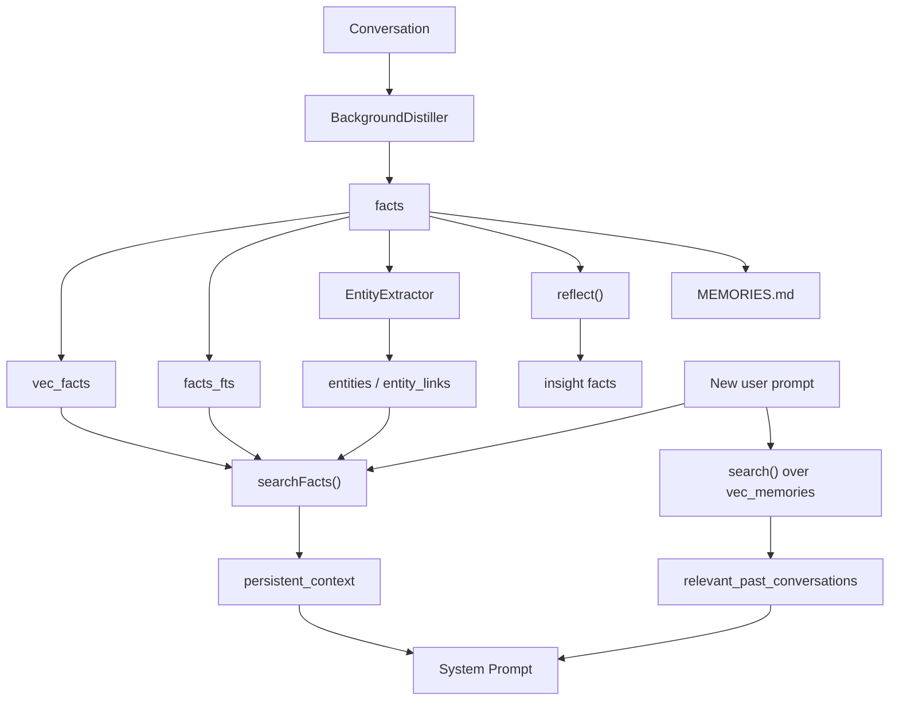
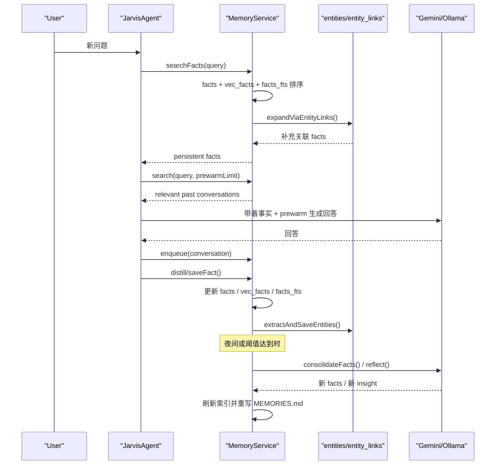

# Jarvis 记忆系统深挖

这份文档专门拆解 Jarvis 的长期记忆系统，重点覆盖 `facts`、`vec_facts`、`entities` / `entity_links`、`prewarm`、`reflect` 这五个核心部分，以及它们在一次对话中的协作方式。

相关核心源码：

- [jarvis/src/core/memory.ts](/Users/liuwei/ai/jarvis-personal-ai/jarvis/src/core/memory.ts:1)
- [jarvis/src/core/entityExtractor.ts](/Users/liuwei/ai/jarvis-personal-ai/jarvis/src/core/entityExtractor.ts:1)
- [jarvis/src/core/agent.ts](/Users/liuwei/ai/jarvis-personal-ai/jarvis/src/core/agent.ts:303)
- [docs/DNI_ARCHITECTURE.md](/Users/liuwei/ai/jarvis-personal-ai/docs/DNI_ARCHITECTURE.md:1)
- [docs/dni-memory-system.md](/Users/liuwei/ai/jarvis-personal-ai/docs/dni-memory-system.md:1)

## 总体模型

Jarvis 的记忆系统不是“保存聊天记录”这么简单，而是把长期认知拆成几层：

1. 原始对话进入 `memories` / `vec_memories`
2. 对话蒸馏出的稳定事实进入 `facts`
3. 事实向量进入 `vec_facts`
4. 事实中的实体关系进入 `entities` / `entity_links`
5. 大量事实再被综合成 `insight`

所以它更像是“长期知识库 + 语义索引 + 轻量图谱 + 洞察层”，而不是单纯的聊天历史回放。

## 1. `facts` 是什么

`facts` 表是结构化长期记忆的主存储，建表逻辑在 [memory.ts](/Users/liuwei/ai/jarvis-personal-ai/jarvis/src/core/memory.ts:49) 附近。

它的关键字段有：

- `category`
- `content`
- `importance`
- `timestamp`
- `embedding`
- `last_accessed`
- `access_count`

常见 `category` 主要有：

- `identity`
- `behavior`
- `preference`
- `specification`
- `insight`

可以把它们理解成：

- `identity`：用户是谁，职业、角色、长期身份
- `behavior`：习惯、兴趣、做事方式
- `preference`：回答风格偏好
- `specification`：项目规则、技术约束、长期决策
- `insight`：系统综合多个事实后生成的高层判断

### `saveFact()` 做了什么

入口在 [memory.ts](/Users/liuwei/ai/jarvis-personal-ai/jarvis/src/core/memory.ts:525)。

它不会无脑插入，而是先去重，再写入，再决定是否触发后续流程。

去重分两层：

- 精确字符串去重
- 语义去重
  - `jaccard`：词面相似度
  - `embedding`：余弦相似度

如果配置允许 embedding 去重，`saveFact()` 会在插入前先为新事实计算向量；如果向量不可用，就回退到 Jaccard 去重。

这一步很关键，因为 Jarvis 会持续从对话中蒸馏事实，如果不做强去重，`facts` 很快会被重复记忆污染。

## 2. `vec_facts` 是什么

`vec_facts` 是 `facts` 的语义向量镜像，建表在 [memory.ts](/Users/liuwei/ai/jarvis-personal-ai/jarvis/src/core/memory.ts:161)。

关系是：

- `facts.id` 对应 `vec_facts.id`
- `facts.embedding` 是持久化存档
- `vec_facts` 是 `sqlite-vec` 的近邻检索表

写入逻辑集中在 `insertFactWithVec()`：

- 插入 `facts`
- 如果已有 embedding，再插入 `vec_facts`
- 同时插入 `facts_fts`

所以 `facts`、`vec_facts`、`facts_fts` 是一组同步维护的索引层。

### 为什么不能只有 `facts`

只有 `facts` 只能做字面匹配，无法很好支持语义召回。

例如用户问：

- “我之前是不是提过本地模型路由？”

而历史事实写的是：

- “Local model router initialized with Ollama classifier”

这类 query 和 fact 的字面差异很大，`vec_facts` 才能把它们连起来。

## 3. 为什么还要有 `facts_fts`

除了向量索引，Jarvis 还维护了 FTS5 全文索引 `facts_fts`，见 [memory.ts](/Users/liuwei/ai/jarvis-personal-ai/jarvis/src/core/memory.ts:122)。

原因很直接：

- embedding 擅长语义相近
- BM25 擅长术语精确命中

像下面这些内容，BM25 往往更稳：

- 项目名
- 函数名
- 模型名
- 工具名

所以 `searchFacts()` 实际上走的是混合检索，而不是纯向量搜索。

## 4. `searchFacts()` 怎么选出当前轮要注入的事实

`searchFacts()` 是整个记忆系统最关键的读路径，入口在 [memory.ts](/Users/liuwei/ai/jarvis-personal-ai/jarvis/src/core/memory.ts:1219)。

它的流程可以概括成：

1. 一次性读出全部 facts
2. 拆成 `alwaysFacts` 和 `candidateFacts`
3. 对 `candidateFacts` 做语义/关键词排序
4. 用 `entity_links` 做轻量图谱扩展
5. 返回最终要注入 prompt 的事实列表

### 永远注入的事实

Jarvis 把下面两类事实定义为 always inject：

- `preference`
- `insight`

定义在 [memory.ts](/Users/liuwei/ai/jarvis-personal-ai/jarvis/src/core/memory.ts:1208)。

这背后的设计很明确：

- `preference` 决定回答风格，每轮都应该生效
- `insight` 是高层认知，也值得持续带入

### 排序逻辑

如果配置为 embedding 策略，`searchFacts()` 会：

- 先算 query embedding
- 从 `vec_facts` 找最近邻
- 再从 `facts_fts` 找 BM25 命中
- 用 RRF 做排名融合
- 再叠加 `importance`
- 再叠加 `last_accessed` 的时间衰减
- 最后截断到 `factRelevanceLimit`

大致可以理解为：

`最终得分 = 向量/BM25 融合分 + 重要性 + 最近访问热度`

它不是单纯“最相似优先”，而是在做“相似 + 重要 + 活跃”的综合排序。

### 时间衰减

访问衰减依赖：

- `last_accessed`
- `access_count`

命中后 `searchFacts()` 会异步调用 `updateAccessStats()`，更新这些字段，位置在 [memory.ts](/Users/liuwei/ai/jarvis-personal-ai/jarvis/src/core/memory.ts:1599)。

这让 Jarvis 的事实不是静态权重，而是会根据真实使用频率逐渐升温或冷却。

## 5. `entities` / `entity_links` 是什么

这部分是 Jarvis 记忆系统最像知识图谱的层。

表结构在 [memory.ts](/Users/liuwei/ai/jarvis-personal-ai/jarvis/src/core/memory.ts:71)：

- `entities`：实体表
- `entity_links`：关系表

`entityExtractor.ts` 定义了可抽取的实体与关系类型：

实体：

- `person`
- `project`
- `technology`
- `concept`

关系：

- `is_a`
- `has_skill`
- `works_on`
- `uses`
- `interested_in`
- `has_habit`
- `part_of`

### 抽取过程

入口在 `extractAndSaveEntities()`：

- [memory.ts](/Users/liuwei/ai/jarvis-personal-ai/jarvis/src/core/memory.ts:1439)

流程是：

1. 把一个或多个 fact 组装成 prompt
2. 交给 `EntityExtractor`
3. 模型返回 JSON 结构的 `EntityLink[]`
4. 写入 `entities` 和 `entity_links`

`EntityExtractor` 的实现见 [entityExtractor.ts](/Users/liuwei/ai/jarvis-personal-ai/jarvis/src/core/entityExtractor.ts:1)，它支持：

- `provider = gemini`
- `provider = ollama`

并且做了比较强的容错：

- 截取首尾 JSON
- 修复尾逗号
- 解析失败时记录上下文

### 为什么有 `processed` sentinel

`entity_links` 里不仅有真实业务关系，还会写入一类哨兵记录：

- `relation = 'processed'`
- `subject_id/object_id = NULL`

这不是知识图谱的一部分，而是“这个 fact 已经尝试做过 entity extraction”的标记。

这样系统就能区分：

- 这个 fact 还没处理
- 处理过但没抽出关系
- 某次失败后是否应该重试

这是为了避免启动后的 backfill 一直重复扫描同一批 facts。

## 6. 图谱扩展怎么参与检索

`searchFacts()` 在拿到高分事实后，还会调用 `expandViaEntityLinks()`：

- [memory.ts](/Users/liuwei/ai/jarvis-personal-ai/jarvis/src/core/memory.ts:1540)

它做的不是复杂图搜索，而是非常克制的一跳扩展：

1. 从当前高分 ranked facts 出发
2. 找这些 facts 对应的实体边
3. 查询共享 subject/object 的其他边
4. 拿到那些边关联的其他 `fact_id`
5. 最多追加少量相关 facts

所以它的作用不是“全图推理”，而是“让相关事实带一点关系邻域”。

例如排名命中了：

- `David works_on jarvis-personal-ai`

图谱就可能补出：

- `jarvis-personal-ai uses TypeScript`
- `DNI part_of jarvis-personal-ai`

这让 prompt 中出现的不只是单点事实，还有“围绕同一实体的相关上下文”。

## 7. `prewarm` 是什么

`prewarm` 不走 `facts`，而是走 `memories` / `vec_memories`，也就是“原始历史对话片段”的语义召回。

发生位置在 [agent.ts](/Users/liuwei/ai/jarvis-personal-ai/jarvis/src/core/agent.ts:316)。

每轮 `refreshContext()` 时会：

- 调用 `memoryService.search(userPrompt, prewarmLimit)`
- 拿到若干条相似历史对话
- 包成 `<relevant_past_conversations>`
- 拼进当前轮 system prompt

### `prewarm` 和 `facts` 的差别

`facts` 负责：

- 稳定
- 可控
- 结构化
- 可修正

`prewarm` 负责：

- 还原历史场景感
- 提供过去的问法、上下文、问题模式

举个直观的理解：

- fact 能告诉模型“用户偏好简洁回答”
- prewarm 能让模型看到“用户过去是怎么追问、怎么描述问题、怎么做决定的”

所以：

- `facts` 更像长期知识
- `prewarm` 更像场景记忆

## 8. 为什么 `prewarm` 不能直接靠聊天历史

Jarvis 是长期运行服务，不是单 session 聊天机器人。

如果把所有历史消息直接塞进上下文，会遇到三个问题：

- token 很快爆炸
- 噪声很大
- 很旧的消息会污染当前任务

所以它采用的是分层策略：

- 当前 session 历史：摘要 + 最近几轮
- 跨 session 历史：通过 `prewarm` 做少量语义召回
- 稳定长期认知：通过 `facts` 注入

这就是它跟普通“聊天记录回放”方案最本质的区别。

## 9. `reflect` 是什么

`reflect()` 是夜间反思机制，入口在 [memory.ts](/Users/liuwei/ai/jarvis-personal-ai/jarvis/src/core/memory.ts:1043)。

它的输入不是原始对话，而是：

- 所有非 `insight` 的 facts
- 当前已有的 `insight`

模型被要求做的事不是“复述事实”，而是：

- 综合多个 facts
- 生成 2-5 条 meta-level insight
- 替换旧的 insight

这说明 `reflect` 的定位不是抽取，而是“二次理解”。

例如底层 facts 可能是：

- 用户经常在晚上做投资总结
- 用户偏好简洁、结构化输出
- 用户长期关注本地模型和 agent 架构

反思生成的 insight 可能是：

- 用户倾向于把 AI 当作长期工作伙伴，而非一次性问答工具
- 用户更重视结构化输出与持续迭代，而不是短期 novelty

这类 insight 并不是任何单条对话直接说出来的，而是系统综合出来的高层认知。

## 10. `reflect` 真正改写了什么

`reflect()` 只替换 `category = 'insight'` 的 facts，不会重写其他类型事实。

具体流程是：

1. 读全部非 insight facts
2. 读已有 insights
3. 生成新的 insight JSON
4. 删除旧 insight 对应的 `entity_links`
5. 删除旧 insight facts
6. 清理孤儿 `vec_facts` / `facts_fts`
7. 插入新的 insight facts
8. 重写 `MEMORIES.md`

这意味着它的影响范围是可控的：

- 不会破坏 `identity`
- 不会破坏 `preference`
- 不会破坏 `specification`
- 只更新“高层理解层”

## 11. `consolidateFacts()` 和 `reflect()` 的区别

这两个容易混淆，但目标完全不同。

### `consolidateFacts()`

位置在 [memory.ts](/Users/liuwei/ai/jarvis-personal-ai/jarvis/src/core/memory.ts:583)。

它的目标是：

- 去重
- 合并重复 facts
- 修正 category
- 清洗整个 facts 集合

它作用于整个事实层，结果是重写全部 facts、`vec_facts`、`facts_fts`、`entity_links`。

更像“知识库整理”。

### `reflect()`

位置在 [memory.ts](/Users/liuwei/ai/jarvis-personal-ai/jarvis/src/core/memory.ts:1043)。

它的目标是：

- 从大量 facts 中提炼高层 insight
- 替换旧 insight

它不清洗整个 facts 层，只更新 `insight`。

更像“认知升维”。

一句话区分：

- `consolidateFacts()` 是整理记忆
- `reflect()` 是形成理解

## 12. `MEMORIES.md` 在系统里的角色

`MEMORIES.md` 是 L1 物理真相层，不只是一个导出文件。

### L2 -> L1：刷盘

`flushToPhysicalLayer()` 位于：

- [memory.ts](/Users/liuwei/ai/jarvis-personal-ai/jarvis/src/core/memory.ts:1695)

它会把当前 `facts` 全量重写成 Markdown。

### L1 -> L2：手工纠错回灌

`syncFromPhysicalLayerIfModified()` 位于：

- [memory.ts](/Users/liuwei/ai/jarvis-personal-ai/jarvis/src/core/memory.ts:1998)

如果发现用户手工改了 `MEMORIES.md`，启动时会：

- 清空 `facts`
- 清空 `vec_facts`
- 清空 `facts_fts`
- 清空 `entity_links`
- 从 Markdown 重建 `facts`
- 后续自动回填 embedding 和 entity links

所以：

- L1 支持人工纠错
- L2/L3 可以基于 L1 自愈重建

这也是 Jarvis 和记忆黑盒系统最不同的地方之一。

## 13. 启动时的自愈回填

`autoBackfill()` 位于：

- [memory.ts](/Users/liuwei/ai/jarvis-personal-ai/jarvis/src/core/memory.ts:1800)

它会在启动时做一组修复动作：

- 检查 embedding 维度是否变化
- 回填缺失的 `facts_fts`
- 如果 `MEMORIES.md` 被改过，执行 L1 -> L2 同步
- 回填缺失的 `vec_facts`
- 必要时重建 `MEMORIES.md`
- 延迟回填 `entity_links`
- 回填 session events

这说明记忆系统不是一次性流水线，而是偏“最终一致性”的自修复式架构。

## 14. 把五层能力用一句话记住

- `facts`
  - Jarvis 已经认可的稳定事实
- `vec_facts`
  - 让这些事实可以按语义被召回
- `entities`
  - 让事实之间能沿着实体关系串起来
- `prewarm`
  - 把过去类似场景的原始语境临时召回
- `reflect`
  - 从很多事实中提炼更高层的理解

如果只看用户体验，最终效果就是：

- Jarvis 记得你是谁
- 记得你项目的长期约束
- 记得你过去聊过的相似问题
- 还能逐渐形成对你的抽象理解

## 15. 一次对话中它们怎么协作

可以把一次消息中的记忆协作简化成：

这就是 Jarvis 记忆系统的闭环：

`对话 -> 蒸馏事实 -> 建索引 -> 建图谱 -> 检索注入 -> 再对话 -> 反思升维`
