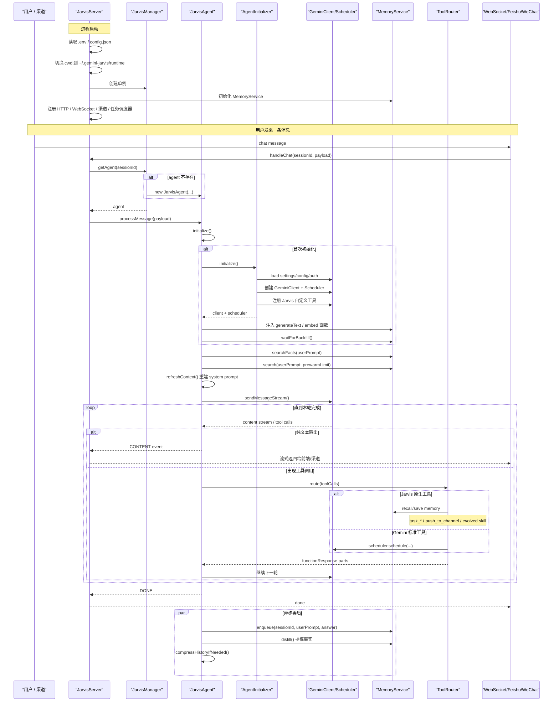

# Jarvis 启动到响应一次消息

这份文档按“进程启动 -> 服务就绪 -> 收到消息 -> LLM/工具循环 -> 返回结果 -> 记忆落盘”的顺序，梳理 Jarvis 的主执行链路。

## 时序图

## 1. 启动阶段

入口文件是 [jarvis/src/index.ts](/Users/liuwei/ai/jarvis-personal-ai/jarvis/src/index.ts:1)。

启动时先做几件事：

- 读取 `.env` 和 `~/.gemini-jarvis/config.json`
- 根据 `security.jailbreak` 决定是否重写上游 `PolicyEngine`
- 把运行目录切到 `~/.gemini-jarvis/runtime`
- 初始化 `JarvisServer`

`JarvisServer` 会继续挂载：

- Express 静态页面和 `/health`
- WebSocket 服务
- Feishu / WeChat channel
- `TaskScheduler`
- `ChannelRegistry`
- `JarvisManager`

所以 Jarvis 启动完以后是一个常驻服务，不是一次性脚本。

## 2. 收到消息

用户消息可能来自：

- Web UI
- WeChat
- Feishu

最终都会汇到 `JarvisServer.handleChat()`：

- [jarvis/src/index.ts](/Users/liuwei/ai/jarvis-personal-ai/jarvis/src/index.ts:240)

这里先做两类判断：

- 根据 `sessionId` 找到对应 agent
- 如果消息是在回复一个执行确认，就直接回注 allow/deny，不再走 LLM

正常聊天才会进入 `agent.processMessage()`。

## 3. 拿到或创建 Agent

`JarvisManager.getAgent()` 位于：

- [jarvis/src/core/manager.ts](/Users/liuwei/ai/jarvis-personal-ai/jarvis/src/core/manager.ts:1)

职责很直接：

- 如果 session 对应的 agent 已存在，直接复用
- 如果不存在，创建新的 `JarvisAgent`
- 如果启用了全局会话模式，不同渠道会映射到同一个 agent

所以“会话态”主要活在 `JarvisAgent` 实例里。

## 4. Agent 首次初始化

`JarvisAgent.processMessage()` 在真正处理消息前会确保 `initialize()` 执行过：

- [jarvis/src/core/agent.ts](/Users/liuwei/ai/jarvis-personal-ai/jarvis/src/core/agent.ts:379)

首次初始化时，`JarvisAgent` 会委托 `AgentInitializer` 做底座搭建：

- [jarvis/src/core/agentInitializer.ts](/Users/liuwei/ai/jarvis-personal-ai/jarvis/src/core/agentInitializer.ts:93)

这一层主要负责：

- 读取 gemini-cli settings
- 打开需要的工具能力
- 配置模型、代理、认证方式
- 创建 `GeminiClient`
- 创建 `Scheduler`
- 注册 Jarvis 自己的工具，如 `recall_memory`、`task_add`、`task_list`

初始化回到 `JarvisAgent` 后，还会继续做：

- 创建 `BackgroundDistiller`
- 给 `MemoryService` 注入 `generateText` 和 `embed` 能力
- 初始化 `ToolRouter`
- 按配置初始化 `LocalModelRouter`
- 注册 tool confirmation 监听
- 等待 `MemoryService.waitForBackfill()` 完成

这一步结束，agent 才算真正 ready。

## 5. 组装当前轮上下文

真正问模型前，会调用 `refreshContext()`：

- [jarvis/src/core/agent.ts](/Users/liuwei/ai/jarvis-personal-ai/jarvis/src/core/agent.ts:303)

这里从 `MemoryService` 拿两类上下文：

- `searchFacts(userPrompt)`：结构化事实
- `search(userPrompt, prewarmLimit)`：语义相似的历史对话

然后通过 `SystemPromptBuilder` 重新组装当前轮 system prompt，包括：

- Jarvis 精简 preamble
- persistent facts
- 按用户问题动态注入的协议
- relevant past conversations

这一步决定了 Jarvis 的记忆不是“把整段聊天历史硬塞回去”，而是“检索式重建上下文”。

## 6. 真正开始回答

随后进入 `GeminiClient.sendMessageStream()` 的流式生成循环：

- [jarvis/src/core/agent.ts](/Users/liuwei/ai/jarvis-personal-ai/jarvis/src/core/agent.ts:418)

可以把它理解成一个内部多轮循环：

1. 把当前用户输入发给模型
2. 一边收文本流，一边通过 event 转发给前端或渠道
3. 如果模型发出 tool call，就进入工具回路
4. 工具结果回来后，再继续喂给模型
5. 直到本轮不再产生工具调用

所以“一条用户消息”内部，可能包含多轮 LLM 和工具交替。

## 7. 工具调用怎么跑

工具分发统一走 `ToolRouter`：

- [jarvis/src/core/toolRouter.ts](/Users/liuwei/ai/jarvis-personal-ai/jarvis/src/core/toolRouter.ts:1)

它会把工具分成两类：

- Jarvis 原生工具
  - `save_memory`
  - `recall_memory`
  - `task_*`
  - `push_to_channel`
  - `run_evolved_skill_*`
- Gemini 标准工具
  - 转给 `Scheduler.schedule(...)`

另外，若调用的是 `generalist` 或 `codebase_investigator`，`ToolRouter` 还会先把 Jarvis 的长期记忆上下文塞进请求里，让子 agent 带着用户背景去执行。

## 8. 流式返回给前端或渠道

在 LLM 生成过程中，`JarvisAgent` 会持续发出 `CONTENT` 事件，`JarvisServer` 再把这些 event 转发出去。

因此 Web UI 看到的是流式状态，而不是最终一次性结果：

- 文本流
- 工具调用状态
- 确认请求
- done 信号

前端文件在：

- [jarvis/ui/index.html](/Users/liuwei/ai/jarvis-personal-ai/jarvis/ui/index.html:1)

## 9. 一轮完成后的异步善后

回答结束后，`JarvisAgent` 还会做一串后台动作：

- `memoryService.enqueue(...)`
  - 把这轮对话排队写入长期记忆
- `distiller.distill(...)`
  - 从“用户问题 + 助手回答”提炼事实
- 按配置触发事件抽取、技能抽取
- 必要时压缩会话历史

相关逻辑主要在：

- [jarvis/src/core/agent.ts](/Users/liuwei/ai/jarvis-personal-ai/jarvis/src/core/agent.ts:203)
- [jarvis/src/core/memory.ts](/Users/liuwei/ai/jarvis-personal-ai/jarvis/src/core/memory.ts:19)

这也是 Jarvis 能够逐步形成长期记忆的关键。

## 10. 一句话记住主链路

一次消息的主执行链可以概括为：

`Channel -> JarvisServer -> JarvisManager -> JarvisAgent -> Memory 检索 -> Prompt 重建 -> Gemini 流式生成 -> ToolRouter -> 返回用户 -> Memory 蒸馏入库`
