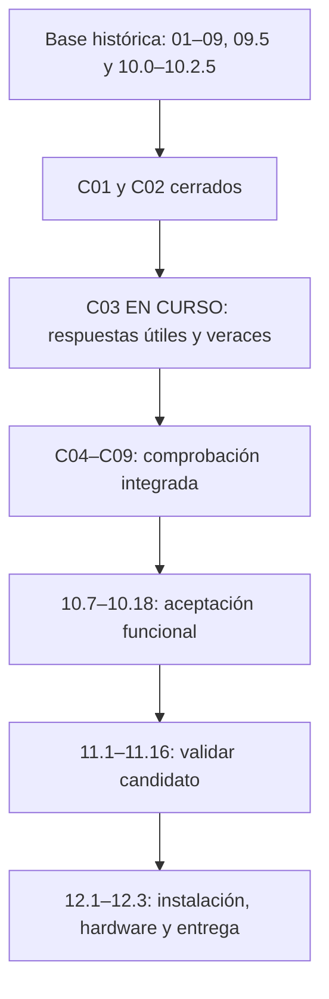

# Mapa completo de BAXY — 2026-09-05

Instantánea de orientación, no prompt ejecutable ni nueva certificación. El estado vivo manda sobre este mapa. Los cierres históricos conservan su evidencia; no demuestran que el producto actual ya funcione de extremo a extremo.

Hay **38 prompts por cerrar, incluido C03**: 7 de comprobación, 12 de fase 10, 16 de fase 11 y 3 de fase 12. No equivalen a 38 conversaciones: cada goal se puede reanudar con checkpoint.

## Base original — implementación histórica

| Goal | Propósito / documento | Estado |
|---|---|---|
| 01 | [Herencia](01_HERENCIA.md) | Histórico; revalidación pendiente |
| 02 | [Base reproducible](02_BASE.md) | Histórico; revalidación pendiente |
| 03 | [Comprensión](03_COMPRENSION.md) | Histórico; revalidación pendiente |
| 03B | [Techo de comprensión](03B_COMPRENSION_TECHO.md) | Histórico; revalidación pendiente |
| 03C | [Alcance y cobertura](03C_ALCANCE.md) | Histórico; revalidación pendiente |
| 04 | [Honestidad](04_HONESTIDAD.md) | Histórico; revalidación pendiente |
| 05 | [Ejecución verificada](05_EJECUCION.md) | Histórico; revalidación pendiente |
| 06 | [Voz del producto / prosa](06_VOZ_DEL_PRODUCTO.md) | Histórico; revalidación pendiente |
| 07 | [Misiones](07_MISIONES.md) | Histórico; revalidación pendiente |
| 08 | [Primera señal](08_PRIMERA_SENAL.md) | Histórico; revalidación pendiente |
| 09 | [Voz y oído](09_VOZ_Y_OIDO.md) | Histórico; revalidación pendiente |

## 09.5 — recuperación histórica

| Goal | Propósito / documento | Estado |
|---|---|---|
| 09.5.0 | [Fuentes y ambiente](09.5.0_FUENTES_Y_AMBIENTE.md) | Cerrado histórico |
| 09.5.1 | [Manifiesto y colas](09.5.1_MANIFIESTO_Y_COLAS.md) | Cerrado histórico |
| 09.5.2 | [Documentación](09.5.2_LEER_DOCUMENTACION_LOTE.md) | Cerrado histórico |
| 09.5.3 | [Código y pruebas](09.5.3_AUDITAR_CODIGO_LOTE.md) | Cerrado histórico |
| 09.5.4 | [Evidencia y assets](09.5.4_AUDITAR_EVIDENCIA_LOTE.md) | Cerrado histórico |
| 09.5.5 | [Modelos, router e idiomas](09.5.5_MODELOS_ROUTER_IDIOMAS.md) | Cerrado histórico |
| 09.5.6 | [Voz, audio y presencia](09.5.6_VOZ_AUDIO_PRESENCIA.md) | Cerrado histórico |
| 09.5.7 | [Tools, skills y misiones](09.5.7_TOOLS_SKILLS_MISIONES.md) | Cerrado histórico |
| 09.5.8 | [Runtime, UI y recursos](09.5.8_RUNTIME_UI_RECURSOS.md) | Cerrado histórico |
| 09.5.9 | [Decidir herencia](09.5.9_DECIDIR_HERENCIA.md) | Cerrado histórico |
| 09.5.10 | [Trasplantes](09.5.10_TRASPLANTAR_LOTE.md) | Cerrado histórico |
| 09.5.11A | [Revalidar 01–03C](09.5.11A_REVALIDAR_01_03C.md) | Cerrado histórico |
| 09.5.11B | [Revalidar 04–06](09.5.11B_REVALIDAR_04_06.md) | Cerrado histórico |
| 09.5.11C | [Revalidar 07–09](09.5.11C_REVALIDAR_07_09.md) | Cerrado histórico |
| 09.5.12 | [Integrar y replanificar](09.5.12_INTEGRAR_Y_REPLANIFICAR.md) | Cerrado histórico |

## Comprobación — prioridad actual

| Goal | Propósito / documento | Estado |
|---|---|---|
| C01 | [Entrada compartida](Sprints%20comprobación/C01_ENTRADA_COMPARTIDA.md) | Cerrado d6500f8 |
| C02 | [Herencia y base](Sprints%20comprobación/C02_HERENCIA_Y_BASE.md) | Cerrado 88b5370 |
| C03 | [Respuesta veraz y útil](Sprints%20comprobación/C03_RESPUESTA_VERAZ.md) | EN CURSO; relevo preparado |
| C04 | [Operaciones y confirmación](Sprints%20comprobación/C04_OPERACIONES_Y_CONFIRMACION.md) | Pendiente |
| C05 | [Misiones y continuidad](Sprints%20comprobación/C05_MISIONES_Y_CONTINUIDAD.md) | Pendiente |
| C06 | [Comprensión y cobertura](Sprints%20comprobación/C06_COMPRENSION_Y_COBERTURA.md) | Pendiente |
| C07 | [Señal y recursos](Sprints%20comprobación/C07_SENAL_Y_RECURSOS.md) | Pendiente |
| C08 | [Voz y accesibilidad](Sprints%20comprobación/C08_VOZ_Y_ACCESIBILIDAD.md) | Pendiente |
| C09 | [Admisión a Goal 10](Sprints%20comprobación/C09_ADMISION_GOAL_10.md) | Pendiente |

## 10 — aceptación funcional por dominio

| Goal | Propósito / documento | Estado |
|---|---|---|
| 10.0 | [Base verde](10.0_BASE_VERDE.md) | Cerrado histórico |
| 10.1 | [Corpus y cola](10.1_CORPUS_Y_COLA.md) | Cerrado histórico |
| 10.2 | [Presencia y recursos](10.2_PRESENCIA_Y_RECURSOS.md) | Cerrado histórico |
| 10.2.5 | [Recursos en reposo](10.2.5_RECURSOS_EN_REPOSO.md) | Cerrado histórico |
| 10.3 | [Uso real A](10.3_USO_REAL_A.md) | Retirado por el dueño; no ejecutar |
| 10.4 | [Uso real B](10.4_USO_REAL_B.md) | Retirado por el dueño; no ejecutar |
| 10.5 | [Uso real C](10.5_USO_REAL_C.md) | Retirado por el dueño; no ejecutar |
| 10.6 | [Uso real D](10.6_USO_REAL_D.md) | Retirado por el dueño; no ejecutar |
| 10.7 | [Conversación, aclaración y no efecto](10.7_CONVERSACION.md) | Pendiente |
| 10.8 | [Hechos locales](10.8_HECHOS_LOCALES.md) | Pendiente |
| 10.9 | [Web y actualidad](10.9_WEB_Y_ACTUALIDAD.md) | Pendiente |
| 10.10 | [Apps, ventanas y visión](10.10_APPS_VENTANAS_VISION.md) | Pendiente |
| 10.11 | [Audio](10.11_AUDIO.md) | Pendiente |
| 10.12 | [Media, streaming y juegos](10.12_MEDIA_STREAMING_JUEGOS.md) | Pendiente |
| 10.13 | [Sistema y conectividad](10.13_SISTEMA_CONECTIVIDAD.md) | Pendiente |
| 10.14 | [Productividad y memoria](10.14_PRODUCTIVIDAD_MEMORIA.md) | Pendiente |
| 10.15 | [Comunicación y navegación](10.15_COMUNICACION_NAVEGACION.md) | Pendiente |
| 10.16 | [Misiones compuestas](10.16_MISIONES_COMPUESTAS.md) | Pendiente |
| 10.17 | [Identidad viva](10.17_IDENTIDAD_VIVA.md) | Pendiente |
| 10.18 | [Certificación autónoma e integración](10.18_INTEGRACION.md) | Pendiente |

## 11 — validación del candidato

| Goal | Propósito / documento | Estado |
|---|---|---|
| 11.1 | [Cola de cierre](11.1_COLA_DE_CIERRE.md) | Pendiente |
| 11.2 | [Contratos runtime](11.2_CONTRATOS_RUNTIME.md) | Pendiente |
| 11.3 | [Requisitos A](11.3_REQUISITOS_A.md) | Pendiente |
| 11.4 | [Requisitos B](11.4_REQUISITOS_B.md) | Pendiente |
| 11.5 | [Requisitos C](11.5_REQUISITOS_C.md) | Pendiente |
| 11.6 | [Requisitos D](11.6_REQUISITOS_D.md) | Pendiente |
| 11.7 | [Requisitos E](11.7_REQUISITOS_E.md) | Pendiente |
| 11.8 | [Requisitos F](11.8_REQUISITOS_F.md) | Pendiente |
| 11.9 | [No runtime A](11.9_NO_RUNTIME_A.md) | Pendiente |
| 11.10 | [No runtime B](11.10_NO_RUNTIME_B.md) | Pendiente |
| 11.11 | [Errores de mente y kernel](11.11_ERRORES_MENTE_KERNEL.md) | Pendiente |
| 11.12 | [Errores de providers y estado](11.12_ERRORES_PROVIDERS_ESTADO.md) | Pendiente |
| 11.13 | [Regresión 01–06](11.13_REGRESION_01_06.md) | Pendiente |
| 11.14 | [Regresión 07–10](11.14_REGRESION_07_10.md) | Pendiente |
| 11.15 | [Higiene e identidad](11.15_HIGIENE_IDENTIDAD.md) | Pendiente |
| 11.16 | [Full y cierre del candidato](11.16_FULL_Y_CIERRE.md) | Pendiente |

## 12 — producto instalado y entrega

| Goal | Propósito / documento | Estado |
|---|---|---|
| 12.1 | [Instalación y ciclo de vida](12.1_INSTALACION.md) | Pendiente |
| 12.2 | [Hardware objetivo](12.2_HARDWARE.md) | Pendiente |
| 12.3 | [Aceptación instalada y entrega](12.3_ENTREGA.md) | Pendiente |

## Qué falta concretamente en C03

Actualización 2026-09-06: el checkpoint y `artifacts/comprobaciones/C03/ASTRA-TRAMO-29.md` sustituyen el diagnóstico operativo de este apartado. Se ha registrado Qwen3-4B-Instruct-2507 Q4_K_M, conservando STT/TTS/wake, y observado la ventana real de `py main.py`. Las averías reject/timeout/exhaust ya permiten restaurar y responder en el mismo proceso y sesión. Estas comprobaciones no cierran C03: faltan aceptación fresca, validación del candidato final y Full vigente; los fallos normales descubiertos permanecen documentados.

Primero resolver los bloqueos de idioma, intención y hechos con pruebas acotadas; después validar continuidad e integración real; finalmente evaluar casos nuevos y completar todas las condiciones de cierre. C04–C09 y fases10–12 deben verificar el runtime efectivo, sin presuponer que una aceptación histórica de Granite certifique Qwen. C03 no sustituye su aceptación propia ni la comprobación instalada de12.3.

C09 habilita la fase 10. 10.18 certifica integración funcional. 11.16 cierra el candidato de desarrollo. **12.3 cierra la entrega instalada y validada** bajo las condiciones documentadas, no una garantía de ausencia universal de errores.

## Fuentes y continuación

- [Estado vivo de comprobación](Sprints%20comprobación/05_ESTADO_Y_CONTINUACION.md).
- [Lanzador vigente](00_LANZAR_DESDE_10_7.md).
- [Orden y cierres históricos](00_ORDEN_DESDE_09_5.md).
- [Protocolo común de ejecución](00_PROTOCOLO_EJECUCION.md).
- [Diagnóstico reproducido de C03](../../artifacts/audit/c03_opus_20260905/DIAGNOSTICO.md).
- [Goal de relevo preparado para Opus 5 High](Sprints%20comprobación/C03_OPUS5_HIGH.md). Sigue siendo un prompt para Opus; este mapa no cambia el agente ni inicia su ejecución.

Los protocolos, índices, lanzadores y variantes de prompt no se cuentan como goals adicionales. Los bloques A–F y A–B de fase 11 se definen en sus documentos; sus letras no implican funcionalidades nuevas.
